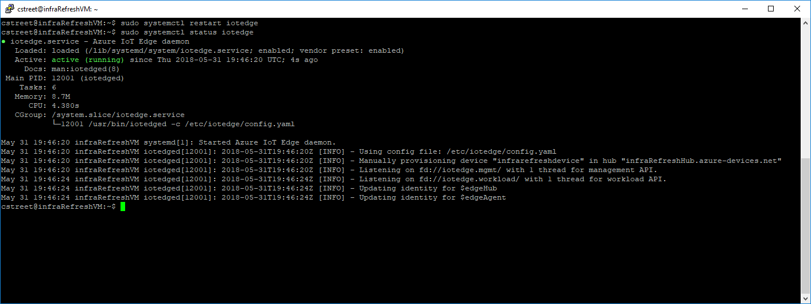
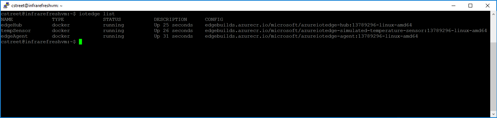
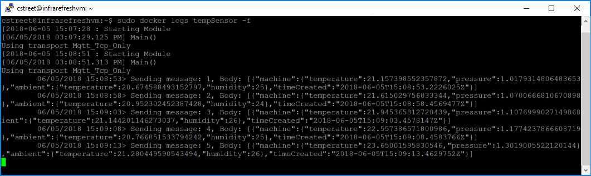

# Quickstart: Deploy your first IoT Edge module to a Linux or Mac device - preview

Azure IoT Edge moves the power of the cloud to your Internet of Things devices. In this quickstart, learn how to use the cloud interface to deploy prebuilt code remotely to an IoT Edge device.

If you don't have an active Azure subscription, create a [free account][lnk-account] before you begin.

## Prerequisites

This quickstart uses your computer or virtual machine like an Internet of Things device. To turn your machine into an IoT Edge device, you need a container runtime. The following command installs one for you: 

```cmd
curl https://conteng.blob.core.windows.net/mby/moby_0.1-0-ubuntu_amd64.deb -o moby_0.1.deb && sudo apt-get install ./moby_0.1.deb
``` 

You use the Azure CLI to complete many of the steps in this quickstart, and Azure IoT has an extension to enable additional functionality. You can complete these steps in the cloud shell in the Azure portal.

1. Sign in to the [Azure portal][lnk-portal]. 
1. Select the **Cloud Shell** button. 

   ![Cloud Shell button][1]

1. Run the following command in the cloud shell:

   ```azurecli
   az extension show --name azure-cli-iot-ext
   ```

## Create an IoT hub with Azure CLI

Create an IoT hub in your Azure subscription. The free level of IoT Hub works for this quickstart. If you've used IoT Hub in the past and already have a free hub created, you can skip this section and go on to [Register an IoT Edge device][anchor-register]. Each subscription can only have one free IoT hub. 

1. In the Azure cloud shell, create a resource group. The following code creates a resource group called **IoTEdge** in the **West US** region:

   ```azurecli
   az group create --name IoTEdge --location westus
   ```

1. Create an IoT hub in your new resource group. The following code creates a free **F1** hub called **MyIotHub** in the resource group **IoTEdge**:

   ```azurecli
   az iot hub create --resource-group IoTEdge --name MyIotHub --sku F1 
   ```

## Register an IoT Edge device

Create a device identity for your simulated device so that it can communicate with your IoT hub. Since IoT Edge devices behave and can be managed differently than typical IoT devices, you declare this to be an IoT Edge device from the beginning. 

1. In the Azure cloud shell, enter the following command to create a device named **myEdgeDevice** in your hub **MyIoTHub**

   ```azurecli
   az iot hub device-identity create --device-id myEdgeDevice --hub-name MyIoTHub --edge-enabled
   ```

1. Retrieve the connection string for your device, which links your physical device with its identity in IoT Hub. 

   ```azurecli
   az iot hub device-identity show-connection-string --device-id myEdgeDevice --hub-name MyIoTHub
   ```

1. Copy the connection string and save it. You'll use this value to configure the IoT Edge runtime in the next section. 

## Install and start the IoT Edge runtime

The IoT Edge runtime is deployed on all IoT Edge devices. Its composed of three components. The **IoT Edge security daemon** starts each time an Edge device boots and bootstraps the device by starting the IoT Edge agent. The **IoT Edge agent** facilitates deployment and monitoring of modules on the IoT Edge device, including the IoT Edge hub. The **IoT Edge hub** manages communications between modules on the IoT Edge device, and between the device and IoT Hub. 

1. On the machine where you'll run the IoT Edge device, install a version of **hsmlib** that enables the security daemon to interact with the device's hardware security:

   ```bash
   wget https://azureiotedgepreview.blob.core.windows.net/shared/edgelet-amd64-13893488/libiothsm-std_0.1.1-13893488_amd64.deb && sudo apt-get install ./libiothsm-std_0.1.1-13893488_amd64.deb
   ```

1. Download and install the IoT Edge Security Daemon. The package installs the daemon as a system service so IoT Edge starts every time your device boots.

   ```bash
   wget https://azureiotedgepreview.blob.core.windows.net/shared/edgelet-amd64-13893488/iotedge_0.1-13893488_amd64.deb && sudo apt-get install ./iotedge_0.1-13893488_amd64.deb
   ```

2. Open `/etc/iotedge/config.yaml`. It is a protected file so you may have to use elevated privileges to access it.
   
   ```bash
   sudo nano /etc/iotedge/config.yaml
   ```

3. Add the IoT Edge device connection string that you copied when you registered your device. Replace the value of the variable **device_connection_string**.

4. Restart the Edge Security Daemon:

   ```bash
   sudo systemctl restart iotedge
   ```

5. Check to see that the Edge Security Daemon is running as a system service:

   ```bash
   sudo systemctl status iotedge
   ```

   

You can also see logs from the Edge Security Daemon by running the following command:
   ```
   journalctl -u iotedge
   ```

## Deploy a module

[!INCLUDE [iot-edge-deploy-module](../../includes/iot-edge-deploy-module.md)]

## View generated data

In this quickstart, you created a new IoT Edge device and installed the IoT Edge runtime on it. Then, you used the Azure portal to push an IoT Edge module to run on the device without having to make changes to the device itself. In this case, the module that you pushed creates environmental data that you can use for the tutorials. 

Open the command prompt on the computer running your simulated device again. Confirm that the module deployed from the cloud is running on your IoT Edge device:

```cmd
sudo iotedge list
```



View the messages being sent from the tempSensor module to the cloud:

```cmd
sudo docker logs tempSensor -f 
```



The temperature sensor module may be waiting to connect to Edge Hub if the last line you see in the log is `Using transport Mqtt_Tcp_Only`. Try killing the module and letting the Edge Agent restart it. You can kill it with the command `sudo docker stop tempSensor`.

You can also view the telemetry the device is sending by using the [IoT Hub explorer tool][lnk-iothub-explorer]. 


## Clean up resources

If you want to continue on to the IoT Edge tutorials, you can use the device that you registered and set up in this quickstart. If you want to remove the installations from your device, use the following commands.  

Remove the IoT Edge runtime.

   ```bash
   sudo apt-get remove --purge iotedge
   ```

Delete the containers that were created on your device. 

   ```bash
   sudo docker rm -f $(sudo docker ps -aq)
   ```

Remove the container runtime.

   ```bash
   sudo apt-get remove --purge moby
   ```

When you no longer need the IoT Hub you created, you can use the [az iot hub delete][lnk-delete] command to remove the resource and any devices associated with it:

```azurecli
az iot hub delete --name MyIoTHub --resource-group IoTEdge
```

## Next steps

This quickstart is the prerequisite for all of the IoT Edge tutorials. You can continue on to any of the other tutorials to learn how Azure IoT Edge can help you turn this data into business insights at the edge.

> [!div class="nextstepaction"]
> [Filter sensor data using an Azure Function](tutorial-deploy-function.md)


<!-- Images -->
[1]: ./media/quickstart/cloud-shell.png

<!-- Links -->
[lnk-docker-ubuntu]: https://docs.docker.com/engine/installation/linux/docker-ce/ubuntu/ 
[lnk-docker-mac]: https://docs.docker.com/docker-for-mac/install/
[lnk-iothub-explorer]: https://github.com/azure/iothub-explorer
[lnk-account]: https://azure.microsoft.com/free
[lnk-portal]: https://portal.azure.com
[lnk-delete]: https://docs.microsoft.com/cli/azure/iot/hub?view=azure-cli-latest#az_iot_hub_delete

<!-- Anchor links -->
[anchor-register]: #register-an-iot-edge-device
