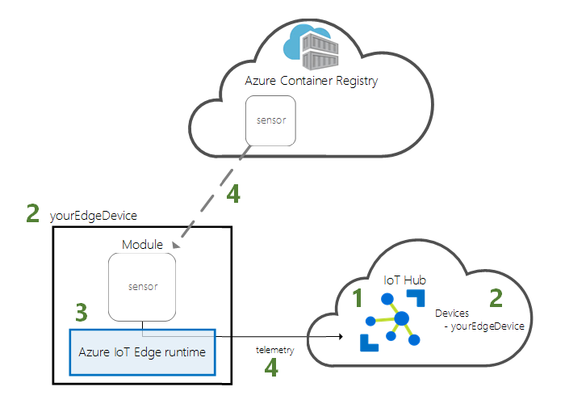
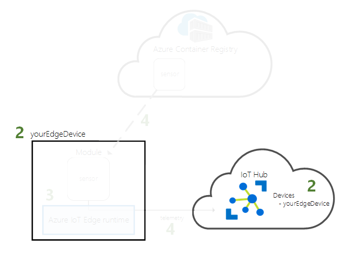
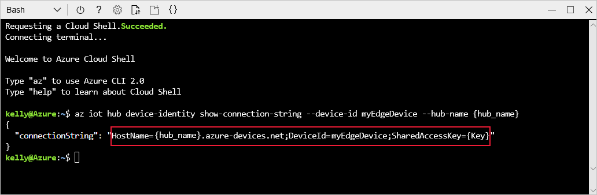
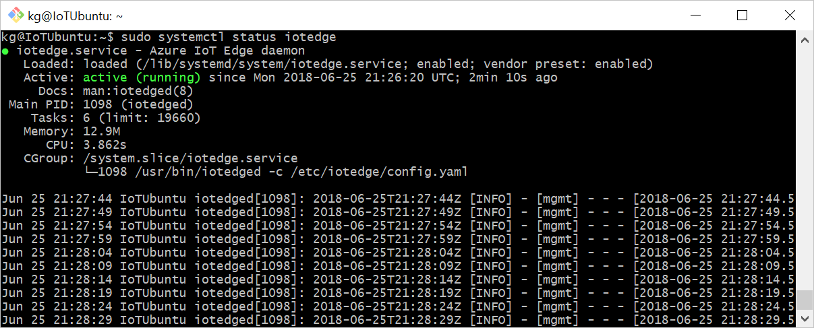
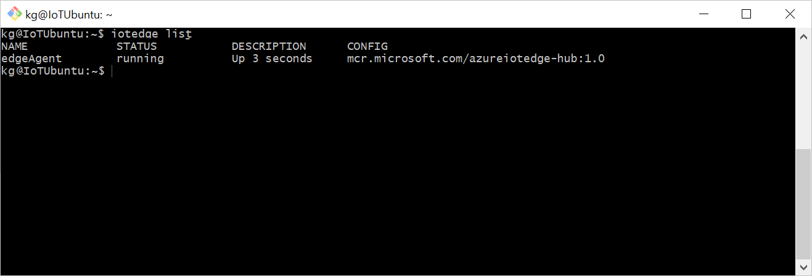
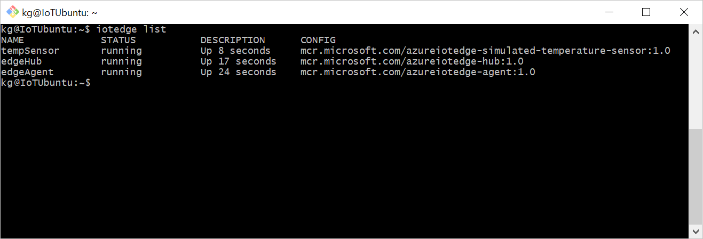
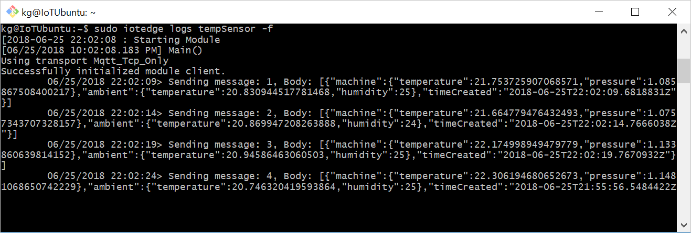

# Quickstart: Deploy your first IoT Edge module to a virtual Linux device

Test out Azure IoT Edge in this quickstart by deploying containerized code to a virtual IoT Edge device. IoT Edge allows you to remotely manage code on your devices so that you can send more of your workloads to the edge. For this quickstart, we recommend using an Azure virtual machine for your IoT Edge device, which allows you to quickly create a test machine with all prerequisites installed and then delete it when you're finished.

In this quickstart you learn how to:

1. Create an IoT Hub.
2. Register an IoT Edge device to your IoT hub.
3. Install and start the IoT Edge runtime on your virtual device.
4. Remotely deploy a module to an IoT Edge device.



This quickstart walks you through creating a Linux virtual machine that's configured to be IoT Edge device. Then you can deploy a module from the Azure portal to your device. The module that you deploy in this quickstart is a simulated sensor that generates temperature, humidity, and pressure data. The other Azure IoT Edge tutorials build upon the work you do here by deploying modules that analyze the simulated data for business insights.

If you don't have an active Azure subscription, create a [free account](https://azure.microsoft.com/free) before you begin.

[!INCLUDE [cloud-shell-try-it.md](../../includes/cloud-shell-try-it.md)]

You use the Azure CLI to complete many of the steps in this quickstart, and Azure IoT has an extension to enable additional functionality.

Add the Azure IoT extension to the cloud shell instance.

   ```azurecli-interactive
   az extension add --name azure-cli-iot-ext
   ```

## Prerequisites

Cloud resources:

* A resource group to manage all the resources you use in this quickstart.

   ```azurecli-interactive
   az group create --name IoTEdgeResources --location westus2
   ```

IoT Edge device:

* A Linux device or virtual machine to act as your IoT Edge device. You should use the Microsoft-provided [Azure IoT Edge on Ubuntu](https://azuremarketplace.microsoft.com/marketplace/apps/microsoft_iot_edge.iot_edge_vm_ubuntu) virtual machine, which preinstalls everything you need to run IoT Edge on a device. Accept the terms of use and create this virtual machine using the following commands:

   ```azurecli-interactive
   az vm image terms accept --urn microsoft_iot_edge:iot_edge_vm_ubuntu:ubuntu_1604_edgeruntimeonly:latest
   az vm create --resource-group IoTEdgeResources --name EdgeVM --image microsoft_iot_edge:iot_edge_vm_ubuntu:ubuntu_1604_edgeruntimeonly:latest --admin-username azureuser --generate-ssh-keys
   ```

   It may take a few minutes to create and start the new virtual machine.

   When you create a new virtual machine, make a note of the **publicIpAddress**, which is provided as part of the create command output. You will use this public IP address to connect to the virtual machine later in the quickstart.

* If you prefer to run the Azure IoT Edge runtime on your own device, follow instructions at [Install the Azure IoT Edge runtime on Linux](how-to-install-iot-edge-linux.md).

## Create an IoT hub

Start the quickstart by creating an IoT hub with Azure CLI.


The free level of IoT Hub works for this quickstart. If you've used IoT Hub in the past and already have a free hub created, you can use that IoT hub. Each subscription can only have one free IoT hub.

The following code creates a free **F1** hub in the resource group **IoTEdgeResources**. Replace `{hub_name}` with a unique name for your IoT hub.

   ```azurecli-interactive
   az iot hub create --resource-group IoTEdgeResources --name {hub_name} --sku F1 --partition-count 2
   ```

   If you get an error because there's already one free hub in your subscription, change the SKU to **S1**. If you get an error that the IoT Hub name isn't available, it means that someone else already has a hub with that name. Try a new name.

## Register an IoT Edge device

Register an IoT Edge device with your newly created IoT hub.



Create a device identity for your IoT Edge device so that it can communicate with your IoT hub. The device identity lives in the cloud, and you use a unique device connection string to associate a physical device to a device identity.

Since IoT Edge devices behave and can be managed differently than typical IoT devices, declare this identity to be for an IoT Edge device with the `--edge-enabled` flag.

1. In the Azure cloud shell, enter the following command to create a device named **myEdgeDevice** in your hub.

   ```azurecli-interactive
   az iot hub device-identity create --hub-name {hub_name} --device-id myEdgeDevice --edge-enabled
   ```

   If you get an error about iothubowner policy keys, make sure that your cloud shell is running the latest version of the azure-cli-iot-ext extension.

2. Retrieve the connection string for your device, which links your physical device with its identity in IoT Hub.

   ```azurecli-interactive
   az iot hub device-identity show-connection-string --device-id myEdgeDevice --hub-name {hub_name}
   ```

3. Copy the value of the `connectionString` key from the JSON output and save it. This value is the device connection string. You'll use this connection string to configure the IoT Edge runtime in the next section.

   

## Configure your IoT Edge device

Start the Azure IoT Edge runtime on your IoT Edge device.


The IoT Edge runtime is deployed on all IoT Edge devices. It has three components. The **IoT Edge security daemon** starts each time an IoT Edge device boots and bootstraps the device by starting the IoT Edge agent. The **IoT Edge agent** facilitates deployment and monitoring of modules on the IoT Edge device, including the IoT Edge hub. The **IoT Edge hub** manages communications between modules on the IoT Edge device, and between the device and IoT Hub.

During the runtime configuration, you provide a device connection string. Use the string that you retrieved from the Azure CLI. This string associates your physical device with the IoT Edge device identity in Azure.

### Set the connection string on the IoT Edge device

If you're using the Azure IoT Edge on Ubuntu virtual machine as described in the prerequisites, then your device already has the IoT Edge runtime installed. You just need to configure your device with the device connection string that you retrieved in the previous section. You can do this remotely without having to connect to the virtual machine. Run the following command, replacing `{device_connection_string}` with your own string.

   ```azurecli-interactive
   az vm run-command invoke -g IoTEdgeResources -n EdgeVM --command-id RunShellScript --script "/etc/iotedge/configedge.sh '{device_connection_string}'"
   ```

If you're running IoT Edge on your local machine or an ARM32 or ARM64 device, you need to install the IoT Edge runtime and its prerequisites on your device. Follow the instructions in [Install the Azure IoT Edge runtime on Linux](how-to-install-iot-edge-linux.md), then return to this quickstart.

### View the IoT Edge runtime status

The rest of the commands in this quickstart take place on your IoT Edge device itself, so that you can see what's happening on the device. If you're using a virtual machine, connect to that machine now using the public IP address that was output by the creation command. You can also find the public IP address on your virtual machine's overview page in the Azure portal. Use the following command to connect to your virtual machine. Replace `{azureuser}` if you used a different username than the one suggested in the prerequisites. Replace `{publicIpAddress}` with your machine's address.

   ```azurecli-interactive
   ssh azureuser@{publicIpAddress}
   ```

Verify that the runtime was successfully installed and configured on your IoT Edge device.

>[!TIP]
>You need elevated privileges to run `iotedge` commands. Once you sign out of your machine and sign back in the first time after installing the IoT Edge runtime, your permissions are automatically updated. Until then, use `sudo` in front of the commands.

1. Check to see that the IoT Edge security daemon is running as a system service.

   ```bash
   sudo systemctl status iotedge
   ```

   

2. If you need to troubleshoot the service, retrieve the service logs.

   ```bash
   journalctl -u iotedge
   ```

3. View the modules running on your device.

   ```bash
   sudo iotedge list
   ```

   

Your IoT Edge device is now configured. It's ready to run cloud-deployed modules.

## Deploy a module

Manage your Azure IoT Edge device from the cloud to deploy a module that will send telemetry data to IoT Hub.


[!INCLUDE [iot-edge-deploy-module](../../includes/iot-edge-deploy-module.md)]

## View generated data

In this quickstart, you created a new IoT Edge device and installed the IoT Edge runtime on it. Then, you used the Azure portal to deploy an IoT Edge module to run on the device without having to make changes to the device itself.

In this case, the module that you pushed creates sample data that you can use for testing. The simulated temperature sensor module generates environment data that you can use for testing later. The simulated sensor is monitoring both a machine and the environment around the machine. For example, this sensor might be in a server room, on a factory floor, or on a wind turbine. The message includes ambient temperature and humidity, machine temperature and pressure, and a timestamp. The IoT Edge tutorials use the data created by this module as test data for analytics.

Open the command prompt on your IoT Edge device again, or use the SSH connection from Azure CLI. Confirm that the module deployed from the cloud is running on your IoT Edge device:

   ```bash
   sudo iotedge list
   ```

   

View the messages being sent from the temperature sensor module:

   ```bash
   sudo iotedge logs SimulatedTemperatureSensor -f
   ```

   >[!TIP]
   >IoT Edge commands are case-sensitive when referring to module names.

   

You can also watch the messages arrive at your IoT hub by using the [Azure IoT Hub extension for Visual Studio Code](https://marketplace.visualstudio.com/items?itemName=vsciot-vscode.azure-iot-toolkit).

## Clean up resources

If you want to continue on to the IoT Edge tutorials, you can use the device that you registered and set up in this quickstart. Otherwise, you can delete the Azure resources that you created to avoid charges.

If you created your virtual machine and IoT hub in a new resource group, you can delete that group and all the associated resources. Double check the contents of the resource group to make sure that there's nothing you want to keep. If you don't want to delete the whole group, you can delete individual resources instead.

Remove the **IoTEdgeResources** group.

```azurecli-interactive
az group delete --name IoTEdgeResources
```

## Next steps

In this quickstart, you created an IoT Edge device and used the Azure IoT Edge cloud interface to deploy code onto the device. Now, you have a test device generating raw data about its environment.

The next step is to set up your local development environment so that you can start creating IoT Edge modules that run your business logic.

> [!div class="nextstepaction"]
> [Start developing IoT Edge modules for Linux devices](tutorial-develop-for-linux.md)
