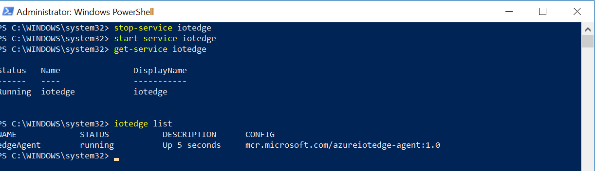
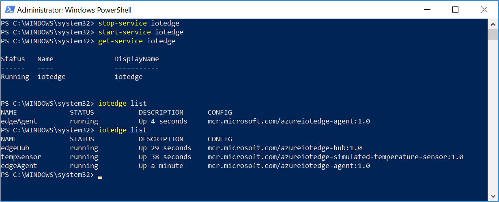
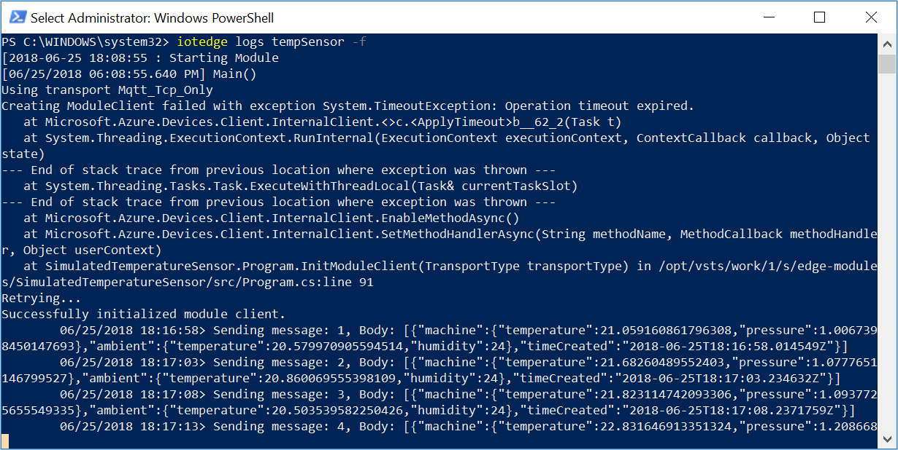

# Quickstart: Deploy your first IoT Edge module from the Azure portal to a Windows device - preview

Azure IoT Edge enables you to perform analytics and data processing on your devices, instead of having to push all the data to the cloud. The IoT Edge tutorials demonstrate how to deploy different types of modules, but first you need a device to test. 

In this quickstart you learn how to:

1. Create an IoT Hub
2. Register an IoT Edge device
3. Start the IoT Edge runtime
4. Deploy a module

![Tutorial architecture][2]

The module that you deploy in this quickstart is a simulated sensor that generates temperature, humidity, and pressure data. The other Azure IoT Edge tutorials build upon the work you do here by deploying modules that analyze the simulated data for business insights. 

>[!NOTE]
>The IoT Edge runtime on Windows is in [public preview](https://azure.microsoft.com/support/legal/preview-supplemental-terms/).

If you don't have an active Azure subscription, create a [free account][lnk-account] before you begin.

## Prerequisites

This quickstart assumes that you're using a computer or virtual machine running Windows to simulate an IoT device. If you're running Windows in a virtual machine, enable [nested virtualization][lnk-nested] and allocate at least 2GB memory. 

Have the following prerequisites ready on the machine that you're using for an IoT Edge device:

1. Make sure you're using a supported Windows version:
   * Windows 10 or newer
   * Windows Server 2016 or newer
2. Install [Docker for Windows][lnk-docker] and make sure it's running.
3. Configure Docker to use [Linux containers](https://docs.docker.com/docker-for-windows/#switch-between-windows-and-linux-containers)

## Create an IoT hub

Start the quickstart by creating an IoT hub in the Azure portal.
![Create IoT Hub][3]

Create your IoT hub in a resource group that you can use to maintain and manage all the resources that you create in this quickstart. Call it something easy to remember, like **IoTEdgeResources**. By putting all the resources for the quickstarts and tutorials in a group, you can manage them together and remove them easily when you're done testing. 

[!INCLUDE [iot-hub-create-hub](../../includes/iot-hub-create-hub.md)]

## Register an IoT Edge device

Register an IoT Edge device with your newly created IoT Hub.
![Register a device][4]

[!INCLUDE [iot-edge-register-device](../../includes/iot-edge-register-device.md)]

## Install and start the IoT Edge runtime

Install and start the Azure IoT Edge runtime on your IoT Edge device. 
![Register a device][5]

The IoT Edge runtime is deployed on all IoT Edge devices. It has three components. The **IoT Edge security daemon** starts each time an Edge device boots and bootstraps the device by starting the IoT Edge agent. The **IoT Edge agent** facilitates deployment and monitoring of modules on the IoT Edge device, including the IoT Edge hub. The **IoT Edge hub** manages communications between modules on the IoT Edge device, and between the device and IoT Hub. 

>[!NOTE]
>The installation steps in this section are manual for now while an installation script is being developed. 

The instructions in this section configure the IoT Edge runtime with Linux containers. If you want to use Windows containers, see [Install Azure IoT Edge runtime on Windows to use with Windows containers](how-to-install-iot-edge-windows-with-windows.md).

### Download and install the IoT Edge service

1. On your IoT Edge device, run PowerShell as an administrator.

2. Download the IoT Edge service package.

   ```powershell
   Invoke-WebRequest https://aka.ms/iotedged-windows-latest -o .\iotedged-windows.zip
   Expand-Archive .\iotedged-windows.zip C:\ProgramData\iotedge -f
   Move-Item c:\ProgramData\iotedge\iotedged-windows\* C:\ProgramData\iotedge\ -Force
   rmdir C:\ProgramData\iotedge\iotedged-windows
   $sysenv = "HKLM:\SYSTEM\CurrentControlSet\Control\Session Manager\Environment"
   $path = (Get-ItemProperty -Path $sysenv -Name Path).Path + ";C:\ProgramData\iotedge"
   Set-ItemProperty -Path $sysenv -Name Path -Value $path
   ```

3. Install the vcruntime.

  ```powershell
  Invoke-WebRequest -useb https://download.microsoft.com/download/0/6/4/064F84EA-D1DB-4EAA-9A5C-CC2F0FF6A638/vc_redist.x64.exe -o vc_redist.exe
  .\vc_redist.exe /quiet /norestart
  ```

4. Create and start the IoT Edge service.

   ```powershell
   New-Service -Name "iotedge" -BinaryPathName "C:\ProgramData\iotedge\iotedged.exe -c C:\ProgramData\iotedge\config.yaml"
   Start-Service iotedge
   ```

5. Add firewall exceptions for the ports that the IoT Edge service uses.

   ```powershell
   New-NetFirewallRule -DisplayName "iotedged allow inbound 15580,15581" -Direction Inbound -Action Allow -Protocol TCP -LocalPort 15580-15581 -Program "C:\programdata\iotedge\iotedged.exe" -InterfaceType Any
   ```

6. Create a new file called **iotedge.reg** and open it with a text editor. 

7. Add the following content and save the file. 

   ```input
   Windows Registry Editor Version 5.00
   [HKEY_LOCAL_MACHINE\SYSTEM\CurrentControlSet\Services\EventLog\Application\iotedged]
   "CustomSource"=dword:00000001
   "EventMessageFile"="C:\\ProgramData\\iotedge\\iotedged.exe"
   "TypesSupported"=dword:00000007
   ```

8. Navigate to your file in File Explorer and double-click it to import the changes to the Windows Registry. 

### Configure the IoT Edge runtime 

Configure the runtime with your IoT Edge device connection string that you copied when you registered a new device. Then, configure the runtime network. 

1. Open the IoT Edge configuration file, which is located at `C:\ProgramData\iotedge\config.yaml`. This file is protected, so run a text editor like Notepad as an administrator, then use the editor to open the file. 

2. Find the **provisioning** section and update the value of **device_connection_string** with the string that you copied from your IoT Edge device details. 

3. In your administrator PowerShell window, retrieve the hostname for your IoT Edge device and copy the output. 

   ```powershell
   hostname
   ```

4. In the configuration file, find the **Edge device hostname** section. Update the value of **hostname** with the hostname that you copied from PowerShell.

3. In your administrator PowerShell window, retrieve the IP address for your IoT Edge device. 

   ```powershell
   ipconfig
   ```

4. Copy the value for **IPv4 Address** in the **vEthernet (DockerNAT)** section of the output. 

5. Create an environment variable called **IOTEDGE_HOST**, replacing *\<ip_address\>* with the IP Address for your IoT Edge device. 

  ```powershell
  [Environment]::SetEnvironmentVariable("IOTEDGE_HOST", "http://<ip_address>:15580")
  ```

  Persist the environment variable across reboots.

  ```powershell
  SETX /M IOTEDGE_HOST "http://<ip_address>:15580"
  ```

6. In the `config.yaml` file, find the **Connect settings** section. Update the **management_uri** and **workload_uri** values with your IP address and the ports that you opened in the previous section. Replace **\<GATEWAY_ADDRESS\>** with the DockerNAT IP address that you copied.

   ```yaml
   connect: 
     management_uri: "http://<GATEWAY_ADDRESS>:15580"
     workload_uri: "http://<GATEWAY_ADDRESS>:15581"
   ```

7. Find the **Listen settings** section and add the same values for **management_uri** and **workload_uri**. 

   ```yaml
   listen:
     management_uri: "http://<GATEWAY_ADDRESS>:15580"
     workload_uri: "http://<GATEWAY_ADDRESS>:15581"
   ```

8. Find the **Moby Container Runtime settings** section and verify that the value for **network** is uncommented and set to **azure-iot-edge**

   ```yaml
   moby_runtime:
     docker_uri: "npipe://./pipe/docker_engine"
     network: "azure-iot-edge"
   ```
   
9. Save the configuration file. 

10. In PowerShell, restart the IoT Edge service.

   ```powershell
   Stop-Service iotedge -NoWait
   sleep 5
   Start-Service iotedge
   ```

### View the IoT Edge runtime status

Verify that the runtime was successfully installed and configured.

1. Check the status of the IoT Edge service.

   ```powershell
   Get-Service iotedge
   ```

2. If you need to troubleshoot the service, retrieve the service logs. 

   ```powershell
   # Displays logs from today, newest at the bottom.

   Get-WinEvent -ea SilentlyContinue `
    -FilterHashtable @{ProviderName= "iotedged";
      LogName = "application"; StartTime = [datetime]::Today} |
    select TimeCreated, Message |
    sort-object @{Expression="TimeCreated";Descending=$false} |
    format-table -autosize -wrap
   ```

3. View all the modules running on your IoT Edge device. Since the service just started for the first time, you should only see the **edgeAgent** module running. The edgeAgent module runs by default, and helps to install and start any additional modules that you deploy to your device. 

   ```powershell
   iotedge list
   ```

   

## Deploy a module

Manage your Azure IoT Edge device from the cloud to deploy a module that will send telemetry data to IoT Hub.
![Register a device][6]

[!INCLUDE [iot-edge-deploy-module](../../includes/iot-edge-deploy-module.md)]

## View generated data

In this quickstart, you created a new IoT Edge device and installed the IoT Edge runtime on it. Then, you used the Azure portal to push an IoT Edge module to run on the device without having to make changes to the device itself. In this case, the module that you pushed creates environmental data that you can use for the tutorials. 

Confirm that the module deployed from the cloud is running on your IoT Edge device. 

```powershell
iotedge list
```

   

View the messages being sent from the tempSensor module to the cloud. 

```powershell
iotedge logs tempSensor -f
```

  

You can also view the messages that are received by your IoT hub by using the [Azure IoT Toolkit extension for Visual Studio Code](https://marketplace.visualstudio.com/items?itemName=vsciot-vscode.azure-iot-toolkit). 

## Clean up resources

If you want to continue on to the IoT Edge tutorials, you can use the device that you registered and set up in this quickstart. Otherwise, you can delete the Azure resources that you created and remove the IoT Edge runtime from your device. 

### Delete Azure resources

If you created your virtual machine and IoT hub in a new resource group, you can delete that group and all the associated resources. If there's anything in that resource group that you want to keep, then just delete the individual resources that you want to clean up. 

To remove a resource group, follow these steps: 

1. Sign in to the [Azure portal](https://portal.azure.com) and click **Resource groups**.
2. In the **Filter by name...** textbox, type the name of the resource group containing your IoT Hub. 
3. To the right of your resource group in the result list, click **...** then **Delete resource group**.
4. You will be asked to confirm the deletion of the resource group. Type the name of your resource group again to confirm, and then click **Delete**. After a few moments, the resource group and all of its contained resources are deleted.

### Remove the IoT Edge runtime

If you plan on using the IoT Edge device for future testing, but want to stop the tempSensor module from sending data to your IoT hub while not in use, use the following command to stop the IoT Edge service. 

   ```powershell
   Stop-Service iotedge -NoWait
   ```

You can restart the service when you're ready to start testing again

   ```powershell
   Start-Service iotedge
   ```

If you want to remove the installations from your device, use the following commands.  

Remove the IoT Edge runtime.

   ```powershell
   cmd /c sc delete iotedge
   rm -r c:\programdata\iotedge
   ```

When the IoT Edge runtime is removed, the containers that it created are stopped, but still exist on your device. View all containers.

   ```powershell
   docker ps -a
   ```

Delete the containers that were created on your device by the IoT Edge runtime. Change the name of the tempSensor container if you called it something different. 

   ```powershell
   docker rm -f tempSensor
   docker rm -f edgeHub
   docker rm -f edgeAgent
   ```

## Next steps

In this quickstart, you created a new IoT Edge device and used the Azure IoT Edge cloud interface to deploy code onto the device. Now, you have a test device generating raw data about its environment. 

You are ready to continue on to any of the other tutorials to learn how Azure IoT Edge can help you turn this data into business insights at the edge.

> [!div class="nextstepaction"]
> [Filter sensor data using an Azure Function](tutorial-deploy-function.md)

<!-- Images -->
[2]: ./media/quickstart/install-edge-full.png
[3]: ./media/quickstart/create-iot-hub.png
[4]: ./media/quickstart/register-device.png
[5]: ./media/quickstart/start-runtime.png
[6]: ./media/quickstart/deploy-module.png

<!-- Links -->
[lnk-nested]: https://docs.microsoft.com/virtualization/hyper-v-on-windows/user-guide/nested-virtualization
[lnk-docker]: https://docs.docker.com/docker-for-windows/install/ 
[lnk-python]: https://www.python.org/downloads/
[lnk-docker-containers]: https://docs.microsoft.com/virtualization/windowscontainers/quick-start/quick-start-windows-10#2-switch-to-windows-containers
[lnk-install-iotcore]: how-to-install-iot-core.md
[lnk-account]: https://azure.microsoft.com/free
