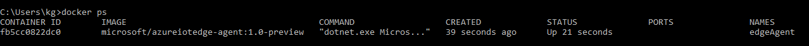
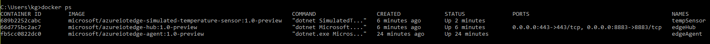
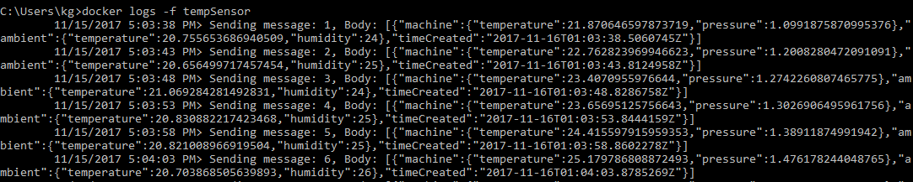

---
# Mandatory fields. See more on aka.ms/skyeye/meta.
title: Quickstart Azure IoT Edge + Windows | Microsoft Docs 
description: Try out Azure IoT Edge by running analytics on a simulated edge device
services: iot-edge
keywords: 
author: kgremban
manager: timlt

ms.author: kgremban
ms.date: 11/15/2017
ms.topic: article
ms.service: iot-edge

# Optional fields. Don't forget to remove # if you need a field.
# ms.custom: can-be-multiple-comma-separated
# ms.devlang:devlang-from-white-list
# ms.suite: 
# ms.tgt_pltfrm:
# ms.reviewer:
---

# Quickstart: Deploy your first IoT Edge module from the Azure portal to a Windows device - preview

In this quickstart, use the Azure IoT Edge cloud interface to deploy prebuilt code remotely to an IoT Edge device. To accomplish this task, first use your Windows device to simulate an IoT Edge device, then you can deploy a module to it.

If you don't have an active Azure subscription, create a [free account][lnk-account] before you begin.

## Prerequisites

This tutorial assumes that you're using a computer or virtual machine running Windows to simulate an Internet of Things device. If you're running Windows in a virtual machine, enable [nested virtualization][lnk-nested] and allocate at least 2GB memory. 

1. Make sure you're using a supported Windows version:
   * Windows 10 
   * Windows Server
2. Install [Docker for Windows][lnk-docker] and make sure it's running.
3. Install [Python 2.7 on Windows][lnk-python] and make sure you can use the pip command.
4. Run the following command to download the IoT Edge control script.

   ```
   pip install -U azure-iot-edge-runtime-ctl
   ```

> [!NOTE]
> Azure IoT Edge can run either Windows containers or Linux containers. To use Windows containers, you have to run:
>    * Windows 10 Fall Creators Update, or
>    * Windows Server 1709 (Build 16299), or
>    * Windows IoT Core (Build 16299) on a x64-based device
>
> For Windows IoT Core, follow the instructions in [Install the IoT Edge runtime on Windows IoT Core][lnk-install-iotcore]. Otherwise, simply [configure Docker to use Windows containers][lnk-docker-containers], and optionally validate your prerequisites with the following powershell command:
>    ```
>    Invoke-Expression (Invoke-WebRequest -useb https://aka.ms/iotedgewin)
>    ```

## Create an IoT hub with Azure CLI

Create an IoT hub in your Azure subscription. The free level of IoT Hub works for this quickstart. If you've used IoT Hub in the past and already have a free hub created, you can skip this section and go on to [Register an IoT Edge device][anchor-register]. Each subscription can only have one free IoT hub. 

1. Sign in to the [Azure portal][lnk-portal]. 
1. Select the **Cloud Shell** button. 

   ![Cloud Shell button][1]

1. Create a resource group. The following code creates a resource group called **IoTEdge** in the **West US** region:

   ```azurecli
   az group create --name IoTEdge --location westus
   ```

1. Create an IoT hub in your new resource group. The following code creates a free **F1** hub called **MyIotHub** in the resource group **IoTEdge**:

   ```azurecli
   az iot hub create --resource-group IoTEdge --name MyIotHub --sku F1 
   ```

## Register an IoT Edge device

[!INCLUDE [iot-edge-register-device](../../includes/iot-edge-register-device.md)]

## Configure the IoT Edge runtime

The IoT Edge runtime is deployed on all IoT Edge devices. It comprises two modules. First, the IoT Edge agent facilitates deployment and monitoring of modules on the IoT Edge device. Second, the IoT Edge hub manages communications between modules on the IoT Edge device, and between the device and IoT Hub. 

Configure the runtime with your IoT Edge device connection string from the previous section.

```
iotedgectl setup --connection-string "{device connection string}" --auto-cert-gen-force-no-passwords
```

Start the runtime.

```
iotedgectl start
```

Check Docker to see that the IoT Edge agent is running as a module.

```
docker ps
```



## Deploy a module

[!INCLUDE [iot-edge-deploy-module](../../includes/iot-edge-deploy-module.md)]

## View generated data

In this quickstart, you created a new IoT Edge device and installed the IoT Edge runtime on it. Then, you used the Azure portal to push an IoT Edge module to run on the device without having to make changes to the device itself. In this case, the module that you pushed creates environmental data that you can use for the tutorials. 

Open the command prompt on the computer running your simulated device again. Confirm that the module deployed from the cloud is running on your IoT Edge device. 

```cmd
docker ps
```



View the messages being sent from the tempSensor module to the cloud. 

```cmd
docker logs -f tempSensor
```



You can also view the telemetry the device is sending by using the [IoT Hub explorer tool][lnk-iothub-explorer]. 
## Clean up resources

When you no longer need the IoT Hub you created, you can use the [az iot hub delete][lnk-delete] command to remove the resource and any devices associated with it:

```azurecli
az iot hub delete --name {your iot hub name} --resource-group {your resource group name}
```

## Next steps

You learned how to deploy an IoT Edge module to an IoT Edge device. Now try deploying different types of Azure services as modules, so that you can analyze data at the edge. 

* [Deploy Azure Function as a module](tutorial-deploy-function.md)
* [Deploy Azure Stream Analytics as a module](tutorial-deploy-stream-analytics.md)
* [Deploy your own code as a module](tutorial-csharp-module.md)


<!-- Images -->
[1]: ./media/quickstart/cloud-shell.png

<!-- Links -->
[lnk-docker]: https://docs.docker.com/docker-for-windows/install/ 
[lnk-docker-containers]: https://docs.microsoft.com/virtualization/windowscontainers/quick-start/quick-start-windows-10#2-switch-to-windows-containers
[lnk-python]: https://www.python.org/downloads/
[lnk-iothub-explorer]: https://github.com/azure/iothub-explorer
[lnk-account]: https://azure.microsoft.com/free
[lnk-portal]: https://portal.azure.com
[lnk-nested]: https://docs.microsoft.com/virtualization/hyper-v-on-windows/user-guide/nested-virtualization
[lnk-delete]: https://docs.microsoft.com/cli/azure/iot/hub?view=azure-cli-latest#az_iot_hub_delete

<!-- Anchor links -->
[anchor-register]: #register-an-iot-edge-device
