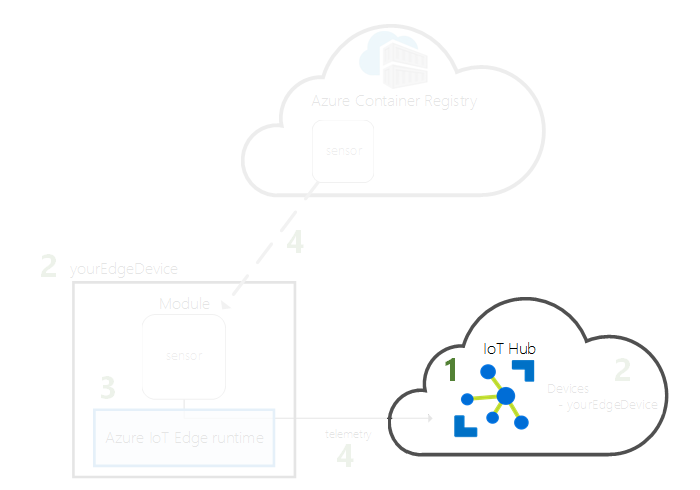
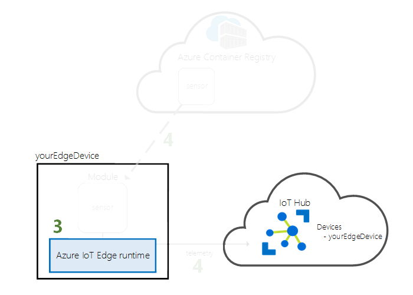
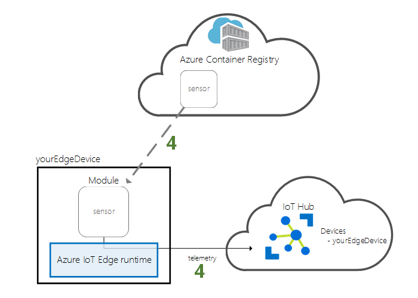

# Quickstart: Deploy your first IoT Edge module from the Azure portal to a Windows device

In this quickstart, use the Azure IoT Edge cloud interface to deploy prebuilt code remotely to an IoT Edge device. To accomplish this task, first create and configure a Windows virtual machine to work as an IoT Edge device, then you can deploy a module to it.

In this quickstart you learn how to:

1. Create an IoT Hub.
2. Register an IoT Edge device to your IoT hub.
3. Install and start the IoT Edge runtime on your device.
4. Remotely deploy a module to an IoT Edge device and send telemetry to IoT Hub.


The module that you deploy in this quickstart is a simulated sensor that generates temperature, humidity, and pressure data. The other Azure IoT Edge tutorials build upon the work you do here by deploying modules that analyze the simulated data for business insights.

If you don't have an active Azure subscription, create a [free account](https://azure.microsoft.com/free) before you begin.

[!INCLUDE [cloud-shell-try-it.md](../../includes/cloud-shell-try-it.md)]

You use the Azure CLI to complete many of the steps in this quickstart, and Azure IoT has an extension to enable additional functionality.

Add the Azure IoT extension to the cloud shell instance.

   ```azurecli-interactive
   az extension add --name azure-cli-iot-ext
   ```

## Prerequisites

Cloud resources:

* A resource group to manage all the resources you use in this quickstart.

   ```azurecli-interactive
   az group create --name IoTEdgeResources --location westus2
   ```

IoT Edge device:

* A Windows virtual machine to act as your IoT Edge device. You can create this virtual machine using the following command, replacing *{password}* with a secure password:

  ```azurecli-interactive
  az vm create --resource-group IoTEdgeResources --name EdgeVM --image MicrosoftWindowsDesktop:Windows-10:rs5-pro:latest --admin-username azureuser --admin-password {password} --size Standard_DS1_v2
  ```

  It may take a few minutes to create and start the new virtual machine. You can then download an RDP file for use when connecting to your virtual machine:

  1. Navigate to your new Windows virtual machine in the Azure portal.
  1. Select **Connect**.
  1. On the **RDP** tab, select **Download RDP File**.

  Open this file with Remote Desktop Connection to connect to your Windows virtual machine using the administrator name and password you specified with the `az vm create` command.


> [!NOTE]
> This quickstart uses a Windows desktop virtual machine for simplicity. For information about which Windows operating systems are generally available for production scenarios, see [Azure IoT Edge supported systems](support.md).

## Create an IoT hub

Start the quickstart by creating an IoT hub with Azure CLI.



The free level of IoT Hub works for this quickstart. If you've used IoT Hub in the past and already have a free hub created, you can use that IoT hub. Each subscription can only have one free IoT hub.

The following code creates a free **F1** hub in the resource group **IoTEdgeResources**. Replace *{hub_name}* with a unique name for your IoT hub.

   ```azurecli-interactive
   az iot hub create --resource-group IoTEdgeResources --name {hub_name} --sku F1
   ```

   If you get an error because there's already one free hub in your subscription, change the SKU to **S1**. If you get an error that the IoT Hub name isn't available, it means that someone else already has a hub with that name. Try a new name.

## Register an IoT Edge device

Register an IoT Edge device with your newly created IoT Hub.


Create a device identity for your simulated device so that it can communicate with your IoT hub. The device identity lives in the cloud, and you use a unique device connection string to associate a physical device to a device identity.

Since IoT Edge devices behave and can be managed differently than typical IoT devices, declare this identity to be for an IoT Edge device with the `--edge-enabled` flag.

1. In the Azure cloud shell, enter the following command to create a device named **myEdgeDevice** in your hub.

   ```azurecli-interactive
   az iot hub device-identity create --device-id myEdgeDevice --hub-name {hub_name} --edge-enabled
   ```

   If you get an error about iothubowner policy keys, make sure that your cloud shell is running the latest version of the azure-cli-iot-ext extension.

2. Retrieve the connection string for your device, which links your physical device with its identity in IoT Hub.

   ```azurecli-interactive
   az iot hub device-identity show-connection-string --device-id myEdgeDevice --hub-name {hub_name}
   ```

3. Copy the value of the `connectionString` key from the JSON output and save it. This value is the device connection string. You'll use this connection string to configure the IoT Edge runtime in the next section.

   

## Install and start the IoT Edge runtime

Install the Azure IoT Edge runtime on your IoT Edge device and configure it with a device connection string.


The IoT Edge runtime is deployed on all IoT Edge devices. It has three components. The **IoT Edge security daemon** starts each time an IoT Edge device boots and bootstraps the device by starting the IoT Edge agent. The **IoT Edge agent** manages deployment and monitoring of modules on the IoT Edge device, including the IoT Edge hub. The **IoT Edge hub** handles communications between modules on the IoT Edge device, and between the device and IoT Hub.

The installation script also includes a container engine called Moby that manages the container images on your IoT Edge device.

During the runtime installation, you're asked for a device connection string. Use the string that you retrieved from the Azure CLI. This string associates your physical device with the IoT Edge device identity in Azure.

### Connect to your IoT Edge device

The steps in this section all take place on your IoT Edge device, so you want to connect to that virtual machine now via remote desktop.

### Install and configure the IoT Edge service

Use PowerShell to download and install the IoT Edge runtime. Use the device connection string that you retrieved from IoT Hub to configure your device.

1. If you haven't already, follow the steps in [Register a new Azure IoT Edge device](how-to-register-device-portal.md) to register your device and retrieve the device connection string. 

2. Run PowerShell as an administrator.

   >[!NOTE]
   >Use an AMD64 session of PowerShell to install IoT Edge, not PowerShell (x86). If you're not sure which session type you're using, run the following command:
   >
   >```powershell
   >(Get-Process -Id $PID).StartInfo.EnvironmentVariables["PROCESSOR_ARCHITECTURE"]
   >```

3. The **Deploy-IoTEdge** command checks that your Windows machine is on a supported version, turns on the containers feature, downloads the moby runtime, and then downloads the IoT Edge runtime.

   ```powershell
   . {Invoke-WebRequest -useb aka.ms/iotedge-win} | Invoke-Expression; `
   Deploy-IoTEdge -ContainerOs Windows
   ```

4. Your machine may restart automatically. If you are prompted by the Deploy-IoTEdge command to reboot, do so now. 

5. Run PowerShell as an administrator again.

6. The **Initialize-IoTEdge** command configures the IoT Edge runtime on your machine. The command defaults to manual provisioning with Windows containers. 

   ```powershell
   . {Invoke-WebRequest -useb aka.ms/iotedge-win} | Invoke-Expression; `
   Initialize-IoTEdge -ContainerOs Windows
   ```

7. When prompted for a **DeviceConnectionString**, provide the string that you copied in the previous section. Don't include quotes around the connection string.

### View the IoT Edge runtime status

Verify that the runtime was successfully installed and configured.

1. Check the status of the IoT Edge service.

   ```powershell
   Get-Service iotedge
   ```

2. If you need to troubleshoot the service, retrieve the service logs.

   ```powershell
   . {Invoke-WebRequest -useb aka.ms/iotedge-win} | Invoke-Expression; Get-IoTEdgeLog
   ```

3. View all the modules running on your IoT Edge device. Since the service just started for the first time, you should only see the **edgeAgent** module running. The edgeAgent module runs by default, and helps to install and start any additional modules that you deploy to your device.

   ```powershell
   iotedge list
   ```

   

It may take a few minutes for the installation to complete and the IoT Edge agent module to start.

Your IoT Edge device is now configured. It's ready to run cloud-deployed modules.

## Deploy a module

Manage your Azure IoT Edge device from the cloud to deploy a module that sends telemetry data to IoT Hub.


[!INCLUDE [iot-edge-deploy-module](../../includes/iot-edge-deploy-module.md)]

## View generated data

In this quickstart, you registered an IoT Edge device and installed the IoT Edge runtime on it. Then, you used the Azure portal to deploy an IoT Edge module to run on the device without having to make changes to the device itself.

In this case, the module that you pushed creates sample data that you can use for testing. The simulated temperature sensor module generates environment data that you can use for testing later. The simulated sensor is monitoring both a machine and the environment around the machine. For example, this sensor might be in a server room, on a factory floor, or on a wind turbine. The message includes ambient temperature and humidity, machine temperature and pressure, and a timestamp. The IoT Edge tutorials use the data created by this module as test data for analytics.

Confirm that the module deployed from the cloud is running on your IoT Edge device.

```powershell
iotedge list
```

   

View the messages being sent from the temperature sensor module to the cloud.

```powershell
iotedge logs SimulatedTemperatureSensor -f
```

   >[!TIP]
   >IoT Edge commands are case-sensitive when referring to module names.

   

You can also watch the messages arrive at your IoT hub by using the [Azure IoT Hub Toolkit extension for Visual Studio Code](https://marketplace.visualstudio.com/items?itemName=vsciot-vscode.azure-iot-toolkit) (formerly Azure IoT Toolkit extension).

## Clean up resources

If you want to continue on to the IoT Edge tutorials, you can use the device that you registered and set up in this quickstart. Otherwise, you can delete the Azure resources that you created to avoid charges.

If you created your virtual machine and IoT hub in a new resource group, you can delete that group and all the associated resources. Double check the contents of the resource group to make sure that there's nothing you want to keep. If you don't want to delete the whole group, you can delete individual resources instead.

Remove the **IoTEdgeResources** group.

```azurecli-interactive
az group delete --name IoTEdgeResources
```

## Next steps

In this quickstart, you created an IoT Edge device and used the Azure IoT Edge cloud interface to deploy code onto the device. Now, you have a test device generating raw data about its environment.

The next step is to set up your local development environment so that you can start creating IoT Edge modules that run your business logic. 

> [!div class="nextstepaction"]
> [Start developing IoT Edge modules for Windows devices](tutorial-develop-for-windows.md)
