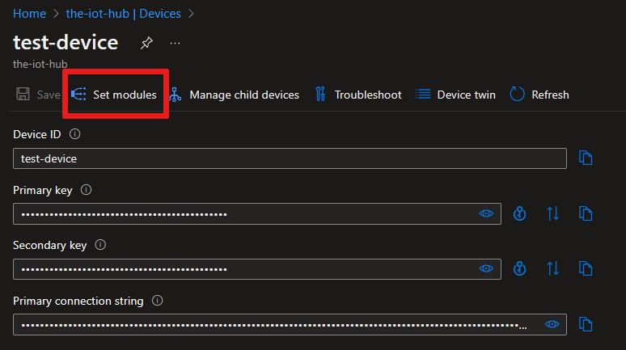
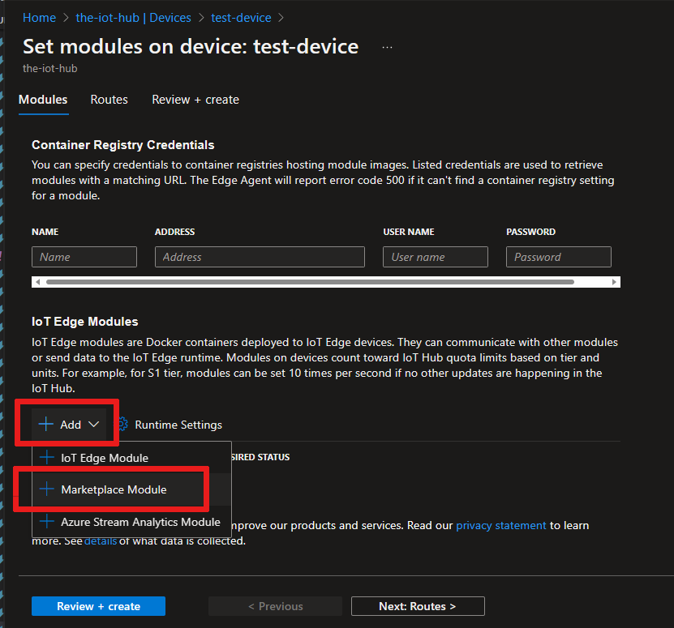
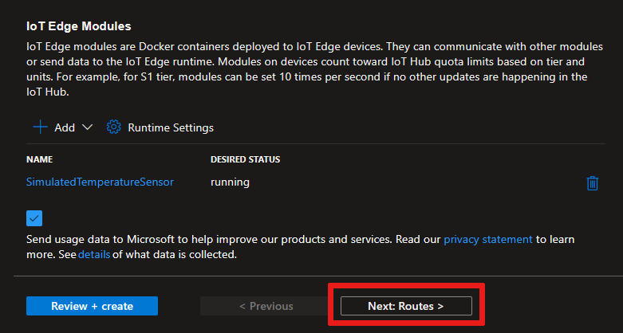
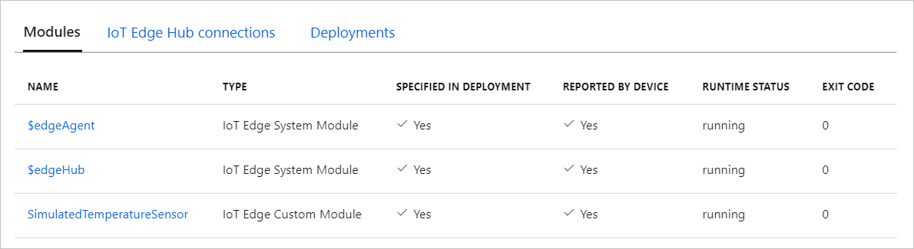

# Quickstart: Deploy your first IoT Edge module to a Windows device (preview)

[!INCLUDE [iot-edge-version-201806](../../includes/iot-edge-version-201806.md)]

Try out Azure IoT Edge in this quickstart by deploying containerized code to a Linux on Windows IoT Edge device. IoT Edge allows you to remotely manage code on your devices so that you can send more of your workloads to the edge. For this quickstart, we recommend using your own device to see how easy it is to use Azure IoT Edge for Linux on Windows.

In this quickstart, you'll learn how to:

* Create an IoT hub.
* Register an IoT Edge device to your IoT hub.
* Install and start the IoT Edge for Linux on Windows runtime on your device.
* Remotely deploy a module to an IoT Edge device and send telemetry.


This quickstart walks you through how to set up your Azure IoT Edge for Linux on Windows device. Then, you'll deploy a module from the Azure portal to your device. The module you'll use is a simulated sensor that generates temperature, humidity, and pressure data. Other Azure IoT Edge tutorials build on the work you do here by deploying modules that analyze the simulated data for business insights.

If you don't have an active Azure subscription, create a [free account](https://azure.microsoft.com/free) before you begin.

>[!NOTE]
>IoT Edge for Linux on Windows is in [public preview](https://azure.microsoft.com/support/legal/preview-supplemental-terms/).

## Prerequisites

Prepare your environment for the Azure CLI.

[!INCLUDE [azure-cli-prepare-your-environment-no-header.md](../../includes/azure-cli-prepare-your-environment-no-header.md)]

Create a cloud resource group to manage all the resources you'll use in this quickstart.

   ```azurecli-interactive
   az group create --name IoTEdgeResources --location westus2
   ```

Make sure your IoT Edge device meets the following requirements:

* Editions
  * Windows 10 version 1809 or later; build 17763 or later
    * Professional, Enterprise, IoT Enterprise
  * Windows Server 2019 build 17763 or later

* Hardware requirements
  * Minimum Free Memory: 1 GB
  * Minimum Free Disk Space: 10 GB

>[!NOTE]
>This quickstart uses Windows Admin Center to create a deployment of IoT Edge for Linux on Windows. You can also use PowerShell. If you wish to use PowerShell to create your deployment, follow the steps in the how-to guide on [installing and provisioning Azure IoT Edge for Linux on a Windows device](how-to-install-iot-edge-on-windows.md).

## Create an IoT hub

Start by creating an IoT hub with the Azure CLI.


The free level of Azure IoT Hub works for this quickstart. If you've used IoT Hub in the past and already have a hub created, you can use that IoT hub.

The following code creates a free **F1** hub in the resource group `IoTEdgeResources`. Replace `{hub_name}` with a unique name for your IoT hub. It might take a few minutes to create an IoT hub.

```azurecli-interactive
az iot hub create --resource-group IoTEdgeResources --name {hub_name} --sku F1 --partition-count 2
```

If you get an error because you already have one free hub in your subscription, change the SKU to `S1`. If you get an error that the IoT hub name isn't available, someone else already has a hub with that name. Try a new name.

## Register an IoT Edge device

Register an IoT Edge device with your newly created IoT hub.


Create a device identity for your simulated device so that it can communicate with your IoT hub. The device identity lives in the cloud, and you use a unique device connection string to associate a physical device to a device identity.

IoT Edge devices behave and can be managed differently than typical IoT devices. Use the `--edge-enabled` flag to declare that this identity is for an IoT Edge device.

1. In Azure Cloud Shell, enter the following command to create a device named **myEdgeDevice** in your hub.

     ```azurecli-interactive
     az iot hub device-identity create --device-id myEdgeDevice --edge-enabled --hub-name {hub_name}
     ```

     If you get an error about `iothubowner` policy keys, make sure that Cloud Shell is running the latest version of the Azure IoT extension.

1. View the connection string for your device, which links your physical device with its identity in IoT Hub. It contains the name of your IoT hub, the name of your device, and a shared key that authenticates connections between the two.

     ```azurecli-interactive
     az iot hub device-identity connection-string show --device-id myEdgeDevice --hub-name {hub_name}
     ```

1. Copy the value of the `connectionString` key from the JSON output and save it. This value is the device connection string. You'll use it to configure the IoT Edge runtime in the next section.

     

## Install and start the IoT Edge runtime

Install IoT Edge for Linux on Windows on your device, and configure it with the device connection string.


1. [Download Windows Admin Center](https://aka.ms/wacdownload).

1. Follow the prompts in the installation wizard to set up Windows Admin Center on your device.

1. Open Windows Admin Center.

1. Select the **Settings gear** icon in the upper-right corner, and then select **Extensions**.

1. On the **Feeds** tab, select **Add**.

1. Enter `https://aka.ms/wac-insiders-feed` into the text box, and then select **Add**.

1. After the feed has been added, go to the **Available extensions** tab and wait for the extensions list to update.

1. From the list of **Available extensions**, select **Azure IoT Edge**.

1. Install the extension.

1. When the extension is installed, select **Windows Admin Center** in the upper-left corner to go to the main dashboard page.

     The **localhost** connection represents the PC where you're running Windows Admin Center.

     :::image type="content" source="media/quickstart/windows-admin-center-start-page.png" alt-text="Screenshot of the Windows Admin Start page.":::

1. Select **Add**.

     :::image type="content" source="media/quickstart/windows-admin-center-start-page-add.png" alt-text="Screenshot that shows selecting the Add button in Windows Admin Center.":::

1. On the Azure IoT Edge tile, select **Create new** to start the installation wizard.

     :::image type="content" source="media/quickstart/select-tile-screen.png" alt-text="Screenshot that shows creating a new deployment in the Azure IoT Edge til.":::

1. Continue through the installation wizard to accept the Microsoft Software License Terms, and then select **Next**.

     :::image type="content" source="media/quickstart/wizard-welcome-screen.png" alt-text="Screenshot that shows selecting Next to continue through the installation wizard.":::

1. Select **Optional diagnostic data**, and then select **Next: Deploy**. This selection provides extended diagnostics data that helps Microsoft monitor and maintain quality of service.

     :::image type="content" source="media/quickstart/diagnostic-data-screen.png" alt-text="Screenshot that shows the Diagnostic data options.":::

1. On the **Select target device** screen, select your desired target device to validate that it meets the minimum requirements. For this quickstart, we're installing IoT Edge on the local device, so choose the **localhost** connection. If the target device meets the requirements, select **Next** to continue.

     :::image type="content" source="media/quickstart/wizard-select-target-device-screen.png" alt-text="Screenshot that shows the Target device list.":::

1. ​Select **Next** to accept the default settings. The deployment screen shows the process of downloading the package, installing the package, configuring the host, and final setting up the Linux virtual machine (VM)​. A successful deployment looks like this:

     :::image type="content" source="media/quickstart/wizard-deploy-success-screen.png" alt-text="Screenshot of a successful deployment.":::

1. Select **Next: Connect** to continue to the final step to provision your Azure IoT Edge device with its device ID from your IoT hub instance.

1. Paste the connection string you copied [earlier in this quickstart](#register-an-iot-edge-device) into the **Device connection string** field. Then select **Provisioning with the selected method**​.

     :::image type="content" source="media/quickstart/wizard-provision.png" alt-text="Screenshot that shows the connection string in the Device connection string field.":::

1. After provisioning is complete, select **Finish** to complete and return to the Windows Admin Center start screen. You should see your device listed as an IoT Edge device.

     :::image type="content" source="media/quickstart/windows-admin-center-device-screen.png" alt-text="Screenshot that shows all connections in Windows Admin Center.":::

1. Select your Azure IoT Edge device to view its dashboard​. You should see that the workloads from your device twin in Azure IoT Hub have been deployed. The **IoT Edge Module List** should show one module running **edgeAgent**, and the **IoT Edge Status** should be **active (running)**.

Your IoT Edge device is now configured. It's ready to run cloud-deployed modules.

## Deploy a module

Manage your Azure IoT Edge device from the cloud to deploy a module that sends telemetry data to IoT Hub.


<!--
[!INCLUDE [iot-edge-deploy-module](../../includes/iot-edge-deploy-module.md)]

Include content included below to support versioned steps in Linux quickstart. Can update include file once Windows quickstart supports v1.2
-->

One of the key capabilities of Azure IoT Edge is deploying code to your IoT Edge devices from the cloud. *IoT Edge modules* are executable packages implemented as containers. In this section, you'll deploy a pre-built module from the [IoT Edge Modules section of Azure Marketplace](https://azuremarketplace.microsoft.com/marketplace/apps/category/internet-of-things?page=1&subcategories=iot-edge-modules) directly from Azure IoT Hub.

The module that you deploy in this section simulates a sensor and sends generated data. This module is a useful piece of code when you're getting started with IoT Edge because you can use the simulated data for development and testing. If you want to see exactly what this module does, you can view the [simulated temperature sensor source code](https://github.com/Azure/iotedge/blob/027a509549a248647ed41ca7fe1dc508771c8123/edge-modules/SimulatedTemperatureSensor/src/Program.cs).

Follow these steps to deploy your first module from Azure Marketplace.

1. Sign in to the [Azure portal](https://portal.azure.com) and go to your IoT hub.

1. From the menu on the left, under **Automatic Device Management**, select **IoT Edge**.

1. Select the device ID of the target device from the list of devices.

1. On the upper bar, select **Set Modules**.

   

1. Under **IoT Edge Modules**, open the **Add** drop-down menu, and then select **Marketplace Module**.

   

1. In **IoT Edge Module Marketplace**, search for and select the `Simulated Temperature Sensor` module.

   The module is added to the IoT Edge Modules section with the desired **running** status.

1. Select **Next: Routes** to continue to the next step of the wizard.

   

1. On the **Routes** tab, remove the default route, **route**, and then select **Next: Review + create** to continue to the next step of the wizard.

   >[!Note]
   >Routes are constructed by using name and value pairs. You should see two routes on this page. The default route, **route**, sends all messages to IoT Hub (which is called `$upstream`). A second route, **SimulatedTemperatureSensorToIoTHub**, was created automatically when you added the module from Azure Marketplace. This route sends all messages from the simulated temperature module to IoT Hub. You can delete the default route because it's redundant in this case.

   

1. Review the JSON file, and then select **Create**. The JSON file defines all of the modules that you deploy to your IoT Edge device. You'll see the **SimulatedTemperatureSensor** module and the two runtime modules, **edgeAgent** and **edgeHub**.

   >[!Note]
   >When you submit a new deployment to an IoT Edge device, nothing is pushed to your device. Instead, the device queries IoT Hub regularly for any new instructions. If the device finds an updated deployment manifest, it uses the information about the new deployment to pull the module images from the cloud then starts running the modules locally. This process can take a few minutes.

1. After you create the module deployment details, the wizard returns you to the device details page. View the deployment status on the **Modules** tab.

   You should see three modules: **$edgeAgent**, **$edgeHub**, and **SimulatedTemperatureSensor**. If one or more of the modules has **YES** under **SPECIFIED IN DEPLOYMENT** but not under **REPORTED BY DEVICE**, your IoT Edge device is still starting them. Wait a few minutes, and then refresh the page.

   

## View the generated data

In this quickstart, you created a new IoT Edge device and installed the IoT Edge runtime on it. Then you used the Azure portal to deploy an IoT Edge module to run on the device without having to make changes to the device itself.

The module that you pushed generates sample environment data that you can use for testing later. The simulated sensor is monitoring both a machine and the environment around the machine. For example, this sensor might be in a server room, on a factory floor, or on a wind turbine. The messages that it sends include ambient temperature and humidity, machine temperature and pressure, and a timestamp. IoT Edge tutorials use the data created by this module as test data for analytics.

From the command shell in Windows Admin Center, confirm that the module you deployed from the cloud is running on your IoT Edge device.

1. Connect to your newly created IoT Edge device.

     :::image type="content" source="media/quickstart/connect-edge-screen.png" alt-text="Screenshot that shows selecting Connect in Windows Admin Center.":::

     On the **Overview** page, you'll see the **IoT Edge Module List** and **IoT Edge Status**. You can see the modules that have been deployed and the device status.  

1. Under **Tools**, select **Command Shell**. The command shell is a PowerShell terminal that automatically uses Secure Shell (SSH) to connect to your Azure IoT Edge device's Linux VM on your Windows PC.

     :::image type="content" source="media/quickstart/command-shell-screen.png" alt-text="Screenshot that shows opening the command shell.":::

1. To verify the three modules on your device, run the following Bash command:

     ```bash
     sudo iotedge list
     ```

    :::image type="content" source="media/quickstart/iotedge-list-screen.png" alt-text="Screenshot that shows the command shell I o T edge list output.":::

1. View the messages being sent from the temperature sensor module to the cloud.

     ```bash
     iotedge logs SimulatedTemperatureSensor -f
     ```

    >[!Important]
    >IoT Edge commands are case-sensitive when they refer to module names.

    :::image type="content" source="media/quickstart/temperature-sensor-screen.png" alt-text="Screenshot that shows the list of messages sent from the module to the cloud.":::

You can also use the [Azure IoT Hub extension for Visual Studio Code](https://marketplace.visualstudio.com/items?itemName=vsciot-vscode.azure-iot-toolkit) to watch messages arrive at your IoT hub.

## Clean up resources

If you want to continue on to the IoT Edge tutorials, skip this step. You can use the device that you registered and set up in this quickstart. Otherwise, you can delete the Azure resources that you created to avoid charges.

If you created your virtual machine and IoT hub in a new resource group, you can delete that group and all the associated resources. If you don't want to delete the whole group, you can delete individual resources instead.

> [!IMPORTANT]
> Check the contents of the resource group to make sure that there's nothing you want to keep. Deleting a resource group is irreversible.

Use the following command to remove the **IoTEdgeResources** group. Deletion might take a few minutes.

```azurecli-interactive
az group delete --name IoTEdgeResources
```

You can confirm that the resource group is removed by using this command to view the list of resource groups.

```azurecli-interactive
az group list
```

### Remove Azure IoT Edge for Linux on Windows

Use the dashboard extension in Windows Admin Center to uninstall Azure IoT Edge for Linux on Windows.

1. Connect to the IoT Edge device in Windows Admin Center. The Azure dashboard tool extension loads.

1. Select **Uninstall**. After Azure IoT Edge is removed, Windows Admin Center removes the Azure IoT Edge device connection entry from the **Start** page.

>[!Note]
>Another way to remove Azure IoT Edge from your Windows system is to select **Start** > **Settings** > **Apps** > **Azure IoT Edge** > **Uninstall** on your IoT Edge device. This method removes Azure IoT Edge from your IoT Edge device, but leaves the connection behind in Windows Admin Center. To complete the removal, uninstall Windows Admin Center from the **Settings** menu as well.

## Next steps

In this quickstart, you created an IoT Edge device and used the Azure IoT Edge cloud interface to deploy code onto the device. Now you have a test device generating raw data about its environment.

Next, set up your local development environment so that you can start creating IoT Edge modules that run your business logic.

> [!div class="nextstepaction"]
> [Start developing IoT Edge modules](tutorial-develop-for-linux.md)
