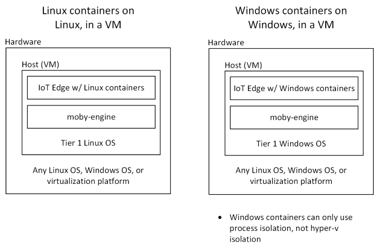

# Azure IoT Edge supported systems

[!INCLUDE [iot-edge-version-201806-or-202011](../../includes/iot-edge-version-201806-or-202011.md)]

This article provides details about which systems and components are supported by IoT Edge, whether officially or in preview.

## Get support

If you experience problems while using the Azure IoT Edge service, there are several ways to seek support. Try one of the following channels for support:

**Reporting bugs** – The majority of development that goes into the Azure IoT Edge product happens in the IoT Edge open-source project. Bugs can be reported on the [issues page](https://github.com/azure/iotedge/issues) of the project. Bugs related to Azure IoT Edge for Linux on Windows can be reported on the [iotedge-eflow issues page](https://github.com/azure/iotedge-eflow/issues). Fixes rapidly make their way from the projects in to product updates.

**Microsoft Customer Support team** – Users who have a [support plan](https://azure.microsoft.com/support/plans/) can engage the Microsoft Customer Support team by creating a support ticket directly from the [Azure portal](https://ms.portal.azure.com/signin/index/?feature.settingsportalinstance=mpac).

**Feature requests** – The Azure IoT Edge product tracks feature requests via the product's [User Voice page](https://feedback.azure.com/forums/907045-azure-iot-edge).

## Container engines

Azure IoT Edge modules are implemented as containers, so IoT Edge needs a container engine to launch them. Microsoft provides a container engine, moby-engine, to fulfill this requirement. This container engine is based on the Moby open-source project. Docker CE and Docker EE are other popular container engines. They're also based on the Moby open-source project and are compatible with Azure IoT Edge. Microsoft provides best effort support for systems using those container engines; however, Microsoft can't ship fixes for issues in them. For this reason, Microsoft recommends using moby-engine on production systems.

 

## Operating systems

Azure IoT Edge runs on most operating systems that can run containers; however, not all of these systems are equally supported. Operating systems are grouped into tiers that represent the level of support users can expect.

* Tier 1 systems are supported. For tier 1 systems, Microsoft:
  * has this operating system in automated tests
  * provides installation packages for them
* Tier 2 systems are compatible with Azure IoT Edge and can be used relatively easily. For tier 2 systems:
  * Microsoft has done informal testing on the platforms or knows of a partner successfully running Azure IoT Edge on the platform
  * Installation packages for other platforms may work on these platforms

The family of the host OS must always match the family of the guest OS used inside a module's container.

<!-- 1.1 -->
:::moniker range="iotedge-2018-06"
In other words, you can only use Linux containers on Linux and Windows containers on Windows. When using Windows containers, only process isolated containers are supported, not Hyper-V isolated containers.  

IoT Edge for Linux on Windows uses IoT Edge in a Linux virtual machine running on a Windows host. In this way, you can run Linux modules on a Windows device.
:::moniker-end
<!-- end 1.1 -->

### Tier 1

The systems listed in the following tables are supported by Microsoft, either generally available or in public preview, and are tested with each new release.

<!-- 1.1 -->
:::moniker range="iotedge-2018-06"
Azure IoT Edge supports modules built as either Linux or Windows containers. Linux containers can be deployed to Linux devices or deployed to Windows devices using IoT Edge for Linux on Windows. Windows containers can only be deployed to Windows devices.
:::moniker-end
<!-- end 1.1 -->

<!-- 1.2 -->
:::moniker range=">=iotedge-2020-11"
Azure IoT Edge version 1.2 only supports modules built as Linux containers.

Currently, there is no supported way to run IoT Edge version 1.2 on Windows devices. [IoT Edge for Linux on Windows](iot-edge-for-linux-on-windows.md) is the recommended way to run IoT Edge on Windows devices, but currently only runs IoT Edge 1.1. For more information, refer to the [IoT Edge 1.1](?view=iotedge-2018-06&preserve-view=true) version of this article.

:::moniker-end
<!-- end 1.2 -->

#### Linux containers

<!-- 1.1 -->
:::moniker range="iotedge-2018-06"
Modules built as Linux containers can be deployed to either Linux or Windows devices. For Linux devices, the IoT Edge runtime is installed directly on the host device. For Windows devices, a Linux virtual machine prebuilt with the IoT Edge runtime runs on the host device.

[IoT Edge for Linux on Windows](iot-edge-for-linux-on-windows.md) is currently in public preview, but is the recommended way to run IoT Edge on Windows devices.

| Operating System | AMD64 | ARM32v7 | ARM64 |
| ---------------- | ----- | ------- | ----- |
| Raspberry Pi OS Stretch |  |  |  |
| Ubuntu Server 18.04 |  |  | Public preview |
| Windows 10 Pro | Public preview |  |  |
| Windows 10 Enterprise | Public preview |  |  |
| Windows 10 IoT Enterprise | Public preview |  |  |
| Windows Server 2019 | Public preview |  |  |

All Windows operating systems must be version 1809 (build 17763) or later.
:::moniker-end
<!-- end 1.1 -->

<!-- 1.2 -->
:::moniker range=">=iotedge-2020-11"

| Operating System | AMD64 | ARM32v7 | ARM64 |
| ---------------- | ----- | ------- | ----- |
| Raspberry Pi OS Stretch |  |  |  |
| Ubuntu Server 18.04 |  |  | Public preview |

:::moniker-end
<!-- end 1.2 -->

>[!NOTE]
>Ubuntu Server 16.04 support ended with the release of IoT Edge version 1.1.

#### Windows containers

<!-- 1.1 -->
:::moniker range="iotedge-2018-06"
>[!IMPORTANT]
>IoT Edge 1.1 LTS is the last release channel that will support Windows containers. Starting with version 1.2, Windows containers will not be supported. Consider using or moving to [IoT Edge for Linux on Windows](iot-edge-for-linux-on-windows.md) to run IoT Edge on Windows devices.

Modules built as Windows containers can be deployed only to Windows devices.

| Operating System | AMD64 | ARM32v7 | ARM64 |
| ---------------- | ----- | ------- | ----- |
| Windows 10 IoT Enterprise |  |  |  |
| Windows Server 2019  |  |  |  |
| Windows Server IoT 2019 |  |  |  |

All Windows operating systems must be version 1809 (build 17763). The specific build of Windows is required for IoT Edge on Windows because the version of the Windows containers must exactly match the version of the host Windows device. Windows containers currently only use build 17763.

>[!NOTE]
>Windows 10 IoT Core support ended with the release of IoT Edge version 1.1.
:::moniker-end
<!-- end 1.1 -->

<!-- 1.2 -->
:::moniker range=">=iotedge-2020-11"
IoT Edge 1.1 LTS is the last release channel that supports Windows containers. Starting with version 1.2, Windows containers are not supported.

For information about supported operating systems for Windows containers, refer to the [IoT Edge 1.1](?view=iotedge-2018-06&preserve-view=true) version of this article.

:::moniker-end
<!-- end 1.2 -->

### Tier 2

The systems listed in the following table are considered compatible with Azure IoT Edge, but are not actively tested or maintained by Microsoft.

| Operating System | AMD64 | ARM32v7 | ARM64 |
| ---------------- | ----- | ------- | ----- |
| [CentOS 7.5](https://wiki.centos.org/Manuals/ReleaseNotes/CentOS7.1804) |  |  |  |
| [Ubuntu 20.04 1](https://wiki.ubuntu.com/FocalFossa/ReleaseNotes) |  |  |  |
| [Debian 9](https://www.debian.org/releases/stretch/) |  |  |  |
| [Debian 10](https://www.debian.org/releases/buster/) |  |  |  |
| [Mentor Embedded Linux Flex OS](https://www.mentor.com/embedded-software/linux/mel-flex-os/) |  |  |  |
| [Mentor Embedded Linux Omni OS](https://www.mentor.com/embedded-software/linux/mel-omni-os/) |  |  |  |
| [RHEL 7.5](https://access.redhat.com/documentation/en-us/red_hat_enterprise_linux/7/html/7.5_release_notes/index) |  |  |  |
| [Ubuntu 18.04](https://wiki.ubuntu.com/BionicBeaver/ReleaseNotes) |  |  |  |
| [Wind River 8](https://docs.windriver.com/category/os-wind_river_linux) |  |  |  |
| [Yocto](https://www.yoctoproject.org/) |  |  |  |
| Raspberry Pi OS Buster |  |  |  |

1 The Ubuntu Server 18.04 installation steps in [Install or uninstall Azure IoT Edge for Linux](how-to-install-iot-edge.md) should work without any changes on Ubuntu 20.04.

## Releases

IoT Edge release assets and release notes are available on the [azure-iotedge releases](https://github.com/Azure/azure-iotedge/releases) page. This section reflects information from those release notes to help you visualize the components of each version more easily.

The following table lists the components included in each release starting with 1.2.0. The components listed in this table can be installed or updated individually, and are backwards compatible with older versions.

| Release | aziot-edge | edgeHub edgeAgent | aziot-identity-service |
| ------- | ---------- | -------------------- | ---------------------- |
| **1.2** | 1.2.0      | 1.2.0                | 1.2.0                  |

The following table lists the components included in each release up to the 1.1 LTS release. The components listed in this table can be installed or updated individually, and are backwards compatible with older versions.

| Release | iotedge | edgeHub edgeAgent | libiothsm | moby |
|--|--|--|--|--|
| **1.1 LTS**1 | 1.1.0 1.1.1   | 1.1.0 1.1.1 1.1.2 | 1.1.0 1.1.1   |   |
| **1.0.10** | 1.0.10 1.0.10.1 1.0.10.2  1.0.10.4 | 1.0.10 1.0.10.1 1.0.10.2 1.0.10.3 1.0.10.4 | 1.0.10 1.0.10.1 1.0.10.2  1.0.10.4 |  |
| **1.0.9** | 1.0.9 1.0.9.1 1.0.9.2 1.0.9.3 1.0.9.4 1.0.9.5 | 1.0.9 1.0.9.1 1.0.9.2 1.0.9.3 1.0.9.4 1.0.9.5 | 1.0.9 1.0.9.1 1.0.9.2 1.0.9.3 1.0.9.4 1.0.9.5 |  |
| **1.0.8** | 1.0.8 | 1.0.8 1.0.8.1 1.0.8.2 1.0.8.3 1.0.8.4 1.0.8.5 | 1.0.8 | 3.0.6 |
| **1.0.7** | 1.0.7 1.0.7.1 | 1.0.7 1.0.7.1 | 1.0.7 1.0.7.1 | 3.0.4 (ARMv7hl, CentOS) 3.0.5 |
| **1.0.6** | 1.0.6 1.0.6.1 | 1.0.6 1.0.6.1 | 1.0.6 1.0.6.1 |  |
| **1.0.5** | 1.0.5 | 1.0.5 | 1.0.5 | 3.0.2 |

1IoT Edge 1.1 is the first long-term support (LTS) release channel. This version introduced no new features, but will receive security updates and fixes to regressions. IoT Edge 1.1 LTS uses .NET Core 3.1, and will be supported until December 3, 2022 to match the [.NET Core and .NET 5 release lifecycle](https://dotnet.microsoft.com/platform/support/policy/dotnet-core).

>[!IMPORTANT]
>With the release of a long-term support channel, we recommend that all current customers running 1.0.x upgrade their devices to 1.1.x to receive ongoing support.

IoT Edge uses the Microsoft.Azure.Devices.Client SDK. For more information, see the [Azure IoT C# SDK GitHub repo](https://github.com/Azure/azure-iot-sdk-csharp) or the [Azure SDK for .NET reference content](/dotnet/api/overview/azure/iot/client). The following list shows the version of the client SDK that each release is tested against:

| IoT Edge version | Microsoft.Azure.Devices.Client SDK version |
|------------------|--------------------------------------------|
| 1.2.0            | 1.33.4-NestedEdge
| 1.1 (LTS)        | 1.28.0                                     |
| 1.0.10           | 1.28.0                                     |
| 1.0.9            | 1.21.1                                     |
| 1.0.8            | 1.20.3                                     |
| 1.0.7            | 1.20.1                                     |
| 1.0.6            | 1.17.1                                     |
| 1.0.5            | 1.17.1                                     |

## Virtual Machines

Azure IoT Edge can be run in virtual machines. Using a virtual machine as an IoT Edge device is common when customers want to augment existing infrastructure with edge intelligence. The family of the host VM OS must match the family of the guest OS used inside a module's container. This requirement is the same as when Azure IoT Edge is run directly on a device. Azure IoT Edge is agnostic of the underlying virtualization technology and works in VMs powered by platforms like Hyper-V and vSphere.

 

<!-- 1.1 -->
:::moniker range="iotedge-2018-06"

::: moniker-end

<!-- 1.2 -->
:::moniker range=">=iotedge-2020-11"

:::moniker-end

## Minimum system requirements

Azure IoT Edge runs great on devices as small as a Raspberry Pi3 to server grade hardware. Choosing the right hardware for your scenario depends on the workloads that you want to run. Making the final device decision can be complicated; however, you can easily start prototyping a solution on traditional laptops or desktops.

Experience while prototyping will help guide your final device selection. Questions you should consider include:

* How many modules are in your workload?
* How many layers do your modules' containers share?
* In what language are your modules written?
* How much data will your modules be processing?
* Do your modules need any specialized hardware for accelerating their workloads?
* What are the desired performance characteristics of your solution?
* What is your hardware budget?
