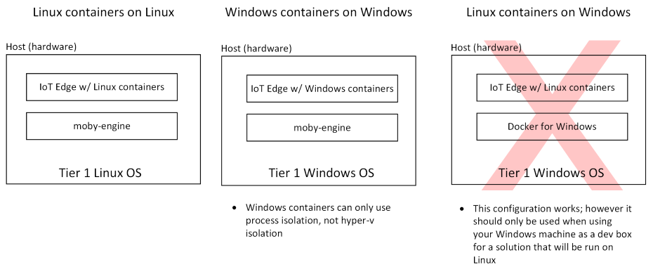

# Azure IoT Edge supported systems

This article provides details about which systems and components are supported by IoT Edge, whether officially or in preview.

If you experience problems while using the Azure IoT Edge service, there are several ways to seek support. Try one of the following channels for support:

**Reporting bugs** – The majority of development that goes into the Azure IoT Edge product happens in the IoT Edge open-source project. Bugs can be reported on the [issues page](https://github.com/azure/iotedge/issues) of the project. Fixes rapidly make their way from the project in to product updates.

**Microsoft Customer Support team** – Users who have a [support plan](https://azure.microsoft.com/support/plans/) can engage the Microsoft Customer Support team by creating a support ticket directly from the [Azure portal](https://ms.portal.azure.com/signin/index/?feature.settingsportalinstance=mpac).

**Feature requests** – The Azure IoT Edge product tracks feature requests via the product's [User Voice page](https://feedback.azure.com/forums/907045-azure-iot-edge).

## Container engines

Azure IoT Edge modules are implemented as containers, so IoT Edge needs a container engine to launch them. Microsoft provides a container engine, moby-engine, to fulfill this requirement. This container engine is based on the Moby open-source project. Docker CE and Docker EE are other popular container engines. They're also based on the Moby open-source project and are compatible with Azure IoT Edge. Microsoft provides best effort support for systems using those container engines; however, Microsoft can't ship fixes for issues in them. For this reason, Microsoft recommends using moby-engine on production systems.

<br>
<center>


</center>

## Operating systems

Azure IoT Edge runs on most operating systems that can run containers; however, not all of these systems are equally supported. Operating systems are grouped into tiers that represent the level of support users can expect.

* Tier 1 systems are supported. For tier 1 systems, Microsoft:
  * has this operating system in automated tests
  * provides installation packages for them
* Tier 2 systems are compatible with Azure IoT Edge and can be used relatively easily. For tier 2 systems:
  * Microsoft has done informal testing on the platforms or knows of a partner successfully running Azure IoT Edge on the platform
  * Installation packages for other platforms may work on these platforms

The family of the host OS must always match the family of the guest OS used inside a module's container. In other words, you can only use Linux containers on Linux and Windows containers on Windows. When using Windows, only process isolated containers are supported, not Hyper-V isolated containers.  

<br>
<center>


</center>

### Tier 1

The systems listed in the following table are supported by Microsoft, either generally available or in public preview, and are tested with each new release. 

| Operating System | AMD64 | ARM32v7 | ARM64 |
| ---------------- | ----- | ------- | ----- |
| Raspbian Stretch |  |  |  |
| [Ubuntu Server 16.04](https://wiki.ubuntu.com/XenialXerus/ReleaseNotes) |  |  | Public preview  |
| [Ubuntu Server 18.04](https://wiki.ubuntu.com/BionicBeaver/ReleaseNotes) |  |  | Public preview |
| [Windows 10 IoT Core](https://docs.microsoft.com/windows/iot-core/windows-iot-core), build 17763 |  |  |  |
| [Windows 10 IoT Enterprise](https://docs.microsoft.com/windows/iot-core/windows-iot-enterprise), build 17763 |  |  |  |
| [Windows Server 2019](https://docs.microsoft.com/windows-server/get-started-19/rel-notes-19), build 17763 |  |  |  |
| [Windows Server IoT 2019](https://docs.microsoft.com/windows/iot-core/windows-server), build 17763 |  |  |  |

The Windows operating systems listed above are the requirements for devices that run Windows containers on Windows, which is the only supported configuration for production. The Azure IoT Edge installation packages for Windows allow the use of Linux containers on Windows; however, this configuration is for development and testing only. For more information, see [Use IoT Edge on Windows to run Linux containers](how-to-install-iot-edge-windows-with-linux.md).

### Tier 2

The systems listed in the following table are considered compatible with Azure IoT Edge, but are not actively tested or maintained by Microsoft.

| Operating System | AMD64 | ARM32v7 | ARM64 |
| ---------------- | ----- | ------- | ----- |
| [CentOS 7.5](https://wiki.centos.org/Manuals/ReleaseNotes/CentOS7.1804) |  |  |  |
| [Debian 8](https://www.debian.org/releases/jessie/) |  |  |  |
| [Debian 9](https://www.debian.org/releases/stretch/) |  |  |  |
| [Debian 10](https://www.debian.org/releases/buster/) <sup>1</sup> |  |  |  |
| [Mentor Embedded Linux Flex OS](https://www.mentor.com/embedded-software/linux/mel-flex-os/) |  |  |  |
| [Mentor Embedded Linux Omni OS](https://www.mentor.com/embedded-software/linux/mel-omni-os/) |  |  |  |
| [RHEL 7.5](https://access.redhat.com/documentation/en-us/red_hat_enterprise_linux/7/html/7.5_release_notes/index) |  |  |  |
| [Ubuntu 16.04](https://wiki.ubuntu.com/XenialXerus/ReleaseNotes) |  |  |  |
| [Ubuntu 18.04](https://wiki.ubuntu.com/BionicBeaver/ReleaseNotes) |  |  |  |
| [Wind River 8](https://docs.windriver.com/category/os-wind_river_linux) |  |  |  |
| [Yocto](https://www.yoctoproject.org/) |  |  |  |
| Raspbian Buster <sup>1</sup> |  |  |  |

<sup>1</sup> Debian 10 systems, including Raspian Buster, use a version of OpenSSL that IoT Edge doesn't support. Use the following command to install an earlier version before installing IoT Edge:

```bash
sudo apt-get install libssl1.0.2
```

## Releases

IoT Edge release assets and release notes are available on the [azure-iotedge releases](https://github.com/Azure/azure-iotedge/releases) page. This section reflects information from those release notes to help you visualize the components of each version more easily.

IoT Edge components can be installed or updated individually, and are backwards compatible with components from older versions. The following table lists the components included in each release:

| Release | Security daemon | Edge hub<br>Edge agent | Libiothsm | Moby |
|--|--|--|--|--|
| **1.0.9** | 1.0.9.2<br>1.0.9.1<br>1.0.9 | 1.0.9.2<br>1.0.9.1<br>1.0.9 | 1.0.9.2<br>1.0.9.1<br>1.0.9 |  |
| **1.0.8** | 1.0.8 | 1.0.8.5<br>1.0.8.4<br>1.0.8.3<br>1.0.8.2<br>1.0.8.1<br>1.0.8 | 1.0.8 | 3.0.6 |
| **1.0.7** | 1.0.7.1<br>1.0.7 | 1.0.7.1<br>1.0.7 | 1.0.7.1<br>1.0.7 | 3.0.5<br>3.0.4 (ARMv7hl, CentOS) |
| **1.0.6** | 1.0.6.1<br>1.0.6 | 1.0.6.1<br>1.0.6 | 1.0.6.1<br>1.0.6 |  |
| **1.0.5** | 1.0.5 | 1.0.5 | 1.0.5 | 3.0.2 |

IoT Edge uses the Microsoft.Azure.Device.Client SDK. For more information, see the [Azure IoT C# SDK GitHub repo](https://github.com/Azure/azure-iot-sdk-csharp) or the [Azure SDK for .NET reference content](https://docs.microsoft.com/dotnet/api/overview/azure/iot/client?view=azure-dotnet). The following list shows the version of the client SDK that each release is tested against:

* **IoT Edge 1.0.9**: Client SDK 1.21.1
* **IoT Edge 1.0.8**: Client SDK 1.20.3
* **IoT Edge 1.0.7**: Client SDK 1.20.1
* **IoT Edge 1.0.6**: Client SDK 1.17.1
* **IoT Edge 1.0.5**: Client SDK 1.17.1

## Virtual Machines

Azure IoT Edge can be run in virtual machines. Using a virtual machine as an IoT Edge device is common when customers want to augment existing infrastructure with edge intelligence. The family of the host VM OS must match the family of the guest OS used inside a module's container. This requirement is the same as when Azure IoT Edge is run directly on a device. Azure IoT Edge is agnostic of the underlying virtualization technology and works in VMs powered by platforms like Hyper-V and vSphere.

<br>
<center>


</center>

## Minimum system requirements

Azure IoT Edge runs great on devices as small as a Raspberry Pi3 to server grade hardware. Choosing the right hardware for your scenario depends on the workloads that you want to run. Making the final device decision can be complicated; however, you can easily start prototyping a solution on traditional laptops or desktops.

Experience while prototyping will help guide your final device selection. Questions you should consider include:

* How many modules are in your workload?
* How many layers do your modules' containers share?
* In what language are your modules written?
* How much data will your modules be processing?
* Do your modules need any specialized hardware for accelerating their workloads?
* What are the desired performance characteristics of your solution?
* What is your hardware budget?
