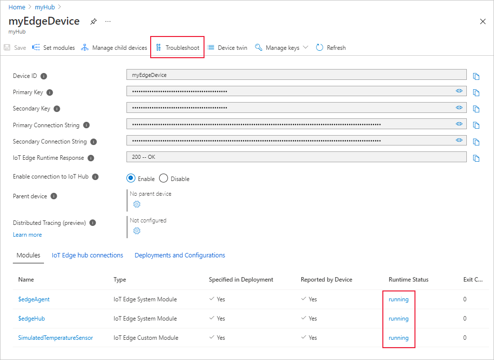
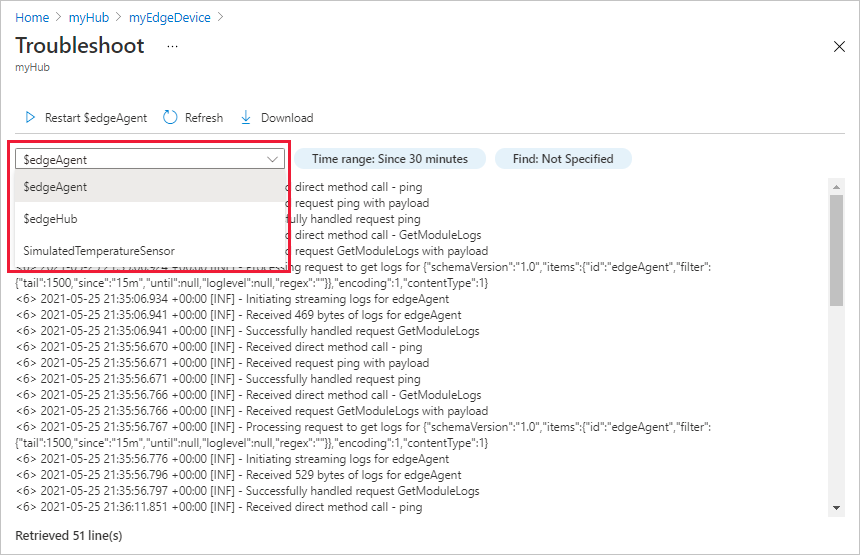
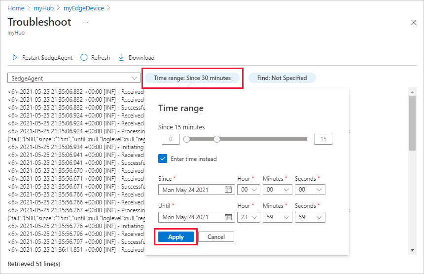
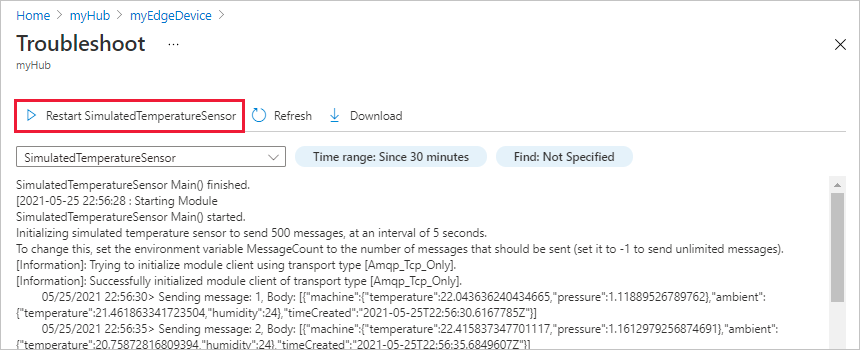

# Troubleshoot IoT Edge devices from the Azure portal

[!INCLUDE [iot-edge-version-all-supported](../../includes/iot-edge-version-all-supported.md)]

IoT Edge provides a streamlined way of monitoring and troubleshooting modules in the Azure portal. The troubleshooting page is a wrapper for the IoT Edge agent's direct methods so that you can easily retrieve logs from deployed modules and remotely restart them.

## Prerequisites

The full functionality of this troubleshooting feature in the portal requires IoT Edge version 1.1.3 or newer if you're on the long-term support branch, or version 1.2.1 or newer if you're on the latest stable branch. Both the IoT Edge host component and the edgeAgent module need to be on these versions.

## Access the troubleshooting page

You can access the troubleshooting page in the portal through either the IoT Edge device details page or the IoT Edge module details page.

1. Sign in to the [Azure portal](https://portal.azure.com) and navigate to your IoT hub.

1. In the left pane,select **Devices** under the **Device management** menu.

1. Select the IoT Edge device that you want to monitor from the list of devices.

1. From the device details page, you can either select **Troubleshoot** from the menu or select the runtime status of a particular module that you want to inspect.

   

1. From the device details page, you can also select the name of a module to open the module details page. From there, you can select **Troubleshoot** from the menu.

   

## View module logs in the portal

On the **Troubleshoot** page, you can view and download logs from any of the running modules on your IoT Edge device.

This page has a maximum limit of 1500 log lines, and any logs longer than that will be truncated. If the logs are too large, the attempt to get module logs will fail. In that case, try to change the time range filter to retrieve less data or consider using direct methods to [Retrieve logs from IoT Edge deployments](how-to-retrieve-iot-edge-logs.md) to gather larger log files.

Use the dropdown menu to choose which module to inspect.

By default, this page displays the last fifteen minutes of logs. Select the **Time range** filter to see different logs. Use the slider to select a time window within the last 60 minutes, or check **Enter time instead** to choose a specific datetime window.

Once you have the logs from the module that you want to troubleshoot during the time range that you want to inspect, you can use the **Find** filter to retrieve specific lines from the logs. You can filter for either warnings or errors, or provide a specific term or phrase to search for. The **Find** feature supports plaintext searches or [.NET regular expressions](/dotnet/standard/base-types/regular-expression-language-quick-reference) for more complex searches.

You can download the module logs as a text file. The downloaded log file will reflect any active filters you have applied to the logs.

>[!TIP]
>The CPU utilization on a device will spike temporarily as it gathers logs in response to a request from the portal. This behavior is expected, and the utilization should stabilize after the task is complete.

## Restart modules

The **Troubleshoot** page includes a feature to restart a module. Selecting this option sends a command to the IoT Edge agent to restart the selected module. Restarting a module won't affect your ability to retrieve logs from before the restart.

## Next steps

Find more tips for [Troubleshooting your IoT Edge device](troubleshoot.md) or learn about [Common issues and resolutions](troubleshoot-common-errors.md). 

If you have more questions, create a [Support request](https://portal.azure.com/#create/Microsoft.Support) for help.
