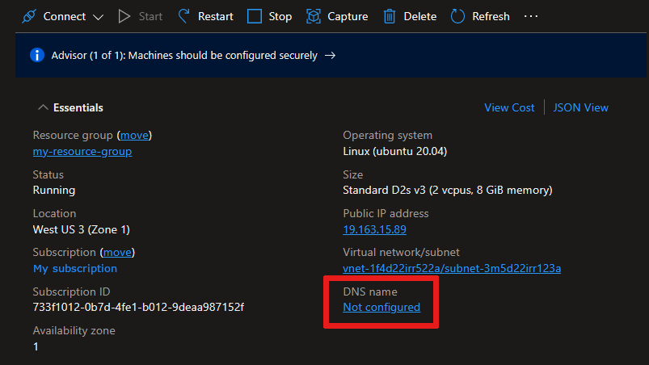
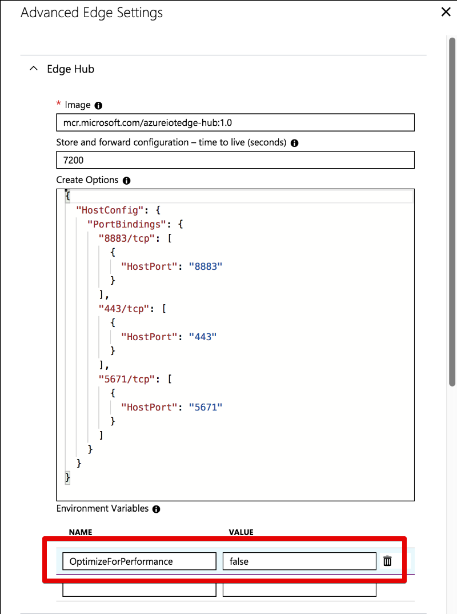

# Common issues and resolutions for Azure IoT Edge

If you experience issues running Azure IoT Edge in your environment, use this article as a guide for troubleshooting and resolution.

## Run the iotedge 'check' command

Your first step when troubleshooting IoT Edge should be to use the `check` command, which performs a collection of configuration and connectivity tests for common issues. The `check` command is available in [release 1.0.7](https://github.com/Azure/azure-iotedge/releases/tag/1.0.7) and later.

You can run the `check` command as follows, or include the `--help` flag to see a complete list of options:

* On Linux:

  ```bash
  sudo iotedge check
  ```

* On Windows:

  ```powershell
  iotedge check
  ```

The types of checks run by the tool can be classified as:

* Configuration checks: Examines details that could prevent Edge devices from connecting to the cloud, including issues with *config.yaml* and the container engine.
* Connection checks: Verifies the IoT Edge runtime can access ports on the host device and all the IoT Edge components can connect to the IoT Hub.
* Production readiness checks: Looks for recommended production best practices, such as the state of device certificate authority (CA) certificates and module log file configuration.

For a complete list of diagnostic checks, see [Built-in troubleshooting functionality](https://github.com/Azure/iotedge/blob/master/doc/troubleshoot-checks.md).

## Standard diagnostic steps

If you encounter an issue, you can learn more about the state of your IoT Edge device by reviewing the container logs and the messages that pass to and from the device. Use the commands and tools in this section to gather information.

### Check the status of the IoT Edge Security Manager and its logs

On Linux:

* To view the status of the IoT Edge Security Manager:

   ```bash
   sudo systemctl status iotedge
   ```

* To view the logs of the IoT Edge Security Manager:

    ```bash
    sudo journalctl -u iotedge -f
    ```

* To view more detailed logs of the IoT Edge Security Manager:

  * Edit the iotedge daemon settings:

      ```bash
      sudo systemctl edit iotedge.service
      ```

  * Update the following lines:

      ```bash
      [Service]
      Environment=IOTEDGE_LOG=edgelet=debug
      ```

  * Restart the IoT Edge Security Daemon:

      ```bash
      sudo systemctl cat iotedge.service
      sudo systemctl daemon-reload
      sudo systemctl restart iotedge
      ```

On Windows:

* To view the status of the IoT Edge Security Manager:

   ```powershell
   Get-Service iotedge
   ```

* To view the logs of the IoT Edge Security Manager:

   ```powershell
   . {Invoke-WebRequest -useb aka.ms/iotedge-win} | Invoke-Expression; Get-IoTEdgeLog
   ```

### If the IoT Edge Security Manager is not running, verify your yaml configuration file

> [!WARNING]
> YAML files cannot contain tabs as indentation. Use 2 spaces instead. Top-level elements should have no leading spaces.

On Linux:

   ```bash
   sudo nano /etc/iotedge/config.yaml
   ```

On Windows:

   ```cmd
   notepad C:\ProgramData\iotedge\config.yaml
   ```

### Check container logs for issues

Once the IoT Edge Security Daemon is running, look at the logs of the containers to detect issues. Start with your deployed containers, then look at the containers that make up the IoT Edge runtime: edgeAgent and edgeHub. The IoT Edge agent logs typically provide info on the lifecycle of each container. The IoT Edge hub logs provide info on messaging and routing.

   ```cmd
   iotedge logs <container name>
   ```

### View the messages going through the IoT Edge hub

You can view the messages going through the IoT Edge hub, and gather insights from verbose logs from the runtime containers. To turn on verbose logs on these containers, set `RuntimeLogLevel` in your yaml configuration file. To open the file:

On Linux:

   ```bash
   sudo nano /etc/iotedge/config.yaml
   ```

On Windows:

   ```cmd
   notepad C:\ProgramData\iotedge\config.yaml
   ```

By default, the `agent` element will look like the following example:

   ```yaml
   agent:
     name: edgeAgent
     type: docker
     env: {}
     config:
       image: mcr.microsoft.com/azureiotedge-agent:1.0
       auth: {}
   ```

Replace `env: {}` with:

   ```yaml
   env:
     RuntimeLogLevel: debug
   ```

   > [!WARNING]
   > YAML files cannot contain tabs as identation. Use 2 spaces instead. Top-level items cannot have leading whitespace.

Save the file and restart the IoT Edge security manager.

You can also check the messages being sent between IoT Hub and the IoT Edge devices. View these messages by using the [Azure IoT Hub extension for Visual Studio Code](https://marketplace.visualstudio.com/items?itemName=vsciot-vscode.azure-iot-toolkit). For more information, see [Handy tool when you develop with Azure IoT](https://blogs.msdn.microsoft.com/iotdev/2017/09/01/handy-tool-when-you-develop-with-azure-iot/).

### Restart containers

After investigating the logs and messages for information, you can try restarting containers:

```cmd
iotedge restart <container name>
```

Restart the IoT Edge runtime containers:

```cmd
iotedge restart edgeAgent && iotedge restart edgeHub
```

### Restart the IoT Edge security manager

If issue is still persisting, you can try restarting the IoT Edge security manager.

On Linux:

   ```cmd
   sudo systemctl restart iotedge
   ```

On Windows:

   ```powershell
   Stop-Service iotedge -NoWait
   sleep 5
   Start-Service iotedge
   ```

## IoT Edge agent stops after about a minute

The edgeAgent module starts and runs successfully for about a minute, then stops. The logs indicate that the IoT Edge agent attempts to connect to IoT Hub over AMQP, and then attempts to connect using AMQP over WebSocket. When that fails, the IoT Edge agent exits.

Example edgeAgent logs:

```output
2017-11-28 18:46:19 [INF] - Starting module management agent.
2017-11-28 18:46:19 [INF] - Version - 1.0.7516610 (03c94f85d0833a861a43c669842f0817924911d5)
2017-11-28 18:46:19 [INF] - Edge agent attempting to connect to IoT Hub via AMQP...
2017-11-28 18:46:49 [INF] - Edge agent attempting to connect to IoT Hub via AMQP over WebSocket...
```

**Root cause**

A networking configuration on the host network is preventing the IoT Edge agent from reaching the network. The agent attempts to connect over AMQP (port 5671) first. If the connection fails, it tries WebSockets (port 443).

The IoT Edge runtime sets up a network for each of the modules to communicate on. On Linux, this network is a bridge network. On Windows, it uses NAT. This issue is more common on Windows devices using Windows containers that use the NAT network.

**Resolution**

Ensure that there is a route to the internet for the IP addresses assigned to this bridge/NAT network. Sometimes a VPN configuration on the host overrides the IoT Edge network.

## IoT Edge hub fails to start

The edgeHub module fails to start, and prints the following message to the logs:

```output
One or more errors occurred. 
(Docker API responded with status code=InternalServerError, response=
{\"message\":\"driver failed programming external connectivity on endpoint edgeHub (6a82e5e994bab5187939049684fb64efe07606d2bb8a4cc5655b2a9bad5f8c80): 
Error starting userland proxy: Bind for 0.0.0.0:443 failed: port is already allocated\"}\n)
```

**Root cause**

Some other process on the host machine has bound port 443. The IoT Edge hub maps ports 5671 and 443 for use in gateway scenarios. This port mapping fails if another process has already bound this port.

**Resolution**

Find and stop the process that is using port 443. This process is usually a web server.

## IoT Edge agent can't access a module's image (403)

A container fails to run, and the edgeAgent logs show a 403 error.

**Root cause**

The IoT Edge agent doesn't have permissions to access a module's image.

**Resolution**

Make sure that your registry credentials are correctly specified in your deployment manifest

## IoT Edge security daemon fails with an invalid hostname

The command `sudo journalctl -u iotedge` fails and prints the following message:

```output
Error parsing user input data: invalid hostname. Hostname cannot be empty or greater than 64 characters
```

**Root cause**

The IoT Edge runtime can only support hostnames that are shorter than 64 characters. Physical machines usually don't have long hostnames, but the issue is more common on a virtual machine. The automatically generated hostnames for Windows virtual machines hosted in Azure, in particular, tend to be long. 

**Resolution**

When you see this error, you can resolve it by configuring the DNS name of your virtual machine, and then setting the DNS name as the hostname in the setup command.

1. In the Azure portal, navigate to the overview page of your virtual machine.
2. Select **configure** under DNS name. If your virtual machine already has a DNS name configured, you don't need to configure a new one.

   

3. Provide a value for **DNS name label** and select **Save**.
4. Copy the new DNS name, which should be in the format **\<DNSnamelabel\>.\<vmlocation\>.cloudapp.azure.com**.
5. Inside the virtual machine, use the following command to set up the IoT Edge runtime with your DNS name:

   * On Linux:

      ```bash
      sudo nano /etc/iotedge/config.yaml
      ```

   * On Windows:

      ```cmd
      notepad C:\ProgramData\iotedge\config.yaml
      ```

## Stability issues on resource constrained devices

You may encounter stability problems on constrained devices like the Raspberry Pi, especially when used as a gateway. Symptoms include out of memory exceptions in the edge hub module, downstream devices cannot connect or the device stops sending telemetry messages after a few hours.

**Root cause**

The IoT Edge hub, which is part of the IoT Edge runtime, is optimized for performance by default and attempts to allocate large chunks of memory. This optimization is not ideal for constrained edge devices and can cause stability problems.

**Resolution**

For the IoT Edge hub, set an environment variable **OptimizeForPerformance** to **false**. There are two ways to do this:

In the Azure portal:

In your IoT Hub, select your IoT Edge device and from the device details page and select **Set Modules** > **Runtime Settings**. Create an environment variable for the Edge Hub module called *OptimizeForPerformance* that is set to *false*.



**OR**

In the deployment manifest:

```json
  "edgeHub": {
    "type": "docker",
    "settings": {
      "image": "mcr.microsoft.com/azureiotedge-hub:1.0",
      "createOptions": <snipped>
    },
    "env": {
      "OptimizeForPerformance": {
          "value": "false"
      }
    },
```

## Can't get the IoT Edge daemon logs on Windows

If you get an EventLogException when using `Get-WinEvent` on Windows, check your registry entries.

**Root cause**

The `Get-WinEvent` PowerShell command relies on a registry entry to be present to find logs by a specific `ProviderName`.

**Resolution**

Set a registry entry for the IoT Edge daemon. Create a **iotedge.reg** file with the following content, and import in to the Windows Registry by double-clicking it or using the `reg import iotedge.reg` command:

```
Windows Registry Editor Version 5.00

[HKEY_LOCAL_MACHINE\SYSTEM\CurrentControlSet\Services\EventLog\Application\iotedged]
"CustomSource"=dword:00000001
"EventMessageFile"="C:\\ProgramData\\iotedge\\iotedged.exe"
"TypesSupported"=dword:00000007
```

## IoT Edge module fails to send a message to the edgeHub with 404 error

A custom IoT Edge module fails to send a message to the edgeHub with a 404 `Module not found` error. The IoT Edge daemon prints the following message to the logs: 

```output
Error: Time:Thu Jun  4 19:44:58 2018 File:/usr/sdk/src/c/provisioning_client/adapters/hsm_client_http_edge.c Func:on_edge_hsm_http_recv Line:364 executing HTTP request fails, status=404, response_buffer={"message":"Module not found"}u, 04 ) 
```

**Root cause**

The IoT Edge daemon enforces process identification for all modules connecting to the edgeHub for security reasons. It verifies that all messages being sent by a module come from the main process ID of the module. If a message is being sent by a module from a different process ID than initially established, it will reject the message with a 404 error message.

**Resolution**

As of version 1.0.7, all module processes are authorized to connect. If upgrading to 1.0.7 isn't possible, complete the following steps. For more information, see the [1.0.7 release changelog](https://github.com/Azure/iotedge/blob/master/CHANGELOG.md#iotedged-1).

Make sure that the same process ID is always used by the custom IoT Edge module to send messages to the edgeHub. For instance, make sure to `ENTRYPOINT` instead of `CMD` command in your Docker file, since `CMD` will lead to one process ID for the module and another process ID for the bash command running the main program whereas `ENTRYPOINT` will lead to a single process ID.

## Firewall and Port configuration rules for IoT Edge deployment

Azure IoT Edge allows communication from an on-premises server to Azure cloud using supported IoT Hub protocols, see [choosing a communication protocol](../iot-hub/iot-hub-devguide-protocols.md). For enhanced security, communication channels between Azure IoT Edge and Azure IoT Hub are always configured to be Outbound. This configuration is based on the [Services Assisted Communication pattern](https://blogs.msdn.microsoft.com/clemensv/2014/02/09/service-assisted-communication-for-connected-devices/), which minimizes the attack surface for a malicious entity to explore. Inbound communication is only required for specific scenarios where Azure IoT Hub needs to push messages to the Azure IoT Edge device. Cloud-to-device messages are protected using secure TLS channels and can be further secured using X.509 certificates and TPM device modules. The Azure IoT Edge Security Manager governs how this communication can be established, see [IoT Edge Security Manager](../iot-edge/iot-edge-security-manager.md).

While IoT Edge provides enhanced configuration for securing Azure IoT Edge runtime and deployed modules, it is still dependent on the underlying machine and network configuration. Hence, it is imperative to ensure proper network and firewall rules are set up for secure edge to cloud communication. The following table can be used as a guideline when configuration firewall rules for the underlying servers where Azure IoT Edge runtime is hosted:

|Protocol|Port|Incoming|Outgoing|Guidance|
|--|--|--|--|--|
|MQTT|8883|BLOCKED (Default)|BLOCKED (Default)|<ul> <li>Configure Outgoing (Outbound) to be Open when using MQTT as the communication protocol.<li>1883 for MQTT is not supported by IoT Edge. <li>Incoming (Inbound) connections should be blocked.</ul>|
|AMQP|5671|BLOCKED (Default)|OPEN (Default)|<ul> <li>Default communication protocol for IoT Edge. <li> Must be configured to be Open if Azure IoT Edge is not configured for other supported protocols or AMQP is the desired communication protocol.<li>5672 for AMQP is not supported by IoT Edge.<li>Block this port when Azure IoT Edge uses a different IoT Hub supported protocol.<li>Incoming (Inbound) connections should be blocked.</ul></ul>|
|HTTPS|443|BLOCKED (Default)|OPEN (Default)|<ul> <li>Configure Outgoing (Outbound) to be Open on 443 for IoT Edge provisioning. This configuration is required when using manual scripts or Azure IoT Device Provisioning Service (DPS). <li>Incoming (Inbound) connection should be Open only for specific scenarios: <ul> <li>  If you have a transparent gateway with leaf devices that may send method requests. In this case, Port 443 does not need to be open to external networks to connect to IoTHub or provide IoTHub services through Azure IoT Edge. Thus the incoming rule could be restricted to only open Incoming (Inbound) from the internal network. <li> For Client to Device (C2D) scenarios.</ul><li>80 for HTTP is not supported by IoT Edge.<li>If non-HTTP protocols (for example, AMQP or MQTT) cannot be configured in the enterprise; the messages can be sent over WebSockets. Port 443 will be used for WebSocket communication in that case.</ul>|

## Edge Agent module continually reports 'empty config file' and no modules start on the device

The device has trouble starting modules defined in the deployment. Only the edgeAgent is running but continually reporting 'empty config file...'.

**Root cause**

By default, IoT Edge starts modules in their own isolated container network. The device may be having trouble with DNS name resolution within this private network.

**Resolution**

**Option 1: Set DNS server in container engine settings**

Specify the DNS server for your environment in the container engine settings which will apply to all container modules started by the engine. Create a file named `daemon.json` specifying the DNS server to use. For example:

```json
{
    "dns": ["1.1.1.1"]
}
```

The above example sets the DNS server to a publicly accessible DNS service. If the edge device cannot access this IP from its environment, replace it with DNS server address that is accessible.

Place `daemon.json` in the right location for your platform: 

| Platform | Location |
| --------- | -------- |
| Linux | `/etc/docker` |
| Windows host with Windows containers | `C:\ProgramData\iotedge-moby\config` |

If the location already contains `daemon.json` file, add the **dns** key to it and save the file.

*Restart the container engine for the updates to take effect*

| Platform | Command |
| --------- | -------- |
| Linux | `sudo systemctl restart docker` |
| Windows (Admin Powershell) | `Restart-Service iotedge-moby -Force` |

**Option 2: Set DNS server in IoT Edge deployment per module**

You can set DNS server for each module's *createOptions* in the IoT Edge deployment. For example:

```json
"createOptions": {
  "HostConfig": {
    "Dns": [
      "x.x.x.x"
    ]
  }
}
```

Be sure to set this for the *edgeAgent* and *edgeHub* modules as well.

## Next steps

Do you think that you found a bug in the IoT Edge platform? [Submit an issue](https://github.com/Azure/iotedge/issues) so that we can continue to improve.

If you have more questions, create a [Support request](https://portal.azure.com/#create/Microsoft.Support) for help.
