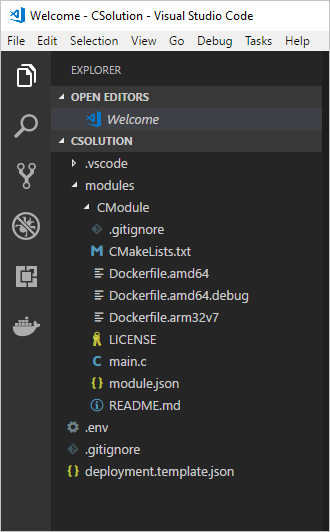

---
# Mandatory fields. See more on aka.ms/skyeye/meta.
title: Azure IoT Edge C tutorial | Microsoft Docs 
description: This tutorial shows you how to create an IoT Edge module with C code and deploy it to an edge device
services: iot-edge
author: shizn
manager: timlt

ms.author: xshi
ms.date: 09/21/2018
ms.topic: tutorial
ms.service: iot-edge
ms.custom: mvc

---

# Tutorial: Develop a C IoT Edge module and deploy to your simulated device

You can use IoT Edge modules to deploy code that implements your business logic directly to your IoT Edge devices. This tutorial walks you through creating and deploying an IoT Edge module that filters sensor data. In this tutorial, you learn how to:    

> [!div class="checklist"]
> * Use Visual Studio Code to create an IoT Edge module in C
> * Use Visual Studio Code and Docker to create a docker image and publish it to a container registry 
> * Deploy the module to your IoT Edge device
> * View generated data


The IoT Edge module that you create in this tutorial filters the temperature data generated by your device. It only sends messages upstream if the temperature is above a specified threshold. This type of analysis at the edge is useful for reducing the amount of data communicated to and stored in the cloud. 

[!INCLUDE [quickstarts-free-trial-note](../../includes/quickstarts-free-trial-note.md)]


## Prerequisites

An Azure IoT Edge device:

* You can use your development machine or a virtual machine as an Edge device by following the steps in the quickstart for [Linux](quickstart-linux.md) or [Windows devices](quickstart.md).
* C modules for Azure IoT Edge don't support Windows containers. If your IoT Edge device is a Windows machine, configure it to [use Linux containers](https://docs.docker.com/docker-for-windows/#switch-between-windows-and-linux-containers)

Cloud resources:

* A free or standard-tier [IoT Hub](../iot-hub/iot-hub-create-through-portal.md) in Azure. 

Development resources:

* [Visual Studio Code](https://code.visualstudio.com/). 
* [C/C++ extension](https://marketplace.visualstudio.com/items?itemName=ms-vscode.cpptools) for Visual Studio Code.
* [Azure IoT Edge extension](https://marketplace.visualstudio.com/items?itemName=vsciot-vscode.azure-iot-edge) for Visual Studio Code.
* [Docker CE](https://docs.docker.com/install/). 

>[!Note]
>C modules for Azure IoT Edge don't support Windows containers. 

[!INCLUDE [cloud-shell-try-it.md](../../includes/cloud-shell-try-it.md)]


## Create a container registry
In this tutorial, you use the Azure IoT Edge extension for VS Code to build a module and create a **container image** from the files. Then you push this image to a **registry** that stores and manages your images. Finally, you deploy your image from your registry to run on your IoT Edge device.  

You can use any Docker-compatible registry for this tutorial. Two popular Docker registry services available in the cloud are [Azure Container Registry](https://docs.microsoft.com/azure/container-registry/) and [Docker Hub](https://docs.docker.com/docker-hub/repos/#viewing-repository-tags). This tutorial uses Azure Container Registry. 

The following Azure CLI command creates a registry in a resource group called **IoTEdgeResources**. Replace **{acr_name}** with a unique name for your registry. 

   ```azurecli-interactive
   az acr create --resource-group IoTEdgeResources --name {acr_name} --sku Basic --admin-enabled true
   ```

Retrieve the credentials for your registry. 

   ```azurecli-interactive
   az acr credential show --name {acr_name}
   ```

Copy the values for **Username** and one of the passwords. You'll use these values later in the tutorial when you publish the Docker image to your registry, and when you add the registry credentials to the Edge runtime. 

## Create an IoT Edge module project
The following steps show you how to create an IoT Edge module project based on .NET core 2.0 using Visual Studio Code and the Azure IoT Edge extension.

### Create a new solution

Create a C solution template that you can customize with your own code. 

1. Select **View** > **Command Palette** to open the VS Code command palette. 

2. In the command palette, type and run the command **Azure: Sign in** and follow the instructions to sign in your Azure account. If you've already signed in, you can skip this step.

3. In the command palette, type and run the command **Azure IoT Edge: New IoT Edge solution**. In the command palette, provide the following information to create your solution: 

   1. Select the folder where you want to create the solution. 
   2. Provide a name for your solution or accept the default **EdgeSolution**.
   3. Choose **C Module** as the module template. 
   4. Name your module **CModule**. 
   5. Specify the Azure Container Registry that you created in the previous section as the image repository for your first module. Replace **localhost:5000** with **\<registry name\>.azurecr.io**. Only replace the localhost part of the string, don't delete your module name. 

   

The VS Code window loads your IoT Edge solution workspace. The solution workspace contains five top-level components. You won't edit the **\.vscode** folder or **\.gitignore** file in this tutorial. The **modules** folder contains the C code for your module as well as Dockerfiles for building your module as a container image. The **\.env** file stores your container registry credentials. The **deployment.template.json** file contains the information that the IoT Edge runtime uses to deploy modules on a device. 

If you didn't specify a container registry when creating your solution, but accepted the default localhost:5000 value, you won't have a \.env file. 

   

### Add your registry credentials

The environment file stores the credentials for your container registry and shares them with the IoT Edge runtime. The runtime needs these credentials to pull your private images onto the IoT Edge device. 

1. In the VS Code explorer, open the .env file. 
2. Update the fields with the **username** and **password** values that you copied from your Azure container registry. 
3. Save this file. 

### Update the module with custom code

Add code to your C module that allows it to read in data from the sensor, check whether the reported machine temperature has exceeded a safe threshold, and pass that information on to IoT Hub. 

5. The data from the sensor in this scenario comes in JSON format. To filter messages in JSON format, import a JSON library for C. This tutorial uses Parson.

   1. Download the [Parson Github repository](https://github.com/kgabis/parson). Copy the **parson.c** and **parson.h** files into the **CModule** folder.

   2. Open **modules** > **CModule** > **CMakeLists.txt**. At the top of the file, import the Parson files as a library called **my_parson**.

      ```
      add_library(my_parson
          parson.c
          parson.h
      )
      ```

   3. Add **my_parson** to the list of libraries in the **target_link_libraries** function of CMakeLists.txt.

   4. Save the **CMakeLists.txt** file.

   5. Open **modules** > **CModule** > **main.c**. At the buttom of the list of include statements, add a new one to include `parson.h` for JSON support:

      ```c
      #include "parson.h"
      ```

6. In the **main.c** file, add a global variable called `temperatureThreshold` after the include section. This variable sets the value that the measured temperature must exceed in order for the data to be sent to IoT Hub. 

    ```c
    static double temperatureThreshold = 25;
    ```

7. Replace the entire `CreateMessageInstance` function with the following code. This function allocates a context for the callback. 

    ```c
    static MESSAGE_INSTANCE* CreateMessageInstance(IOTHUB_MESSAGE_HANDLE message)
    {
        MESSAGE_INSTANCE* messageInstance = (MESSAGE_INSTANCE*)malloc(sizeof(MESSAGE_INSTANCE));
        if (NULL == messageInstance)
        {
            printf("Failed allocating 'MESSAGE_INSTANCE' for pipelined message\r\n");
        }
        else
        {
            memset(messageInstance, 0, sizeof(*messageInstance));

            if ((messageInstance->messageHandle = IoTHubMessage_Clone(message)) == NULL)
            {
                free(messageInstance);
                messageInstance = NULL;
            }
            else
            {
                messageInstance->messageTrackingId = messagesReceivedByInput1Queue;
                MAP_HANDLE propMap = IoTHubMessage_Properties(messageInstance->messageHandle);
                if (Map_AddOrUpdate(propMap, "MessageType", "Alert") != MAP_OK)
                {
                    printf("ERROR: Map_AddOrUpdate Failed!\r\n");
                }
            }
        }

        return messageInstance;
    }
    ```

8. Replace the entire `InputQueue1Callback` function with the following code. This function implements the actual messaging filter. 

    ```c
    static IOTHUBMESSAGE_DISPOSITION_RESULT InputQueue1Callback(IOTHUB_MESSAGE_HANDLE message, void* userContextCallback)
    {
        IOTHUBMESSAGE_DISPOSITION_RESULT result;
        IOTHUB_CLIENT_RESULT clientResult;
        IOTHUB_MODULE_CLIENT_LL_HANDLE iotHubModuleClientHandle = (IOTHUB_MODULE_CLIENT_LL_HANDLE)userContextCallback;

        unsigned const char* messageBody;
        size_t contentSize;

        if (IoTHubMessage_GetByteArray(message, &messageBody, &contentSize) != IOTHUB_MESSAGE_OK)
        {
            messageBody = "<null>";
        }

        printf("Received Message [%zu]\r\n Data: [%s]\r\n", 
                messagesReceivedByInput1Queue, messageBody);

        JSON_Value *root_value = json_parse_string(messageBody);
        JSON_Object *root_object = json_value_get_object(root_value);
        double temperature;
        if (json_object_dotget_value(root_object, "machine.temperature") != NULL && (temperature = json_object_dotget_number(root_object, "machine.temperature")) > temperatureThreshold)
        {
            printf("Machine temperature %f exceeds threshold %f\r\n", temperature, temperatureThreshold);
            // This message should be sent to next stop in the pipeline, namely "output1".  What happens at "outpu1" is determined
            // by the configuration of the Edge routing table setup.
            MESSAGE_INSTANCE *messageInstance = CreateMessageInstance(message);
            if (NULL == messageInstance)
            {
                result = IOTHUBMESSAGE_ABANDONED;
            }
            else
            {
                printf("Sending message (%zu) to the next stage in pipeline\n", messagesReceivedByInput1Queue);

                clientResult = IoTHubModuleClient_LL_SendEventToOutputAsync(iotHubModuleClientHandle, messageInstance->messageHandle, "output1", SendConfirmationCallback, (void *)messageInstance);
                if (clientResult != IOTHUB_CLIENT_OK)
                {
                    IoTHubMessage_Destroy(messageInstance->messageHandle);
                    free(messageInstance);
                    printf("IoTHubModuleClient_LL_SendEventToOutputAsync failed on sending msg#=%zu, err=%d\n", messagesReceivedByInput1Queue, clientResult);
                    result = IOTHUBMESSAGE_ABANDONED;
                }
                else
                {
                    result = IOTHUBMESSAGE_ACCEPTED;
                }
            }
        }
        else
        {
            printf("Not sending message (%zu) to the next stage in pipeline.\r\n", messagesReceivedByInput1Queue);
            result = IOTHUBMESSAGE_ACCEPTED;
        }

        messagesReceivedByInput1Queue++;
        return result;
    }
    ```

9. Add a `moduleTwinCallback` function. This method receives updates on the desired properties from the module twin, and updates the **temperatureThreshold** variable to match. All modules have their own module twin, which lets you configure the code running inside a module directly from the cloud.

    ```c
    static void moduleTwinCallback(DEVICE_TWIN_UPDATE_STATE update_state, const unsigned char* payLoad, size_t size, void* userContextCallback)
    {
        printf("\r\nTwin callback called with (state=%s, size=%zu):\r\n%s\r\n", 
            ENUM_TO_STRING(DEVICE_TWIN_UPDATE_STATE, update_state), size, payLoad);
        JSON_Value *root_value = json_parse_string(payLoad);
        JSON_Object *root_object = json_value_get_object(root_value);
        if (json_object_dotget_value(root_object, "desired.TemperatureThreshold") != NULL) {
            temperatureThreshold = json_object_dotget_number(root_object, "desired.TemperatureThreshold");
        }
        if (json_object_get_value(root_object, "TemperatureThreshold") != NULL) {
            temperatureThreshold = json_object_get_number(root_object, "TemperatureThreshold");
        }
    }
    ```

10. Replace the `SetupCallbacksForModule` function with the following code. 

    ```c
    static int SetupCallbacksForModule(IOTHUB_MODULE_CLIENT_LL_HANDLE iotHubModuleClientHandle)
    {
        int ret;

        if (IoTHubModuleClient_LL_SetInputMessageCallback(iotHubModuleClientHandle, "input1", InputQueue1Callback, (void*)iotHubModuleClientHandle) != IOTHUB_CLIENT_OK)
        {
            printf("ERROR: IoTHubModuleClient_LL_SetInputMessageCallback(\"input1\")..........FAILED!\r\n");
            ret = __FAILURE__;
        }
        else if (IoTHubModuleClient_LL_SetModuleTwinCallback(iotHubModuleClientHandle, moduleTwinCallback, (void*)iotHubModuleClientHandle) != IOTHUB_CLIENT_OK)
        {
            printf("ERROR: IoTHubModuleClient_LL_SetModuleTwinCallback(default)..........FAILED!\r\n");
            ret = __FAILURE__;
        }
        else
        {
            ret = 0;
        }

        return ret;
    }
    ```

11. Save the **main.c** file.

## Build your IoT Edge solution

In the previous section you created an IoT Edge solution and added code to the CModule that will filter out messages where the reported machine temperature is within the acceptable limits. Now you need to build the solution as a container image and push it to your container registry. 

1. Open the VS Code integrated terminal by selecting **View** > **Integrated terminal**. 

1. Sign in to Docker by entering the following command in the Visual Studio Code integrated terminal. You need to sign in with your Azure Container Registry credentials so that you can push your module image to the registry. 
     
   ```csh/sh
   docker login -u <ACR username> -p <ACR password> <ACR login server>
   ```
   Use the username, password, and login server that you copied from your Azure Container Registry in the first section. Or retrieve them again from the **Access keys** section of your registry in the Azure portal.

2. In the VS Code explorer, open the **deployment.template.json** file in your IoT Edge solution workspace. This file tells the `$edgeAgent` to deploy two modules: **tempSensor** and **CModule**. The `CModule.image` value is set to a Linux amd64 version of the image. To learn more about deployment manifests, see [Understand how IoT Edge modules can be used, configured, and reused](module-composition.md).

4. Add the CModule module twin to the deployment manifest. Insert the following JSON content at the bottom of the `moduleContent` section, after the `$edgeHub` module twin: 

    ```json
        "CModule": {
            "properties.desired":{
                "TemperatureThreshold":25
            }
        }
    ```

   

4. Save the **deployment.template.json** file.
5. In the VS Code explorer, right-click the **deployment.template.json** file and select **Build and Push IoT Edge solution**. 

When you tell Visual Studio Code to build your solution, it first generates a `deployment.json` file in a new **config** folder. The information for the deployment.json file is gathered from the template file that you updated, the .env file that you used to store your container registry credentials, and the module.json file in the CModule folder. 

Next, Visual Studio Code runs two commands in the integrated terminal: `docker build` and `docker push`. These two commands build your code, containerize the `CModule.dll`, and the push it to the container registry that you specified when you initialized the solution. 

You can see the full container image address with tag in the VS Code integrated terminal. The image address is built from information in the `module.json` file, with the format **\<repository\>:\<version\>-\<platform\>**. For this tutorial, it should look like **myregistry.azurecr.io/cmodule:0.0.1-amd64**.

## Deploy and run the solution

In the quickstart article that you used to set up your IoT Edge device, you deployed a module by using the Azure portal. You can also deploy modules using the Azure IoT Toolkit extension for Visual Studio Code. You already have a deployment manifest prepared for your scenario, the **deployment.json** file. All you need to do now is select a device to receive the deployment.

1. In the VS Code command palette, run **Azure IoT Hub: Select IoT Hub**. 

2. Choose the subscription and IoT hub that contain the IoT Edge device that you want to configure. 

3. In the VS Code explorer, expand the **Azure IoT Hub Devices** section. 

4. Right-click the name of your IoT Edge device, then select **Create Deployment for Single Device**. 

   

5. Select the **deployment.json** file in the **config** folder and then click **Select Edge Deployment Manifest**. Do not use the deployment.template.json file. 

6. Click the refresh button. You should see the new **CModule** running along with the **TempSensor** module and the **$edgeAgent** and **$edgeHub**. 

## View generated data

Once you apply the deployment manifest to your IoT Edge device, the IoT Edge runtime on the device collects the new deployment information and starts executing on it. Any modules running on the device that aren't included in the deployment manifest are stopped. Any modules missing from the device are started. 

You can view the status of your IoT Edge device using the **Azure IoT Hub Devices** section of the Visual Studio Code explorer. Expand the details of your device to see a list of deployed and running modules. 

On the IoT Edge device itself you can see the status of your deployment modules using the command `iotedge list`. You should see four modules: the two IoT Edge runtime modules, tempSensor, and the custom module that you created in this tutorial. It may take a few minutes for all the modules to start, so rerun the command if you don't see them all initially. 

To view the messages being generated by any module, use the command `iotedge logs <module name>`. 

You can view the messages as they arrive at your IoT hub using Visual Studio Code. 

1. To monitor data arriving at the IoT hub, click **...**, and select **Start Monitoring D2C Messages**.
2. To monitor the D2C message for a specific device, right-click the device in the list, and select **Start Monitoring D2C Messages**.
3. To stop monitoring data, run the command **Azure IoT Hub: Stop monitoring D2C message** in command palette. 
4. To view or update module twin, right-click the module in the list, and select **Edit module twin**. To update the module twin, save the twin JSON file and right-click the editor area and select **Update Module Twin**.
5. To view Docker logs, you can install [Docker](https://marketplace.visualstudio.com/items?itemName=PeterJausovec.vscode-docker) for VS Code and find your running modules locally in Docker explorer. In the context menu, click **Show Logs** to view in integrated terminal.
 
## Clean up resources 

If you plan to continue to the next recommended article, you can keep the resources and configurations that you created and reuse them. You can also keep using the same IoT Edge device as a test device. 

Otherwise, you can delete the local configurations and the Azure resources that you created in this article to avoid charges. 

[!INCLUDE [iot-edge-clean-up-cloud-resources](../../includes/iot-edge-clean-up-cloud-resources.md)]

[!INCLUDE [iot-edge-clean-up-local-resources](../../includes/iot-edge-clean-up-local-resources.md)]


## Next steps

In this tutorial, you created an IoT Edge module that contains code to filter raw data generated by your IoT Edge device. When you're ready to build your own modules, you can learn more about how to [Develop a C module with Azure IoT Edge for Visual Studio Code](how-to-develop-c-module.md). You can continue on to the next tutorials to learn about other ways that Azure IoT Edge can help you turn data into business insights at the edge.

> [!div class="nextstepaction"]
> [Store data at the edge with SQL Server databases](tutorial-store-data-sql-server.md)

<!-- Links -->
[lnk-tutorial1-win]: quickstart.md
[lnk-tutorial1-lin]: quickstart-linux.md
