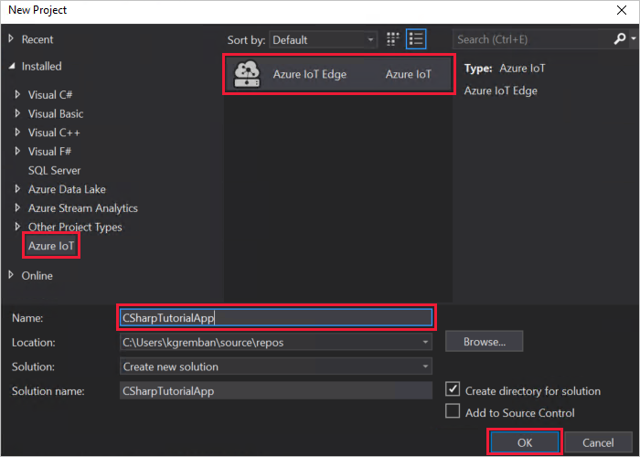
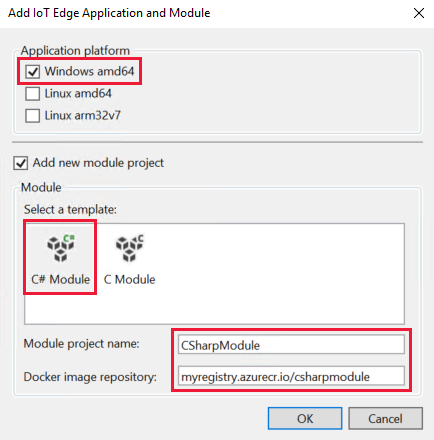

---
# Mandatory fields. See more on aka.ms/skyeye/meta.
title: Tutorial C# module for Windows - Azure IoT Edge | Microsoft Docs 
description: This tutorial shows you how to create an IoT Edge module with C# code and deploy it to a Windows IoT Edge device.
services: iot-edge
author: kgremban
manager: philmea

ms.author: kgremban
ms.date: 04/14/2019
ms.topic: tutorial
ms.service: iot-edge
ms.custom: mvc

---

# Tutorial: Develop a C# IoT Edge module and deploy to a Windows device

Use Visual Studio to develop C# code and deploy it to a Windows device running Azure IoT Edge. 

You can use Azure IoT Edge modules to deploy code that implements your business logic directly to your IoT Edge devices. This tutorial walks you through creating and deploying an IoT Edge module that filters sensor data. In this tutorial, you learn how to:    

> [!div class="checklist"]
> * Use Visual Studio to create an IoT Edge module that's based on the .NET Core 2.1 SDK.
> * Use Visual Studio and Docker to create a Docker image and publish it to your registry.
> * Deploy the module to your IoT Edge device.
> * View generated data.

The IoT Edge module that you create in this tutorial filters the temperature data that's generated by your device. It only sends messages upstream if the temperature is above a specified threshold. This type of analysis at the edge is useful for reducing the amount of data that's communicated to and stored in the cloud. 

[!INCLUDE [quickstarts-free-trial-note](../../includes/quickstarts-free-trial-note.md)]

## Solution scope

This tutorial demonstrates how to develop a module in **C#** using **Visual Studio 2017**, and how to deploy it to a **Windows device**. The sample code included here can work in other tools and for other devices, as well. Use the following table to understand your options for developing and deploying C# modules to Windows devices: 

| C# | Visual Studio Code | Visual Studio 2017 | 
| -- | ------------------ | ------------------ |
| **Windows AMD64 develop** |  |  |
| **Windows AMD64 debug** |   |  |

## Prerequisites

Before beginning this tutorial, you should have gone through the previous tutorial to set up your development environment, [Develop an IoT Edge module for a Windows device](tutorial-develop-visual-studio.md). After completing that tutorial, you already should have the following prerequisites: 

* A free or standard-tier [IoT Hub](../iot-hub/iot-hub-create-through-portal.md) in Azure.
* A [Windows device running Azure IoT Edge](quickstart.md).
* A container registry, like [Azure Container Registry](https://docs.microsoft.com/azure/container-registry/).
* [Visual Studio 2017](https://docs.microsoft.com/visualstudio/install/install-visual-studio?view=vs-2017) configured with the [Azure IoT Edge Tools](https://marketplace.visualstudio.com/items?itemName=vsc-iot.vsiotedgetools) extension.
* [Docker CE](https://docs.docker.com/install/) on your development machine, configured to run Windows containers.

## Create an IoT Edge module project

The following steps create an IoT Edge module project that's based on the .NET Core 2.0 SDK by using Visual Studio and the Azure IoT Edge Tools extension.

### Create a new project

The Azure IoT Tools extension provides project templates for all supported IoT Edge module languages in Visual Studio 2017. These templates have all the files and code that you need to deploy a working module to test IoT Edge, or give you a starting point to customize the template with your own business logic. 

1. Run Visual Studio as an administrator.

2. Select **File** > **New** > **Project**. 

3. In the new project window, select the **Azure IoT** project type and choose the **Azure IoT Edge** project. Rename the project and solution to something descriptive like **CSharpTutorialApp**. Select **OK** to create the project. 

   

4. In the IoT Edge application and module window, configure your project with the following values: 

   | Field | Value |
   | ----- | ----- |
   | Application platform | Uncheck **Linux Amd64**, and check **WindowsAmd64**. |
   | Select a template | Select **C# Module**. | 
   | Module project name | Name your module **CSharpModule**. | 
   | Docker image repository | An image repository includes the name of your container registry and the name of your container image. Your container image is prepopulated from the module project name value. Replace **localhost:5000** with the login server value from your Azure container registry. You can retrieve the login server from the Overview page of your container registry in the Azure portal. <br><br> The final image repository looks like \<registry name\>.azurecr.io/csharpmodule. |

   

5. Select **OK** to apply your changes. 

### Add your registry credentials

The deployment manifest shares the credentials for your container registry with the IoT Edge runtime. The runtime needs these credentials to pull your private images onto the IoT Edge device. Use the credentials from the **Access keys** section of your Azure container registry. 

1. In the Visual Studio solution explorer, open the **deployment.template.json** file. 

2. Find the **registryCredentials** property in the $edgeAgent desired properties. 

3. Update the property with your credentials, following this format: 

   ```json
   "registryCredentials": {
     "<registry name>": {
       "username": "<username>",
       "password": "<password>",
       "address": "<registry name>.azurecr.io"
     }
   }

4. Save the deployment.template.json file. 

### Update the module with custom code

The default module code receives messages on an input queue and passes them along through an output queue. Let's add some additional code so that the module processes the messages at the edge before forwarding them to IoT Hub. Update the module so that it analyzes the temperature data in each message, and only sends the message to IoT Hub if the temperature exceeds a certain threshold. 

1. In Visual Studio, open **CSharpModule** > **Program.cs**.

2. At the top of the **CSharpModule** namespace, add three **using** statements for types that are used later:

    ```csharp
    using System.Collections.Generic;     // For KeyValuePair<>
    using Microsoft.Azure.Devices.Shared; // For TwinCollection
    using Newtonsoft.Json;                // For JsonConvert
    ```

3. Add the **temperatureThreshold** variable to the **Program** class. This variable sets the value that the measured temperature must exceed for the data to be sent to the IoT hub. 

    ```csharp
    static int TemperatureThreshold { get; set; } = 25;
    ```

4. Add the **MessageBody**, **Machine**, and **Ambient** classes to the **Program** class. These classes define the expected schema for the body of incoming messages.

    ```csharp
    class MessageBody
    {
        public Machine Machine {get;set;}
        public Ambient Ambient {get; set;}
        public string TimeCreated {get; set;}
    }
    class Machine
    {
        public double Temperature {get; set;}
        public double Pressure {get; set;}         
    }
    class Ambient
    {
        public double Temperature {get; set;}
        public int Humidity {get; set;}         
    }
    ```

5. Find the **Init** method. This method creates and configures a **ModuleClient** object, which allows the module to connect to the local Azure IoT Edge runtime to send and receive messages. The code also registers a callback to receive messages from an IoT Edge hub via the **input1** endpoint.

   Add new code to the Init method so that it reads the module twin's desired properties to retrieve the **temperatureThreshold** value. Then, create a callback that listens for any future updates to the module twin's desired properties. With this callback, you can update the temperature threshold in the module twin remotely, and the changes will be incorporated into the module. 

   ```csharp
   // Read the TemperatureThreshold value from the module twin's desired properties
   var moduleTwin = await ioTHubModuleClient.GetTwinAsync();
   await OnDesiredPropertiesUpdate(moduleTwin.Properties.Desired, ioTHubModuleClient);

   // Attach a callback for updates to the module twin's desired properties.
   await ioTHubModuleClient.SetDesiredPropertyUpdateCallbackAsync(OnDesiredPropertiesUpdate, null);
   ```

   Update the existing **SetInputMessageHandlerAsync** method. In the sample code, incoming messages on *input1* are processed with the *PipeMessage* function, but we want to change that to use the *FilterMessages* function that we'll create in the following steps. 

   ```csharp
   // Register a callback for messages that are received by the module.
   // await ioTHubModuleClient.SetInputMessageHandlerAsync("input1", PipeMessage, iotHubModuleClient);

   await ioTHubModuleClient.SetInputMessageHandlerAsync("input1", FilterMessages, ioTHubModuleClient);
   ```

6. Add a new **onDesiredPropertiesUpdate** method to the **Program** class. This method receives updates on the desired properties from the module twin, and updates the **temperatureThreshold** variable to match. All modules have their own module twin, which lets you configure the code that's running inside a module directly from the cloud.

    ```csharp
    static Task OnDesiredPropertiesUpdate(TwinCollection desiredProperties, object userContext)
    {
        try
        {
            Console.WriteLine("Desired property change:");
            Console.WriteLine(JsonConvert.SerializeObject(desiredProperties));

            if (desiredProperties["TemperatureThreshold"]!=null)
                temperatureThreshold = desiredProperties["TemperatureThreshold"];

        }
        catch (AggregateException ex)
        {
            foreach (Exception exception in ex.InnerExceptions)
            {
                Console.WriteLine();
                Console.WriteLine("Error when receiving desired property: {0}", exception);
            }
        }
        catch (Exception ex)
        {
            Console.WriteLine();
            Console.WriteLine("Error when receiving desired property: {0}", ex.Message);
        }
        return Task.CompletedTask;
    }
    ```

7. Remove the sample **PipeMessage** method and replace it with a new **FilterMessages** method. This method is called whenever the module receives a message from the IoT Edge hub. It filters out messages that report temperatures below the temperature threshold set via the module twin. It also adds the **MessageType** property to the message with the value set to **Alert**. 

    ```csharp
    static async Task<MessageResponse> FilterMessages(Message message, object userContext)
    {
        var counterValue = Interlocked.Increment(ref counter);
        try
        {
            ModuleClient moduleClient = (ModuleClient)userContext;
            var messageBytes = message.GetBytes();
            var messageString = Encoding.UTF8.GetString(messageBytes);
            Console.WriteLine($"Received message {counterValue}: [{messageString}]");

            // Get the message body.
            var messageBody = JsonConvert.DeserializeObject<MessageBody>(messageString);

            if (messageBody != null && messageBody.machine.temperature > temperatureThreshold)
            {
                Console.WriteLine($"Machine temperature {messageBody.machine.temperature} " +
                    $"exceeds threshold {temperatureThreshold}");
                var filteredMessage = new Message(messageBytes);
                foreach (KeyValuePair<string, string> prop in message.Properties)
                {
                    filteredMessage.Properties.Add(prop.Key, prop.Value);
                }

                filteredMessage.Properties.Add("MessageType", "Alert");
                await moduleClient.SendEventAsync("output1", filteredMessage);
            }

            // Indicate that the message treatment is completed.
            return MessageResponse.Completed;
        }
        catch (AggregateException ex)
        {
            foreach (Exception exception in ex.InnerExceptions)
            {
                Console.WriteLine();
                Console.WriteLine("Error in sample: {0}", exception);
            }
            // Indicate that the message treatment is not completed.
            var moduleClient = (ModuleClient)userContext;
            return MessageResponse.Abandoned;
        }
        catch (Exception ex)
        {
            Console.WriteLine();
            Console.WriteLine("Error in sample: {0}", ex.Message);
            // Indicate that the message treatment is not completed.
            ModuleClient moduleClient = (ModuleClient)userContext;
            return MessageResponse.Abandoned;
        }
    }
    ```

8. Save the Program.cs file.

9. Open the **deployment.template.json** file in your IoT Edge solution. This file tells the IoT Edge agent which modules to deploy, in this case **tempSensor** and **CSharpModule**, and tells the IoT Edge hub how to route messages between them. The Visual Studio extension automatically populates most of the information that you need in the deployment template, but verify that everything is accurate for your solution: 

   1. Verify that the template has the correct module name, not the default **IotEdgeModule** name that you changed when you created the IoT Edge solution.

   2. The **registryCredentials** section stores your Docker registry credentials, so that the IoT Edge agent can pull your module image. Add your credentials to the deployment template file if you haven't already.  
   3. If you want to learn more about deployment manifests, see [Learn how to deploy modules and establish routes in IoT Edge](module-composition.md).

10. Add the **CSharpModule** module twin to the deployment manifest. Insert the following JSON content at the bottom of the **modulesContent** section, after the **$edgeHub** module twin: 

    ```json
       "CSharpModule": {
           "properties.desired":{
               "TemperatureThreshold":25
           }
       }
    ```

    

11. Save the deployment.template.json file.


## Build your IoT Edge solution

In the previous section, you created an IoT Edge solution and added code to the **CSharpModule** to filter out messages where the reported machine temperature is below the acceptable threshold. Now you need to build the solution as a container image and push it to your container registry. 


## Deploy and run the solution

In the quickstart article that you used to set up your IoT Edge device, you deployed a module by using the Azure portal. You can also deploy modules using the Azure IoT Hub Toolkit extension (formerly Azure IoT Toolkit extension) for Visual Studio Code. You already have a deployment manifest prepared for your scenario, the **deployment.json** file. All you need to do now is select a device to receive the deployment.

## View generated data

Once you apply the deployment manifest to your IoT Edge device, the IoT Edge runtime on the device collects the new deployment information and starts executing on it. Any modules running on the device that aren't included in the deployment manifest are stopped. Any modules missing from the device are started. 

## Clean up resources 

If you plan to continue to the next recommended article, you can keep the resources and configurations that you created and reuse them. You can also keep using the same IoT Edge device as a test device. 

Otherwise, you can delete the local configurations and the Azure resources that you created in this article to avoid charges. 

[!INCLUDE [iot-edge-clean-up-cloud-resources](../../includes/iot-edge-clean-up-cloud-resources.md)]

[!INCLUDE [iot-edge-clean-up-local-resources](../../includes/iot-edge-clean-up-local-resources.md)]


## Next steps

In this tutorial, you created an IoT Edge module with code to filter raw data that's generated by your IoT Edge device. When you're ready to build your own modules, you can learn more about how to [develop a C# module with Azure IoT Edge for Visual Studio Code](how-to-develop-csharp-module.md). You can continue on to the next tutorials to learn other ways that Azure IoT Edge can help you turn data into business insights at the edge.

> [!div class="nextstepaction"]
> [Store data at the edge with SQL Server databases](tutorial-store-data-sql-server.md)
