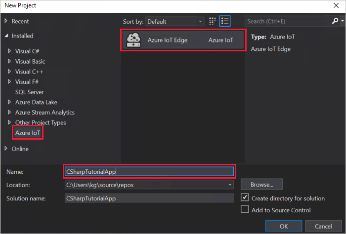
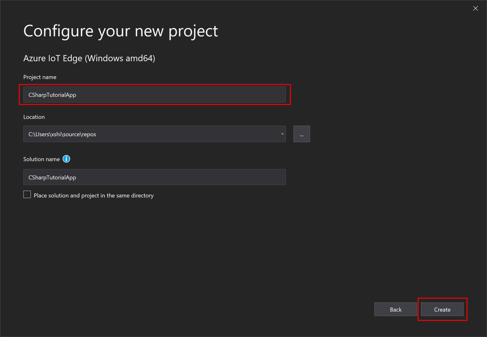
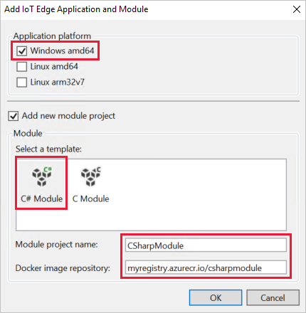
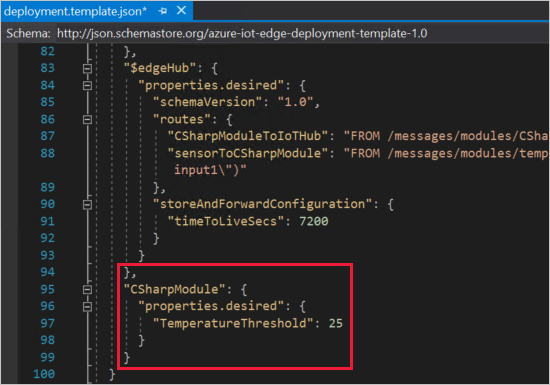
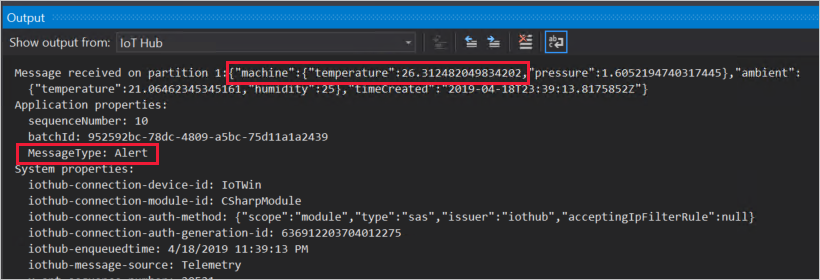

# Tutorial: Develop a C# IoT Edge module for Windows devices

Use Visual Studio to develop C# code and deploy it to a Windows device running Azure IoT Edge.

You can use Azure IoT Edge modules to deploy code that implements your business logic directly to your IoT Edge devices. This tutorial walks you through creating and deploying an IoT Edge module that filters sensor data. In this tutorial, you learn how to:

> [!div class="checklist"]
>
> * Use Visual Studio to create an IoT Edge module that's based on the C# SDK.
> * Use Visual Studio and Docker to create a Docker image and publish it to your registry.
> * Deploy the module to your IoT Edge device.
> * View generated data.

The IoT Edge module that you create in this tutorial filters the temperature data that's generated by your device. It only sends messages upstream if the temperature is above a specified threshold. This type of analysis at the edge is useful for reducing the amount of data that's communicated to and stored in the cloud.

[!INCLUDE [quickstarts-free-trial-note](../../includes/quickstarts-free-trial-note.md)]

## Solution scope

This tutorial demonstrates how to develop a module in **C#** using **Visual Studio 2019** and deploy it to a **Windows device**. If you're developing modules for Linux devices, go to [Develop a C# IoT Edge module for Linux devices](tutorial-csharp-module.md) instead.

Use the following table to understand your options for developing and deploying C# modules to Windows devices:

| C# | Visual Studio Code | Visual Studio 2017/2019 |
| -- | ------------------ | ------------------ |
| **Windows AMD64 develop** |  |  |
| **Windows AMD64 debug** |   |  |

## Prerequisites

Before beginning this tutorial, you should have gone through the previous tutorial to set up your development environment, [Develop an IoT Edge module for a Windows device](tutorial-develop-for-windows.md). After completing that tutorial, you already should have the following prerequisites:

* A free or standard-tier [IoT Hub](../iot-hub/iot-hub-create-through-portal.md) in Azure.
* A [Windows device running Azure IoT Edge](quickstart.md).
* A container registry, like [Azure Container Registry](https://docs.microsoft.com/azure/container-registry/).
* [Visual Studio 2019](https://docs.microsoft.com/visualstudio/install/install-visual-studio) configured with the [Azure IoT Edge Tools](https://marketplace.visualstudio.com/items?itemName=vsc-iot.vs16iotedgetools) extension.
* [Docker Desktop](https://docs.docker.com/docker-for-windows/install/) configured to run Windows containers.

> [!TIP]
> If you are using Visual Studio 2017 (version 15.7 or higher), plrease download and install [Azure IoT Edge Tools](https://marketplace.visualstudio.com/items?itemName=vsc-iot.vsiotedgetools) for VS 2017 from the Visual Studio marketplace

## Create a module project

The following steps create an IoT Edge module project  by using Visual Studio and the Azure IoT Edge Tools extension. Once you have a project template created, add new code so that the module filters out messages based on their reported properties.

### Create a new project

The Azure IoT Edge Tools provide project templates for all supported IoT Edge module languages in Visual Studio. These templates have all the files and code that you need to deploy a working module to test IoT Edge, or give you a starting point to customize the template with your own business logic.

1. Launch Visual Studio 2019 and select **Create New Project**.

2. Search for **IoT Edge** and choose the **Azure IoT Edge (Windows amd64)** project. Click **Next**.

   

3. Rename the project and solution to something descriptive like **CSharpTutorialApp**. Click **Create** to create the project.

   

4. Configure your project with the following values:

   | Field | Value |
   | ----- | ----- |
   | Select a template | Select **C# Module**. |
   | Module project name | Name your module **CSharpModule**. |
   | Docker image repository | An image repository includes the name of your container registry and the name of your container image. Your container image is prepopulated from the module project name value. Replace **localhost:5000** with the login server value from your Azure container registry. You can retrieve the login server from the Overview page of your container registry in the Azure portal. <br><br> The final image repository looks like \<registry name\>.azurecr.io/csharpmodule. |

   

5. Select **Add** to create the project.

### Add your registry credentials

The deployment manifest shares the credentials for your container registry with the IoT Edge runtime. The runtime needs these credentials to pull your private images onto the IoT Edge device. Use the credentials from the **Access keys** section of your Azure container registry.

1. In the Visual Studio solution explorer, open the **deployment.template.json** file.

2. Find the **registryCredentials** property in the $edgeAgent desired properties. It should have your registry address autofilled from the information you provided when creating the project, and then username and password fields should contain variable names. For example:

   ```json
   "registryCredentials": {
     "<registry name>": {
       "username": "$CONTAINER_REGISTRY_USERNAME_<registry name>",
       "password": "$CONTAINER_REGISTRY_PASSWORD_<registry name>",
       "address": "<registry name>.azurecr.io"
     }
   }
   ```

3. Open the **.env** file in your module solution. (It's hidden by default in the Solution Explorer, so you might need to select the **Show All Files** button to display it.) The .env file should contain the same username and password variables that you saw in the deployment.template.json file.

4. Add the **Username** and **Password** values from your Azure container registry.

5. Save your changes to the .env file.

### Update the module with custom code

The default module code receives messages on an input queue and passes them along through an output queue. Let's add some additional code so that the module processes the messages at the edge before forwarding them to IoT Hub. Update the module so that it analyzes the temperature data in each message, and only sends the message to IoT Hub if the temperature exceeds a certain threshold.

1. In Visual Studio, open **CSharpModule** > **Program.cs**.

2. At the top of the **CSharpModule** namespace, add three **using** statements for types that are used later:

    ```csharp
    using System.Collections.Generic;     // For KeyValuePair<>
    using Microsoft.Azure.Devices.Shared; // For TwinCollection
    using Newtonsoft.Json;                // For JsonConvert
    ```

3. Add the **temperatureThreshold** variable to the **Program** class after the counter variable. The temperatureThreshold variable sets the value that the measured temperature must exceed for the data to be sent to the IoT hub.

    ```csharp
    static int temperatureThreshold { get; set; } = 25;
    ```

4. Add the **MessageBody**, **Machine**, and **Ambient** classes to the **Program** class after the variable declarations. These classes define the expected schema for the body of incoming messages.

    ```csharp
    class MessageBody
    {
        public Machine machine {get;set;}
        public Ambient ambient {get; set;}
        public string timeCreated {get; set;}
    }
    class Machine
    {
        public double temperature {get; set;}
        public double pressure {get; set;}
    }
    class Ambient
    {
        public double temperature {get; set;}
        public int humidity {get; set;}
    }
    ```

5. Find the **Init** method. This method creates and configures a **ModuleClient** object, which allows the module to connect to the local Azure IoT Edge runtime to send and receive messages. The code also registers a callback to receive messages from an IoT Edge hub via the **input1** endpoint.

   Replace the entire Init method with the following code:

   ```csharp
   static async Task Init()
   {
       AmqpTransportSettings amqpSetting = new AmqpTransportSettings(TransportType.Amqp_Tcp_Only);
       ITransportSettings[] settings = { amqpSetting };

       // Open a connection to the Edge runtime
       ModuleClient ioTHubModuleClient = await ModuleClient.CreateFromEnvironmentAsync(settings);
       await ioTHubModuleClient.OpenAsync();
       Console.WriteLine("IoT Hub module client initialized.");

       // Read the TemperatureThreshold value from the module twin's desired properties
       var moduleTwin = await ioTHubModuleClient.GetTwinAsync();
       await OnDesiredPropertiesUpdate(moduleTwin.Properties.Desired, ioTHubModuleClient);

       // Attach a callback for updates to the module twin's desired properties.
       await ioTHubModuleClient.SetDesiredPropertyUpdateCallbackAsync(OnDesiredPropertiesUpdate, null);

       // Register a callback for messages that are received by the module.
       await ioTHubModuleClient.SetInputMessageHandlerAsync("input1", FilterMessages, ioTHubModuleClient);
   }
   ```

   This updated Init method still sets up the connection to the IoT Edge runtime with the ModuleClient, but also adds new functionality. It reads the module twin's desired properties to retrieve the **temperatureThreshold** value. Then, it creates a callback that listens for any future updates to the module twin's desired properties. With this callback, you can update the temperature threshold in the module twin remotely, and the changes will be incorporated into the module.

   The updated Init method also changes the existing **SetInputMessageHandlerAsync** method. In the sample code, incoming messages on *input1* are processed with the *PipeMessage* function, but we want to change that to use the *FilterMessages* function that we'll create in the following steps.

6. Add a new **onDesiredPropertiesUpdate** method to the **Program** class. This method receives updates on the desired properties from the module twin, and updates the **temperatureThreshold** variable to match. All modules have their own module twin, which lets you configure the code that's running inside a module directly from the cloud.

    ```csharp
    static Task OnDesiredPropertiesUpdate(TwinCollection desiredProperties, object userContext)
    {
        try
        {
            Console.WriteLine("Desired property change:");
            Console.WriteLine(JsonConvert.SerializeObject(desiredProperties));

            if (desiredProperties["TemperatureThreshold"]!=null)
                temperatureThreshold = desiredProperties["TemperatureThreshold"];

        }
        catch (AggregateException ex)
        {
            foreach (Exception exception in ex.InnerExceptions)
            {
                Console.WriteLine();
                Console.WriteLine("Error when receiving desired property: {0}", exception);
            }
        }
        catch (Exception ex)
        {
            Console.WriteLine();
            Console.WriteLine("Error when receiving desired property: {0}", ex.Message);
        }
        return Task.CompletedTask;
    }
    ```

7. Remove the sample **PipeMessage** method and replace it with a new **FilterMessages** method. This method is called whenever the module receives a message from the IoT Edge hub. It filters out messages that report temperatures below the temperature threshold set via the module twin. It also adds the **MessageType** property to the message with the value set to **Alert**.

    ```csharp
    static async Task<MessageResponse> FilterMessages(Message message, object userContext)
    {
        var counterValue = Interlocked.Increment(ref counter);
        try
        {
            ModuleClient moduleClient = (ModuleClient)userContext;
            var messageBytes = message.GetBytes();
            var messageString = Encoding.UTF8.GetString(messageBytes);
            Console.WriteLine($"Received message {counterValue}: [{messageString}]");

            // Get the message body.
            var messageBody = JsonConvert.DeserializeObject<MessageBody>(messageString);

            if (messageBody != null && messageBody.machine.temperature > temperatureThreshold)
            {
                Console.WriteLine($"Machine temperature {messageBody.machine.temperature} " +
                    $"exceeds threshold {temperatureThreshold}");
                using(var filteredMessage = new Message(messageBytes))
                {
                    foreach (KeyValuePair<string, string> prop in message.Properties)
                    {
                        filteredMessage.Properties.Add(prop.Key, prop.Value);
                    }

                    filteredMessage.Properties.Add("MessageType", "Alert");
                    await moduleClient.SendEventAsync("output1", filteredMessage);
                }
            }

            // Indicate that the message treatment is completed.
            return MessageResponse.Completed;
        }
        catch (AggregateException ex)
        {
            foreach (Exception exception in ex.InnerExceptions)
            {
                Console.WriteLine();
                Console.WriteLine("Error in sample: {0}", exception);
            }
            // Indicate that the message treatment is not completed.
            var moduleClient = (ModuleClient)userContext;
            return MessageResponse.Abandoned;
        }
        catch (Exception ex)
        {
            Console.WriteLine();
            Console.WriteLine("Error in sample: {0}", ex.Message);
            // Indicate that the message treatment is not completed.
            ModuleClient moduleClient = (ModuleClient)userContext;
            return MessageResponse.Abandoned;
        }
    }
    ```

8. Save the Program.cs file.

9. Open the **deployment.template.json** file in your IoT Edge solution. This file tells the IoT Edge agent which modules to deploy, in this case **SimulatedTemperatureSensor** and **CSharpModule**, and tells the IoT Edge hub how to route messages between them.

10. Add the **CSharpModule** module twin to the deployment manifest. Insert the following JSON content at the bottom of the **modulesContent** section, after the **$edgeHub** module twin:

    ```json
       "CSharpModule": {
           "properties.desired":{
               "TemperatureThreshold":25
           }
       }
    ```

    

11. Save the deployment.template.json file.

## Build and push your module

In the previous section, you created an IoT Edge solution and added code to the **CSharpModule** to filter out messages where the reported machine temperature is below the acceptable threshold. Now you need to build the solution as a container image and push it to your container registry.

1. Use the following command to sign in to Docker on your development machine. Use the username, password, and login server from your Azure container registry. You can retrieve these values from the **Access keys** section of your registry in the Azure portal.

   ```cmd
   docker login -u <ACR username> -p <ACR password> <ACR login server>
   ```

   You may receive a security warning recommending the use of `--password-stdin`. While that best practice is recommended for production scenarios, it's outside the scope of this tutorial. For more information, see the [docker login](https://docs.docker.com/engine/reference/commandline/login/#provide-a-password-using-stdin) reference.

2. In the Visual Studio solution explorer, right-click the project name that you want to build. The default name is **AzureIotEdgeApp1** and since you're building a Windows module, the extension should be **Windows.Amd64**.

3. Select **Build and Push IoT Edge Modules**.

   The build and push command starts three operations. First, it creates a new folder in the solution called **config** that holds the full deployment manifest, built out of information in the deployment template and other solution files. Second, it runs `docker build` to build the container image based on the appropriate dockerfile for your target architecture. Then, it runs `docker push` to push the image repository to your container registry.

## Deploy modules to device

Use the Visual Studio cloud explorer and the Azure IoT Edge Tools extension to deploy the module project to your IoT Edge device. You already have a deployment manifest prepared for your scenario, the **deployment.json** file in the config folder. All you need to do now is select a device to receive the deployment.

Make sure that your IoT Edge device is up and running.

1. In the Visual Studio cloud explorer, expand the resources to see your list of IoT devices.

2. Right-click the name of the IoT Edge device that you want to receive the deployment.

3. Select **Create Deployment**.

4. In the file explorer, select the **deployment.windows-amd64** file in the config folder of your solution.

5. Refresh the cloud explorer to see the deployed modules listed under your device.

## View generated data

Once you apply the deployment manifest to your IoT Edge device, the IoT Edge runtime on the device collects the new deployment information and starts executing on it. Any modules running on the device that aren't included in the deployment manifest are stopped. Any modules missing from the device are started.

You can use the IoT Edge Tools extension to view messages as they arrive at your IoT Hub.

1. In the Visual Studio cloud explorer, select the name of your IoT Edge device.

2. In the **Actions** list, select **Start Monitoring Built-in Event Endpoint**.

3. View the messages arriving at your IoT Hub. It may take a while for the messages to arrive, because the changes we made to the CSharpModule code wait until the machine temperature reaches 25 degrees before sending messages. It also adds the message type **Alert** to any messages that reach that temperature threshold.

   

## Edit the module twin

We used the CSharpModule module twin to set the temperature threshold at 25 degrees. You can use the module twin to change the functionality without having to update the module code.

1. In Visual Studio, open the **deployment.windows-amd64.json** file. (Not the deployment.template file. If you don't see the deployment manifest in the config file in the solution explorer, select the **Show all files** icon in the explorer toolbar.)

2. Find the CSharpModule twin and change the value of the **temperatureThreshold** parameter to a new temperature 5 degrees to 10 degrees higher than the latest reported temperature.

3. Save the **deployment.windows-amd64.json** file.

4. Follow the deployment steps again to apply the updated deployment manifest to your device.

5. Monitor the incoming device-to-cloud messages. You should see the messages stop until the new temperature threshold is reached.

## Clean up resources

If you plan to continue to the next recommended article, you can keep the resources and configurations that you created and reuse them. You can also keep using the same IoT Edge device as a test device.

Otherwise, you can delete the local configurations and the Azure resources that you used in this article to avoid charges.

[!INCLUDE [iot-edge-clean-up-cloud-resources](../../includes/iot-edge-clean-up-cloud-resources.md)]

## Next steps

In this tutorial, you created an IoT Edge module with code to filter raw data that's generated by your IoT Edge device. When you're ready to build your own modules, you can learn more about [developing your own IoT Edge modules](module-development.md) or how to [develop modules with Visual Studio](how-to-visual-studio-develop-module.md). For examples of IoT Edge modules, including the simulated temperature module, see [IoT Edge module samples](https://github.com/Azure/iotedge/tree/master/edge-modules).

You can continue on to the next tutorials to learn how Azure IoT Edge can help you deploy Azure cloud services to process and analyze data at the edge.

> [!div class="nextstepaction"]
> [Functions](tutorial-deploy-function.md)
> [Stream Analytics](tutorial-deploy-stream-analytics.md)
> [Machine Learning](tutorial-deploy-machine-learning.md)
> [Custom Vision Service](tutorial-deploy-custom-vision.md)
