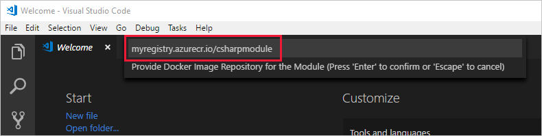
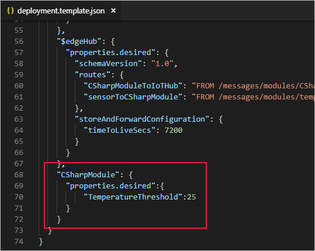
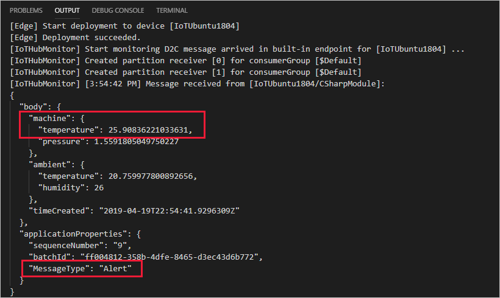

# Tutorial: Develop a C# IoT Edge module using Linux containers

[!INCLUDE [iot-edge-version-all-supported](../../includes/iot-edge-version-all-supported.md)]

Use Visual Studio Code to develop C# code and deploy it to a device running Azure IoT Edge.

You can use Azure IoT Edge modules to deploy code that implements your business logic directly to your IoT Edge devices. This tutorial walks you through creating and deploying an IoT Edge module that filters sensor data. You'll use the simulated IoT Edge device that you created in the quickstarts. In this tutorial, you learn how to:

> [!div class="checklist"]
>
> * Use Visual Studio Code to create an IoT Edge module that's based on the .NET Core 2.1 SDK.
> * Use Visual Studio Code and Docker to create a Docker image and publish it to your registry.
> * Deploy the module to your IoT Edge device.
> * View generated data.

The IoT Edge module that you create in this tutorial filters the temperature data that's generated by your device. It only sends messages upstream if the temperature is above a specified threshold. This type of analysis at the edge is useful for reducing the amount of data that's communicated to and stored in the cloud.

[!INCLUDE [quickstarts-free-trial-note](../../includes/quickstarts-free-trial-note.md)]

## Prerequisites

This tutorial demonstrates how to develop a module in **C#** using **Visual Studio Code** and deploy it to an IoT Edge device. If you're developing modules using Windows containers, go to [Develop a C# IoT Edge module using Windows containers](tutorial-csharp-module-windows.md) instead.

Use the following table to understand your options for developing and deploying C# modules using Linux containers:

| C# | Visual Studio Code | Visual Studio |
| -- | ------------------ | ------------- |
| **Linux AMD64** |  |  |
| **Linux ARM32** |  |  |

>[!NOTE]
>Support for Linux ARM64 devices is available in [public preview](https://azure.microsoft.com/support/legal/preview-supplemental-terms/). For more information, see [Develop and debug ARM64 IoT Edge modules in Visual Studio Code (preview)](https://devblogs.microsoft.com/iotdev/develop-and-debug-arm64-iot-edge-modules-in-visual-studio-code-preview).

Before beginning this tutorial, you should have gone through the previous tutorial to set up your development environment, [Develop an IoT Edge module using Linux containers](tutorial-develop-for-linux.md). After completing that tutorial, you already should have the following prerequisites:

* A free or standard-tier [IoT Hub](../iot-hub/iot-hub-create-through-portal.md) in Azure.
* A device running Azure IoT Edge with Linux containers. You can use the quickstarts to set up a [Linux device](quickstart-linux.md) or [Windows device](quickstart.md).
* A container registry, like [Azure Container Registry](../container-registry/index.yml).
* [Visual Studio Code](https://code.visualstudio.com/) configured with the [Azure IoT Tools](https://marketplace.visualstudio.com/items?itemName=vsciot-vscode.azure-iot-tools).
* [Docker CE](https://docs.docker.com/install/) configured to run Linux containers.

To complete these tutorials, prepare the following additional prerequisites on your development machine:

* [C# for Visual Studio Code (powered by OmniSharp) extension](https://marketplace.visualstudio.com/items?itemName=ms-dotnettools.csharp).
* [.NET Core 2.1 SDK](https://dotnet.microsoft.com/download/dotnet/2.1).

## Create a module project

The following steps create an IoT Edge module project for C# by using Visual Studio Code and the Azure IoT Tools extension. Once you have a project template created, add new code so that the module filters out messages based on their reported properties.

### Create a new project

Create a C# solution template that you can customize with your own code.

1. In Visual Studio Code, select **View** > **Command Palette** to open the VS Code command palette.

2. In the command palette, enter and run the command **Azure: Sign in** and follow the instructions to sign in your Azure account. If you're already signed in, you can skip this step.

3. In the command palette, enter and run the command **Azure IoT Edge: New IoT Edge solution**. Follow the prompts in the command palette to create your solution.

   | Field | Value |
   | ----- | ----- |
   | Select folder | Choose the location on your development machine for VS Code to create the solution files. |
   | Provide a solution name | Enter a descriptive name for your solution or accept the default **EdgeSolution**. |
   | Select module template | Choose **C# Module**. |
   | Provide a module name | Name your module **CSharpModule**. |
   | Provide Docker image repository for the module | An image repository includes the name of your container registry and the name of your container image. Your container image is prepopulated from the name you provided in the last step. Replace **localhost:5000** with the **Login server** value from your Azure container registry. You can retrieve the Login server from the Overview page of your container registry in the Azure portal. <br><br>The final image repository looks like \<registry name\>.azurecr.io/csharpmodule. |

   

### Add your registry credentials

The environment file stores the credentials for your container registry and shares them with the IoT Edge runtime. The runtime needs these credentials to pull your private images onto the IoT Edge device. Use the credentials from the **Access keys** section of your Azure container registry.

The IoT Edge extension tries to pull your container registry credentials from Azure and populate them in the environment file. Check to see if your credentials are already included. If not, add them now:

1. In the VS Code explorer, open the **.env** file.
2. Update the fields with the **username** and **password** values from your Azure container registry.
3. Save this file.

### Select your target architecture

Currently, Visual Studio Code can develop C# modules for Linux AMD64 and Linux ARM32v7 devices. You need to select which architecture you're targeting with each solution, because the container is built and run differently for each architecture type. The default is Linux AMD64.

1. Open the command palette and search for **Azure IoT Edge: Set Default Target Platform for Edge Solution**, or select the shortcut icon in the side bar at the bottom of the window.

2. In the command palette, select the target architecture from the list of options. For this tutorial, we're using an Ubuntu virtual machine as the IoT Edge device, so will keep the default **amd64**.

### Update the module with custom code

1. In the VS Code explorer, open **modules** > **CSharpModule** > **Program.cs**.

2. At the top of the **CSharpModule** namespace, add three **using** statements for types that are used later:

    ```csharp
    using System.Collections.Generic;     // For KeyValuePair<>
    using Microsoft.Azure.Devices.Shared; // For TwinCollection
    using Newtonsoft.Json;                // For JsonConvert
    ```

3. Add the **temperatureThreshold** variable to the **Program** class. This variable sets the value that the measured temperature must exceed for the data to be sent to the IoT hub.

    ```csharp
    static int temperatureThreshold { get; set; } = 25;
    ```

4. Add the **MessageBody**, **Machine**, and **Ambient** classes to the **Program** class. These classes define the expected schema for the body of incoming messages.

    ```csharp
    class MessageBody
    {
        public Machine machine {get;set;}
        public Ambient ambient {get; set;}
        public string timeCreated {get; set;}
    }
    class Machine
    {
        public double temperature {get; set;}
        public double pressure {get; set;}
    }
    class Ambient
    {
        public double temperature {get; set;}
        public int humidity {get; set;}
    }
    ```

5. Find the **Init** function. This function creates and configures a **ModuleClient** object, which allows the module to connect to the local Azure IoT Edge runtime to send and receive messages. After creating the **ModuleClient**, the code reads the **temperatureThreshold** value from the module twin's desired properties. The code registers a callback to receive messages from an IoT Edge hub via the **input1** endpoint. Replace the **SetInputMessageHandlerAsync** method with a new one, and add a **SetDesiredPropertyUpdateCallbackAsync** method for updates to the desired properties. To make this change, replace the last line of the **Init** method with the following code:

    ```csharp
    // Register a callback for messages that are received by the module.
    // await ioTHubModuleClient.SetInputMessageHandlerAsync("input1", PipeMessage, iotHubModuleClient);

    // Read the TemperatureThreshold value from the module twin's desired properties
    var moduleTwin = await ioTHubModuleClient.GetTwinAsync();
    await OnDesiredPropertiesUpdate(moduleTwin.Properties.Desired, ioTHubModuleClient);

    // Attach a callback for updates to the module twin's desired properties.
    await ioTHubModuleClient.SetDesiredPropertyUpdateCallbackAsync(OnDesiredPropertiesUpdate, null);

    // Register a callback for messages that are received by the module.
    await ioTHubModuleClient.SetInputMessageHandlerAsync("input1", FilterMessages, ioTHubModuleClient);
    ```

6. Add the **onDesiredPropertiesUpdate** method to the **Program** class. This method receives updates on the desired properties from the module twin, and updates the **temperatureThreshold** variable to match. All modules have their own module twin, which lets you configure the code that's running inside a module directly from the cloud.

    ```csharp
    static Task OnDesiredPropertiesUpdate(TwinCollection desiredProperties, object userContext)
    {
        try
        {
            Console.WriteLine("Desired property change:");
            Console.WriteLine(JsonConvert.SerializeObject(desiredProperties));

            if (desiredProperties["TemperatureThreshold"]!=null)
                temperatureThreshold = desiredProperties["TemperatureThreshold"];

        }
        catch (AggregateException ex)
        {
            foreach (Exception exception in ex.InnerExceptions)
            {
                Console.WriteLine();
                Console.WriteLine("Error when receiving desired property: {0}", exception);
            }
        }
        catch (Exception ex)
        {
            Console.WriteLine();
            Console.WriteLine("Error when receiving desired property: {0}", ex.Message);
        }
        return Task.CompletedTask;
    }
    ```

7. Replace the **PipeMessage** method with the **FilterMessages** method. This method is called whenever the module receives a message from the IoT Edge hub. It filters out messages that report temperatures below the temperature threshold set via the module twin. It also adds the **MessageType** property to the message with the value set to **Alert**.

    ```csharp
    static async Task<MessageResponse> FilterMessages(Message message, object userContext)
    {
        var counterValue = Interlocked.Increment(ref counter);
        try
        {
            ModuleClient moduleClient = (ModuleClient)userContext;
            var messageBytes = message.GetBytes();
            var messageString = Encoding.UTF8.GetString(messageBytes);
            Console.WriteLine($"Received message {counterValue}: [{messageString}]");

            // Get the message body.
            var messageBody = JsonConvert.DeserializeObject<MessageBody>(messageString);

            if (messageBody != null && messageBody.machine.temperature > temperatureThreshold)
            {
                Console.WriteLine($"Machine temperature {messageBody.machine.temperature} " +
                    $"exceeds threshold {temperatureThreshold}");
                using (var filteredMessage = new Message(messageBytes))
                {
                    foreach (KeyValuePair<string, string> prop in message.Properties)
                    {
                        filteredMessage.Properties.Add(prop.Key, prop.Value);
                    }

                    filteredMessage.Properties.Add("MessageType", "Alert");
                    await moduleClient.SendEventAsync("output1", filteredMessage);
                }
            }

            // Indicate that the message treatment is completed.
            return MessageResponse.Completed;
        }
        catch (AggregateException ex)
        {
            foreach (Exception exception in ex.InnerExceptions)
            {
                Console.WriteLine();
                Console.WriteLine("Error in sample: {0}", exception);
            }
            // Indicate that the message treatment is not completed.
            var moduleClient = (ModuleClient)userContext;
            return MessageResponse.Abandoned;
        }
        catch (Exception ex)
        {
            Console.WriteLine();
            Console.WriteLine("Error in sample: {0}", ex.Message);
            // Indicate that the message treatment is not completed.
            ModuleClient moduleClient = (ModuleClient)userContext;
            return MessageResponse.Abandoned;
        }
    }
    ```

8. Save the Program.cs file.

9. In the VS Code explorer, open the **deployment.template.json** file in your IoT Edge solution workspace.

10. Add the **CSharpModule** module twin to the deployment manifest. Insert the following JSON content at the bottom of the **modulesContent** section, after the **$edgeHub** module twin:

    ```json
       "CSharpModule": {
           "properties.desired":{
               "TemperatureThreshold":25
           }
       }
    ```

    

11. Save the deployment.template.json file.

## Build and push your module

In the previous section, you created an IoT Edge solution and added code to the CSharpModule. The new code filters out messages where the reported machine temperature is within the acceptable limits. Now you need to build the solution as a container image and push it to your container registry.

1. Open the VS Code integrated terminal by selecting **View** > **Terminal**.

1. Sign in to Docker by entering the following command in the terminal. Sign in with the username, password, and login server from your Azure container registry. You can retrieve these values from the **Access keys** section of your registry in the Azure portal.

   ```bash
   docker login -u <ACR username> -p <ACR password> <ACR login server>
   ```

   You may receive a security warning recommending the use of `--password-stdin`. While that best practice is recommended for production scenarios, it's outside the scope of this tutorial. For more information, see the [docker login](https://docs.docker.com/engine/reference/commandline/login/#provide-a-password-using-stdin) reference.

1. In the VS Code explorer, right-click the **deployment.template.json** file and select **Build and Push IoT Edge Solution**.

   The build and push command starts three operations. First, it creates a new folder in the solution called **config** that holds the full deployment manifest, built out of information in the deployment template and other solution files. Second, it runs `docker build` to build the container image based on the appropriate dockerfile for your target architecture. Then, it runs `docker push` to push the image repository to your container registry.

   This process may take several minutes the first time, but is faster the next time that you run the commands.

## Deploy and run the solution

Use the Visual Studio Code explorer and the Azure IoT Tools extension to deploy the module project to your IoT Edge device. You already have a deployment manifest prepared for your scenario, the **deployment.amd64.json** file in the config folder. All you need to do now is select a device to receive the deployment.

Make sure that your IoT Edge device is up and running.

1. In the Visual Studio Code explorer, under the **Azure IoT Hub** section, expand **Devices** to see your list of IoT devices.

2. Right-click the name of your IoT Edge device, then select **Create Deployment for Single Device**.

3. Select the **deployment.amd64.json** file in the **config** folder and then click **Select Edge Deployment Manifest**. Do not use the deployment.template.json file.

4. Under your device, expand **Modules** to see a list of deployed and running modules. Click the refresh button. You should see the new **CSharpModule** running along with the **SimulatedTemperatureSensor** module and the **$edgeAgent** and **$edgeHub**.

    It may take a few minutes for the modules to start. The IoT Edge runtime needs to receive its new deployment manifest, pull down the module images from the container runtime, then start each new module.

## View generated data

Once you apply the deployment manifest to your IoT Edge device, the IoT Edge runtime on the device collects the new deployment information and starts executing on it. Any modules running on the device that aren't included in the deployment manifest are stopped. Any modules missing from the device are started.

1. In the Visual Studio Code explorer, right-click the name of your IoT Edge device and select **Start Monitoring Built-in Event Endpoint**.

2. View the messages arriving at your IoT Hub. It may take a while for the messages to arrive, because the IoT Edge device has to receive its new deployment and start all the modules. Then, the changes we made to the CModule code wait until the machine temperature reaches 25 degrees before sending messages. It also adds the message type **Alert** to any messages that reach that temperature threshold.

   

## Edit the module twin

We used the CSharpModule module twin in the deployment manifest to set the temperature threshold at 25 degrees. You can use the module twin to change the functionality without having to update the module code.

1. In Visual Studio Code, expand the details under your IoT Edge device to see the running modules.

2. Right-click **CSharpModule** and select **Edit module twin**.

3. Find **TemperatureThreshold** in the desired properties. Change its value to a new temperature 5 degrees to 10 degrees higher than the latest reported temperature.

4. Save the module twin file.

5. Right-click anywhere in the module twin editing pane and select **Update module twin**.

6. Monitor the incoming device-to-cloud messages. You should see the messages stop until the new temperature threshold is reached.

## Clean up resources

If you plan to continue to the next recommended article, you can keep the resources and configurations that you created and reuse them. You can also keep using the same IoT Edge device as a test device.

Otherwise, you can delete the local configurations and the Azure resources that you used in this article to avoid charges.

[!INCLUDE [iot-edge-clean-up-cloud-resources](../../includes/iot-edge-clean-up-cloud-resources.md)]

## Next steps

In this tutorial, you created an IoT Edge module that contains code to filter raw data generated by your IoT Edge device.

You can continue on to the next tutorials to learn how Azure IoT Edge can help you deploy Azure cloud services to process and analyze data at the edge.

> [!div class="nextstepaction"]
> [Functions](tutorial-deploy-function.md)
> [Stream Analytics](tutorial-deploy-stream-analytics.md)
> [Machine Learning](tutorial-deploy-machine-learning.md)
> [Custom Vision Service](tutorial-deploy-custom-vision.md)