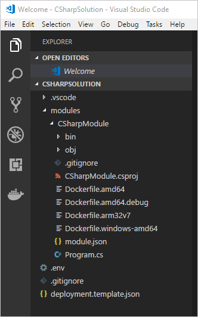

---
# Mandatory fields. See more on aka.ms/skyeye/meta.
title: Azure IoT Edge C# tutorial | Microsoft Docs 
description: This tutorial shows you how to create an IoT Edge module with C# code and deploy it to an edge device.
services: iot-edge
author: kgremban
manager: timlt

ms.author: kgremban
ms.date: 09/21/2018
ms.topic: tutorial
ms.service: iot-edge
ms.custom: mvc

---

# Tutorial: Develop a C# IoT Edge module and deploy to your simulated device

You can use Azure IoT Edge modules to deploy code that implements your business logic directly to your IoT Edge devices. This tutorial walks you through creating and deploying an IoT Edge module that filters sensor data. You'll use the simulated IoT Edge device that you created in the Deploy Azure IoT Edge on a simulated device in [Windows][lnk-tutorial1-win] or [Linux][lnk-tutorial1-lin] quickstarts. In this tutorial, you learn how to:    

> [!div class="checklist"]
> * Use Visual Studio Code to create an IoT Edge module that's based on the .NET Core 2.0 SDK.
> * Use Visual Studio Code and Docker to create a Docker image and publish it to your registry.
> * Deploy the module to your IoT Edge device.
> * View generated data.


The IoT Edge module that you create in this tutorial filters the temperature data that's generated by your device. It only sends messages upstream if the temperature is above a specified threshold. This type of analysis at the edge is useful for reducing the amount of data that's communicated to and stored in the cloud. 

[!INCLUDE [quickstarts-free-trial-note](../../includes/quickstarts-free-trial-note.md)]


## Prerequisites

An Azure IoT Edge device:

* You can use your development machine or a virtual machine as an Edge device by following the steps in the quickstart for [Linux](quickstart-linux.md) or [Windows devices](quickstart.md).

Cloud resources:

* A free or standard-tier [IoT Hub](../iot-hub/iot-hub-create-through-portal.md) in Azure. 

Development resources:

* [Visual Studio Code](https://code.visualstudio.com/). 
* [C# for Visual Studio Code (powered by OmniSharp) extension](https://marketplace.visualstudio.com/items?itemName=ms-vscode.csharp).
* [Azure IoT Edge extension](https://marketplace.visualstudio.com/items?itemName=vsciot-vscode.azure-iot-edge) for Visual Studio Code. 
* [.NET Core 2.1 SDK](https://www.microsoft.com/net/download).
* [Docker CE](https://docs.docker.com/install/)


## Create a container registry
In this tutorial, you use the Azure IoT Edge extension for VS Code to build a module and create a **container image** from the files. Then you push this image to a **registry** that stores and manages your images. Finally, you deploy your image from your registry to run on your IoT Edge device.  

You can use any Docker-compatible registry for this tutorial. Two popular Docker registry services that are available in the cloud are [Azure Container Registry](https://docs.microsoft.com/azure/container-registry/) and [Docker Hub](https://docs.docker.com/docker-hub/repos/#viewing-repository-tags). This tutorial uses Azure Container Registry. 

1. In the [Azure portal](https://portal.azure.com), select **Create a resource** > **Containers** > **Azure Container Registry**.
2. Give your registry a name, choose a subscription, choose a resource group, and set the SKU to **Basic**. 
3. Select **Create**.
4. After your container registry is created, browse to it, and select **Access keys**. 
5. Toggle **Admin user** to **Enable**.
6. Copy the values for **Login server**, **Username**, and **Password**. You use these values later in the tutorial to publish the Docker image to your registry and to add the registry credentials to the Azure IoT Edge runtime. 

## Create an IoT Edge module project
The following steps create an IoT Edge module project that's based on the .NET Core 2.0 SDK by using Visual Studio Code and the Azure IoT Edge extension.

### Create a new solution

Create a C# solution template that you can customize with your own code. 

1. In Visual Studio Code, select **View** > **Command Palette** to open the VS Code command palette. 

2. In the command palette, enter and run the command **Azure: Sign in** and follow the instructions to sign in your Azure account. If you're already signed in, you can skip this step.

3. In the command palette, enter and run the command **Azure IoT Edge: New IoT Edge solution**. In the command palette, provide the following information to create your solution: 

   1. Select the folder where you want to create the solution. 
   2. Provide a name for your solution or accept the default **EdgeSolution**.
   3. Choose **C# Module** as the module template. 
   4. Replace the default module name with **CSharpModule**. 
   5. Specify the Azure container registry that you created in the previous section as the image repository for your first module. Replace **localhost:5000** with the login server value that you copied. The final string looks like \<registry name\>.azurecr.io/csharpmodule.

   

The VS Code window loads your IoT Edge solution workspace. The solution workspace contains five top-level components. You won't edit the **\.vscode** folder or **\.gitignore** file in this tutorial. The **modules** folder contains the C# code for your module as well as Dockerfiles for building your module as a container image. The **\.env** file stores your container registry credentials. The **deployment.template.json** file contains the information that the IoT Edge runtime uses to deploy modules on a device. 

If you didn't specify a container registry when creating your solution, but accepted the default localhost:5000 value, you won't have a \.env file. 

   

### Add your registry credentials

The environment file stores the credentials for your container registry and shares them with the IoT Edge runtime. The runtime needs these credentials to pull your private images onto the IoT Edge device. 

1. In the VS Code explorer, open the .env file. 
2. Update the fields with the **username** and **password** values that you copied from your Azure container registry. 
3. Save this file. 

### Update the module with custom code

1. In the VS Code explorer, open **modules** > **CSharpModule** > **Program.cs**.

5. At the top of the **CSharpModule** namespace, add three **using** statements for types that are used later:

    ```csharp
    using System.Collections.Generic;     // For KeyValuePair<>
    using Microsoft.Azure.Devices.Shared; // For TwinCollection
    using Newtonsoft.Json;                // For JsonConvert
    ```

6. Add the **temperatureThreshold** variable to the **Program** class. This variable sets the value that the measured temperature must exceed for the data to be sent to the IoT hub. 

    ```csharp
    static int temperatureThreshold { get; set; } = 25;
    ```

7. Add the **MessageBody**, **Machine**, and **Ambient** classes to the **Program** class. These classes define the expected schema for the body of incoming messages.

    ```csharp
    class MessageBody
    {
        public Machine machine {get;set;}
        public Ambient ambient {get; set;}
        public string timeCreated {get; set;}
    }
    class Machine
    {
       public double temperature {get; set;}
       public double pressure {get; set;}         
    }
    class Ambient
    {
       public double temperature {get; set;}
       public int humidity {get; set;}         
    }
    ```

8. In the **Init** method, the code creates and configures a **ModuleClient** object. This object allows the module to connect to the local Azure IoT Edge runtime to send and receive messages. The connection string that's used in the **Init** method is supplied to the module by the IoT Edge runtime. After creating the **ModuleClient**, the code reads the **temperatureThreshold** value from the module twin's desired properties. The code registers a callback to receive messages from an IoT Edge hub via the **input1** endpoint. Replace the **SetInputMessageHandlerAsync** method with a new one, and add a **SetDesiredPropertyUpdateCallbackAsync** method for updates to the desired properties. To make this change, replace the last line of the **Init** method with the following code:

    ```csharp
    // Register a callback for messages that are received by the module.
    // await ioTHubModuleClient.SetImputMessageHandlerAsync("input1", PipeMessage, iotHubModuleClient);

    // Read the TemperatureThreshold value from the module twin's desired properties
    var moduleTwin = await ioTHubModuleClient.GetTwinAsync();
    var moduleTwinCollection = moduleTwin.Properties.Desired;
    try {
        temperatureThreshold = moduleTwinCollection["TemperatureThreshold"];
    } catch(ArgumentOutOfRangeException e) {
        Console.WriteLine($"Property TemperatureThreshold not exist: {e.Message}"); 
    }

    // Attach a callback for updates to the module twin's desired properties.
    await ioTHubModuleClient.SetDesiredPropertyUpdateCallbackAsync(OnDesiredPropertiesUpdate, null);

    // Register a callback for messages that are received by the module.
    await ioTHubModuleClient.SetInputMessageHandlerAsync("input1", FilterMessages, ioTHubModuleClient);
    ```

9. Add the **onDesiredPropertiesUpdate** method to the **Program** class. This method receives updates on the desired properties from the module twin, and updates the **temperatureThreshold** variable to match. All modules have their own module twin, which lets you configure the code that's running inside a module directly from the cloud.

    ```csharp
    static Task OnDesiredPropertiesUpdate(TwinCollection desiredProperties, object userContext)
    {
        try
        {
            Console.WriteLine("Desired property change:");
            Console.WriteLine(JsonConvert.SerializeObject(desiredProperties));

            if (desiredProperties["TemperatureThreshold"]!=null)
                temperatureThreshold = desiredProperties["TemperatureThreshold"];

        }
        catch (AggregateException ex)
        {
            foreach (Exception exception in ex.InnerExceptions)
            {
                Console.WriteLine();
                Console.WriteLine("Error when receiving desired property: {0}", exception);
            }
        }
        catch (Exception ex)
        {
            Console.WriteLine();
            Console.WriteLine("Error when receiving desired property: {0}", ex.Message);
        }
        return Task.CompletedTask;
    }
    ```

10. Replace the **PipeMessage** method with the **FilterMessages** method. This method is called whenever the module receives a message from the IoT Edge hub. It filters out messages that report temperatures below the temperature threshold set via the module twin. It also adds the **MessageType** property to the message with the value set to **Alert**. 

    ```csharp
    static async Task<MessageResponse> FilterMessages(Message message, object userContext)
    {
        var counterValue = Interlocked.Increment(ref counter);
        try
        {
            ModuleClient moduleClient = (ModuleClient)userContext;
            var messageBytes = message.GetBytes();
            var messageString = Encoding.UTF8.GetString(messageBytes);
            Console.WriteLine($"Received message {counterValue}: [{messageString}]");

            // Get the message body.
            var messageBody = JsonConvert.DeserializeObject<MessageBody>(messageString);

            if (messageBody != null && messageBody.machine.temperature > temperatureThreshold)
            {
                Console.WriteLine($"Machine temperature {messageBody.machine.temperature} " +
                    $"exceeds threshold {temperatureThreshold}");
                var filteredMessage = new Message(messageBytes);
                foreach (KeyValuePair<string, string> prop in message.Properties)
                {
                    filteredMessage.Properties.Add(prop.Key, prop.Value);
                }

                filteredMessage.Properties.Add("MessageType", "Alert");
                await moduleClient.SendEventAsync("output1", filteredMessage);
            }

            // Indicate that the message treatment is completed.
            return MessageResponse.Completed;
        }
        catch (AggregateException ex)
        {
            foreach (Exception exception in ex.InnerExceptions)
            {
                Console.WriteLine();
                Console.WriteLine("Error in sample: {0}", exception);
            }
            // Indicate that the message treatment is not completed.
            var moduleClient = (ModuleClient)userContext;
            return MessageResponse.Abandoned;
        }
        catch (Exception ex)
        {
            Console.WriteLine();
            Console.WriteLine("Error in sample: {0}", ex.Message);
            // Indicate that the message treatment is not completed.
            ModuleClient moduleClient = (ModuleClient)userContext;
            return MessageResponse.Abandoned;
        }
    }
    ```

11. Save this file.

## Build your IoT Edge solution

In the previous section, you created an IoT Edge solution and added code to the **CSharpModule** to filter out messages where the reported machine temperature is below the acceptable threshold. Now you need to build the solution as a container image and push it to your container registry. 

1. Sign in to Docker by entering the following command in the Visual Studio Code integrated terminal. Then you can push your module image to your Azure container registry.
     
   ```csh/sh
   docker login -u <ACR username> -p <ACR password> <ACR login server>
   ```
   Use the username, password, and login server that you copied from your Azure container registry in the first section. You can also retrieve these values from the **Access keys** section of your registry in the Azure portal.

2. In the VS Code explorer, open the deployment.template.json file in your IoT Edge solution workspace. This file tells the **$edgeAgent** to deploy two modules: **tempSensor** and **CSharpModule**. The **CSharpModule.image** value is set to a Linux amd64 version of the image. 

   Verify that the template has the correct module name, not the default **SampleModule** name that you changed when you created the IoT Edge solution.

   To learn more about deployment manifests, see [Understand how IoT Edge modules can be used, configured, and reused](module-composition.md).

3. In the deployment.template.json file, the **registryCredentials** section stores your Docker registry credentials. The actual username and password pairs are stored in the .env file, which is ignored by git.  

4. Add the **CSharpModule** module twin to the deployment manifest. Insert the following JSON content at the bottom of the **moduleContent** section, after the **$edgeHub** module twin: 
    ```json
        "CSharpModule": {
            "properties.desired":{
                "TemperatureThreshold":25
            }
        }
    ```

4. Save this file.

5. In the VS Code explorer, right-click the deployment.template.json file and select **Build and Push IoT Edge solution**. 

When you tell Visual Studio Code to build your solution, it first takes the information in the deployment template and generates a deployment.json file in a new folder named **config**. Then, it runs two commands in the integrated terminal: `docker build` and `docker push`. These two commands build your code, containerize the CSharpModule.dll, and then push the code to the container registry that you specified when you initialized the solution. 

You can see the full container image address with tag in the VS Code integrated terminal. The image address is built from information that's in the module.json file with the format \<repository\>:\<version\>-\<platform\>. For this tutorial, it should look like registryname.azurecr.io/csharpmodule:0.0.1-amd64.

## Deploy and run the solution

In the quickstart article that you used to set up your IoT Edge device, you deployed a module by using the Azure portal. You can also deploy modules using the Azure IoT Toolkit extension for Visual Studio Code. You already have a deployment manifest prepared for your scenario, the **deployment.json** file. All you need to do now is select a device to receive the deployment.

1. In the VS Code command palette, run **Azure IoT Hub: Select IoT Hub**. 

2. Choose the subscription and IoT hub that contain the IoT Edge device that you want to configure. 

3. In the VS Code explorer, expand the **Azure IoT Hub Devices** section. 

4. Right-click the name of your IoT Edge device, then select **Create Deployment for Single Device**. 

   

5. Select the **deployment.json** file in the **config** folder and then click **Select Edge Deployment Manifest**. Do not use the deployment.template.json file. 

6. Click the refresh button. You should see the new **CSharpModule** running along with the **TempSensor** module and the **$edgeAgent** and **$edgeHub**.  

## View generated data

Once you apply the deployment manifest to your IoT Edge device, the IoT Edge runtime on the device collects the new deployment information and starts executing on it. Any modules running on the device that aren't included in the deployment manifest are stopped. Any modules missing from the device are started. 

You can view the status of your IoT Edge device using the **Azure IoT Hub Devices** section of the Visual Studio Code explorer. Expand the details of your device to see a list of deployed and running modules. 

On the IoT Edge device itself you can see the status of your deployment modules using the command `iotedge list`. You should see four modules: the two IoT Edge runtime modules, tempSensor, and the custom module that you created in this tutorial. It may take a few minutes for all the modules to start, so rerun the command if you don't see them all initially. 

To view the messages being generated by any module, use the command `iotedge logs <module name>`. 

You can view the messages as they arrive at your IoT hub using Visual Studio Code. 

1. To monitor data that arrives at the IoT hub, select the ellipsis (**...**), and then select **Start Monitoring D2C Messages**.
2. To monitor the D2C message for a specific device, right-click the device in the list, and select **Start Monitoring D2C Messages**.
3. To stop monitoring data, run the command **Azure IoT Hub: Stop monitoring D2C message** in the command palette. 
4. To view or update the module twin, right-click the module in the list, and select **Edit module twin**. To update the module twin, save the twin JSON file, right-click the editor area, and select **Update Module Twin**.
5. To view Docker logs, install [Docker](https://marketplace.visualstudio.com/items?itemName=PeterJausovec.vscode-docker) for VS Code. You can find your running modules locally in Docker explorer. In the context menu, select **Show Logs** to view in the integrated terminal.
 
## Clean up resources 

If you plan to continue to the next recommended article, you can keep the resources and configurations that you created and reuse them. You can also keep using the same IoT Edge device as a test device. 

Otherwise, you can delete the local configurations and the Azure resources that you created in this article to avoid charges. 

[!INCLUDE [iot-edge-clean-up-cloud-resources](../../includes/iot-edge-clean-up-cloud-resources.md)]

[!INCLUDE [iot-edge-clean-up-local-resources](../../includes/iot-edge-clean-up-local-resources.md)]


## Next steps

In this tutorial, you created an IoT Edge module with code to filter raw data that's generated by your IoT Edge device. When you're ready to build your own modules, you can learn more about how to [develop a C# module with Azure IoT Edge for Visual Studio Code](how-to-develop-csharp-module.md). You can continue on to the next tutorials to learn other ways that Azure IoT Edge can help you turn data into business insights at the edge.

> [!div class="nextstepaction"]
> [Store data at the edge with SQL Server databases](tutorial-store-data-sql-server.md)

<!-- Links -->
[lnk-tutorial1-win]: quickstart.md
[lnk-tutorial1-lin]: quickstart-linux.md

<!-- Images -->
[1]: ./media/tutorial-csharp-module/programcs.png
[2]: ./media/tutorial-csharp-module/build-module.png
[3]: ./media/tutorial-csharp-module/docker-os.png
