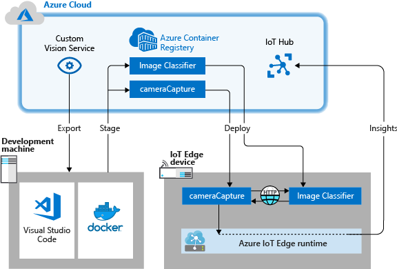
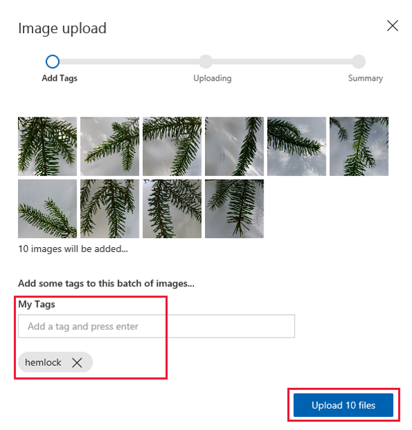
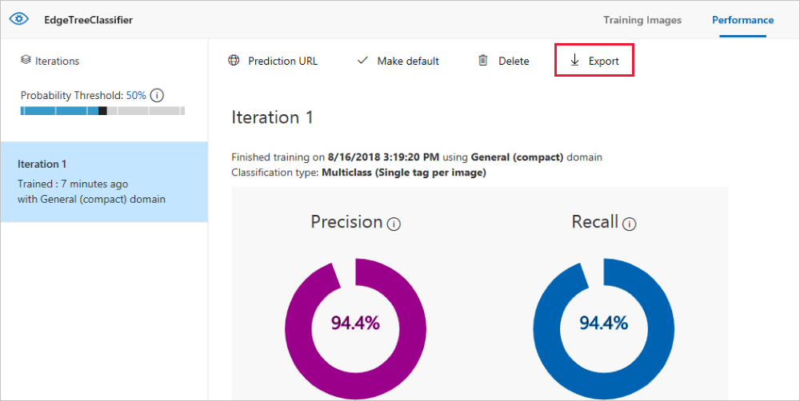
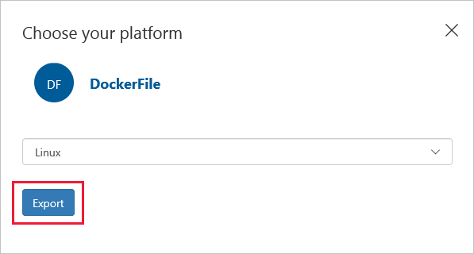
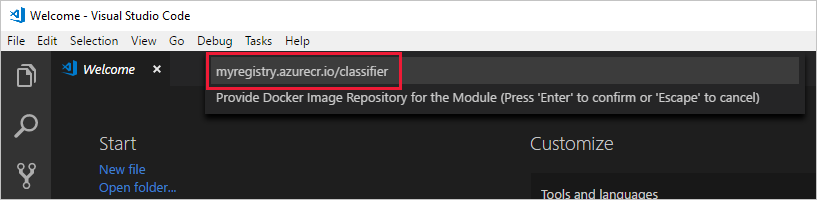
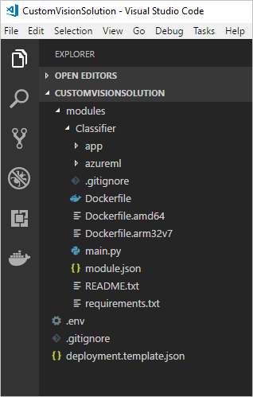

---
# Mandatory fields. See more on aka.ms/skyeye/meta.
title: Tutorial deploy Custom Vision classifier to a device - Azure IoT Edge | Microsoft Docs 
description: In this tutorial, learn how to make a computer vision model run as a container using Custom Vision and IoT Edge.
services: iot-edge
author: kgremban
manager: philmea
ms.author: kgremban
ms.date: 06/25/2019
ms.topic: tutorial
ms.service: iot-edge
ms.custom: "mvc, seodec18"
#Customer intent: As an IoT developer, I want to perform image recognition directly on my IoT Edge device so that I can have faster results and lower costs for data transfers.
---

# Tutorial: Perform image classification at the edge with Custom Vision Service

Azure IoT Edge can make your IoT solution more efficient by moving workloads out of the cloud and to the edge. This capability lends itself well to services that process a lot of data, like computer vision models. The [Custom Vision Service](../cognitive-services/custom-vision-service/home.md) lets you build custom image classifiers and deploy them to devices as containers. Together, these two services enable you to find insights from images or video streams without having to transfer all of the data off site first. Custom Vision provides a classifier that compares an image against a trained model to generate insights.

For example, Custom Vision on an IoT Edge device could determine whether a highway is experiencing higher or lower traffic than normal, or whether a parking garage has available parking spots in a row. These insights can be shared with another service to take action.

In this tutorial, you learn how to:

> [!div class="checklist"]
>
> * Build an image classifier with Custom Vision.
> * Develop an IoT Edge module that queries the Custom Vision web server on your device.
> * Send the results of the image classifier to IoT Hub.

<center>


</center>

[!INCLUDE [quickstarts-free-trial-note](../../includes/quickstarts-free-trial-note.md)]

## Prerequisites

Before beginning this tutorial, you should have gone through the previous tutorial to set up your development environment for Linux container development: [Develop IoT Edge modules for Linux devices](tutorial-develop-for-linux.md). By completing that tutorial, you should have the following prerequisites in place: 

* A free or standard-tier [IoT Hub](../iot-hub/iot-hub-create-through-portal.md) in Azure.
* A [Linux device running Azure IoT Edge](quickstart-linux.md)
* A container registry, like [Azure Container Registry](https://docs.microsoft.com/azure/container-registry/).
* [Visual Studio Code](https://code.visualstudio.com/) configured with the [Azure IoT Tools](https://marketplace.visualstudio.com/items?itemName=vsciot-vscode.azure-iot-tools).
* [Docker CE](https://docs.docker.com/install/) configured to run Linux containers.

To develop an IoT Edge module with the Custom Vision service, install the following additional prerequisites on your development machine: 

* [Python](https://www.python.org/downloads/)
* [Git](https://git-scm.com/downloads)
* [Python](https://marketplace.visualstudio.com/items?itemName=ms-python.python) extension for Visual Studio Code

## Build an image classifier with Custom Vision

To build an image classifier, you need to create a Custom Vision project and provide training images. For more information about the steps that you take in this section, see [How to build a classifier with Custom Vision](../cognitive-services/custom-vision-service/getting-started-build-a-classifier.md).

Once your image classifier is built and trained, you can export it as a Docker container and deploy it to an IoT Edge device. 

### Create a new project

1. In your web browser, navigate to the [Custom Vision web page](https://customvision.ai/).

2. Select **Sign in** and sign in with the same account that you use to access Azure resources. 

3. Select **New project**.

4. Create your project with the following values:

   | Field | Value |
   | ----- | ----- |
   | Name | Provide a name for your project, like **EdgeTreeClassifier**. |
   | Description | Optional project description. |
   | Resource Group | Select one of your Azure Resource Groups that includes a Custom Vision Service Resource or **create new** if you haven't yet added one. |
   | Project Types | **Classification** |
   | Classification Types | **Multiclass (single tag per image)** |
   | Domains | **General (compact)** |
   | Export Capabilities | **Basic platforms (Tensorflow, CoreML, ONNX, ...)** |

5. Select **Create project**.

### Upload images and train your classifier

Creating an image classifier requires a set of training images, as well as test images. 

1. Clone or download sample images from the [Cognitive-CustomVision-Windows](https://github.com/Microsoft/Cognitive-CustomVision-Windows) repo onto your local development machine. 

   ```cmd/sh
   git clone https://github.com/Microsoft/Cognitive-CustomVision-Windows.git
   ```

2. Return to your Custom Vision project and select **Add images**. 

3. Browse to the git repo that you cloned locally, and navigate to the first image folder, **Cognitive-CustomVision-Windows / Samples / Images / Hemlock**. Select all 10 images in the folder and then **Open**. 

4. Add the tag **hemlock** to this group of images and press **enter** to apply the tag. 

5. Select **Upload 10 files**. 

   

6. When the images are uploaded successfully, select **Done**.

7. Select **Add images** again.

8. Browse to the second image folder, **Cognitive-CustomVision-Windows / Samples / Images / Japanese Cherry**. Select all 10 images in the folder and then **Open**. 

9. Add the tag **japanese cherry** to this group of images and press **enter** to apply the tag. 

10. Select **Upload 10 files**. When the images are uploaded successfully, select **Done**. 

11. When both sets of images are tagged and uploaded, select **Train** to train the classifier. 

### Export your classifier

1. After training your classifier, select **Export** on the Performance page of the classifier. 

   

2. Select **DockerFile** for the platform. 

3. Select **Linux** for the version.  

4. Select **Export**. 

   

5. When the export is complete, select **Download** and save the .zip package locally on your computer. Extract all files from the package. You'll use these files to create an IoT Edge module that contains the image classification server. 

When you reach this point, you've finished creating and training your Custom Vision project. You'll use the exported files in the next section, but you're done with the Custom Vision web page. 

## Create an IoT Edge solution

Now you have the files for a container version of your image classifier on your development machine. In this section, you configure the image classifier container to run as an IoT Edge module. You also create a second module that will be deployed alongside the image classifier. The second module posts requests to the classifier and sends the results as messages to IoT Hub. 

### Create a new solution

A solution is a logical way of developing and organizing multiple modules for a single IoT Edge deployment. A solution contains code for one or more modules as well as the deployment manifest that declares how to configure them on an IoT Edge device. 

1. In Visual Studio Code, select **View** > **Terminal** to open the VS Code integrated terminal.

1. Select **View** > **Command Palette** to open the VS Code command palette. 

1. In the command palette, enter and run the command **Azure IoT Edge: New IoT Edge solution**. In the command palette, provide the following information to create your solution: 

   | Field | Value |
   | ----- | ----- |
   | Select folder | Choose the location on your development machine for VS Code to create the solution files. |
   | Provide a solution name | Enter a descriptive name for your solution, like **CustomVisionSolution**, or accept the default. |
   | Select module template | Choose **Python Module**. |
   | Provide a module name | Name your module **classifier**.<br><br>It's important that this module name be lowercase. IoT Edge is case-sensitive when referring to modules, and this solution uses a library that formats all requests in lowercase. |
   | Provide Docker image repository for the module | An image repository includes the name of your container registry and the name of your container image. Your container image is prepopulated from the last step. Replace **localhost:5000** with the login server value from your Azure container registry. You can retrieve the login server from the Overview page of your container registry in the Azure portal. The final string looks like \<registry name\>.azurecr.io/classifier. |
 
   

The Visual Studio Code window loads your IoT Edge solution workspace.

### Add your registry credentials

The environment file stores the credentials for your container registry and shares them with the IoT Edge runtime. The runtime needs these credentials to pull your private images onto the IoT Edge device.

1. In the VS Code explorer, open the .env file.
2. Update the fields with the **username** and **password** values that you copied from your Azure container registry.
3. Save this file.

### Select your target architecture

Currently, Visual Studio Code can develop modules for Linux AMD64 and Linux ARM32v7 devices. You need to select which architecture you're targeting with each solution, because the container is built and run differently for each architecture type. The default is Linux AMD64. 

1. Open the command palette and search for **Azure IoT Edge: Set Default Target Platform for Edge Solution**, or select the shortcut icon in the side bar at the bottom of the window. 

2. In the command palette, select the target architecture from the list of options. For this tutorial, we're using an Ubuntu virtual machine as the IoT Edge device, so will keep the default **amd64**. 

### Add your image classifier

The Python module template in Visual Studio code contains some sample code that you can run to test IoT Edge. You won't use that code in this scenario. Instead, use the steps in this section to replace the sample code with the image classifier container that you exported previously. 

1. In your file explorer, browse to the Custom Vision package that you downloaded and extracted. Copy all the contents from the extracted package. It should be two folders, **app** and **azureml**, and two files, **Dockerfile** and **README**. 

2. In your file explorer, browse to the directory where you told Visual Studio Code to create your IoT Edge solution. 

3. Open the classifier module folder. If you used the suggested names in the previous section, the folder structure looks like **CustomVisionSolution / modules / classifier**. 

4. Paste the files into the **classifier** folder. 

5. Return to the Visual Studio Code window. Your solution workspace should now show the image classifier files in the module folder. 

   

6. Open the **module.json** file in the classifier folder. 

7. Update the **platforms** parameter to point to the new Dockerfile that you added, and remove the ARM32 architecture and AMD64.debug options, which currently aren't supported for the Custom Vision module. 

   ```json
   "platforms": {
       "amd64": "./Dockerfile"
   }
   ```

8. Save your changes. 

### Create a simulated camera module

In a real Custom Vision deployment, you would have a camera providing live images or video streams. For this scenario, you simulate the camera by building a module that sends a test image to the image classifier. 

#### Add and configure a new module

In this section, you add a new module to the same CustomVisionSolution and provide code to create the simulated camera. 

1. In the same Visual Studio Code window, use the command palette to run **Azure IoT Edge: Add IoT Edge Module**. In the command palette, provide the following information for your new module: 

   | Prompt | Value | 
   | ------ | ----- |
   | Select deployment template file | Select the deployment.template.json file in the CustomVisionSolution folder. |
   | Select module template | Select **Python Module** |
   | Provide a module name | Name your module **cameraCapture** |
   | Provide Docker image repository for the module | Replace **localhost:5000** with the login server value for your Azure container registry. The final string looks like **\<registryname\>.azurecr.io/cameracapture**. |

   The VS Code window loads your new module in the solution workspace, and updates the deployment.template.json file. Now you should see two module folders: classifier and cameraCapture. 

2. Open the **main.py** file in the **modules** / **cameraCapture** folder. 

3. Replace the entire file with the following code. This sample code sends POST requests to the image-processing service running in the classifier module. We provide this module container with a sample image to use in the requests. It then packages the response as an IoT Hub message and sends it to an output queue.  

    ```python
    # Copyright (c) Microsoft. All rights reserved.
    # Licensed under the MIT license. See LICENSE file in the project root for
    # full license information.

    import time
    import sys
    import os
    import requests
    import json

    import iothub_client
    # pylint: disable=E0611
    from iothub_client import IoTHubModuleClient, IoTHubClientError, IoTHubTransportProvider
    from iothub_client import IoTHubMessage, IoTHubMessageDispositionResult, IoTHubError
    # pylint: disable=E0401

    # messageTimeout - the maximum time in milliseconds until a message times out.
    # The timeout period starts at IoTHubModuleClient.send_event_async.
    MESSAGE_TIMEOUT = 10000

    # Choose HTTP, AMQP or MQTT as transport protocol.  
    PROTOCOL = IoTHubTransportProvider.MQTT

    # global counters
    SEND_CALLBACKS = 0

    # Send a message to IoT Hub
    # Route output1 to $upstream in deployment.template.json
    def send_to_hub(strMessage):
        message = IoTHubMessage(bytearray(strMessage, 'utf8'))
        hubManager.send_event_to_output("output1", message, 0)

    # Callback received when the message that we send to IoT Hub is processed.
    def send_confirmation_callback(message, result, user_context):
        global SEND_CALLBACKS
        SEND_CALLBACKS += 1
        print ( "Confirmation received for message with result = %s" % result )
        print ( "   Total calls confirmed: %d \n" % SEND_CALLBACKS )

    # Send an image to the image classifying server
    # Return the JSON response from the server with the prediction result
    def sendFrameForProcessing(imagePath, imageProcessingEndpoint):
        headers = {'Content-Type': 'application/octet-stream'}

        with open(imagePath, mode="rb") as test_image:
            try:
                response = requests.post(imageProcessingEndpoint, headers = headers, data = test_image)
                print("Response from classification service: (" + str(response.status_code) + ") " + json.dumps(response.json()) + "\n")
            except Exception as e:
                print(e)
                print("Response from classification service: (" + str(response.status_code))

        return json.dumps(response.json())

    class HubManager(object):
        def __init__(self, protocol, message_timeout):
            self.client_protocol = protocol
            self.client = IoTHubModuleClient()
            self.client.create_from_environment(protocol)
            # set the time until a message times out
            self.client.set_option("messageTimeout", message_timeout)
            
        # Sends a message to an output queue, to be routed by IoT Edge hub. 
        def send_event_to_output(self, outputQueueName, event, send_context):
            self.client.send_event_async(
                outputQueueName, event, send_confirmation_callback, send_context)

    def main(imagePath, imageProcessingEndpoint):
        try:
            print ( "Simulated camera module for Azure IoT Edge. Press Ctrl-C to exit." )

            try:
                global hubManager 
                hubManager = HubManager(PROTOCOL, MESSAGE_TIMEOUT)
            except IoTHubError as iothub_error:
                print ( "Unexpected error %s from IoTHub" % iothub_error )
                return

            print ( "The sample is now sending images for processing and will indefinitely.")

            while True:
                classification = sendFrameForProcessing(imagePath, imageProcessingEndpoint)
                send_to_hub(classification)
                time.sleep(10)

        except KeyboardInterrupt:
            print ( "IoT Edge module sample stopped" )

    if __name__ == '__main__':
        try:
            # Retrieve the image location and image classifying server endpoint from container environment
            IMAGE_PATH = os.getenv('IMAGE_PATH', "")
            IMAGE_PROCESSING_ENDPOINT = os.getenv('IMAGE_PROCESSING_ENDPOINT', "")
        except ValueError as error:
            print ( error )
            sys.exit(1)

        if ((IMAGE_PATH and IMAGE_PROCESSING_ENDPOINT) != ""):
            main(IMAGE_PATH, IMAGE_PROCESSING_ENDPOINT)
        else: 
            print ( "Error: Image path or image-processing endpoint missing" )
    ```

4. Save the **main.py** file. 

5. Open the **requrements.txt** file. 

6. Add a new line for a library to include in the container.

   ```Text
   requests
   ```

7. Save the **requirements.txt** file.


#### Add a test image to the container

Instead of using a real camera to provide an image feed for this scenario, we're going to use a single test image. A test image is included in the GitHub repo that you downloaded for the training images earlier in this tutorial. 

1. Navigate to the test image, located at **Cognitive-CustomVision-Windows** / **Samples** / **Images** / **Test**. 

2. Copy **test_image.jpg** 

3. Browse to your IoT Edge solution directory and paste the test image in the **modules** / **cameraCapture** folder. The image should be in the same folder as the main.py file that you edited in the previous section. 

3. In Visual Studio Code, open the **Dockerfile.amd64** file for the cameraCapture module. (ARM32 is not currently supported by the Custom Vision module). 

4. After the line that establishes the working directory, `WORKDIR /app`, add the following line of code: 

   ```Dockerfile
   ADD ./test_image.jpg .
   ```

5. Save the Dockerfile. 

### Prepare a deployment manifest

So far in this tutorial you've trained a Custom Vision model to classify images of trees, and packaged that model up as an IoT Edge module. Then, you created a second module that can query the image classification server and report its results back to IoT Hub. Now, you're ready to create the deployment manifest that will tell an IoT Edge device how to start and run these two modules together. 

The IoT Edge extension for Visual Studio Code provides a template in each IoT Edge solution to help you create a deployment manifest. 

1. Open the **deployment.template.json** file in the solution folder. 

2. Find the **modules** section, which should contain three modules: the two that you created, classifier and cameraCapture, and a third that's included by default, tempSensor. 

3. Delete the **tempSensor** module with all of its parameters. This module is included to provide sample data for test scenarios, but we don't need it in this deployment. 

4. If you named the image classification module something other than **classifier**, check the name now and ensure that it's all lowercase. The cameraCapture module calls the classifier module using a requests library that formats all requests in lowercase, and IoT Edge is case-sensitive. 

5. Update the **createOptions** parameter for the cameraCapture module with the following JSON. This information creates environment variables in the module container that are retrieved in the main.py process. By including this information in the deployment manifest, you can change the image or endpoint without having to rebuild the module image. 

    ```json
    "createOptions": "{\"Env\":[\"IMAGE_PATH=test_image.jpg\",\"IMAGE_PROCESSING_ENDPOINT=http://classifier/image\"]}"
    ```

    If you named your Custom Vision module something other than *classifier*, update the image-processing endpoint value to match. 

5. At the bottom of the file, update the **routes** parameter for the $edgeHub module. You want to route the prediction results from cameraCapture to IoT Hub. 

    ```json
        "routes": {
          "CameraCaptureToIoTHub": "FROM /messages/modules/cameraCapture/outputs/* INTO $upstream"
        },
    ```

    If you named your second module something other than *cameraCapture*, update the route value to match. 

7. Save the **deployment.template.json** file.

## Build and deploy your IoT Edge solution

With both modules created and the deployment manifest template configured, you're ready to build the container images and push them to your container registry. 

Once the images are in your registry, you can deploy the solution to an IoT Edge device. You can set modules on a device through the IoT Hub, but you can also access your IoT Hub and devices through Visual Studio Code. In this section, you set up access to your IoT Hub then use VS Code to deploy your solution to your IoT Edge device.

First, build and push your solution to your container registry. 

1. In the VS Code explorer, right-click the **deployment.template.json** file and select **Build and push IoT Edge solution**. You can watch the progress of this operation in the integrated terminal in VS Code. 
2. Notice that a new folder was added to your solution, **config**. Expand this folder and open the **deployment.json** file inside.
3. Review the information in the deployment.json file. The deployment.json file is created (or updated) automatically based on the deployment template file that you configured and information from the solution, including the .env file and the module.json files. 

Next, select your device and deploy your solution.

1. In the VS Code explorer, expand the **Azure IoT Hub Devices** section. 
2. Right-click on the device that you want to target with your deployment and select **Create deployment for single device**. 
3. In the file explorer, navigate to the **config** folder inside your solution and choose **deployment.json**. Click **Select Edge deployment manifest**. 

If the deployment is successful, a confirmation message is printed in the VS Code output. In the VS Code explorer, expand the details about the IoT Edge device that you used for this deployment. Hover your cursor on the **Azure IoT Hub Devices** header to enable the refresh button if the modules don't show up right away. It may take a few moments for the modules to start and report back to IoT Hub. 

You can also check to see that all the modules are up and running on your device itself. On your IoT Edge device, run the following command to see the status of the modules. It may take a few moments for the modules to start.

   ```bash
   iotedge list
   ```

## View classification results

There are two ways to view the results of your modules, either on the device itself as the messages are generated and sent, or from Visual Studio Code as the messages arrive at IoT Hub. 

From your device, view the logs of the cameraCapture module to see the messages being sent and the confirmation that they were received by IoT Hub. 

   ```bash
   iotedge logs cameraCapture
   ```

From Visual Studio Code, right-click on the name of your IoT Edge device and select **Start Monitoring Built-in Event Endpoint**. 

The results from the Custom Vision module, which are sent as messages from the cameraCapture module, include the probability that the image is of either a hemlock or cherry tree. Since the image is hemlock, you should see the probability as 1.0. 


## Clean up resources

If you plan to continue to the next recommended article, you can keep the resources and configurations that you created and reuse them. You can also keep using the same IoT Edge device as a test device. 

Otherwise, you can delete the local configurations and the Azure resources that you used in this article to avoid charges. 

[!INCLUDE [iot-edge-clean-up-cloud-resources](../../includes/iot-edge-clean-up-cloud-resources.md)]


## Next steps

In this tutorial, you trained a Custom Vision model and deployed it as a module onto an IoT Edge device. Then you built a module that can query the image classification service and report its results back to IoT Hub. 

If you want to try a more in-depth version of this scenario with a live camera feed, see the [Custom Vision and Azure IoT Edge on a Raspberry Pi 3](https://github.com/Azure-Samples/Custom-vision-service-iot-edge-raspberry-pi) GitHub project. 

Continue on to the next tutorials to learn about other ways that Azure IoT Edge can help you turn data into business insights at the edge.

> [!div class="nextstepaction"]
> [Store data at the edge with SQL Server databases](tutorial-store-data-sql-server.md)
