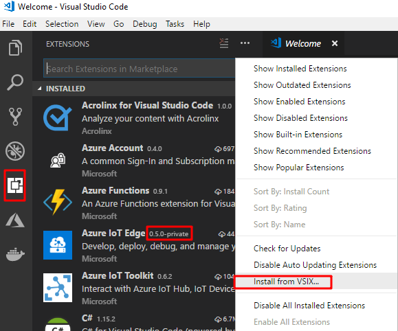

# Deploy Azure Function as an IoT Edge module

You can use Azure Functions to deploy code that implements your business logic directly to your IoT Edge devices. This tutorial walks you through creating and deploying an Azure Function that filters sensor data on the simulated IoT Edge device that you created in the Deploy Azure IoT Edge on a simulated device on [Windows][lnk-tutorial1-win] or [Linux][lnk-tutorial1-lin] tutorials. In this tutorial, you learn how to:     

> [!div class="checklist"]
> * Use Visual Studio Code to create an Azure Function
> * Use VS Code and Docker to create a Docker image and publish it to your registry 
> * Deploy the module to your IoT Edge device
> * View generated data


The Azure Function that you create in this tutorial filters the temperature data generated by your device and only sends messages upstream to Azure IoT Hub when the temperature is above a specified threshold. 

## Prerequisites

* The Azure IoT Edge device that you created in the quickstart or previous tutorial.
* [Visual Studio Code](https://code.visualstudio.com/). 
* [C# for Visual Studio Code (powered by OmniSharp) extension](https://marketplace.visualstudio.com/items?itemName=ms-vscode.csharp). 
* [.NET Core 2.0 SDK](https://www.microsoft.com/net/core#windowscmd). 
* [Docker CE](https://docs.docker.com/install/) on your development machine. 

## Bugbash-only prerequisites
* [Azure IoT Toolkit for Visual Studio Code](https://marketplace.visualstudio.com/items?itemName=vsciot-vscode.azure-iot-toolkit)
* [Azure IoT Edge extension for Visual Studio Code - 0.5.0-private2](https://github.com/Microsoft/vscode-azure-iot-edge/releases/download/v0.5.0-private2/azure-iot-edge-0.5.0-private2.vsix).
    Download and save the VSIX file locally using the link provided. In VS Code, go to the **Extensions** view. Click the **...** then select **Install from VSIX...**. Reload the VS Code window to enable the extension.

    

* [C# Functions module template package - 2.0.0-rc2](https://github.com/Azure/dotnet-template-azure-iot-edge-function/releases/download/v2.0.0-rc2/Microsoft.Azure.IoT.Edge.Function.2.0.0-rc2.nupkg).
    Download and save the package locally using the link provided. the In VS Code integrated terminal (**View** > **Integrated Terminal**), enter the following command to install the **aziotedgefunction** template in dotnet.

    ```cmd/sh
    dotnet new -i [path to Microsoft.Azure.IoT.Edge.Function.2.0.0-rc2.nupkg]
    ```

## Create a container registry
In this tutorial, you use the Azure IoT Edge extension for VS Code to build a module and create a **container image** from the files. Then you push this image to a **registry** that stores and manages your images. Finally, you deploy your image from your registry to run on your IoT Edge device.  

You can use any Docker-compatible registry for this tutorial. Two popular Docker registry services available in the cloud are [Azure Container Registry](https://docs.microsoft.com/azure/container-registry/) and [Docker Hub](https://docs.docker.com/docker-hub/repos/#viewing-repository-tags). This tutorial uses Azure Container Registry. 

1. In the [Azure portal](https://portal.azure.com), select **Create a resource** > **Containers** > **Azure Container Registry**.
2. Give your registry a name, choose a subscription, choose a resource group, and set the SKU to **Basic**. 
3. Select **Create**.
4. Once your container registry is created, navigate to it and select **Access keys**. 
5. Toggle **Admin user** to **Enable**.
6. Copy the values for **Login server**, **Username**, and **Password**. You'll use these values later in the tutorial. 

## Create a function project
The following steps show you how to create an IoT Edge function using Visual Studio Code and the Azure IoT Edge extension.
1. Open Visual Studio Code.
2. To open the VS Code integrated terminal, select **View** > **Integrated Terminal**.
3. In the command palette, type and run the command **Azure IoT Edge: New IoT Edge solution**. In the command palette, provide the following information to create your solution: 
   1. Select the folder where you want to create the solution. 
   2. Provide a name for your solution or accept the default **EdgeSolution**.
   3. Choose **Azure Functions - C#** as the module template. 
   4. Name your module **CSharpFunction**. 
   5. Specify the Azure Container Registry that you created in the previous section as the image repository for your first module. Replace **localhost:5000** with the login server value that you copied. The final string looks like **\<registry name\>.azurecr.io/csharpfunction**.

4. The VS Code window loads your IoT Edge solution workspace. There is a **modules** folder, a **.vscode** folder, and a deployment manifest template file. Open **modules** > **CSharpFunction** > **EdgeHubTrigger-Csharp** > **run.csx**.

5. Replace the contents of the file with the following code:

   ```csharp
   #r "Microsoft.Azure.Devices.Client"
   #r "Newtonsoft.Json"

   using System.IO;
   using Microsoft.Azure.Devices.Client;
   using Newtonsoft.Json;

   // Filter messages based on the temperature value in the body of the message and the temperature threshold value.
   public static async Task Run(Message messageReceived, IAsyncCollector<Message> output, TraceWriter log)
   {
        const int temperatureThreshold = 25;
        byte[] messageBytes = messageReceived.GetBytes();
        var messageString = System.Text.Encoding.UTF8.GetString(messageBytes);

        if (!string.IsNullOrEmpty(messageString))
        {
            // Get the body of the message and deserialize it
            var messageBody = JsonConvert.DeserializeObject<MessageBody>(messageString);

            if (messageBody != null && messageBody.machine.temperature > temperatureThreshold)
            {
                // Send the message to the output as the temperature value is greater than the threashold
                var filteredMessage = new Message(messageBytes);
                // Copy the properties of the original message into the new Message object
                foreach (KeyValuePair<string, string> prop in messageReceived.Properties)
                {
                    filteredMessage.Properties.Add(prop.Key, prop.Value);                }
                // Add a new property to the message to indicate it is an alert
                filteredMessage.Properties.Add("MessageType", "Alert");
                // Send the message        
                await output.AddAsync(filteredMessage);
                log.Info("Received and transferred a message with temperature above the threshold");
            }
        }
    }

    //Define the expected schema for the body of incoming messages
    class MessageBody
    {
        public Machine machine {get;set;}
        public Ambient ambient {get; set;}
        public string timeCreated {get; set;}
    }
    class Machine
    {
       public double temperature {get; set;}
       public double pressure {get; set;}         
    }
    class Ambient
    {
       public double temperature {get; set;}
       public int humidity {get; set;}         
    }
   ```

6. Save the file.

## Build your IoT Edge solution

In the previous section you created an IoT Edge solution and added code to the CSharpFunction that will filter out messages where the reported machine temperature is below the acceptable threshold. Now you need to build the solution as a container image and push it to your container registry.

1. Sign in to Docker by entering the following command in the Visual Studio Code integrated terminal, so you can push your module image to the ACR: 
     
   ```csh/sh
   docker login -u <ACR username> -p <ACR password> <ACR login server>
   ```
   Use the username, password, and login server that you copied from your Azure Container Registry in the first section. Or retrieve them again from the **Access keys** section of your registry in the Azure portal.
   **Bugbash-only** Additionally, you need to login to EdgeShared ACR to get access to the base image of the funtions runtime. Enter the following command in the Visual Studio Code integrated terminal.
   
   ```csh/sh
   docker login -u EdgeShared -p WPruG6Zt4OBs4hZySY9VQAp2dKEM/pDn edgeshared.azurecr.io
   ```

2. In the VS Code explorer, open the **deployment.template.json** file in your IoT Edge solution workspace. This file tells the `$edgeAgent` to deploy two modules: **tempSensor** and **CSharpFunction**. The `CSharpFunction.image` value is set to a Linux amd64 version of the image. To learn more about deployment manifests, see [Understand how IoT Edge modules can be used, configured, and reused](module-composition.md).

3. Add the container repository credentials in the edgeAgent desired properties. **Bugbash-only** - The first credential is for the system module. The next credential is for your own ACR. Find the **EdgeShared** property under **registryCredentials**. Update the password field, then add your own registry information so that it looks like the following example: 

    ```json
        "EdgeShared": {
            "username":"EdgeShared",
            "password":"WPruG6Zt4OBs4hZySY9VQAp2dKEM/pDn",
            "address":"edgeshared.azurecr.io"
        },
        "YourACR": {
            "username":"[Username]",
            "password":"[Password]",
            "address":"[Login server]"
        }
    ```

5. Save this file.
6. In the VS Code explorer, right-click the **deployment.template.json** file and select **Build IoT Edge solution**. 

When you tell Visual Studio Code to build your solution, it first takes the information in the deployment template and generates a `deployment.json` file in a new **config** folder. Then it runs two commands in the integrated terminal: `docker build` and `docker push`. These two commands build your code, containerize the functions, and the push it to the container registry that you specified when you initialized the solution. 

You can see the full container image address with tag in the VS Code integrated terminal. The image address is built from information in the `module.json` file, with the format **\<repository\>:\<version\>-\<platform\>**. For this tutorial, you should see **\<container registry\>.azurecr.io/csharpfunction:0.0.1-amd64**.

## Deploy and run the solution

1. Configure the Azure IoT Toolkit extension with connection string for your IoT hub: 
    1. Open the VS Code explorer by selecting **View** > **Explorer**. 
    2. In the explorer, click **AZURE IOT HUB DEVICES** and then click **...**. Click **Select IoT Hub**. Follow the instructions to log in you Azure account and choose your IoT hub.

       > [!NOTE]
       > You can also setup by clicking **Set IoT Hub Connection String**. Enter the connection string for the IoT hub that your IoT Edge device connects to in the pop-up window. 

2. In Azure IoT Hub Devices explorer, right-click your IoT Edge device, then click **Create Deployment for IoT Edge device**. Select the **deployment.json** file in the **config** folder and then click **Select Edge Deployment Manifest**.

3. Click the refresh button. You should see the new **CSharpFunction** running along with the **TempSensor** module and the **$edgeAgent** and **$edgeHub**. 

## View generated data

1. To monitor data arriving at the IoT hub, click **...**, and select **Start Monitoring D2C Messages**.
2. To monitor the D2C message for a specific device, right-click the device in the list, and select **Start Monitoring D2C Messages**.
3. To stop monitoring data, run the command **Azure IoT Hub: Stop monitoring D2C message** in command palette. 

## Next steps

In this tutorial, you created an Azure Funtions module that contains code to filter raw data generated by your IoT Edge device. You can continue on to either of the following tutorials to learn about other ways that Azure IoT Edge can help you turn data into business insights at the edge.

> [!div class="nextstepaction"]
> [Find averages using a floating window in Azure Stream Analytics](tutorial-deploy-stream-analytics.md)

<!--Links-->
[lnk-tutorial1-win]: quickstart.md
[lnk-tutorial1-lin]: quickstart-linux.md
