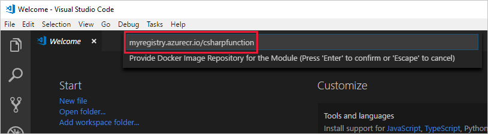
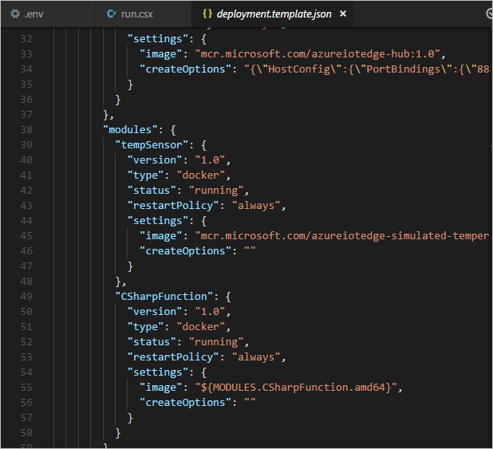
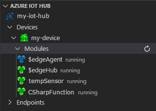

# Tutorial: Deploy Azure functions as IoT Edge modules (preview)

You can use Azure Functions to deploy code that implements your business logic directly to your Azure IoT Edge devices. This tutorial walks you through creating and deploying an Azure function that filters sensor data on the simulated IoT Edge device. You use the simulated IoT Edge device that you created in the Deploy Azure IoT Edge on a simulated device on [Windows][lnk-tutorial1-win] or [Linux][lnk-tutorial1-lin] quickstarts. In this tutorial, you learn how to:     

> [!div class="checklist"]
> * Use Visual Studio Code to create an Azure function.
> * Use VS Code and Docker to create a Docker image and publish it to a container registry.
> * Deploy the module from the container registry to your IoT Edge device.
> * View filtered data.

<center>

</center>

>[!NOTE]
>Azure Function modules on Azure IoT Edge are in [public preview](https://azure.microsoft.com/support/legal/preview-supplemental-terms/). 

The Azure function that you create in this tutorial filters the temperature data that's generated by your device. The function only sends messages upstream to Azure IoT Hub when the temperature is above a specified threshold. 

[!INCLUDE [quickstarts-free-trial-note](../../includes/quickstarts-free-trial-note.md)]

## Prerequisites

An Azure IoT Edge device:

* You can use your development machine or a virtual machine as an Edge device by following the steps in the quickstart for [Linux](quickstart-linux.md) or [Windows devices](quickstart.md).

Cloud resources:

* A free or standard-tier [IoT Hub](../iot-hub/iot-hub-create-through-portal.md) in Azure. 

Development resources:

* [Visual Studio Code](https://code.visualstudio.com/). 
* [C# for Visual Studio Code (powered by OmniSharp) extension](https://marketplace.visualstudio.com/items?itemName=ms-vscode.csharp).
* [Azure IoT Edge extension](https://marketplace.visualstudio.com/items?itemName=vsciot-vscode.azure-iot-edge) for Visual Studio Code. 
* [The .NET Core 2.1 SDK](https://www.microsoft.com/net/download).
* [Docker CE](https://docs.docker.com/install/). 

## Create a container registry

In this tutorial, you use the Azure IoT Edge extension for VS Code to build a module and create a **container image** from the files. Then you push this image to a **registry** that stores and manages your images. Finally, you deploy your image from your registry to run on your IoT Edge device.  

You can use any Docker-compatible registry for this tutorial. Two popular Docker registry services that are available in the cloud are [Azure Container Registry](https://docs.microsoft.com/azure/container-registry/) and [Docker Hub](https://docs.docker.com/docker-hub/repos/#viewing-repository-tags). This tutorial uses Azure Container Registry. 

1. In the [Azure portal](https://portal.azure.com), select **Create a resource** > **Containers** > **Container Registry**.

    

2. Provide the following values to create your container registry:

   | Field | Value | 
   | ----- | ----- |
   | Registry name | Provide a unique name. |
   | Subscription | Select a subscription from the drop-down list. |
   | Resource group | We recommend that you use the same resource group for all of the test resources that you create during the IoT Edge quickstarts and tutorials. For example, **IoTEdgeResources**. |
   | Location | Choose a location close to you. |
   | Admin user | Set to **Enable**. |
   | SKU | Select **Basic**. | 

5. Select **Create**.

6. After your container registry is created, browse to it, and then select **Access keys**. 

7. Copy the values for **Login server**, **Username**, and **Password**. You use these values later in the tutorial. 

## Create a function project

The Azure IoT Edge extension for Visual Studio Code that you installed in the prerequisites provides management capabilities as well as some code templates. In this section, you use Visual Studio Code to create an IoT Edge solution that contains an Azure function. 

1. Open Visual Studio Code on your development machine.

2. Open the VS Code command palette by selecting **View** > **Command Palette**.

3. In the command palette, enter and run the command **Azure: Sign in**. Follow the instructions to sign in your Azure account.

4. In the command palette, enter and run the command **Azure IoT Edge: New IoT Edge solution**. Follow the prompts in the command palette to create your solution.

   1. Select the folder where you want to create the solution. 
   2. Provide a name for your solution or accept the default **EdgeSolution**.
   3. Choose **Azure Functions - C#** as the module template. 
   4. Name your module **CSharpFunction**. 
   5. Specify the Azure container registry that you created in the previous section as the image repository for your first module. Replace **localhost:5000** with the login server value that you copied. The final string looks like \<registry name\>.azurecr.io/csharpfunction.

   

4. The VS Code window loads your IoT Edge solution workspace: a \.vscode folder, a modules folder, a deployment manifest template file. and a \.env file. In the VS Code explorer, open **modules** > **CSharpFunction** > **EdgeHubTrigger-Csharp** > **run.csx**.

5. Replace the contents of the **run.csx** file with the following code:

   ```csharp
   #r "Microsoft.Azure.Devices.Client"
   #r "Newtonsoft.Json"

   using System.IO;
   using Microsoft.Azure.Devices.Client;
   using Newtonsoft.Json;

   // Filter messages based on the temperature value in the body of the message and the temperature threshold value.
   public static async Task Run(Message messageReceived, IAsyncCollector<Message> output, TraceWriter log)
   {
        const int temperatureThreshold = 25;
        byte[] messageBytes = messageReceived.GetBytes();
        var messageString = System.Text.Encoding.UTF8.GetString(messageBytes);

        if (!string.IsNullOrEmpty(messageString))
        {
            // Get the body of the message and deserialize it.
            var messageBody = JsonConvert.DeserializeObject<MessageBody>(messageString);

            if (messageBody != null && messageBody.machine.temperature > temperatureThreshold)
            {
                // Send the message to the output as the temperature value is greater than the threashold.
                var filteredMessage = new Message(messageBytes);
                // Copy the properties of the original message into the new Message object.
                foreach (KeyValuePair<string, string> prop in messageReceived.Properties)
                {
                    filteredMessage.Properties.Add(prop.Key, prop.Value);                }
                // Add a new property to the message to indicate it is an alert.
                filteredMessage.Properties.Add("MessageType", "Alert");
                // Send the message.       
                await output.AddAsync(filteredMessage);
                log.Info("Received and transferred a message with temperature above the threshold");
            }
        }
    }

    //Define the expected schema for the body of incoming messages.
    class MessageBody
    {
        public Machine machine {get; set;}
        public Ambient ambient {get; set;}
        public string timeCreated {get; set;}
    }
    class Machine
    {
       public double temperature {get; set;}
       public double pressure {get; set;}         
    }
    class Ambient
    {
       public double temperature {get; set;}
       public int humidity {get; set;}         
    }
   ```

6. Save the file.

## Build your IoT Edge solution

In the previous section, you created an IoT Edge solution and added code to the **CSharpFunction** to filter out messages where the reported machine temperature is less than the acceptable threshold. Now you need to build the solution as a container image and push it to your container registry.

In this section, you provide the credentials for your container registry twice. The first is to sign in locally from your development machine so that Visual Studio Code can push images to your registry. The second is in the **.env** file of your IoT Edge solution, which gives your IoT Edge device permissions to pull images from your registry. 

1. Open the VS Code integrated terminal by selecting **View** > **Terminal**. 

1. Sign in to your container registry by entering the following command in the integrated terminal. Then you can push your module image to your Azure container registry: 
     
    ```csh/sh
    docker login -u <ACR username> <ACR login server>
    ```
    Use the username and login server that you copied from your Azure container registry earlier. When you're prompted for the password, paste the password for your container registry and press **Enter**.

    ```csh/sh
    Password: <paste in the ACR password and press enter>
    Login Succeeded
    ```

2. In the VS Code explorer, open the **deployment.template.json** file in your IoT Edge solution workspace. This file tells the IoT Edge runtime which modules to deploy to a device. Notice that your Function module, **CSharpFunction** is listed along with the **tempSensor** module that provides test data. To learn more about deployment manifests, see [Understand how IoT Edge modules can be used, configured, and reused](module-composition.md).

   

3. Open the **.env** file in your IoT Edge solution workspace. This git-ignored file stores your container registry credentials so that you don't have to put them in the deployment manifest template. Provide the **username** and **password** for your container registry. 

5. Save this file.

6. In the VS Code explorer, right-click the deployment.template.json file and select **Build and Push IoT Edge solution**. 

When you tell Visual Studio Code to build your solution, it first takes the information in the deployment template and generates a deployment.json file in a new folder named **config**. Then it runs two commands in the integrated terminal: `docker build` and `docker push`. These two commands build your code, containerize the functions, and then push the code to the container registry that you specified when you initialized the solution. 

## View your container image

Visual Studio Code outputs a success message when your container image is pushed to your container registry. If you want to confirm the successful operation for yourself, you can view the image in the registry. 

1. In the Azure portal, browse to your Azure container registry. 
2. Select **Repositories**.
3. You should see the **csharpfunction** repository in the list. Select this repository to see more details.
4. In the **Tags** section, you should see the **0.0.1-amd64** tag. This tag indicates the version and platform of the image that you built. These values are set in the module.json file in the CSharpFunction folder. 

## Deploy and run the solution

You can use the Azure portal to deploy your function module to an IoT Edge device like you did in the quickstarts. You can also deploy and monitor modules from within Visual Studio Code. The following sections use the Azure IoT Edge extension for VS Code that was listed in the prerequisites. Install the extension now, if you didn't already. 

1. Open the VS Code command palette by selecting **View** > **Command Palette**.

2. Search for and run the command **Azure: Sign in**. Follow the instructions to sign in your Azure account. 

3. In the command palette, search for and run the command **Azure IoT Hub: Select IoT Hub**. 

4. Select the subscription that has your IoT hub, and then select the IoT hub that you want to access.

5. In the VS Code explorer, expand the **Azure IoT Hub Devices** section. 

6. Right-click the name of your IoT Edge device, and then select **Create Deployment for single device**. 

7. Browse to the solution folder that contains the **CSharpFunction**. Open the config folder, select the deployment.json file, and then choose **Select Edge Deployment Manifest**.

8. Refresh the **Azure IoT Hub Devices** section. You should see the new **CSharpFunction** running along with the **TempSensor** module and the **$edgeAgent** and **$edgeHub**. 

   

## View generated data

You can see all of the messages that arrive at your IoT hub by running **Azure IoT Hub: Start Monitoring D2C Message** in the command palette.

You can also filter the view to see all of the messages that arrive at your IoT hub from a specific device. Right-click the device in the **Azure IoT Hub Devices** section and select **Start Monitoring D2C Messages**.

To stop monitoring messages, run the command **Azure IoT Hub: Stop monitoring D2C message** in the command palette. 


## Clean up resources

If you plan to continue to the next recommended article, you can keep the resources and configurations that you created and reuse them. You can also keep using the same IoT Edge device as a test device. 

Otherwise, you can delete the local configurations and the Azure resources that you created in this article to avoid charges. 

[!INCLUDE [iot-edge-clean-up-cloud-resources](../../includes/iot-edge-clean-up-cloud-resources.md)]

[!INCLUDE [iot-edge-clean-up-local-resources](../../includes/iot-edge-clean-up-local-resources.md)]


## Next steps

In this tutorial, you created an Azure function module with code to filter raw data that's generated by your IoT Edge device. When you're ready to build your own modules, you can learn more about how to [Develop Azure functions with Azure IoT Edge for Visual Studio Code](how-to-develop-csharp-function.md). 

Continue on to the next tutorials to learn other ways that Azure IoT Edge can help you turn data into business insights at the edge.

> [!div class="nextstepaction"]
> [Find averages by using a floating window in Azure Stream Analytics](tutorial-deploy-stream-analytics.md)

<!--Links-->
[lnk-tutorial1-win]: quickstart.md
[lnk-tutorial1-lin]: quickstart-linux.md
