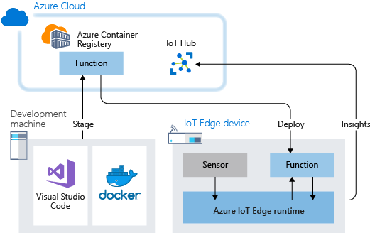

# Tutorial: Deploy Azure functions as IoT Edge modules

You can use Azure Functions to deploy code that implements your business logic directly to your Azure IoT Edge devices. This tutorial walks you through creating and deploying an Azure function that filters sensor data on the simulated IoT Edge device. You use the simulated IoT Edge device that you created in the Deploy Azure IoT Edge on a simulated device on [Windows](quickstart.md) or [Linux](quickstart-linux.md) quickstarts. In this tutorial, you learn how to:

> [!div class="checklist"]
>
> * Use Visual Studio Code to create an Azure function.
> * Use VS Code and Docker to create a Docker image and publish it to a container registry.
> * Deploy the module from the container registry to your IoT Edge device.
> * View filtered data.

<center>


</center>

The Azure function that you create in this tutorial filters the temperature data that's generated by your device. The function only sends messages upstream to Azure IoT Hub when the temperature is above a specified threshold.

[!INCLUDE [quickstarts-free-trial-note](../../includes/quickstarts-free-trial-note.md)]

## Prerequisites

Before beginning this tutorial, you should have gone through the previous tutorial to set up your development environment for Linux container development: [Develop IoT Edge modules for Linux devices](tutorial-develop-for-linux.md). By completing that tutorial, you should have the following prerequisites in place:

* A free or standard-tier [IoT Hub](../iot-hub/iot-hub-create-through-portal.md) in Azure.
* A [Linux device running Azure IoT Edge](quickstart-linux.md)
* A container registry, like [Azure Container Registry](https://docs.microsoft.com/azure/container-registry/).
* [Visual Studio Code](https://code.visualstudio.com/) configured with the [Azure IoT Tools](https://marketplace.visualstudio.com/items?itemName=vsciot-vscode.azure-iot-tools).
* [Docker CE](https://docs.docker.com/install/) configured to run Linux containers.

To develop an IoT Edge module in with Azure Functions, install the following additional prerequisites on your development machine:

* [C# for Visual Studio Code (powered by OmniSharp) extension](https://marketplace.visualstudio.com/items?itemName=ms-dotnettools.csharp).
* [The .NET Core 2.1 SDK](https://www.microsoft.com/net/download).

## Create a function project

The Azure IoT Tools for Visual Studio Code that you installed in the prerequisites provides management capabilities as well as some code templates. In this section, you use Visual Studio Code to create an IoT Edge solution that contains an Azure function.

### Create a new project

Create a C# Function solution template that you can customize with your own code.

1. Open Visual Studio Code on your development machine.

2. Open the VS Code command palette by selecting **View** > **Command Palette**.

3. In the command palette, enter and run the command **Azure IoT Edge: New IoT Edge solution**. Follow the prompts in the command palette to create your solution.

   | Field | Value |
   | ----- | ----- |
   | Select folder | Choose the location on your development machine for VS Code to create the solution files. |
   | Provide a solution name | Enter a descriptive name for your solution, like **FunctionSolution**, or accept the default. |
   | Select module template | Choose **Azure Functions - C#**. |
   | Provide a module name | Name your module **CSharpFunction**. |
   | Provide Docker image repository for the module | An image repository includes the name of your container registry and the name of your container image. Your container image is prepopulated from the last step. Replace **localhost:5000** with the login server value from your Azure container registry. You can retrieve the login server from the Overview page of your container registry in the Azure portal. The final string looks like \<registry name\>.azurecr.io/CSharpFunction. |

   

### Add your registry credentials

The environment file stores the credentials for your container registry and shares them with the IoT Edge runtime. The runtime needs these credentials to pull your private images onto the IoT Edge device.

1. In the VS Code explorer, open the .env file.
2. Update the fields with the **username** and **password** values that you copied from your Azure container registry.
3. Save this file.

### Select your target architecture

Currently, Visual Studio Code can develop C modules for Linux AMD64 and Linux ARM32v7 devices. You need to select which architecture you're targeting with each solution, because the container is built and run differently for each architecture type. The default is Linux AMD64.

1. Open the command palette and search for **Azure IoT Edge: Set Default Target Platform for Edge Solution**, or select the shortcut icon in the side bar at the bottom of the window.

2. In the command palette, select the target architecture from the list of options. For this tutorial, we're using an Ubuntu virtual machine as the IoT Edge device, so will keep the default **amd64**.

### Update the module with custom code

Let's add some additional code so that the module processes the messages at the edge before forwarding them to IoT Hub.

1. In Visual Studio Code, open **modules** > **CSharpFunction** > **CSharpFunction.cs**.

1. Replace the contents of the **CSharpFunction.cs** file with the following code. This code receives telemetry about ambient and machine temperature, and only forwards the message on to IoT Hub if the machine temperature is above a defined threshold.

   ```csharp
   using System;
   using System.Collections.Generic;
   using System.IO;
   using System.Text;
   using System.Threading.Tasks;
   using Microsoft.Azure.Devices.Client;
   using Microsoft.Azure.WebJobs;
   using Microsoft.Azure.WebJobs.Extensions.EdgeHub;
   using Microsoft.Azure.WebJobs.Host;
   using Microsoft.Extensions.Logging;
   using Newtonsoft.Json;

   namespace Functions.Samples
   {
       public static class CSharpFunction
       {
           [FunctionName("CSharpFunction")]
           public static async Task FilterMessageAndSendMessage(
               [EdgeHubTrigger("input1")] Message messageReceived,
               [EdgeHub(OutputName = "output1")] IAsyncCollector<Message> output,
               ILogger logger)
           {
               const int temperatureThreshold = 20;
               byte[] messageBytes = messageReceived.GetBytes();
               var messageString = System.Text.Encoding.UTF8.GetString(messageBytes);

               if (!string.IsNullOrEmpty(messageString))
               {
                   logger.LogInformation("Info: Received one non-empty message");
                   // Get the body of the message and deserialize it.
                   var messageBody = JsonConvert.DeserializeObject<MessageBody>(messageString);

                   if (messageBody != null && messageBody.machine.temperature > temperatureThreshold)
                   {
                       // Send the message to the output as the temperature value is greater than the threshold.
                       using (var filteredMessage = new Message(messageBytes))
                       {
                            // Copy the properties of the original message into the new Message object.
                            foreach (KeyValuePair<string, string> prop in messageReceived.Properties)
                            {filteredMessage.Properties.Add(prop.Key, prop.Value);}
                            // Add a new property to the message to indicate it is an alert.
                            filteredMessage.Properties.Add("MessageType", "Alert");
                            // Send the message.
                            await output.AddAsync(filteredMessage);
                            logger.LogInformation("Info: Received and transferred a message with temperature above the threshold");
                       }
                   }
               }
           }
       }
       //Define the expected schema for the body of incoming messages.
       class MessageBody
       {
           public Machine machine {get; set;}
           public Ambient ambient {get; set;}
           public string timeCreated {get; set;}
       }
       class Machine
       {
           public double temperature {get; set;}
           public double pressure {get; set;}
       }
       class Ambient
       {
           public double temperature {get; set;}
           public int humidity {get; set;}
       }
   }
   ```

1. Save the file.

## Build your IoT Edge solution

In the previous section, you created an IoT Edge solution and modified the **CSharpFunction** to filter out messages with reported machine temperatures below the acceptable threshold. Now you need to build the solution as a container image and push it to your container registry.

In this section, you provide the credentials for your container registry for the second time (the first was in the **.env** file of your IoT Edge solution) by signing in locally from your development machine so that Visual Studio Code can push images to your registry.

1. Open the VS Code integrated terminal by selecting **View** > **Terminal**.

2. Sign in to your container registry by entering the following command in the integrated terminal. Use the username and login server that you copied from your Azure container registry earlier.

    ```csh/sh
    docker login -u <ACR username> <ACR login server>
    ```

    When you're prompted for the password, paste the password (it won't be visible in the terminal window) for your container registry and press **Enter**.

    ```csh/sh
    Password: <paste in the ACR password and press enter>
    Login Succeeded
    ```

3. In the VS Code explorer, right-click the deployment.template.json file and select **Build and Push IoT Edge solution**.

When you tell Visual Studio Code to build your solution, it first takes the information in the deployment template and generates a deployment.json file in a new folder named **config**. Then it runs two commands in the integrated terminal: `docker build` and `docker push`. The build command builds your code and containerizes the functions. Then, the push command pushes the code to the container registry that you specified when you initialized the solution.

## View your container image

Visual Studio Code outputs a success message when your container image is pushed to your container registry. If you want to confirm the successful operation for yourself, you can view the image in the registry.

1. In the Azure portal, browse to your Azure container registry.
2. Select **Repositories**.
3. You should see the **csharpfunction** repository in the list. Select this repository to see more details.
4. In the **Tags** section, you should see the **0.0.1-amd64** tag. This tag indicates the version and platform of the image that you built. These values are set in the module.json file in the CSharpFunction folder.

## Deploy and run the solution

You can use the Azure portal to deploy your function module to an IoT Edge device like you did in the quickstarts. You can also deploy and monitor modules from within Visual Studio Code. The following sections use the Azure IoT Tools for VS Code that was listed in the prerequisites. Install the extension now, if you didn't already.

1. In the VS Code explorer, expand the **Azure IoT Hub Devices** section.

2. Right-click the name of your IoT Edge device, and then select **Create Deployment for single device**.

3. Browse to the solution folder that contains the **CSharpFunction**. Open the config folder, select the **deployment.json** file, and then choose **Select Edge Deployment Manifest**.

4. Refresh the **Azure IoT Hub Devices** section. You should see the new **CSharpFunction** running along with the **SimulatedTemperatureSensor** module and the **$edgeAgent** and **$edgeHub**. It may take a few moments for the new modules to show up. Your IoT Edge device has to retrieve its new deployment information from IoT Hub, start the new containers, and then report the status back to IoT Hub.

   

## View the generated data

You can see all of the messages that arrive at your IoT hub by running **Azure IoT Hub: Start Monitoring Built-in Event Endpoint** in the command palette.

You can also filter the view to see all of the messages that arrive at your IoT hub from a specific device. Right-click the device in the **Azure IoT Hub Devices** section and select **Start Monitoring Built-in Event Endpoint**.

To stop monitoring messages, run the command **Azure IoT Hub: Stop Monitoring Built-in Event Endpoint** in the command palette.

## Clean up resources

If you plan to continue to the next recommended article, you can keep the resources and configurations that you created and reuse them. You can also keep using the same IoT Edge device as a test device.

Otherwise, you can delete the local configurations and the Azure resources that you created in this article to avoid charges.

[!INCLUDE [iot-edge-clean-up-cloud-resources](../../includes/iot-edge-clean-up-cloud-resources.md)]

## Next steps

In this tutorial, you created an Azure function module with code to filter raw data that's generated by your IoT Edge device. When you're ready to build your own modules, you can learn more about how to [Develop with Azure IoT Edge for Visual Studio Code](how-to-vs-code-develop-module.md).

Continue on to the next tutorials to learn other ways that Azure IoT Edge can help you turn data into business insights at the edge.

> [!div class="nextstepaction"]
> [Find averages by using a floating window in Azure Stream Analytics](tutorial-deploy-stream-analytics.md)
