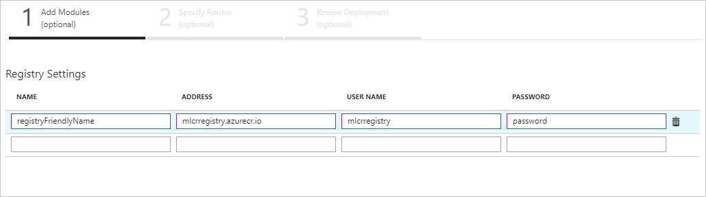
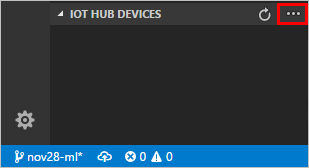
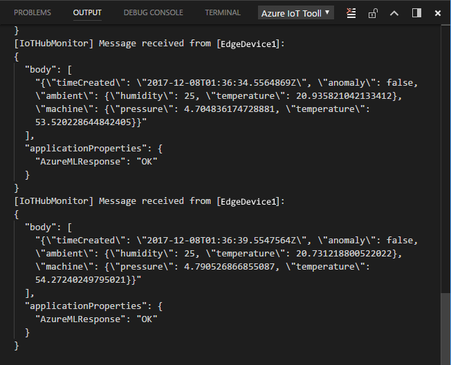

# Tutorial: Deploy Azure Machine Learning as an IoT Edge module (preview)

You can use IoT Edge modules to deploy code that implements your business logic directly to your IoT Edge devices. This tutorial walks you through deploying an Azure Machine Learning module that predicts when a device fails based on simulated machine temperature data. For more information about Azure ML on IoT Edge, see [Azure Machine Learning documentation](../machine-learning/desktop-workbench/use-azure-iot-edge-ai-toolkit.md).

The Azure Machine Learning module that you create in this tutorial reads the environmental data generated by your device and labels the messages as anomalous or not.

In this tutorial, you learn how to:

> [!div class="checklist"]
> * Create an Azure Machine Learning module
> * Push a module container to an Azure container registry
> * Deploy an Azure Machine Learning module to your IoT Edge device
> * View generated data

>[!NOTE]
>Azure Machine Learning modules on Azure IoT Edge are in public preview. 

[!INCLUDE [quickstarts-free-trial-note](../../includes/quickstarts-free-trial-note.md)]


## Prerequisites

An Azure IoT Edge device:

* You can use your development machine or a virtual machine as an Edge device by following the steps in the quickstart for [Linux](quickstart-linux.md) or [Windows devices](quickstart.md).
* The Azure Machine Learning module does not support ARM processors.

Cloud resources:

* A free or standard-tier [IoT Hub](../iot-hub/iot-hub-create-through-portal.md) in Azure. 
* An Azure Machine Learning workspace. Follow the instructions in [Prepare to deploy models on IoT Edge](../machine-learning/service/how-to-deploy-to-iot.md) to create one.


### Disable process identification

>[!NOTE]
>
> While in preview, Azure Machine Learning does not support the process identification security feature enabled by default with IoT Edge. 
> Below are the steps to disable it. This is however not suitable for use in production. These steps are only necessary on Linux, as you will have completed this during the Windows Edge runtime installation.

To disable process identification on your IoT edge device, you'll need to provide the ip address and port for **workload_uri** and **management_uri** in the **connect** section of the IoT Edge daemon configuration.

Get the IP address first. Enter `ipconfig` in your command line and copy the IP address of the **docker0** interface.

Edit the IoT Edge daemon configuration file:

```cmd/sh
sudo nano /etc/iotedge/config.yaml
```

Update the **connect** section of the configuration with your IP address. For example:
```yaml
connect:
  management_uri: "http://172.17.0.1:15580"
  workload_uri: "http://172.17.0.1:15581"
```

Enter the same addresses in the **listen** section of the configuration. For example:

```yaml
listen:
  management_uri: "http://172.17.0.1:15580"
  workload_uri: "http://172.17.0.1:15581"
```

Create an environment variable IOTEDGE_HOST with the management_uri address (To set it permanently, add it to `/etc/environment`).For example:

```cmd/sh
export IOTEDGE_HOST="http://172.17.0.1:15580"
```


## Create the Azure ML container
In this section, you download the trained model files and convert them into an Azure ML container.

Follow the instructions in the [Prepare to deploy models on IoT Edge](../machine-learning/service/how-to-deploy-to-iot.md) documentation to create a Docker container with your machine learning model.  All the components required for the Docker image are in the [AI Toolkit for Azure IoT Edge Git repo](https://github.com/Azure/ai-toolkit-iot-edge/tree/master/IoT%20Edge%20anomaly%20detection%20tutorial).

### View the container repository

Check that your container image was successfully created and stored in the Azure Container registry that is associated with your machine learning environment.

1. On the [Azure portal](https://portal.azure.com), go to **All Services** and Select **Container registries**.
2. Select your registry. The name should start with **mlcr** and it belongs to the resource group, location, and subscription that you used to set up Module Management.
3. Select **Access keys**
4. Copy the **Login server**, **Username**, and **Password**.  You need these to access the registry from your Edge devices.
5. Select **Repositories**
6. Select **machinelearningmodule**
7. You now have the full image path of the container. Take note of this image path for the next section. It should look like this:  **<registry_name>.azurecr.io/machinelearningmodule:1**

## Deploy to your device

1. On the [Azure portal](https://portal.azure.com), navigate to your IoT hub.

1. Go to **IoT Edge** and select your IoT Edge device.

1. Select **Set modules**.

1. In the **Registry Settings** section, add the credentials that you copied from your Azure container registry. 

   

1. If you've previously deployed the tempSensor module to your IoT Edge device, it may autopopulate. If it's not already in your list of modules, add it.

    1. Click **Add** and select **IoT Edge Module**.
    2. In the **Name** field, enter `tempSensor`.
    3. In the **Image URI** field, enter `mcr.microsoft.com/azureiotedge-simulated-temperature-sensor:1.0`.
    4. Select **Save**.

1. Add the machine learning module that you created.

    1. Click **Add** and select **IoT Edge Module**.
    1. In the **Name** field, enter `machinelearningmodule`
    1. In the **Image** field, enter your image address; for example `<registry_name>.azurecr.io/machinelearningmodule:1`.
    1. Select **Save**.

1. Back in the **Add Modules** step, select **Next**.

1. In the **Specify Routes** step, copy the JSON below into the text box. The first route transports messages from the temperature sensor to the machine learning module via the "amlInput" endpoint, which is the endpoint that all Azure Machine Learning modules use. The second route transports messages from the machine learning module to IoT Hub. In this route, ''amlOutput'' is the endpoint that all Azure Machine Learning modules use to output data, and ''$upstream'' denotes IoT Hub.

    ```json
    {
        "routes": {
            "sensorToMachineLearning":"FROM /messages/modules/tempSensor/outputs/temperatureOutput INTO BrokeredEndpoint(\"/modules/machinelearningmodule/inputs/amlInput\")",
            "machineLearningToIoTHub": "FROM /messages/modules/machinelearningmodule/outputs/amlOutput INTO $upstream"
        }
    }
    ```

1. Select **Next**.

1. In the **Review Deployment** step, select **Submit**.

1. Return to the device details page and select **Refresh**.  You should see the new **machinelearningmodule** running along with the **tempSensor** module and the IoT Edge runtime modules.

## View generated data

You can view messages being generated by each IoT Edge module, and you can view messages that are delivered to your IoT hub.

### View data on your IoT Edge device

On your IoT Edge device, you can view the messages being sent from every individual module. 

If you perform these commands on a Linux device, you may need to use `sudo` for elevated permissions.

1. View all modules on your IoT Edge device.

   ```cmd/sh
   iotedge list
   ```

2. View the messages being sent from a specific device. Use the module name from the output of the previous command.

   ```cmd/sh
   iotedge logs <module_name> -f
   ```

### View data arriving at your IoT hub

You can view the device-to-cloud messages that your IoT hub receives by using the [Azure IoT Toolkit extension for Visual Studio Code](https://marketplace.visualstudio.com/items?itemName=vsciot-vscode.azure-iot-toolkit).

The following steps show you how to set up Visual Studio Code to monitor device-to-cloud messages that arrive at your IoT hub. 

1. In Visual Studio Code, select **IoT Hub Devices**.

2. Select **...** then select **Set IoT Hub Connection String** from the menu.

   

3. In the text box that opens at the top of the page, enter the iothubowner connection string for your IoT Hub. Your IoT Edge device should appear in the IoT Hub Devices list.

4. Select **...** again then select **Start monitoring D2C message**.

5. Observe the messages coming from tempSensor every five seconds. The message body contains a property called **anomaly** which the machinelearningmodule provides with a true or false value. The **AzureMLResponse** property contains the value "OK" if the model ran successfully.

   

## Clean up resources 

If you plan to continue to the next recommended article, you can keep the resources and configurations that you created and reuse them. You can also keep using the same IoT Edge device as a test device. 

Otherwise, you can delete the local configurations and the Azure resources that you created in this article to avoid charges. 

[!INCLUDE [iot-edge-clean-up-cloud-resources](../../includes/iot-edge-clean-up-cloud-resources.md)]

[!INCLUDE [iot-edge-clean-up-local-resources](../../includes/iot-edge-clean-up-local-resources.md)]


## Next steps

In this tutorial, you deployed an IoT Edge module powered by Azure Machine Learning. You can continue on to any of the other tutorials to learn about other ways that Azure IoT Edge can help you turn data into business insights at the edge.

> [!div class="nextstepaction"]
> [Filter sensor data using C# code](tutorial-csharp-module.md)

<!--Links-->
[lnk-tutorial1-win]: quickstart.md
[lnk-tutorial1-lin]: quickstart-linux.md
