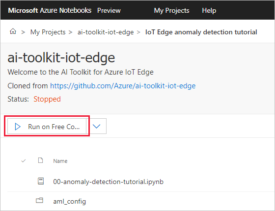

# Tutorial: Deploy Azure Machine Learning as an IoT Edge module (preview)

Use Azure Notebooks to develop a machine learning module and deploy it to a Linux device running Azure IoT Edge. 

You can use IoT Edge modules to deploy code that implements your business logic directly to your IoT Edge devices. This tutorial walks you through deploying an Azure Machine Learning module that predicts when a device fails based on simulated machine temperature data. For more information about Azure Machine Learning service on IoT Edge, see [Azure Machine Learning documentation](../machine-learning/service/how-to-deploy-to-iot.md).

The Azure Machine Learning module that you create in this tutorial reads the environmental data generated by your device and labels the messages as anomalous or not.

In this tutorial, you learn how to:

> [!div class="checklist"]
> * Create an Azure Machine Learning module
> * Push a module container to an Azure container registry
> * Deploy an Azure Machine Learning module to your IoT Edge device
> * View generated data

>[!NOTE]
>Azure Machine Learning modules on Azure IoT Edge are in public preview.

[!INCLUDE [quickstarts-free-trial-note](../../includes/quickstarts-free-trial-note.md)]


## Prerequisites

An Azure IoT Edge device:

* You can use an Azure virtual machine as an IoT Edge device by following the steps in the quickstart for [Linux](quickstart-linux.md).
* The Azure Machine Learning module doesn't support Windows containers.
* The Azure Machine Learning module doesn't support ARM processors.

Cloud resources:

* A free or standard-tier [IoT Hub](../iot-hub/iot-hub-create-through-portal.md) in Azure.
* An Azure Machine Learning workspace. Follow the instructions in [Use the Azure portal to get started with Azure Machine Learning](../machine-learning/service/quickstart-get-started.md) to create one and learn how to use it.
   * Make a note of the workspace name, resource group, and subscription ID. These values are all available on the workspace overview in the Azure portal. You'll use these values later in the tutorial to connect an Azure notebook to your workspace resources. 


## Create and deploy Azure Machine Learning module

In this section, you convert trained machine learning model files and into an Azure Machine Learning service container. All the components required for the Docker image are in the [AI Toolkit for Azure IoT Edge Git repo](https://github.com/Azure/ai-toolkit-iot-edge/tree/master/IoT%20Edge%20anomaly%20detection%20tutorial). Follow these steps to upload that repository into Microsoft Azure Notebooks to create the container and push it to Azure Container Registry.


1. Navigate to your Azure Notebooks projects. You can get there from your Azure Machine Learning service workspace in the [Azure portal](https://portal.azure.com) or by signing in to [Microsoft Azure Notebooks](https://notebooks.azure.com/home/projects) with your Azure account.

2. Select **Upload GitHub Repo**.

3. Provide the following GitHub repository name: `Azure/ai-toolkit-iot-edge`. Uncheck the **Public** box if you want to keep your project private. Select **Import**. 

4. Once the import is finished, navigate into the new **ai-toolkit-iot-edge** project and open the **IoT Edge anomaly detection tutorial** folder. 

5. Verify that your project is running. If not, select **Run on Free Compute**.

   

6. Open the **aml_config/config.json** file.

7. Edit the config file to include the values for your Azure subscription ID, a resource group in your subscription, and your Azure Machine Learning service workspace name. You can get all these values from the **Overview** section of your workspace in Azure. 

8. Save the config file.

9. Open the **00-anomaly-detection-tutorial.ipynb** file.

10. When prompted, select the **Python 3.6** kernel then select **Set Kernel**.

11. Edit the first cell in the notebook according to the instructions in the comments. Use the same resource group, subscription ID, and workspace name that you added to the config file.

12. Run the cells in the notebook by selecting them and selecting **Run** or pressing `Shift + Enter`.

    >[!TIP]
    >Some of the cells in the anomaly detection tutorial notebook are optional, because they create resources that some users may or may not have yet, like an IoT Hub. If you put your existing resource information in the first cell, you'll receive errors if you run the cells that create new resources because Azure won't create duplicate resources. This is fine, and you can ignore the errors or skip those optional sections entirely. 

By completing all the steps in the notebook, you trained an anomaly detection model, built it as a Docker container image, and pushed that image to Azure Container Registry. Then, you tested the model and finally deployed it to your IoT Edge device. 

## View container repository

Check that your container image was successfully created and stored in the Azure container registry associated with your machine learning environment. The notebook that you used in the previous section automatically provided the container image and the registry credentials to your IoT Edge device, but you should know where they're stored so that you can find the information yourself later. 

1. In the [Azure portal](https://portal.azure.com), navigate to your Machine Learning service workspace. 

2. The **Overview** section lists the workspace details as well its associated resources. Select the **Registry** value, which should be your workspace name followed by random numbers. 

3. In the container registry, select **Repositories**. You should see a repository called **tempanomalydetection** that was created by the notebook you ran in the earlier section. 

4. Select **tempanomalydetection**. You should see that the repository has one tag: **1**. 

   Now that you know the registry name, repository name, and tag, you know the full image path of the container. Image paths look like **\<registry_name\>.azurecr.io/tempanomalydetection:1**. You can use the image path to deploy this container to IoT Edge devices. 

5. In the container registry, select **Access keys**. You should see a number of access credentials, including **Login server** and the **Username**, and **Password** for an admin user.

   These credentials can be included in the deployment manifest to give your IoT Edge device access to pull container images from the registry. 

Now you know where the Machine Learning container image is stored. The next section walks through steps to view the container running as a module on your IoT Edge device. 

## View generated data

You can view messages being generated by each IoT Edge module, and you can view messages that are delivered to your IoT hub.

### View data on your IoT Edge device

On your IoT Edge device, you can view the messages being sent from every individual module.

You may need to use `sudo` for elevated permissions to run `iotedge` commands. Signing out and signing back in to your device automatically updates your permissions.

1. View all modules on your IoT Edge device.

   ```cmd/sh
   iotedge list
   ```

2. View the messages being sent from a specific device. Use the module name from the output of the previous command.

   ```cmd/sh
   iotedge logs <module_name> -f
   ```

### View data arriving at your IoT hub

You can view the device-to-cloud messages that your IoT hub receives by using the [Azure IoT Hub Toolkit extension for Visual Studio Code](https://marketplace.visualstudio.com/items?itemName=vsciot-vscode.azure-iot-toolkit) (formerly Azure IoT Toolkit extension).

The following steps show you how to set up Visual Studio Code to monitor device-to-cloud messages that arrive at your IoT hub.

1. In Visual Studio Code, select **IoT Hub Devices**.

2. Select **...** then select **Set IoT Hub Connection String** from the menu.

   

3. In the text box that opens at the top of the page, enter the iothubowner connection string for your IoT Hub. Your IoT Edge device should appear in the IoT Hub Devices list.

4. Select **...** again then select **Start Monitoring Built-in Event Endpoint**.

5. Observe the messages coming from tempSensor every five seconds. The message body contains a property called **anomaly**, which the machinelearningmodule provides with a true or false value. The **AzureMLResponse** property contains the value "OK" if the model ran successfully.

   

## Clean up resources

If you plan to continue to the next recommended article, you can keep the resources and configurations that you created and reuse them. You can also keep using the same IoT Edge device as a test device.

Otherwise, you can delete the local configurations and the Azure resources that you created in this article to avoid charges.

[!INCLUDE [iot-edge-clean-up-cloud-resources](../../includes/iot-edge-clean-up-cloud-resources.md)]

## Next steps

In this tutorial, you deployed an IoT Edge module powered by Azure Machine Learning. You can continue on to any of the other tutorials to learn about other ways that Azure IoT Edge can help you turn data into business insights at the edge.

> [!div class="nextstepaction"]
> [Classify images with Custom Vision service](tutorial-deploy-custom-vision.md)

