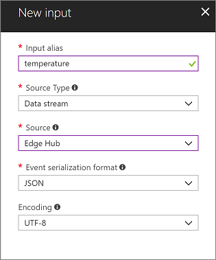
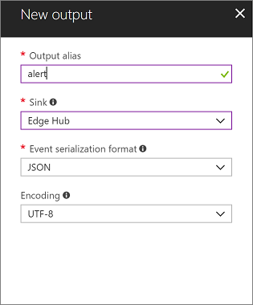

# Tutorial: Deploy Azure Stream Analytics as an IoT Edge module (preview)

Many IoT solutions use analytics services to gain insight about data as it arrives in the cloud from the IoT devices. With Azure IoT Edge, you can take [Azure Stream Analytics][azure-stream] logic and move it onto the device itself. By processing telemetry streams at the edge, you can reduce the amount of uploaded data and reduce the time it takes to react to actionable insights.

Azure IoT Edge and Azure Stream Analytics are integrated so that you can create an Azure Stream Analytics job in the Azure portal and then deploy it as an IoT Edge module with no additional code.  

Azure Stream Analytics provides a richly structured query syntax for data analysis both in the cloud and on IoT Edge devices. For more information about Azure Stream Analytics on IoT Edge, see [Azure Stream Analytics documentation](../stream-analytics/stream-analytics-edge.md).

The Stream Analytics module in this tutorial calculates the average temperature over a rolling 30-second window. When that average reaches 70, the module sends and alert for the device to take action. In this case, that action is to reset the simulated temperature sensor. In a production environment, you might use this functionality to shut off a machine or take preventative measures when the temperature reaches dangerous levels. 

In this tutorial, you learn how to:

> [!div class="checklist"]
> * Create an Azure Stream Analytics job to process data on the edge.
> * Connect the new Azure Stream Analytics job with other IoT Edge modules.
> * Deploy the Azure Stream Analytics job to an IoT Edge device from the Azure portal.

>[!NOTE]
>Azure Stream Analytics modules for IoT Edge are in [public preview](https://azure.microsoft.com/support/legal/preview-supplemental-terms/).

[!INCLUDE [quickstarts-free-trial-note](../../includes/quickstarts-free-trial-note.md)]

## Prerequisites

An Azure IoT Edge device:

* You can use your development machine or a virtual machine as an Edge device by following the steps in the quickstart for [Linux](quickstart-linux.md) or [Windows devices](quickstart.md).

Cloud resources:

* A standard-tier [IoT Hub](../iot-hub/iot-hub-create-through-portal.md) in Azure. 


## Create an Azure Stream Analytics job

In this section, you create an Azure Stream Analytics job to take data from your IoT hub, query the sent telemetry data from your device, and then forward the results to an Azure Blob storage container. For more information, see the "Overview" section of the [Stream Analytics documentation][azure-stream]. 

### Create a storage account

An Azure Storage account is required for Azure Stream Analytics jobs, to act as an endpoint for the job output. The example in this section uses the Blob storage type. For more information, see the "Blobs" section of the [Azure Storage documentation][azure-storage].

1. In the Azure portal, go to **Create a resource**, enter **Storage account** in the search box, and then select **Storage account - blob, file, table, queue**.

1. In the **Create storage account** pane, enter a name for your storage account, select the same location where your IoT hub is stored, select the same resource group as your IoT hub, and then select **Create**. Note the name for later use.

    ![Create a storage account][1]


### Create a Stream Analytics job

1. In the Azure portal, go to **Create a resource** > **Internet of Things**, and then select **Stream Analytics Job**.

1. In the **New Stream Analytics Job** pane, perform the following steps:

   1. In the **Job name** box, type a job name.
   
   1. Use the same **Resource group** and **Location** as your IoT hub. 

      > [!NOTE]
      > Currently, Azure Stream Analytics jobs on IoT Edge aren't supported in the West US 2 region. 

   1. Under **Hosting environment**, select **Edge**.
    
1. Select **Create**.

1. In the created job, under **Job Topology**, open **Inputs**.

   

1. Select **Add stream input**, then select **Edge Hub**.

1. In the **New input** pane, enter **temperature** as the input alias. 

1. Select **Save**.

1. Under **Job Topology**, open **Outputs**.

   

1. Select **Add**, then select **Edge Hub**.

1. In the **New output** pane, enter **alert** as the output alias. 

1. Select **Save**.

1. Under **Job Topology**, select **Query**, and then replace the default text with the following query that creates an alert if the average machine temperature in a 30 second window reaches 70 degrees:

    ```sql
    SELECT  
        'reset' AS command 
    INTO 
       alert 
    FROM 
       temperature TIMESTAMP BY timeCreated 
    GROUP BY TumblingWindow(second,30) 
    HAVING Avg(machine.temperature) > 70
    ```

1. Select **Save**.

1. Under **Configure**, select **IoT Edge settings**.

1. Select your **Storage account** from the drop-down menu.

1. For the **Container** field, select **Create new** and provide a name for the storage container. 

1. Select **Save**. 


## Deploy the job

You are now ready to deploy the Azure Stream Analytics job on your IoT Edge device.

1. In the Azure portal, in your IoT hub, go to **IoT Edge**, and then open the details page for your IoT Edge device.

1. Select **Set modules**.  

   If you previously deployed the tempSensor module on this device, it might autopopulate. If it does not, add the module the following steps:

   1. Click **Add** and select **IoT Edge Module**.
   1. For the name, type **tempSensor**.
   1. For the image URI, enter **mcr.microsoft.com/azureiotedge-simulated-temperature-sensor:1.0**. 
   1. Leave the other settings unchanged.
   1. Select **Save**.

1. Add your Azure Stream Analytics Edge job with the following steps:

   1. Click **Add** and select **Azure Stream Analytics Module**.
   1. Select your subscription and the Azure Stream Analytics Edge job that you created. 
   1. Select **Save**.

1. Select **Next**.

1. Replace the default value in **Routes** with the following code. Update _{moduleName}_ with the name of your Azure Stream Analytics module. The module should have the same name as the job that it was created from. 

    ```json
    {
        "routes": {
            "telemetryToCloud": "FROM /messages/modules/tempSensor/* INTO $upstream",
            "alertsToCloud": "FROM /messages/modules/{moduleName}/* INTO $upstream",
            "alertsToReset": "FROM /messages/modules/{moduleName}/* INTO BrokeredEndpoint(\"/modules/tempSensor/inputs/control\")",
            "telemetryToAsa": "FROM /messages/modules/tempSensor/* INTO BrokeredEndpoint(\"/modules/{moduleName}/inputs/temperature\")"
        }
    }
    ```

1. Select **Next**.

1. In the **Review Deployment** step, select **Submit**.

1. Return to the device details page, and then select **Refresh**.  

    You should see the new Stream Analytics module running, along with the IoT Edge agent module and the IoT Edge hub.

    ![Module output][7]

## View data

Now you can go to your IoT Edge device to check out the interaction between the Azure Stream Analytics module and the tempSensor module.

1. Check that all the modules are running in Docker:

   ```cmd/sh
   iotedge list  
   ```
<!--
   ![Docker output][8]
-->
1. View all system logs and metrics data. Use the Stream Analytics module name:

   ```cmd/sh
   iotedge logs -f {moduleName}  
   ```

You should be able to watch the machine's temperature gradually rise until it reaches 70 degrees for 30 seconds. Then the Stream Analytics module triggers a reset, and the machine temperature drops back to 21. 

   ![Docker log][9]

## Clean up resources 

If you plan to continue to the next recommended article, you can keep the resources and configurations that you created and reuse them. You can also keep using the same IoT Edge device as a test device. 

Otherwise, you can delete the local configurations and the Azure resources that you created in this article to avoid charges. 
 
[!INCLUDE [iot-edge-clean-up-cloud-resources](../../includes/iot-edge-clean-up-cloud-resources.md)]

[!INCLUDE [iot-edge-clean-up-local-resources](../../includes/iot-edge-clean-up-local-resources.md)]


## Next steps

In this tutorial, you configured an Azure Streaming Analytics job to analyze data from your IoT Edge device. You then loaded this Azure Stream Analytics module on your IoT Edge device to process and react to temperature increase locally, as well as sending the aggregated data stream to the cloud. To see how Azure IoT Edge can create more solutions for your business, continue on to the other tutorials.

> [!div class="nextstepaction"] 
> [Deploy an Azure Machine Learning model as a module][lnk-ml-tutorial]

<!-- Images. -->
[1]: ./media/tutorial-deploy-stream-analytics/storage.png
[4]: ./media/tutorial-deploy-stream-analytics/add_device.png
[5]: ./media/tutorial-deploy-stream-analytics/asa_job.png
[6]: ./media/tutorial-deploy-stream-analytics/set_module.png
[7]: ./media/tutorial-deploy-stream-analytics/module_output2.png
[8]: ./media/tutorial-deploy-stream-analytics/docker_output.png
[9]: ./media/tutorial-deploy-stream-analytics/docker_log.png
[10]: ./media/tutorial-deploy-stream-analytics/storage_settings.png
[11]: ./media/tutorial-deploy-stream-analytics/temp_module.png


<!-- Links -->
[lnk-what-is-iot-edge]: what-is-iot-edge.md
[lnk-module-dev]: module-development.md
[iot-hub-get-started-create-hub]: ../../includes/iot-hub-get-started-create-hub.md
[azure-iot]: https://docs.microsoft.com/azure/iot-hub/
[azure-storage]: https://docs.microsoft.com/azure/storage/
[azure-stream]: https://docs.microsoft.com/azure/stream-analytics/
[lnk-free-trial]: http://azure.microsoft.com/pricing/free-trial/
[lnk-quickstart-win]: quickstart.md
[lnk-quickstart-lin]: quickstart-linux.md
[lnk-module-tutorial]: tutorial-csharp-module.md
[lnk-ml-tutorial]: tutorial-deploy-machine-learning.md

