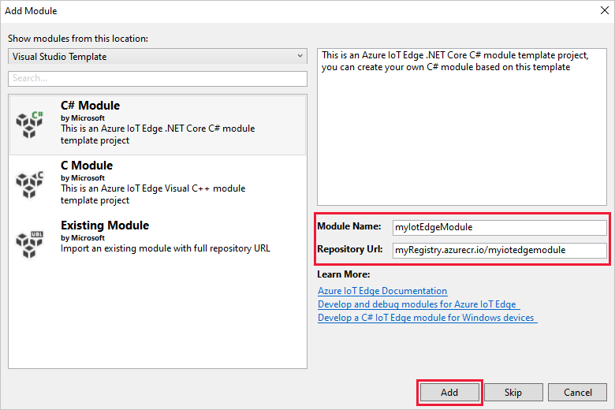
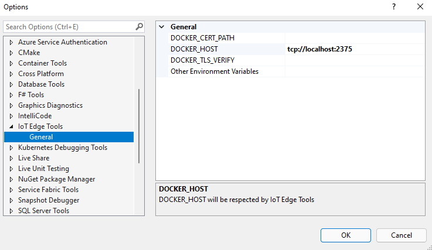
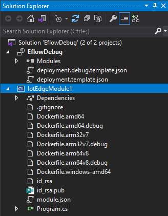
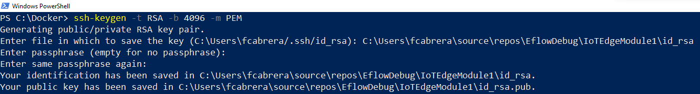
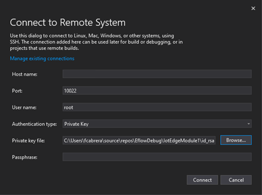
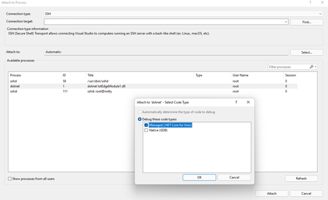
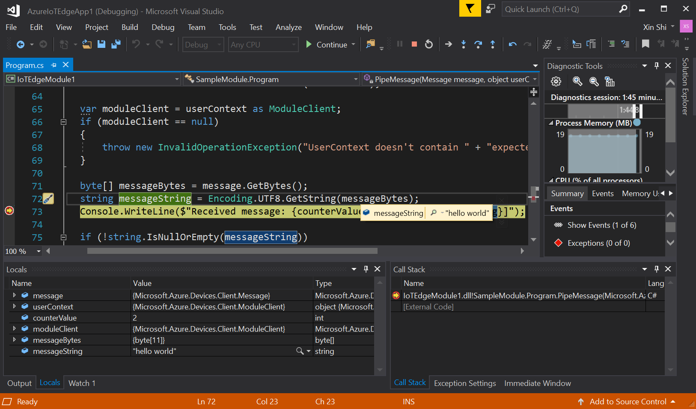

# Tutorial: Develop IoT Edge modules with Linux containers using IoT Edge for Linux on Windows

[!INCLUDE [iot-edge-version-1.4](includes/iot-edge-version-1.4.md)]

Use Visual Studio 2019 to develop, debug and deploy code to devices running IoT Edge for Linux on Windows.

This tutorial walks through developing, debugging and deploying your own code to an IoT Edge device using IoT Edge for Linux on Windows. This article is a useful prerequisite for the other tutorials, which go into more detail about specific programming languages or Azure services.

This tutorial uses the example of deploying a **C# module to a Linux device**. This example was chosen because it's the most common developer scenario for IoT Edge solutions. Even if you plan on using a different language or deploying an Azure service, this tutorial is still useful to learn about the development tools and concepts. Complete this introduction to the development process, then choose your preferred language or Azure service to dive into the details.

In this tutorial, you learn how to:

> [!div class="checklist"]
>
> * Set up your development machine.
> * Use the IoT Edge tools for Visual Studio Code to create a new project.
> * Build your project as a container and store it in an Azure container registry.
> * Deploy your code to an IoT Edge device.

## Prerequisites

This article assumes that you use a machine running Windows as your development machine. On Windows computers, you can develop either Windows or Linux modules. This tutorial will guide you through the development of **Linux containers**, using [IoT Edge for Linux on Windows](./iot-edge-for-linux-on-windows.md) for building and deploying the modules. 

* Install [IoT Edge for Linux on Windows (EFLOW)](./how-to-provision-single-device-linux-on-windows-x509.md)
* Quickstart: [Deploy your first IoT Edge module to a Windows device](./quickstart.md)
* [.NET Core SDK](https://dotnet.microsoft.com/download).

Install Visual Studio on your development machine. Make sure you include the **Azure development** and **Desktop development with C#** workloads in your Visual Studio 2019 installation. You can [Modify Visual Studio 2019](/visualstudio/install/modify-visual-studio?view=vs-2019&preserve-view=true) to add the required workloads.

After your Visual Studio 2019 is ready, you also need the following tools and components:

* Download and install [Azure IoT Edge Tools](https://marketplace.visualstudio.com/items?itemName=vsc-iot.vs16iotedgetools) from the Visual Studio marketplace to create an IoT Edge project in Visual Studio 2019.

  > [!TIP]
  > If you are using Visual Studio 2017, download and install [Azure IoT Edge Tools for VS 2017](https://marketplace.visualstudio.com/items?itemName=vsc-iot.vsiotedgetools) from the Visual Studio marketplace

Cloud resources:

* A free or standard-tier [IoT hub](../iot-hub/iot-hub-create-through-portal.md) in Azure.

[!INCLUDE [quickstarts-free-trial-note](../../includes/quickstarts-free-trial-note.md)]

### Check your tools version

1. From the **Extensions** menu, select **Manage Extensions**. Expand **Installed > Tools** and you can find **Azure IoT Edge Tools for Visual Studio** and **Cloud Explorer for Visual Studio**.

1. Note the installed version. You can compare this version with the latest version on Visual Studio Marketplace ([Cloud Explorer](https://marketplace.visualstudio.com/items?itemName=ms-azuretools.CloudExplorerForVS2019), [Azure IoT Edge](https://marketplace.visualstudio.com/items?itemName=vsc-iot.vs16iotedgetools))

1. If your version is older than what's available on Visual Studio Marketplace, update your tools in Visual Studio as shown in the following section.

> [!NOTE]
> If you are using Visual Studio 2022, [Cloud Explorer](/visualstudio/azure/vs-azure-tools-resources-managing-with-cloud-explorer?view=vs-2022&preserve-view=true) is retired. To deploy Azure IoT Edge modules, use [Azure CLI](how-to-deploy-modules-cli.md) or [Azure portal](how-to-deploy-modules-portal.md).

### Update your tools

1. In the **Manage Extensions** window, expand **Updates > Visual Studio Marketplace**, select **Azure IoT Edge Tools** or **Cloud Explorer for Visual Studio** and select **Update**.

1. After the tools update is downloaded, close Visual Studio to trigger the tools update using the VSIX installer.

1. In the installer, select **OK** to start and then **Modify** to update the tools.

1. After the update is complete, select **Close** and restart Visual Studio.


## Key concepts

This tutorial walks through the development of an IoT Edge module. An *IoT Edge module*, or sometimes just *module* for short, is a container with executable code. You can deploy one or more modules to an IoT Edge device. Modules perform specific tasks like ingesting data from sensors, cleaning and analyzing data, or sending messages to an IoT hub. For more information, see [Understand Azure IoT Edge modules](iot-edge-modules.md).

When developing IoT Edge modules, it's important to understand the difference between the development machine and the target IoT Edge device where the module will eventually be deployed. The container that you build to hold your module code must match the operating system (OS) of the *target device*. For example, the most common scenario is someone developing a module on a Windows computer intending to target a Linux device running IoT Edge. In that case, the container operating system would be Linux. As you go through this tutorial, keep in mind the difference between the *development machine OS* and the *container OS*. For this tutorial, you'll be using your Windows host for development and the IoT Edge for Linux on Windows (EFLOW) VM for building and deploying the modules. 

This tutorial targets devices running IoT Edge with Linux containers. You can use your preferred operating system as long as your development machine runs Linux containers. We recommend using Visual Studio to develop with Linux containers, so that's what this tutorial will use. You can use Visual Studio Code as well, although there are differences in support between the two tools. For more information, refer to [Develop Azure IoT Edge modules using Visual Studio Code](./tutorial-develop-for-linux.md).


## Set up docker-cli and Docker engine remote connection

IoT Edge modules are packaged as containers, so you need a container engine on your development machine to build and manage them. The EFLOW virtual machine already contains an instance of Docker engine, so this tutorial will guide on how to remotely connect from the Windows developer machine to the EFLOW VM Docker instance. By using this, we remove the dependency on Docker Desktop for Windows.

The first step is to configure docker-cli on the Windows development machine to be able to connect to the remote docker engine. 

1. Download the precompiled **docker.exe** version of the docker-cli from [docker-cli Chocolatey](https://download.docker.com/win/static/stable/x86_64/docker-20.10.12.zip). You can also download the official **cli** project from [docker/cli GitHub](https://github.com/docker/cli) and compile it following the repo instructions.
2. Extract the **docker.exe** to a directory in your development machine. For example, _C:\Docker\bin_
3. Open **About your PC** -> **System Info** -> **Advanced system settings**
4. Select **Advanced** -> **Environment variables** -> Under **User variables** check **Path**
5. Edit the **Path** variable and add the location of the **docker.exe**
6. Open an elevated PowerShell session
7. Check that Docker CLI is accessible using the command
   ```powershell
   docker --version
   ```
If everything was successfully configurated, the previous command should output the docker version, something like _Docker version 20.10.12, build e91ed57_. 

The second step is to configure the EFLOW virtual machine Docker engine to accept external connections, and add the appropriate firewall rules. 

>[!WARNING]
>Exposing Docker engine to external connections may increase security risks. This configuration should only be used for development purposes. Make sure to revert the configuration to default settings after development is finished.

1. Open an elevated PowerShell session and run the following commands

    ```powershell
   # Configure the EFLOW virtual machine Docker engine to accept external connections, and add the appropriate firewall rules.
   Invoke-EflowVmCommand "sudo iptables -A INPUT -p tcp --dport 2375 -j ACCEPT"

   # Create a copy of the EFLOW VM _docker.service_ in the system folder.
   Invoke-EflowVmCommand "sudo cp /lib/systemd/system/docker.service /etc/systemd/system/docker.service"

   # Replace the service execution line to listen for external connections.
   Invoke-EflowVmCommand "sudo sed -i 's/-H fd:\/\// -H fd:\/\/ -H tcp:\/\/0.0.0.0:2375/g'  /etc/systemd/system/docker.service"

   # Reload the EFLOW VM services configurations.
   Invoke-EflowVmCommand "sudo systemctl daemon-reload"

   # Reload the Docker engine service.
   Invoke-EflowVmCommand "sudo systemctl restart docker.service"

   # Check that the Docker engine is listening to external connections.
   Invoke-EflowVmCommand "sudo netstat -lntp | grep dockerd"
    ```

   The following is example output.

   ```output
   PS C:\> # Configure the EFLOW virtual machine Docker engine to accept external connections, and add the appropriate firewall rules.
   PS C:\> Invoke-EflowVmCommand "sudo iptables -A INPUT -p tcp --dport 2375 -j ACCEPT"
   PS C:\>
   PS C:\> # Create a copy of the EFLOW VM docker.service in the system folder.
   PS C:\> Invoke-EflowVmCommand "sudo cp /lib/systemd/system/docker.service /etc/systemd/system/docker.service"
   PS C:\>
   PS C:\> # Replace the service execution line to listen for external connections.
   PS C:\> Invoke-EflowVmCommand "sudo sed -i 's/-H fd:\/\// -H fd:\/\/ -H tcp:\/\/0.0.0.0:2375/g' /etc/systemd/system/docker.service"
   PS C:\>
   PS C:\> # Reload the EFLOW VM services configurations.
   PS C:\> Invoke-EflowVmCommand "sudo systemctl daemon-reload"
   PS C:\>
   PS C:\> # Reload the Docker engine service.
   PS C:\> Invoke-EflowVmCommand "sudo systemctl restart docker.service"
   PS C:\>
   PS C:\> # Check that the Docker engine is listening to external connections.
   PS C:\> Invoke-EflowVmCommand "sudo netstat -lntp | grep dockerd"
   tcp6       0      0 :::2375                 :::*                    LISTEN      2790/dockerd
   ```


1. The final step is to test the Docker connection to the EFLOW VM Docker engine. First, you will need the EFLOW VM IP address.
   ```powershell
   Get-EflowVmAddr
   ```
   >[!TIP]
   >If the EFLOW VM was deployed without Static IP, the IP address may change across Windows host OS reboots or networking changes. Make sure you are using the correct EFLOW VM IP address every time you want to establish a remote Docker engine connection. 

   The following is example output.

   ```output
   PS C:\> Get-EflowVmAddr
   [03/15/2022 15:22:30] Querying IP and MAC addresses from virtual machine (DESKTOP-J1842A1-EFLOW)
    - Virtual machine MAC: 00:15:5d:6f:da:78
    - Virtual machine IP : 172.31.24.105 retrieved directly from virtual machine
   00:15:5d:6f:da:78
   172.31.24.105 
   ```

1. Using the obtained IP address, connect to the EFLOW VM Docker engine, and run the Hello-World sample container. Replace \<EFLOW-VM-IP\> with the EFLOW VM IP address obtained in the previous step.
   ```powershell
   docker -H tcp://<EFLOW-VM-IP>:2375 run --rm hello-world
   ```
   You should see that the container is being downloaded, and after will run and output the following.

    ```output
    PS C:\> docker -H tcp://172.31.24.105:2375 run --rm hello-world
    Unable to find image 'hello-world:latest' locally
    latest: Pulling from library/hello-world
    2db29710123e: Pull complete
    Digest: sha256:4c5f3db4f8a54eb1e017c385f683a2de6e06f75be442dc32698c9bbe6c861edd
    Status: Downloaded newer image for hello-world:latest
    
    Hello from Docker!
    This message shows that your installation appears to be working correctly.
    
    To generate this message, Docker took the following steps:
     1. The Docker client contacted the Docker daemon.
     2. The Docker daemon pulled the "hello-world" image from the Docker Hub.
        (amd64)
     3. The Docker daemon created a new container from that image which runs the
        executable that produces the output you are currently reading.
     4. The Docker daemon streamed that output to the Docker client, which sent it
        to your terminal.
    
    To try something more ambitious, you can run an Ubuntu container with:
     $ docker run -it ubuntu bash
    
    Share images, automate workflows, and more with a free Docker ID:
     https://hub.docker.com/
    
    For more examples and ideas, visit:
     https://docs.docker.com/get-started/
    ```

## Create an Azure IoT Edge project

The IoT Edge project template in Visual Studio creates a solution that can be deployed to IoT Edge devices. First you create an Azure IoT Edge solution, and then you generate the first module in that solution. Each IoT Edge solution can contain more than one module.

> [!TIP]
> The IoT Edge project structure created by Visual Studio is not the same as in Visual Studio Code.

1. In Visual Studio, create a new project.

1. On the **Create a new project** page, search for **Azure IoT Edge**. Select the project that matches the platform (Linux IoT Edge module) and architecture for your IoT Edge device, and select **Next**.

   :::image type="content" source="./media/how-to-visual-studio-develop-module/create-new-project.png" alt-text="Create New Project":::

1. On the **Configure your new project** page, enter a name for your project and specify the location, then select **Create**.

1. On the **Add Module** window, select the type of module you want to develop. You can also select **Existing module** to add an existing IoT Edge module to your deployment. Specify your module name and module image repository.

   Visual Studio autopopulates the repository URL with **localhost:5000/<module name\>**. If you use a local Docker registry for testing, then **localhost** is fine. If you use Azure Container Registry, then replace **localhost:5000** with the log in server from your registry's settings. The login server looks like **_\<registry name\>_.azurecr.io**.The final result should look like **\<*registry name*\>.azurecr.io/_\<module name\>_**.

   Select **Add** to add your module to the project.

   

Now, you have an IoT Edge project and an IoT Edge module in your Visual Studio solution.

The module folder contains a file for your module code, named either `Program.cs` or `main.c` depending on the language you chose. This folder also contains a file named `module.json` that describes the metadata of your module. Various Docker files provide the information needed to build your module as a Windows or Linux container.

The project folder contains a list of all the modules included in that project. Right now it should show only one module, but you can add more.

The project folder also contains a file named `deployment.template.json`. This file is a template of an IoT Edge deployment manifest, which defines all the modules that will run on a device along with how they'll communicate with each other. For more information about deployment manifests, see [Learn how to deploy modules and establish routes](module-composition.md). If you open this deployment template, you see that the two runtime modules, **edgeAgent** and **edgeHub** are included, along with the custom module that you created in this Visual Studio project. A fourth module named **SimulatedTemperatureSensor** is also included. This default module generates simulated data that you can use to test your modules, or delete if it's not necessary. To see how the simulated temperature sensor works, view the [SimulatedTemperatureSensor.csproj source code](https://github.com/Azure/iotedge/tree/master/edge-modules/SimulatedTemperatureSensor).

### Set IoT Edge runtime version

The IoT Edge extension defaults to the latest stable version of the IoT Edge runtime when it creates your deployment assets. Currently, the latest stable version is version 1.2. If you're developing modules for devices running the 1.1 long-term support version or the earlier 1.0 version, update the IoT Edge runtime version in Visual Studio to match.

1. In the Solution Explorer, right-click the name of your project and select **Set IoT Edge runtime version**.

   :::image type="content" source="./media/how-to-visual-studio-develop-module/set-iot-edge-runtime-version.png" alt-text="Right-click your project name and select set IoT Edge runtime version.":::

1. Use the drop-down menu to choose the runtime version that your IoT Edge devices are running, then select **OK** to save your changes.

1. Re-generate your deployment manifest with the new runtime version. Right-click the name of your project and select **Generate deployment for IoT Edge**.

> [!WARNING]
> If you are changing the IoT Edge runtime version, make sure the _deployment templates_ reflect the necessary changes. Currently, there's a known issue with Azure IoT Edge Tools that won't change the _"schemVersion"_ inside the _"properties.desired"_ object of _"$edgeHub"_ module (last section of the json file). 


### Set up Visual Studio 2019 remote Docker engine instance

Use the Azure IoT Edge tools extensions for Visual Studio Code to IoT Edge modules and configure it to use the remote Docker engine running inside the EFLOW virtual machine. 

1. Select **Tools** -> **Azure IoT Edge tools** -> **IoT Edge tools settings...**

1. Replace the _DOCKER\_HOST_ localhost value with the EFLOW VM IP address. If you don't remember the IP address, use the EFLOW PowerShell cmdlet `Get-EflowVmAddr` to obtain it. For exmaple, if the EFLOW VM IP address is _172.20.1.100_, then the new value should be _tcp://172.20.1.100:2375_.

   

1. Select **OK**

## Develop your module

When you add a new module, it comes with default code that is ready to be built and deployed to a device so that you can start testing without touching any code. The module code is located within the module folder in a file named `Program.cs` (for C#) or `main.c` (for C).

The default solution is built so that the simulated data from the **SimulatedTemperatureSensor** module is routed to your module, which takes the input and then sends it to IoT Hub.

When you're ready to customize the module template with your own code, use the [Azure IoT Hub SDKs](../iot-hub/iot-hub-devguide-sdks.md) to build other modules that address the key needs for IoT solutions such as security, device management, and reliability.


## Build and push a single module

Typically, you'll want to test and debug each module before running it within an entire solution with multiple modules. Because the solution will be build or debug using the Docker engine running inside the EFLOW VM, the first step will be building and publishing the module to enable remote debugging. 

1. In **Solution Explorer**, right-click the module folder and select **Set as StartUp Project** from the menu.

   

1. To debug the C# Linux module, we need to update Dockerfile.amd64.debug to enable SSH service. Update the Dockerfile.amd64.debug file to use the following template: [Dockerfile for Azure IoT Edge AMD64 C# Module with Remote Debug Support](https://raw.githubusercontent.com/Azure/iotedge-eflow/main/debugging/Dockerfile.amd64.debug).

   > [!NOTE]
   > When choosing **Debug**, Visual Studio uses `Dockerfile.(amd64|windows-amd64).debug` to build Docker images. This includes the .NET Core command-line debugger VSDBG in your container image while building it. For production-ready IoT Edge modules, we recommend that you use the **Release** configuration, which uses `Dockerfile.(amd64|windows-amd64)` without VSDBG.
   
   >[!WARNING]
   > Make sure the last line of the template _ENTRYPOINT ["dotnet", "IotEdgeModule1.dll"]_ the name of the DLL matches the name of your IoT Edge module project.


   

1. To establish an SSH connection with the Linux module, we need to create an RSA key. Open an elevated PowerShell session and run the following commands to create a new RSA key. Make sure you save the RSA key under the same IoT Edge module folder, and the name of the key is _id\_rsa_.
   
   ```cmd
   ssh-keygen -t RSA -b 4096 -m PEM
   ```

   

1. If you're using a private registry like Azure Container Registry (ACR), use the following Docker command to sign in to it.  You can get the username and password from the **Access keys** page of your registry in the Azure portal. If you're using local registry, you can [run a local registry](https://docs.docker.com/registry/deploying/#run-a-local-registry).

   ```cmd
   docker -H tcp://<EFLOW-VM-IP>:2375 login -u <ACR username> -p <ACR password> <ACR login server>
   ```
1. In **Solution Explorer**, right-click the project folder and select **Build and Push IoT Edge Modules** to build and push the Docker image for each module.


## Deploy and debug the solution

1. If you're using a private registry like Azure Container Registry, you need to add your registry login information to the runtime settings found in the file `deployment.template.json`. Replace the placeholders with your actual ACR admin username, password, and registry name.

    ```json
          "settings": {
            "minDockerVersion": "v1.25",
            "loggingOptions": "",
            "registryCredentials": {
              "registry1": {
                "username": "<username>",
                "password": "<password>",
                "address": "<registry name>.azurecr.io"
              }
            }
          }
    ```

   >[!NOTE]
   >This article uses admin login credentials for Azure Container Registry, which are convenient for development and test scenarios. When you're ready for production scenarios, we recommend a least-privilege authentication option like service principals. For more information, see [Manage access to your container registry](production-checklist.md#manage-access-to-your-container-registry).

1. It's necessary to expose port 22 to access the module SSH service. This tutorial uses 10022 as the host port, but you may specify a different port, which will be used as an SSH port to connect into the Linux C# module. You need to add the SSH port information to the "createOptions" of this Linux module setting found in the file `deployment.debug.template.json`. 

    ```json
         "createOptions": {
            "HostConfig": {
               "Privileged": true,
               "PortBindings": {
                     "22/tcp": [
                        {
                           "HostPort": "10022"
                        }
                     ]
               }
            }
         }
    ```

1.  In **Solution Explorer**, right-click the project folder and select **Generate Deployment for IoT Edge** to build the new IoT Edge deployment json.

1. Open **Cloud Explorer** by clicking **View** > **Cloud Explorer**. Make sure you've logged in to Visual Studio 2019.

1. In **Cloud Explorer**, expand your subscription, find your Azure IoT Hub and the Azure IoT Edge device you want to deploy.

1. Right-click on the IoT Edge device and choose **Create deployment**. Navigate to the debug deployment manifest configured for your platform located in the **config** folder in your Visual Studio solution, such as `deployment.amd64.json`.

1. In **Cloud Explorer**, right-click your edge device and refresh to see the new module running along with **$edgeAgent** and **$edgeHub** modules.

1. Using and elevated PowerShell session run the following commands

   1. Get the moduleId based on the name used for the Linux C# module. Make sure to replace the _\<iot-edge-module-name\>_ placeholder with your module's name.
   
      ```powershell
      $moduleId = Invoke-EflowVmCommand "sudo docker ps -aqf name=<iot-edge-module-name>"
      ```

   1. Check that the $moduleId is correct - If the variable is empty, make sure you're using the correct module name

   1. Start the SSH service inside the Linux container
      
      ```powershell
      Invoke-EflowVmCommand "sudo docker exec -it -d $moduleId service ssh start"
      ```
   1. Open the module SSH port on the EFLOW VM (this tutorial uses port 10022)

      ```powershell
      Invoke-EflowVmCommand "sudo iptables -A INPUT -p tcp --dport 10022 -j ACCEPT"
      ```
   >[!WARNING]
   >For security reasons, every time the EFLOW VM reboots, the IP table rule will delete and go back to the original settings. Also, the module SSH service will have to be started again manually.

1. After successfully starting SSH service, select **Debug** -> **Attach to Process**, set Connection Type to SSH, and Connection target to the IP address of your EFLOW VM. If you don't know the EFLOW VM IP, you can use the `Get-EflowVmAddr` PowerShell cmdlet. First, type the IP and then press enter. In the pop-up window, input the following configurations:

   | Field               | Value                                                             |
   |---------------------|-------------------------------------------------------------------|
   | **Hostname**            | Use the EFLOW VM IP                                           |
   | **Port**                | 10022 (Or the one you used in your deployment configuration)  |
   | **Username**            | root                                                          |
   | **Authentication type** | Private Key                                                   |
   | **Private Key File**    | Full path to the id_rsa that was previously created in Step 5 |
   | **Passphrase**          | The one used for the key created in Step 5                    |


   

1. After successfully connecting to the module using SSH, then you can choose the process and select Attach. For the C# module you need to choose process dotnet and **Attach to** to Managed (CoreCLR). It may take 10/C20 seconds the first time you do so.

   [  ](./media/tutorial-develop-for-linux-on-windows/attach-process.png#lightbox)

1. Set a breakpoint to inspect the module.

   * If developing in C#, set a breakpoint in the `PipeMessage()` function in **ModuleBackgroundService.cs**.
   * If using C, set a breakpoint in the `InputQueue1Callback()` function in **main.c**.

1. The output of the **SimulatedTemperatureSensor** should be redirected to **input1** of the custom Linux C# module. The breakpoint should be triggered. You can watch variables in the Visual Studio **Locals** window.

   

1. Press **Ctrl + F5** or select the stop button to stop debugging.

## Clean up resources

If you plan to continue to the next recommended article, you can keep the resources and configurations that you created and reuse them. You can also keep using the same IoT Edge device as a test device.

Otherwise, you can delete the local configurations and the Azure resources that you used in this article to avoid charges.

[!INCLUDE [iot-edge-clean-up-cloud-resources](includes/iot-edge-clean-up-cloud-resources.md)]

## Next steps

In this tutorial, you set up Visual Studio on your development machine and deployed and debugged your first IoT Edge module from it. Now that you know the basic concepts, try adding functionality to a module so that it can analyze the data passing through it.

> [!div class="nextstepaction"]
> [Develop Azure IoT Edge modules using Visual Studio Code](tutorial-develop-for-linux.md)
