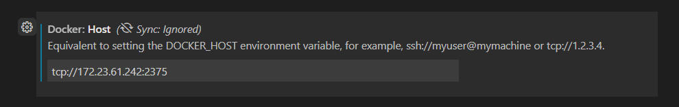
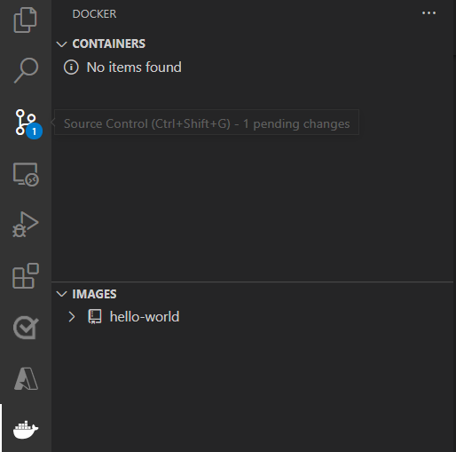

# Tutorial: Develop IoT Edge modules with Linux containers using IoT Edge for Linux on Windows

[!INCLUDE [iot-edge-version-all-supported](../../includes/iot-edge-version-all-supported.md)]

Use Visual Studio Code to develop and deploy code to devices running IoT Edge for Linux on Windows.

In the quickstart, you created an IoT Edge device and deployed a module from the Azure Marketplace. This tutorial walks through developing and deploying your own code to an IoT Edge device using IoT Edge for Linux on Windows. This article is a useful prerequisite for the other tutorials, which go into more detail about specific programming languages or Azure services.

This tutorial uses the example of deploying a **C# module to a Linux device**. This example was chosen because it's the most common developer scenario for IoT Edge solutions. Even if you plan on using a different language or deploying an Azure service, this tutorial is still useful to learn about the development tools and concepts. Complete this introduction to the development process, then choose your preferred language or Azure service to dive into the details.

In this tutorial, you learn how to:

> [!div class="checklist"]
>
> * Set up your development machine.
> * Use the IoT Edge tools for Visual Studio Code to create a new project.
> * Build your project as a container and store it in an Azure container registry.
> * Deploy your code to an IoT Edge device.

## Prerequisites

A development machine:

* Install [IoT Edge for Linux on Windows](./how-to-provision-single-device-linux-on-windows-x509.md)
* Install [Git](https://git-scm.com/), to pull module template packages later in this tutorial.
* [C# for Visual Studio Code (powered by OmniSharp) extension](https://marketplace.visualstudio.com/items?itemName=ms-dotnettools.csharp).
* [.NET Core 2.1 SDK](https://dotnet.microsoft.com/download/dotnet/2.1).

Cloud resources:

* A free or standard-tier [IoT hub](../iot-hub/iot-hub-create-through-portal.md) in Azure.

[!INCLUDE [quickstarts-free-trial-note](../../includes/quickstarts-free-trial-note.md)]


## Key concepts

This tutorial walks through the development of an IoT Edge module. An *IoT Edge module*, or sometimes just *module* for short, is a container with executable code. You can deploy one or more modules to an IoT Edge device. Modules perform specific tasks like ingesting data from sensors, cleaning and analyzing data, or sending messages to an IoT hub. For more information, see [Understand Azure IoT Edge modules](iot-edge-modules.md).

When developing IoT Edge modules, it's important to understand the difference between the development machine and the target IoT Edge device where the module will eventually be deployed. The container that you build to hold your module code must match the operating system (OS) of the *target device*. For example, the most common scenario is someone developing a module on a Windows computer intending to target a Linux device running IoT Edge. In that case, the container operating system would be Linux. As you go through this tutorial, keep in mind the difference between the *development machine OS* and the *container OS*. For the purpose of this tutorial, you will be using your Windows host for development and the EFLOW VM for building and deploying the modules. 

This tutorial targets devices running IoT Edge with Linux containers. You can use your preferred operating system as long as your development machine runs Linux containers. We recommend using Visual Studio Code to develop with Linux containers, so that's what this tutorial will use. You can use Visual Studio as well, although there are differences in support between the two tools.

The following table lists the supported development scenarios for **Linux containers** in Visual Studio Code and Visual Studio.

|   | Visual Studio Code | Visual Studio 2017/2019 |
| - | ------------------ | ------------------ |
| **Linux device architecture** | Linux AMD64 <br> Linux ARM32 <br> Linux ARM64 | Linux AMD64 <br> Linux ARM32 <br> Linux ARM64 |
| **Azure services** | Azure Functions <br> Azure Stream Analytics <br> Azure Machine Learning |   |
| **Languages** | C <br> C# <br> Java <br> Node.js <br> Python | C <br> C# |
| **More information** | [Azure IoT Edge for Visual Studio Code](https://marketplace.visualstudio.com/items?itemName=vsciot-vscode.azure-iot-edge) | [Azure IoT Edge Tools for Visual Studio 2017](https://marketplace.visualstudio.com/items?itemName=vsc-iot.vsiotedgetools) <br> [Azure IoT Edge Tools for Visual Studio 2019](https://marketplace.visualstudio.com/items?itemName=vsc-iot.vs16iotedgetools) |

This tutorial teaches the development steps for Visual Studio Code. If you would rather use Visual Studio, refer to the instructions in [Use Visual Studio 2019 to develop and debug modules for Azure IoT Edge](how-to-visual-studio-develop-module.md).


## Set up Docker-cli and engine remote connection

IoT Edge modules are packaged as containers, so you need a container engine on your development machine to build and manage them. The EFLOW virtual machine already contains an instance of Docker engine, so this tutorial will guide on how to remotely connect from the Windows developer machine to the EFLOW VM Docker instance. By using this, we remove the dependency on Docker Desktop for Windows.

The first step is to configure docker-cli on the Windows development machine to be able to connect to the remote docker engine. 

1. Download the precompiled **docker.exe** version of the docker-cli from [docker-cli-builder GitHub](https://github.com/StefanScherer/docker-cli-builder). You can also download the official **cli** project from [docker/cli GitHub](https://github.com/docker/cli) and compile it following the repo instructions.
2. Copy the **docker.exe** to a directory in your development machine. E.g. _C:\Docker\bin_
3. Open **System Properties**
4. Select **Advanced** -> **Environment variables** -> **Path**
5. Edit the **Path** variable and add the location of the **docker.exe**
6. Open an elevated PowerShell session
7. Check that Docker cli is accessible using the command
   ```powerhsell
   docker --version
   ```
If everything was successfully configurated, the previous command should output the docker version, something like _Docker version 20.10.9, build c2ea9bc90_. 

The second step is to configure the EFLOW virutal machine Docker engine to accept external connections, and add the appropiate firewall rules. 

>[!WARNING]
>Exposing Docker engine to external connections may increase security risks. This configuration should only be used for development purposes. Make sure to revert the configuration to default settings after development is finished.

1. Open an elevated PowerShell session.
2. Add the appropiate firewall to open Docker 2375 port inside the EFLOW VM.
   ```powershell
   Invoke-EflowVmCommand "sudo iptables -A INPUT -p tcp --dport 2375 -j ACCEPT"
   ```
3. Create copy of the EFLOW VM _docker.service_ to the system folder.
   ```powershell
   Invoke-EflowVmCommand "sudo cp /lib/systemd/system/docker.service /etc/systemd/system/docker.service"
   ```
4. Replace service execution line to listen external connections.
   ```powershell
   Invoke-EflowVmCommand "sudo sed -i 's/-H fd:\/\// -H fd:\/\/ -H tcp:\/\/0.0.0.0:2375/g'  /etc/systemd/system/docker.service"
   ```
5. Reload the EFLOW VM services configurations.
   ```powershell
   Invoke-EflowVmCommand "sudo systemctl daemon-reload"
   ```
6. Reload the Docker engine service.
    ```powershell
   Invoke-EflowVmCommand "sudo systemctl restart docker.service"
   ```
7. Check Docker engine is listening to external connections.
   ```powershell
   Invoke-EflowVmCommand "sudo netstat -lntp | grep dockerd"
   ```

If everything was sucessfully configurated, the previous command should output the dockerd service network status. Should be something like:  `tcp6       0      0 :::2375                 :::*                    LISTEN      3752/dockerd`.

The final step is to test the Docker connection to the EFLOW VM Docker engine. 

1. Open an elevated PowerShell session.
2. Get the EFLOW VM IP address.
  ```powershell
   Get-EflowVmAddr
   ```
3. Using the obtained IP address, connect to the EFLOW VM Docker engine, and run the Hello-World sample container.
  ```powershell
   docker -H tcp://<eflow-vm-ip>:2375 run --rm hello-world
   ```
You should see that the continer is being downloaded, and after will run and output: _"Hello from Docker!"_.


## Set up VS Code and tools

Use the IoT extensions for Visual Studio Code to develop IoT Edge modules. These extensions provide project templates, automate the creation of the deployment manifest, and allow you to monitor and manage IoT Edge devices. In this section, you install Visual Studio Code and the IoT extension, then set up your Azure account to manage IoT Hub resources from within Visual Studio Code.

1. Install [Visual Studio Code](https://code.visualstudio.com/) on your development machine.

2. Once the installation is finished, select **View** > **Extensions**.

3. Search for **Azure IoT Tools**, which is actually a collection of extensions that help you interact with IoT Hub and IoT devices, as well as developing IoT Edge modules.

4. Select **Install**. Each included extension installs individually.

5. When the extensions are done installing, open the command palette by selecting **View** > **Command Palette**.

6. In the command palette, search for and select **Azure: Sign in**. Follow the prompts to sign in to your Azure account.

7. In the command palette again, search for and select **Azure IoT Hub: Select IoT Hub**. Follow the prompts to select your Azure subscription and IoT hub.

8. Open the explorer section of Visual Studio Code by either selecting the icon in the activity bar on the left, or by selecting **View** > **Explorer**.

9. At the bottom of the explorer section, expand the collapsed **Azure IoT Hub / Devices** menu. You should see the devices and IoT Edge devices associated with the IoT hub that you selected through the command palette.

   

10. Select **View** > **Extensions**.

11. Search for **Docker**, which is actually a tool that help you create, manage and debug containerized applications.

12. Select **Install**.

13. Search and select the **Docker** icon on the left bar to open the **Docker** panel.

14. In the first **CONTAINERS** tile, select the (?) button and then select **Edit settings...**

15. Search for **Docker: Host** section and add (_tcp://<eflow-vm-ip>:2375_) the EFLOW VM IP address for the remote Docker engine connection.

   

16. Go back to the **Docker** panel and in the first **CONTAINERS** tile, select the &#8634; refresh button

If everything is correctly configurated, you should be able to see the contianers running inside the EFLOW VM, if any, and the recent downloaded _hello-world_ image. 

   

[!INCLUDE [iot-edge-create-container-registry](../../includes/iot-edge-create-container-registry.md)]