# Tutorial: Develop IoT Edge modules for Linux devices

Use Visual Studio Code to develop and deploy code to Linux devices running IoT Edge. 

In the quickstart articles, you created an IoT Edge device using a Linux virtual machine and deployed a pre-built module from the Azure Marketplace. This tutorial walks through what it takes to develop and deploy your own code to an IoT Edge device. This tutorial is a useful prerequisite for all the other tutorials, which will go into more detail about specific programming languages or Azure services. 

This tutorial uses the example of deploying a **C# module to a Linux device**. This example was chosen because it is the most common developer scenario on for IoT Edge solutions. Even if you plan on using a different language or deploying an Azure service, this tutorial will still be useful to learn about the development tools and concepts. After completing this introduction to the development process, then you can choose your preferred language or Azure service to dive into the details. 

In this tutorial, you learn how to:

> [!div class="checklist"]
> * Set up your development machine.
> * Use the IoT Edge tools for Visual Studio Code to create a new project.
> * Build your project as a container and store it in an Azure container registry.
> * Deploy your code to an IoT Edge device. 


[!INCLUDE [quickstarts-free-trial-note](../../includes/quickstarts-free-trial-note.md)]


## Key concepts

This tutorial walks through the development of an IoT Edge module. An *IoT Edge module*, or sometimes just *module* for short, is a container that contains executable code. You can deploy one or more modules to an IoT Edge device. Modules perform specific tasks like ingesting data from sensors, performing data analytics or data cleaning operations, or sending messages to an IoT hub. For more information, see [Understand Azure IoT Edge modules](iot-edge-modules.md).

When developing IoT Edge modules, it's important to understand the difference between the development machine and the target IoT Edge device where the module will eventually be deployed. The container that you build to hold your module code must match the operating system (OS) of the *target device*. For example, the most common scenario is someone developing a module on a Windows computer intending to target a Linux device running IoT Edge. In that case, the container operating system would be Linux. As you go through this tutorial, keep in mind the difference between the *development machine OS* and the *container OS*.

This tutorial targets Linux devices running IoT Edge. You can use your preferred development machine operating system, as long as your development machine can run Linux containers. We recommend using Visual Studio Code to develop for Linux devices, so that's what this tutorial will use. You can use Visual Studio as well, although there are differences in support between the two tools.

The following table lists the supported development scenarios for **Linux containers** in Visual Studio Code and Visual Studio.

|   | Visual Studio Code | Visual Studio 2017/2019 |
| - | ------------------ | ------------------ |
| **Linux device architecture** | Linux AMD64 <br> Linux ARM32 | Linux AMD64 <br> Linux ARM32 |
| **Azure services** | Azure Functions <br> Azure Stream Analytics <br> Azure Machine Learning |   |
| **Languages** | C <br> C# <br> Java <br> Node.js <br> Python | C <br> C# |
| **More information** | [Azure IoT Edge for Visual Studio Code](https://marketplace.visualstudio.com/items?itemName=vsciot-vscode.azure-iot-edge) | [Azure IoT Edge Tools for Visual Studio 2017](https://marketplace.visualstudio.com/items?itemName=vsc-iot.vsiotedgetools) <br> [Azure IoT Edge Tools for Visual Studio 2019](https://marketplace.visualstudio.com/items?itemName=vsc-iot.vs16iotedgetools) |

This tutorial teaches the development steps for Visual Studio Code. If you would rather use Visual Studio, refer to the instructions in [Use Visual Studio 2019 to develop and debug modules for Azure IoT Edge](how-to-visual-studio-develop-module.md).

## Prerequisites

A development machine:

* You can use your own computer or a virtual machine, depending on your development preferences.
* Most operating systems that can run a container engine can be used to develop IoT Edge modules for Linux devices. This tutorial uses a Windows computer, but points out known differences on MacOS or Linux. 
* Install [Git](https://git-scm.com/), to pull module template packages later in this tutorial.  
* [C# for Visual Studio Code (powered by OmniSharp) extension](https://marketplace.visualstudio.com/items?itemName=ms-vscode.csharp).
* [.NET Core 2.1 SDK](https://www.microsoft.com/net/download).

An Azure IoT Edge device on Linux:

* We recommend that you don't run IoT Edge on your development machine, but instead use a separate device. This distinction between development machine and IoT Edge device more accurately mirrors a true deployment scenario, and helps to keep the different concepts straight.
* If you don't have a second device available, use the quickstart article to create an IoT Edge device in Azure with a [Linux virtual machine](quickstart-linux.md).

Cloud resources:

* A free or standard-tier [IoT hub](../iot-hub/iot-hub-create-through-portal.md) in Azure. 

## Install container engine

IoT Edge modules are packaged as containers, so you need a container engine on your development machine to build and manage the containers. We recommend using Docker Desktop for development because of its many features and popularity as a container engine. With Docker Desktop on a Windows device, you can switch between Linux containers and Windows containers so that you can easily develop modules for different types of IoT Edge devices. 

Use the Docker documentation to install on your development machine: 

* [Install Docker Desktop for Windows](https://docs.docker.com/docker-for-windows/install/)

  * When you install Docker Desktop for Windows, you're asked whether you want to use Linux or Windows containers. This decision can be changed at any time using an easy switch. For this tutorial, we use Linux containers because our modules are targeting Linux devices. For more information, see [Switch between Windows and Linux containers](https://docs.docker.com/docker-for-windows/#switch-between-windows-and-linux-containers).

* [Install Docker Desktop for Mac](https://docs.docker.com/docker-for-mac/install/)

* Read [About Docker CE](https://docs.docker.com/install/) for installation information on several Linux platforms.

## Set up VS Code and tools

Use the IoT extensions for Visual Studio Code to develop IoT Edge modules. These extensions provide project templates, automate the creation of the deployment manifest, and allow you to monitor and manage IoT Edge devices. In this section, you install Visual Studio Code and the IoT extension, then set up your Azure account to manage IoT Hub resources from within Visual Studio Code. 

1. Install [Visual Studio Code](https://code.visualstudio.com/) on your development machine. 

2. Once the installation is finished, select **View** > **Extensions**. 

3. Search for **Azure IoT Tools**, which is actually a collection of extensions that help you interact with IoT Hub and IoT devices, as well as developing IoT Edge modules. 

4. Select **Install**. Each included extension installs individually. 

5. When the extensions are done installing, open the command palette by selecting **View** > **Command Palette**. 

6. In the command palette, search for and select **Azure: Sign in**. Follow the prompts to sign in to your Azure account. 

7. In the command palette again, search for and select **Azure IoT Hub: Select IoT Hub**. Follow the prompts to select your Azure subscription and IoT hub. 

7. Open the explorer section of Visual Studio Code by either selecting the icon in the activity bar on the left, or by selecting **View** > **Explorer**. 

8. At the bottom of the explorer section, expand the collapsed **Azure IoT Hub Devices** menu. You should see the devices and IoT Edge devices associated with the IoT hub that you selected through the command palette. 

   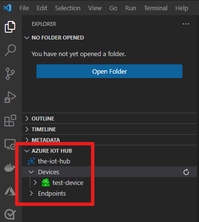

[!INCLUDE [iot-edge-create-container-registry](../../includes/iot-edge-create-container-registry.md)]

## Create a new module project

The Azure IoT Tools extension provides project templates for all supported IoT Edge module languages in Visual Studio Code. These templates have all the files and code that you need to deploy a working module to test IoT Edge, or give you a starting point to customize the template with your own business logic. 

For this tutorial, we use the C# module template because it is the most commonly used template. 

### Create a project template

In the Visual Studio Code command palette, search for and select **Azure IoT Edge: New IoT Edge Solution**. Follow the prompts and use the following values to create your solution: 

   | Field | Value |
   | ----- | ----- |
   | Select folder | Choose the location on your development machine for VS Code to create the solution files. |
   | Provide a solution name | Enter a descriptive name for your solution or accept the default **EdgeSolution**. |
   | Select module template | Choose **C# Module**. |
   | Provide a module name | Accept the default **SampleModule**. |
   | Provide Docker image repository for the module | An image repository includes the name of your container registry and the name of your container image. Your container image is prepopulated from the name you provided in the last step. Replace **localhost:5000** with the login server value from your Azure container registry. You can retrieve the login server from the Overview page of your container registry in the Azure portal. <br><br> The final image repository looks like \<registry name\>.azurecr.io/samplemodule. |
 
   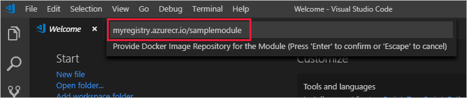

Once your new solution loads in the Visual Studio Code window, take a moment to familiarize yourself with the files that it created: 

* The **.vscode** folder contains a file called **launch.json**, which is used for debugging modules.
* The **modules** folder contains a folder for each module in your solution. Right now, that should only be **SampleModule**, or whatever name you gave to the module. The SampleModule folder contains the main program code, the module metadata, and several Docker files. 
* The **.env** file holds the credentials to your container registry. These credentials are shared with your IoT Edge device so that it has access to pull the container images. 
* The **deployment.debug.template.json** file and **deployment.template.json** file are templates that help you create a deployment manifest. A *deployment manifest* is a file that defines exactly which modules you want deployed on a device, how they should be configured, and how they can communicate with each other and the cloud. The template files use pointers for some values. When you transform the template into a true deployment manifest, the pointers are replaced with values taken from other solution files. Locate the two common placeholders in your deployment template: 

  * In the registry credentials section, the address is autofilled from the information you provided when you created the solution. However, the username and password reference the variables stored in the .env file. This is for security, as the .env file is git ignored, but the deployment template is not. 
  * In the SampleModule section, the container image isn't filled in even though you provided the image repository when you created the solution. This placeholder points to the **module.json** file inside the SampleModule folder. If you go to that file, you'll see that the image field does contain the repository, but also a tag value that is made up of the version and the platform of the container. You can iterate the version manually as part of your development cycle, and you select the container platform using a switcher that we introduce later in this section. 

### Provide your registry credentials to the IoT Edge agent

The environment file stores the credentials for your container registry and shares them with the IoT Edge runtime. The runtime needs these credentials to pull your container images onto the IoT Edge device. 

The IoT Edge extension tries to pull your container registry credentials from Azure and populate them in the environment file. Check to see if your credentials are already included. If not, add them now:

1. Open the **.env** file in your module solution. 
2. Add the **username** and **password** values that you copied from your Azure container registry.
3. Save your changes to the .env file. 

### Select your target architecture

Currently, Visual Studio Code can develop C# modules for Linux AMD64 and ARM32v7 devices. You need to select which architecture you're targeting with each solution, because that affects how the container is built and runs. The default is Linux AMD64. 

1. Open the command palette and search for **Azure IoT Edge: Set Default Target Platform for Edge Solution**, or select the shortcut icon in the side bar at the bottom of the window. 

   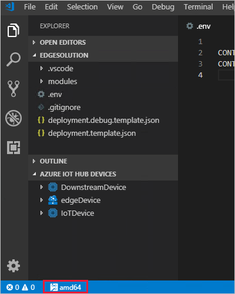

2. In the command palette, select the target architecture from the list of options. For this tutorial, we're using an Ubuntu virtual machine as the IoT Edge device, so will keep the default **amd64**. 

### Review the sample code

The solution template that you created includes sample code for an IoT Edge module. This sample module simply receives messages and then passes them on. The pipeline functionality demonstrates an important concept in IoT Edge, which is how modules communicate with each other.

Each module can have multiple *input* and *output* queues declared in their code. The IoT Edge hub running on the device routes messages from the output of one module into the input of one or more modules. The specific language for declaring inputs and outputs varies between languages, but the concept is the same across all modules. For more information about routing between modules, see [Declare routes](module-composition.md#declare-routes).

The sample C# code that comes with the project template uses the [ModuleClient Class](https://docs.microsoft.com/dotnet/api/microsoft.azure.devices.client.moduleclient?view=azure-dotnet) from the IoT Hub SDK for .NET. 

1. Open the **Program.cs** file, which is inside the **modules/SampleModule/** folder. 

2. In program.cs, find the **SetInputMessageHandlerAsync** method.

2. The [SetInputMessageHandlerAsync](https://docs.microsoft.com/dotnet/api/microsoft.azure.devices.client.moduleclient.setinputmessagehandlerasync?view=azure-dotnet) method sets up an input queue to receive incoming messages. Review this method and see how it initializes an input queue called **input1**. 

   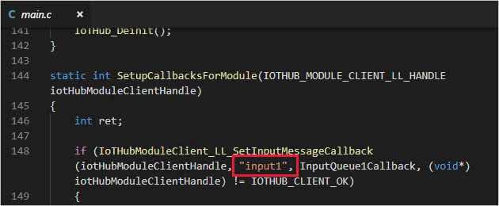

3. Next, find the **SendEventAsync** method.

4. The [SendEventAsync](https://docs.microsoft.com/dotnet/api/microsoft.azure.devices.client.moduleclient.sendeventasync?view=azure-dotnet) method processes received messages and sets up an output queue to pass them along. Review this method and see that it initializes an output queue called **output1**. 

   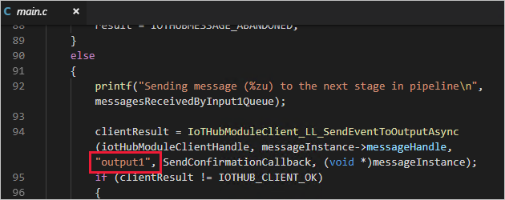

6. Open the **deployment.template.json** file.

7. Find the **modules** property of the $edgeAgent desired properties. 

   There should be two modules listed here. The first is **tempSensor**, which is included in all the templates by default to provide simulated temperature data that you can use to test your modules. The second is the **SampleModule** module that you created as part of this solution.

7. At the bottom of the file, find the desired properties for the **$edgeHub** module. 

   One of the functions of the IoT Edge hub module is to route messages between all the modules in a deployment. Review the values in the **routes** property. The first route, **SampleModuleToIoTHub**, uses a wildcard character (**\***) to indicate any messages coming from any output queues in the SampleModule module. These messages go into *$upstream*, which is a reserved name that indicates IoT Hub. The second route, sensorToSampleModule, takes messages coming from the tempSensor module and routes them to the *input1* input queue that you saw initialized in the SampleModule code. 

   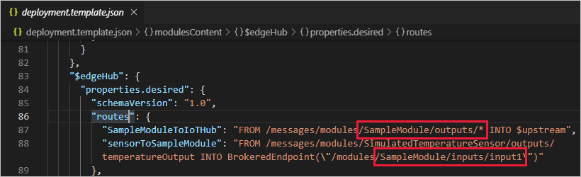

## Build and push your solution

You've reviewed the module code and the deployment template to understand some key deployment concepts. Now, you're ready to build the SampleModule container image and push it to your container registry. With the IoT tools extension for Visual Studio Code, this step also generates the deployment manifest based on the information in the template file and the module information from the solution files. 

### Sign in to Docker

Provide your container registry credentials to Docker so that it can push your container image to be stored in the registry. 

1. Open the Visual Studio Code integrated terminal by selecting **View** > **Terminal**.

2. Sign in to Docker with the Azure container registry credentials that you saved after creating the registry. 

   ```cmd/sh
   docker login -u <ACR username> -p <ACR password> <ACR login server>
   ```

   You may receive a security warning recommending the use of `--password-stdin`. While that best practice is recommended for production scenarios, it's outside the scope of this tutorial. For more information, see the [docker login](https://docs.docker.com/engine/reference/commandline/login/#provide-a-password-using-stdin) reference.

### Build and push 

Visual Studio Code now has access to your container registry, so it's time to turn the solution code into a container image. 

1. In the Visual Studio Code explorer, right-click the **deployment.template.json** file and select **Build and Push IoT Edge Solution**. 

   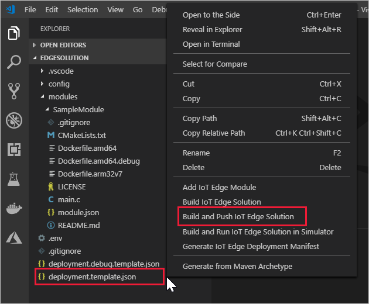

   The build and push command starts three operations. First, it creates a new folder in the solution called **config** that holds the full deployment manifest, built out of information in the deployment template and other solution files. Second, it runs `docker build` to build the container image based on the appropriate dockerfile for your target architecture. Then, it runs `docker push` to push the image repository to your container registry. 

   This process may take several minutes the first time, but is faster the next time that you run the commands. 

2. Open the **deployment.amd64.json** file in newly created config folder. The filename reflects the target architecture, so it will be different if you chose a different architecture.

3. Notice that the two parameters that had placeholders now are filled in with their proper values. The **registryCredentials** section has your registry username and password pulled from the .env file. The **SampleModule** has the full image repository with the name, version, and architecture tag from the module.json file. 

4. Open the **module.json** file in the SampleModule folder. 

5. Change the version number for the module image. (The version, not the $schema-version.) For example, increment the patch version number to **0.0.2** as though we had made a small fix in the module code. 

   >[!TIP]
   >Module versions enable version control, and allow you to test changes on a small set of devices before deploying updates to production. If you don't increment the module version before building and pushing, then you overwrite the repository in your container registry. 

6. Save your changes to the module.json file.

7. Right-click the **deployment.template.json** file again, and again select **Build and Push IoT Edge Solution**.

8. Open the **deployment.amd64.json** file again. Notice that a new file wasn't created when you ran the build and push command again. Rather, the same file was updated to reflect the changes. The SampleModule image now points to the 0.0.2 version of the container. 

9. To further verify what the build and push command did, go to the [Azure portal](https://portal.azure.com) and navigate to your container registry. 

10. In your container registry, select **Repositories** then **samplemodule**. Verify that both versions of the image were pushed to the registry.

    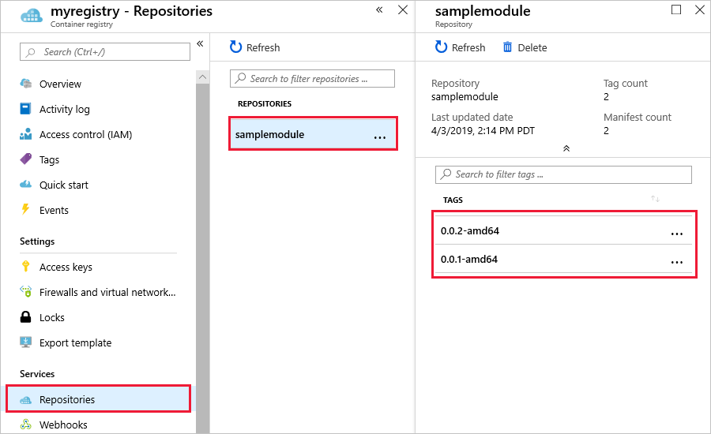

<!--Alternative steps: Use VS Code Docker tools to view ACR images with tags-->

### Troubleshoot

If you encounter errors when building and pushing your module image, it often has to do with Docker configuration on your development machine. Use the following checks to review your configuration: 

* Did you run the `docker login` command using the credentials that you copied from your container registry? These credentials are different than the ones that you use to sign in to Azure. 
* Is your container repository correct? Does it have your correct container registry name and your correct module name? Open the **module.json** file in the SampleModule folder to check. The repository value should look like **\<registry name\>.azurecr.io/samplemodule**. 
* If you used a different name than **SampleModule** for your module, is that name consistent throughout the solution?
* Is your machine running the same type of containers that you're building? This tutorial is for Linux IoT Edge devices, so Visual Studio Code should say **amd64** or **arm32v7** in the side bar, and Docker Desktop should be running Linux containers.  

## Deploy modules to device

You verified that the built container images are stored in your container registry, so it's time to deploy them to a device. Make sure that your IoT Edge device is up and running. 

1. In the Visual Studio Code explorer, expand the Azure IoT Hub Devices section. 

2. Right-click the IoT Edge device that you want to deploy to, then select **Create Deployment for Single Device**. 

   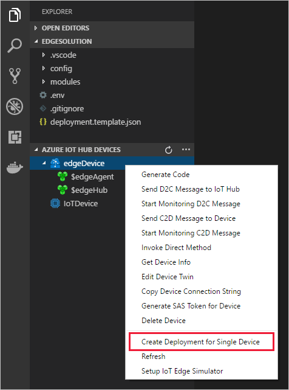

3. In the file explorer, navigate into the **config** folder then select the **deployment.amd64.json** file. 

   Do not use the deployment.template.json file, which doesn't have the container registry credentials or module image values in it. If you're targeting a Linux ARM32 device, the deployment manifest will be named deployment.arm32v7.json. 

4. Expand the details for your IoT Edge device, then expand the **Modules** list for your device. 

5. Use the refresh button to update the device view until you see the tempSensor and SampleModule modules running on your device. 

   It may take a few minutes for both modules to start. The IoT Edge runtime needs to receive its new deployment manifest, pull down the module images from the container runtime, then start each new module. 

   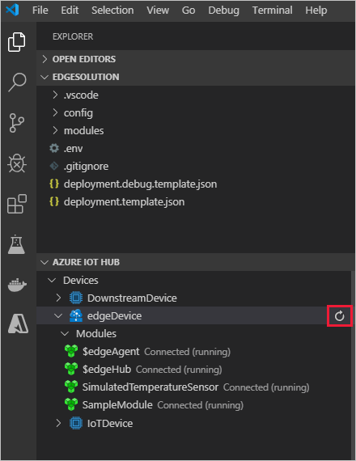

## View messages from device

The SampleModule code receives messages through its input queue and passes them along through its output queue. The deployment manifest declared routes that passed messages to SampleModule from tempSensor, and then forwarded messages from SampleModule to IoT Hub. The Azure IoT tools for Visual Studio Code allow you to see messages as they arrive at IoT Hub from your individual devices. 

1. In the Visual Studio Code explorer, right-click the IoT Edge device that you want to monitor, then select **Start Monitoring Built-in Event Endpoint**. 

2. Watch the output window in Visual Studio Code to see messages arriving at your IoT hub. 

   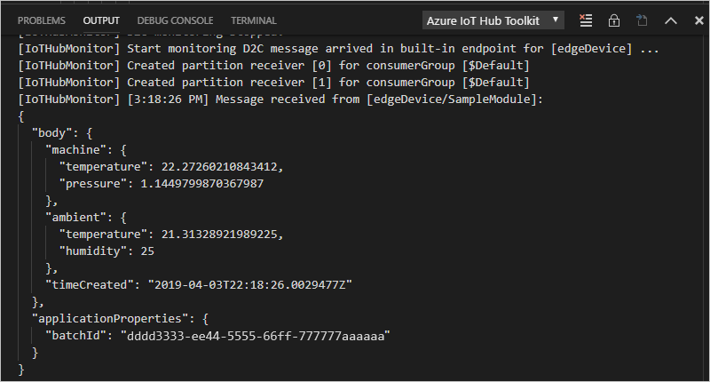

## View changes on device

If you want to see what's happening on your device itself, use the commands in this section to inspect the IoT Edge runtime and modules running on your device. 

The commands in this section are for your IoT Edge device, not your development machine. If you're using a virtual machine for your IoT Edge device, connect to it now. In Azure, go to the virtual machine's overview page and select **Connect** to access the secure shell connection. 

* View all modules deployed to your device, and check their status:

   ```bash
   iotedge list
   ```

   You should see four modules: the two IoT Edge runtime modules, tempSensor, and SampleModule. All four should be listed as running.

* Inspect the logs for a specific module:

   ```bash
   iotedge logs <module name>
   ```

   IoT Edge modules are case-sensitive. 

   The tempSensor and SamplModule logs should show the messages they're processing. The edgeAgent module is responsible for starting the other modules, so its logs will have information about implementing the deployment manifest. If any module isn't listed or isn't running, the edgeAgent logs will probably have the errors. The edgeHub module is responsible for communications between the modules and IoT Hub. If the modules are up and running, but the messages aren't arriving at your IoT hub, the edgeHub logs will probably have the errors. 

## Next steps

In this tutorial, you set up Visual Studio Code on your development machine and deployed your first IoT Edge module from it. Now that you know the basic concepts, try adding functionality to a module so that it can analyze the data passing through it. Choose your preferred language: 

> [!div class="nextstepaction"] 
> [C](tutorial-c-module.md)
> [C#](tutorial-csharp-module.md)
> [Java](tutorial-java-module.md)
> [Node.js](tutorial-node-module.md)
> [Python](tutorial-python-module.md)