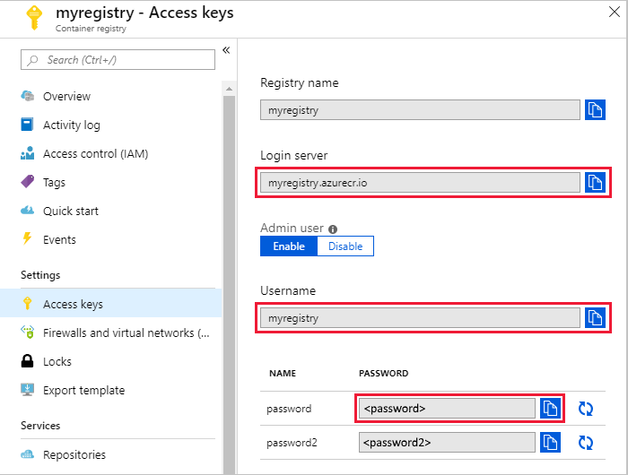

# Tutorial: Develop an IoT Edge module

In the quickstart articles, you created an IoT Edge device and deployed a pre-built module from the Azure Marketplace. This tutorial walks through what it takes to develop and deploy your own code to an IoT Edge device. This tutorial is a useful prerequisite for all the other tutorials, which will go into more detail about specific programming languages or Azure services. 

This tutorial uses the example of deploying a **C module to a Linux device**. This example was chosen because it has the fewest prerequisites, so that you can learn about the development tools without worrying about whether you have the right libraries installed. Once you understand the development concepts, then you can choose your preferred language or Azure service to dive into the details. 

In this tutorial, you learn how to:

> [!div class="checklist"]
> * Set up your development machine.
> * Use the IoT Edge tools for Visual Studio Code to create a new project.
> * Build your project as a container and store it in an Azure container registry.
> * Deploy your code to an IoT Edge device. 


[!INCLUDE [quickstarts-free-trial-note](../../includes/quickstarts-free-trial-note.md)]

## Prerequisites

A development machine:

* You can use your own computer or a virtual machine, depending on your development preferences.
* Most operating systems that can run a container engine can be used for IoT Edge development. This tutorial uses a Windows computer, but points out known differences on MacOS or Linux. 

An Azure IoT Edge device:

* We recommend that you don't run IoT Edge on your development machine, but instead use a separate device. This distinction between development machine and IoT Edge device more accurately mirrors a true deployment scenario, and helps to keep the different concepts straight.
* If you don't have a second device available, use the quickstart article to create an IoT Edge device in Azure with a [Linux virtual machine](quickstart-linux.md). This tutorial uses a Linux IoT Edge device, but points out differences for Windows devices. 

Cloud resources:

* Along with your working IoT Edge device, you should also have a free or standard-tier [IoT hub](../iot-hub/iot-hub-create-through-portal.md) in Azure. 

## Key concepts

This tutorial walks through the development of an IoT Edge module. An *IoT Edge module*, or sometimes just *module* for short, is a container that contains executable code. You can deploy one or more modules to an IoT Edge device. Modules perform specific tasks like ingesting data from sensors, performing data analytics or data cleaning operations, or sending messages to an IoT hub. For more information, see [Understand Azure IoT Edge modules](iot-edge-modules.md).

When developing IoT Edge modules, it's important to understand the difference between the development machine and the target IoT Edge device where the module will eventually be deployed. The container that you build to hold your module code must match the operating system (OS) of the target device. For example, the most common scenario is someone developing a module on a Windows computer intending to target a Linux IoT Edge device. In that case, the container operating system would be Linux. This tutorial demonstrates that scenario and tries to explicitly call out when a step applies to the *development machine OS* or the *container OS*.

## Install container engine

IoT Edge modules are packaged as containers, so you need a container engine on your development machine to build and manage the containers. We recommend using Docker Desktop for development because of its many features and popularity as a container engine. With Docker Desktop on a Windows device, you can switch between Linux containers and Windows containers so that you can easily develop modules for different types of IoT Edge devices. 

Use the Docker documentation to install on your development machine: 

* [Install Docker Desktop for Windows](https://docs.docker.com/docker-for-windows/install/)

  * When you install Docker Desktop for Windows, you're asked whether you want to use Linux or Windows containers. This decision can be changed at any time using an easy switch. For this tutorial, we assume Linux containers. For more information, see [Switch between Windows and Linux containers](https://docs.docker.com/docker-for-windows/#switch-between-windows-and-linux-containers).

* [Install Docker Desktop for Mac](https://docs.docker.com/docker-for-mac/install/)

* Read [About Docker CE](https://docs.docker.com/install/) for installation information on several Linux platforms

## Install VS Code and tools

If you're familiar with container development, you can use your preferred editors and tools to develop IoT Edge modules. If not, we recommend using the IoT extensions for Visual Studio Code or Visual Studio 2017 that were built specifically to assist with IoT Edge development. These extensions provide project templates, automate the creation of the deployment manifest, and allow you to monitor and manage IoT Edge devices. 

Visual Studio 2017 currently supports the following development options:
* Languages: C and C#
* Device architecture: AMD64

Visual Studio Code currently supports the following development options:
* Languages: C, C#, Java, Node.js, and Python
* Device architecture: AMD64, ARM32v7
* Cloud services: Azure Functions (C#), Azure Machine Learning, Azure Stream Analytics, Azure Marketplace

This tutorial uses Visual Studio Code for development, because it covers more scenarios. If you prefer to use Visual Studio 2017, you can learn more about it in [Use Visual Studio 2017 to develop and debug modules](how-to-visual-studio-develop-csharp-module.md).

1. Install [Visual Studio Code](https://code.visualstudio.com/) on your development machine. 

2. Once the installation is finished, select **View** > **Extensions**. 

3. Search for **Azure IoT Tools**, which is actually a collection of extensions that help you interact with IoT Hub and IoT devices, as well as developing IoT Edge modules. 

4. Select **Install**. Each included extension installs individually. 

5. When the extensions are done installing, open the command palette by selecting **View** > **Command Palette**. 

6. In the command palette, search for and select **Azure: Sign in**. Follow the prompts to sign in to your Azure account. 

7. In the command palette again, search for and select **Azure IoT Hub: Select IoT Hub**. Follow the prompts to select your Azure subscription and IoT hub. 

7. Open the explorer section of Visual Studio Code by either selecting the icon in the activity bar on the left, or by selecting **View** > **Explorer**. 

8. At the bottom of the explorer section, expand the collapsed **Azure IoT Hub Devices** menu. You should see the devices and IoT Edge devices associated with the IoT hub that you selected through the command palette. 

## Create a container registry

In this tutorial, you use the Azure IoT Tools for Visual Studio Code to build a module and create a **container image** from the files. Then you push this image to a **registry** that stores and manages your images. Finally, you deploy your image from your registry to run on your IoT Edge device.

You can use any Docker-compatible registry to hold your container images. Two popular Docker registry services are [Azure Container Registry](https://docs.microsoft.com/azure/container-registry/) and [Docker Hub](https://docs.docker.com/docker-hub/repos/#viewing-repository-tags). This tutorial uses Azure Container Registry.

If you don't already have a container registry, follow these steps to create a new one in Azure:

1. In the [Azure portal](https://portal.azure.com), select **Create a resource** > **Containers** > **Container Registry**.

2. Provide the following values to create your container registry:

   | Field | Value |
   | ----- | ----- |
   | Registry name | Provide a unique name. |
   | Subscription | Select a subscription from the drop-down list. |
   | Resource group | We recommend that you use the same resource group for all of the test resources that you create during the IoT Edge quickstarts and tutorials. For example, **IoTEdgeResources**. |
   | Location | Choose a location close to you. |
   | Admin user | Set to **Enable**. |
   | SKU | Select **Basic**. |

5. Select **Create**.

6. After your container registry is created, browse to it, and then select **Access keys**.

7. Copy the values for **Login server**, **Username**, and **Password** and save them somewhere convenient. You use these values throughout this tutorial to provide access to the container registry.

   

## Create a new module project

The Azure IoT Tools extension provides project templates for all supported IoT Edge module languages in Visual Studio Code. These templates have all the files and code that you need to deploy a working module to test IoT Edge, or give you a starting point to customize the template with your own business logic. 

For this tutorial, we use the C module template because it has no additional prerequisites to install. However, IoT Edge modules written in C don't support Windows containers. You can quickly create a Linux device following the quickstart for IoT Edge on [Linux virtual machines](quickstart-linux.md). If you are only interested in developing for Windows containers, you can follow this tutorial up until the deployment step. Then, continue onto one of the other tutorials for more examples. 

### Create a project template

In the Visual Studio Code command palette, search for and select **Azure IoT Edge: New IoT Edge Solution**. Follow the prompts and use the following values to create your solution: 

   | Field | Value |
   | ----- | ----- |
   | Select folder | Choose the location on your development machine for VS Code to create the solution files. |
   | Provide a solution name | Enter a descriptive name for your solution or accept the default **EdgeSolution**. |
   | Select module template | Choose **C Module**. |
   | Provide a module name | Accept the default **SampleModule**. |
   | Provide Docker image repository for the module | An image repository includes the name of your container registry and the name of your container image. Your container image is prepopulated from the name you provided in the last step. Replace **localhost:5000** with the login server value from your Azure container registry. You can retrieve the login server from the Overview page of your container registry in the Azure portal. <br><br> The final image repository looks like \<registry name\>.azurecr.io/samplemodule. |
 
   

Once your new solution loads in the Visual Studio Code window, take a moment to familiarize yourself with the files it created: 

* The **.vscode** folder contains a file called **launch.json**, which is used for debugging modules.
* The **modules** folder contains a folder for each module in your solution. Right now, that should only be **SampleModule**, or whatever name you gave to the module. The SampleModule folder contains the main program code, the module metadata, and several Docker files. 
* The **.env** file holds the credentials to your container registry. These credentials are shared with your IoT Edge device so that it has acceess to pull the container images. 
* The **deployment.debug.template.json** file and **deployment.template.json** file are templates that help you create a deployment manifest. A *deployment manifest* is a file that defines exactly which modules you want deployed on a device, how they should be configured, and how they can communicate with each other and the cloud. The template files use pointers for some values. When you transform the template into a true deployment manifest, the pointers are replaced with values taken from other solution files. Locate the two common placeholders in your deployment template: 

  * In the registry credentials section, the address is auto-filled from the information you provided when you created the solution. However, the username and password reference the variables stored in the .env file. This is for security, as the .env file is git ignored, but the deployment template is not. 
  * In the SampleModule section, the container image isn't filled in even though you provided the image repository when you created the solution. This placeholder points to the **module.json** file inside the SampleModule folder. If you go to that file, you'll see that the image field does contain the repository, but also a tag value which is made up of the version and the platform of the container. You can iterate the version manually as part of your development cycle, and you select the container platform using a switcher that we introduce later in this section. 

### Add your registry credentials. 

The environment file stores the credentials for your container registry and shares them with the IoT Edge runtime. The runtime uses these credentials to pull your container images onto the IoT Edge device. 

1. Open the **.env** file in your module solution. 
2. Add the **username** and **password** values that you copied from your Azure container registry.
3. Save your changes to the .env file. 

### Select your target architecture

Currently, IoT Edge modules can run on Linux AMD64, Linux ARM32v7, and Windows AMD64. You need to select which architecture you're targeting with each solution, because that affects how the container is built and runs. The default is Linux AMD64, because that's the most common device architecture for IoT Edge deployments. 

1. Open the command palette and search for **Azure IoT Edge: Set Default Target Platform for Edge Solution**, or select the shortcut icon in the side bar at the bottom of the window. 

   

2. In the command palette, select the target architecture from the list of options. For this tutorial, we're using an Ubuntu virtual machine for the IoT Edge device, so will keep the default **amd64**. 

### Review the sample code

The solution template that you created includes sample code for an IoT Edge module. This sample module simply receives messages and then passes them on. The pipeline functionality demonstrates an important concept in IoT Edge, which is how modules communicate with each other.

Each module can have multiple *input* and *output* queues declared in their code. The IoT Edge hub running on the device routes messages from the output of one module into the input of one or more modules. The specific language for declaring inputs and outputs varies between languages, but the concept is the same across all modules. For more information about routing between modules, see [module-composition.md#declare-routes].

1. Open the **main.c** file, which is inside the modules/SampleModules/ folder. 

2. The IoT Hub C SDK uses the method [SetInputMessageCallback](https://docs.microsoft.com/azure/iot-hub/iot-c-sdk-ref/iothub-module-client-ll-h/iothubmoduleclient-ll-setinputmessagecallback) to initialize module input queues. Search within the main.c file for that method.

3. Review the method constructor, and see that an input queue called **input1** is initialized in the code. 

   

4. Similarly, module output queues are initialized as part of a method. Search for the [SendEventToOutputAsync](https://docs.microsoft.com/azure/iot-hub/iot-c-sdk-ref/iothub-module-client-ll-h/iothubmoduleclient-ll-sendeventtooutputasync) method constructor in the main.c file. 

5. Review the method constructor, and see that an output queue called **output1** is initialized in the code. 

   

6. Open the **deployment.template.json** file.

7. Find the **modules** property of the $edgeAgent desired properties. 

   There should be two modules listed here. The first is **tempSensor**, which is included in all the templates by default to provide simulated temperature data that you can use to test your modules. The second is the **SampleModule** that you created as part of this solution.

7. At the bottom of the file, find the desired properties for the **$edgeHub** module. 

   One of the functions of the IoT Edge hub module is to route messages between all the modules in a deployment. Review the values in the **routes** parameter. The first route, SampleModuleToIoTHub, uses a wildcard character, **\***, to indicate any messages coming from any output queues in the SampleModule module. These messages go into *$upstream*, which is a reserved name that indicates IoT Hub. The second route, sensorToSampleModule, takes messages coming from the tempSensor module and routes them to the *input1* input queue that you saw initialized in the SampleModule code. 

   

## Build and push your solution

You've reviewed the module code and the deployment template to understand some key deployment concepts. Now, you're ready to build the SampleModule container image and push it to your container registry. With the IoT tools extension for Visual Studio Code, this step also generates the deployment manifest based on the information in the template file and the module information from the solution files. 

### Sign in to Docker

Provide your container registry credentials to Docker so that it can push your container image to be stored in the registry. 

1. Open the Visual Studio Code integrated terminal by selecting **View** > **Terminal**.

2. Sign in to Docker with the Azure container registry credentials that you saved after creating the registry. 

   ```cmd/sh
   docker login -u <ACR username> -p <ACR password> <ACR login server>
   ```

   You may receive a security warning recommending the use of `--password-stdin`. While that best practice is recommended for production scenarios, it's outside the scope of this tutorial. For more information, see the [docker login](https://docs.docker.com/engine/reference/commandline/login/#provide-a-password-using-stdin) reference.

### Build and push 

Visual Studio Code now has access to your container registry, so it's time to turn the solution code into a container image. 

1. In the Visual Studio Code explorer, right-click the **deployment.template.json** file and select **Build and Push IoT Edge Solution**. 

   That command starts three operations. First, it creates a new folder in the solution called **config** which holds the full deployment manifest, built out of information in the deployment template and other solution files. Second, it runs `docker build` to build the container image based on the appropriate dockerfile for your target architecture. Then, it runs `docker push` to push the image repository to your container registry. 

2. Open the **deployment.amd64.json** file in newly created config folder. The filename reflects the target architecture, so it will be different if you chose a different architecture.

3. Notice that the two parameters that had placeholders now are filled in with their proper values. The **registryCredentials** section has your registry username and password pulled from the .env file. The **SampleModule** has the full image repository with the name, version, and architecture tag from the module.json file. 

4. Open the **module.json** file in the SampleModule folder. 

5. Change the version number for the module image. (The version, not the $schema-version.) For example, increment the patch version number to **0.0.2** as though we had made a small fix in the module code. 

6. Save your changes to the module.json file.

7. Right-click the **deployment.template.json** file again, and again select **Build and Push IoT Edge Solution**. (The build and push process is much faster the second time.)

8. Open the **deployment.amd64.json** file again. Notice that a new file wasn't created when you ran the build and push command again. Rather, the same file was updated to reflect the changes. The SampleModule image now points to the 0.0.2 version of the container. 

9. To further verify what the build and push command did, go to the [Azure portal](https://portal.azure.com) and navigate to your container registry. 

10. In your container registry, select **Repositories** then **samplemodule**. Verify that both versions of the image were pushed to the registry.

   >[!TIP]
   >Module versions enable version control, and allow you to test changes on a small set of devices before deploying updates to production. If you don't increment the module version before building and pushing, then you overwrite the repository in your container registry. 

   

### Troubleshoot

If you encounter errors when building and pushing your module image, it often has to do with Docker configuration on your development machine. Use the following checks to review your configuration: 

* Did you run the `docker login` command using the credentials that you copied from your container registry? These are different than the credentials you use to sign in to Azure. 
* Is your container repository correct? Does it have your correct container registry name and your correct module name? Open the **module.json** file in the SampleModule folder to check. The repository value should look like **\<registry name\>.azurecr.io/samplemodule**. 
* If you used a different name than **SampleModule** for your module, is that name consistent throughout the solution?
* Is your machine running the same type of containers that you're building? This tutorial assumes that you're targeting a Linux AMD64 device, so Visual Studio Code should say **amd64** in the side bar, and Docker Desktop should be running Linux containers. C modules do not support Windows containers. 

## Deploy solution to a device

You verified that the built container images are stored in your container registry, so it's time to deploy them to a device. Make sure that your IoT Edge device is up and running. 

1. In the Visual Studio Code explorer, expand the Azure IoT Hub Devices section. 

2. Right-click the IoT Edge device that you want to deploy to, then select **Create Deployment for Single Device**. 

3. In the file explorer, navigate into the **config** folder then select the **deployment.amd64.json** file. 

   Do not use the deployment.template.json file, which doesn't have the container registry credentials or module image values in it.

4. Expand the details for your IoT Edge device, then expand the **Modules** list for your device. 

5. Use the refresh button to update the device view until you see the tempSensor and SampleModule modules running on your device. 

   It may take a few minutes for both modules to start. The IoT Edge runtime needs to receive its new deployment manifest, pull down the module images from the container runtime, then start each new module. 

   

### Troubleshoot


## View messages from device

The SampleModule code receives messages through its input queue and passes them along through its output queue. The deployment manifest declared routes that passed messages to SampleModule from tempSensor, and then forwarded messages from SampleModule to IoT Hub. The Azure IoT tools for Visual Studio Code allow you to see messages as they arrive at IoT Hub from your individual devices. 

1. In the Visual Studio Code explorer, right-click the IoT Edge device that you want to monitor, then select **Start Monitoring D2C Message**. 

2. Watch the **OUTPUT** window in Visual Studio Code to see messages arriving at your IoT Hub. 

   

