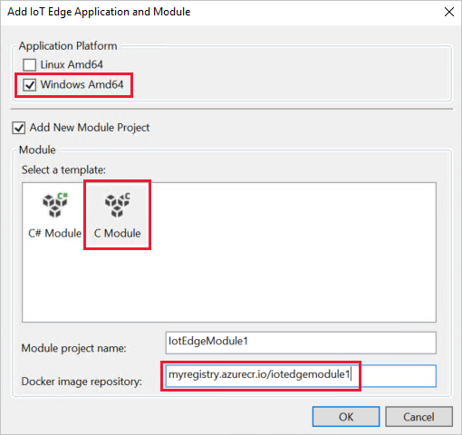

# Tutorial: Develop an IoT Edge module for a Windows device

Use Visual Studio 2017 to develop and deploy code to Windows devices running IoT Edge.

In the quickstart articles, you created an IoT Edge device and deployed a pre-built module from the Azure Marketplace. This tutorial walks through what it takes to develop and deploy your own code to an IoT Edge device. This tutorial is a useful prerequisite for all the other tutorials, which will go into more detail about specific programming languages or Azure services. 

This tutorial uses the example of deploying a **C module to a Windows device**. This example was chosen because it has the fewest prerequisites, so that you can learn about the development tools without worrying about whether you have the right libraries installed. Once you understand the development concepts, then you can choose your preferred language or Azure service to dive into the details. 

In this tutorial, you learn how to:

> [!div class="checklist"]
> * Set up your development machine.
> * Use the IoT Edge tools for Visual Studio 2017 to create a new project.
> * Build your project as a container and store it in an Azure container registry.
> * Deploy your code to an IoT Edge device. 

[!INCLUDE [quickstarts-free-trial-note](../../includes/quickstarts-free-trial-note.md)]


## Key concepts

This tutorial walks through the development of an IoT Edge module. An *IoT Edge module*, or sometimes just *module* for short, is a container that contains executable code. You can deploy one or more modules to an IoT Edge device. Modules perform specific tasks like ingesting data from sensors, performing data analytics or data cleaning operations, or sending messages to an IoT hub. For more information, see [Understand Azure IoT Edge modules](iot-edge-modules.md).

When developing IoT Edge modules, it's important to understand the difference between the development machine and the target IoT Edge device where the module will eventually be deployed. The container that you build to hold your module code must match the operating system (OS) of the *target device*. For Windows container development, this concept is simpler because Windows containers only run on Windows operating systems. But you could, for example, use your Windows development machine to build modules for Linux IoT Edge devices. In that scenario, you'd have to make sure that your development machine was running Linux containers. As you go through this tutorial, keep in mind the difference between *development machine OS* and the *container OS*.

This tutorial targets Windows devices running IoT Edge. Windows IoT Edge devices use Windows containers. We recommend using Visual Studio 2017 to develop for Windows devices, so that's what this tutorial will use. You can use Visual Studio Code as well, although there are differences in support between the two tools.

The following table lists the supported development scenarios for Windows containers in Visual Studio Code and Visual Studio 2017.

|   | Visual Studio Code | Visual Studio 2017 |
| - | ------------------ | ------------------ |
| **Azure services** | * Azure Functions <br> * Azure Stream Analytics |   |
| **Languages** | * C# (debugging not supported) <br> * Python | * C <br> * C# |
| **Full feature list** | [Azure IoT Edge for Visual Studio Code](https://marketplace.visualstudio.com/itemdetails?itemName=vsciot-vscode.azure-iot-edge) | [Azure IoT Edge Tools for Visual Studio 2017](https://marketplace.visualstudio.com/items?itemName=vsc-iot.vsiotedgetools) |

This tutorial teaches the development steps for Visual Studio 2017. If you would rather use Visual Studio Code, refer to the devlopment instructions in [Use Visual Studio Code to develop and debug modules for Azure IoT Edge](how-to-vs-code-develop-module.md).

## Prerequisites

A development machine:

* Windows 10 with 1809 update or newer.
* You can use your own computer or a virtual machine, depending on your development preferences.
* Install [Git](https://git-scm.com/). 
* Install the Azure IoT C SDK for Windows x64 through vcpkg:

   ```powershell
   git clone https://github.com/Microsoft/vcpkg
   cd vcpkg
   .\bootstrap-vcpkg.bat
   .\vcpkg install azure-iot-sdk-c:x64-windows
   .\vcpkg --triplet x64-windows integrate install
   ```

An Azure IoT Edge device:

* We recommend that you don't run IoT Edge on your development machine, but instead use a separate device. This distinction between development machine and IoT Edge device more accurately mirrors a true deployment scenario, and helps to keep the different concepts straight.
* If you don't have a second device available, use the quickstart article to create an IoT Edge device in Azure with a [Windows virtual machine](quickstart.md).

Cloud resources:

* A free or standard-tier [IoT hub](../iot-hub/iot-hub-create-through-portal.md) in Azure. 

## Install container engine

IoT Edge modules are packaged as containers, so you need a container engine on your development machine to build and manage the containers. We recommend using Docker Desktop for development because of its many features and popularity as a container engine. With Docker Desktop on a Windows computer, you can switch between Linux containers and Windows containers so that you can easily develop modules for different types of IoT Edge devices. 

Use the Docker documentation to install on your development machine: 

* [Install Docker Desktop for Windows](https://docs.docker.com/docker-for-windows/install/)

  * When you install Docker Desktop for Windows, you're asked whether you want to use Linux or Windows containers. For this tutorial, use **Windows containers**. For more information, see [Switch between Windows and Linux containers](https://docs.docker.com/docker-for-windows/#switch-between-windows-and-linux-containers).


## Install Visual Studio and tools

Use the IoT extensions for Visual Studio 2017 to develop IoT Edge modules. These extensions provide project templates, automate the creation of the deployment manifest, and allow you to monitor and manage IoT Edge devices. 

1. [Install Visual Studio Community 2017](https://docs.microsoft.com/visualstudio/install/install-visual-studio?view=vs-2017) on your development machine with the following workloads: 

   * Azure development
   * Desktop development with C++

2. Download and install the [Azure IoT Edge Tools](https://marketplace.visualstudio.com/items?itemName=vsc-iot.vsiotedgetools) extension for Visual Studio 2017. 

3. When your installations are complete, open Visual Studio.

4. Select **View** > **Cloud Explorer**. 

5. Select the profile icon in Cloud Explorer and sign in to your Azure account if you aren't signed in already. 

6. Once you sign in, your Azure subscriptions are listed. Select the subscriptions that you want to access through Cloud Explorer and then select **Apply**. 

7. Expand your subscription, then **IoT Hubs**, then your IoT hub. You should see a list of your IoT devices, and can use this explorer to manage them. 

   

## Create a container registry

In this tutorial, you use the Azure IoT Tools for Visual Studio 2017 to build a module and create a **container image** from the files. Then you push this image to a **registry** that stores and manages your images. Finally, you deploy your image from your registry to run on your IoT Edge device.

You can use any Docker-compatible registry to hold your container images. Two popular Docker registry services are [Azure Container Registry](https://docs.microsoft.com/azure/container-registry/) and [Docker Hub](https://docs.docker.com/docker-hub/repos/#viewing-repository-tags). This tutorial uses Azure Container Registry.

If you don't already have a container registry, follow these steps to create a new one in Azure:

1. In the [Azure portal](https://portal.azure.com), select **Create a resource** > **Containers** > **Container Registry**.

2. Provide the following values to create your container registry:

   | Field | Value |
   | ----- | ----- |
   | Registry name | Provide a unique name. |
   | Subscription | Select a subscription from the drop-down list. |
   | Resource group | We recommend that you use the same resource group for all of the test resources that you create during the IoT Edge quickstarts and tutorials. For example, **IoTEdgeResources**. |
   | Location | Choose a location close to you. |
   | Admin user | Set to **Enable**. |
   | SKU | Select **Basic**. |

5. Select **Create**.

6. After your container registry is created, browse to it, and then select **Access keys**.

7. Copy the values for **Login server**, **Username**, and **Password** and save them somewhere convenient. You use these values throughout this tutorial to provide access to the container registry.

   

## Create a new module project

The Azure IoT Tools extension provides project templates for all supported IoT Edge module languages in Visual Studio 2017. These templates have all the files and code that you need to deploy a working module to test IoT Edge, or give you a starting point to customize the template with your own business logic. 

1. Run Visual Studio as an administrator.

2. Select **File** > **New** > **Project**. 

3. In the new project window, select the **Azure IoT** project type and choose the **Azure IoT Edge** project. Rename the project and solution, or accept the default **AzureIoTEdgeApp1**. Select **OK** to create the project. 

   

4. In the IoT Edge application and module window, configure your project with the following values: 

   | Field | Value |
   | ----- | ----- |
   | Application platform | Uncheck **Linux Amd64**, and check **WindowsAmd64**. |
   | Select a template | Select **C Module**. | 
   | Module project name | Accept the default **IoTEdgeModule1**. | 
   | Docker image repository | An image repository includes the name of your container registry and the name of your container image. Your container image is prepopulated from the module project name value. Replace **localhost:5000** with the login server value from your Azure container registry. You can retrieve the login server from the Overview page of your container registry in the Azure portal. <br><br> The final image repository looks like \<registry name\>.azurecr.io/iotedgemodule1. |

   

5. Select **OK** to apply your changes. 

Once your new project loads in the Visual Studio window, take a moment to familiarize yourself with the files that it created: 

* An IoT Edge project called **AzureIoTEdgeApp1.Windows.Amd64**.
    * The **Modules** folder contains pointers to the modules included in the project. In this case, it should be just IoTEdgeModule1. 
    * The **deployment.template.json** file is a template to help you create a deployment manifest. A *deployment manifest* is a file that defines exactly which modules you want deployed on a device, how they should be configured, and how they can communicate with each other and the cloud. 
* An IoT Edge module project called **IoTEdgeModule1**.
    * The **main.c** file contains the default C module code that comes with the project template. The default module takes input from a source and passes it along to IoT Hub. 
    * The **module.json** file hold details about the module, including the full image repository, image version, and which Dockerfile to use for each supported platform.

## Review the sample code

The solution template that you created includes sample code for an IoT Edge module. This sample module simply receives messages and then passes them on. The pipeline functionality demonstrates an important concept in IoT Edge, which is how modules communicate with each other.

Each module can have multiple *input* and *output* queues declared in their code. The IoT Edge hub running on the device routes messages from the output of one module into the input of one or more modules. The specific language for declaring inputs and outputs varies between languages, but the concept is the same across all modules. For more information about routing between modules, see [Declare routes](module-composition.md#declare-routes).

1. In the **main.c** file, find the **SetupCallbacksForModule** function.

2. This function sets up an input queue to receive incoming messages. It calls the C SDK module client function [SetInputMessageCallback](https://docs.microsoft.com/azure/iot-hub/iot-c-sdk-ref/iothub-module-client-ll-h/iothubmoduleclient-ll-setinputmessagecallback). Review this function and see that it initializes an input queue called **input1**. 

   

3. Next, find the **InputQueue1Callback** function.

4. This function processes recieved messages and sets up an output queue to pass them along. It calls the C SDK module client function [SendEventToOutputAsync](https://docs.microsoft.com/azure/iot-hub/iot-c-sdk-ref/iothub-module-client-ll-h/iothubmoduleclient-ll-sendeventtooutputasync). Review this function and see that it initializes an output queue called **output1**. 

   


## Build and push your solution

You've reviewed the module code and the deployment template to understand some key deployment concepts. Now, you're ready to build the SampleModule container image and push it to your container registry. With the IoT tools extension for Visual Studio Code, this step also generates the deployment manifest based on the information in the template file and the module information from the solution files. 

## Deploy solution to a device

You verified that the built container images are stored in your container registry, so it's time to deploy them to a device. Make sure that your IoT Edge device is up and running. 

## View messages from device

The SampleModule code receives messages through its input queue and passes them along through its output queue. The deployment manifest declared routes that passed messages to SampleModule from tempSensor, and then forwarded messages from SampleModule to IoT Hub. The Azure IoT tools for Visual Studio Code allow you to see messages as they arrive at IoT Hub from your individual devices. 

## Next steps

In this tutorial, you set up Visual Studio 2017 on your development machine and deployed your first IoT Edge module from it. Now that you know the basic concepts, try adding functionality to a module so that it can analyze the data passing through it. Choose your preferred language: 

> [!div class="nextstepaction"] 
> [C](tutorial-c-module.md)
> [C#](tutorial-csharp-module.md)