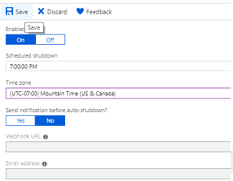

# Tutorial: Machine Learning and IoT Edge - setup

## 1 Setting Up a Development Machine

### 1.1 Role

This step is typically performed by a cloud developer. Some of the software configured on the VM may also be helpful for a data scientist.

### 1.2 Introduction

Over the course of this walk-through we will be performing various developer tasks including coding, compiling, configuring and deploying IoT Edge module and IoT devices.

To provide a common base for these tasks we recommend the use of an Azure virtual machine configured specifically as your development machine for this walk-through. The VM that we create needs to be able to handle [nested virtualization](https://docs.microsoft.com/en-us/azure/virtual-machines/windows/nested-virtualization), which is why we chose a DS8V3 machine size.

The development VM will be set up with:

* Windows 10

* [Chocolatey](https://chocolatey.org/)

* [Docker Desktop for Windows](https://www.docker.com/products/docker-desktop)

* [Git for Windows](https://gitforwindows.org/)

* [Git Credential Manager for Windows](https://github.com/Microsoft/Git-Credential-Manager-for-Windows)

* [.Net Core SDK](https://dotnet.microsoft.com/)

* [Python 3](https://www.python.org/)

* [Visual Studio Code](https://code.visualstudio.com/)

* [Azure PowerShell](https://docs.microsoft.com/en-us/powershell/azure/overview?view=azps-1.1.0)

* [VS Code Extensions](https://marketplace.visualstudio.com/search?target=VSCode)
  * [Azure IoT Tools](https://marketplace.visualstudio.com/items?itemName=vsciot-vscode.azure-iot-tools)
  * [Python](https://marketplace.visualstudio.com/items?itemName=ms-python.python)
  * [C\#](https://marketplace.visualstudio.com/items?itemName=ms-vscode.csharp)
  * [Docker](https://marketplace.visualstudio.com/items?itemName=PeterJausovec.vscode-docker)
  * [PowerShell](https://marketplace.visualstudio.com/items?itemName=ms-vscode.PowerShell)

The developer VM is not strictly necessary – all the development tools can of course also be run on a local machine. However, we strongly recommend using the VM to ensure a level playing field.

This section will take about 30 minutes to complete.

### 1.3 Get the code

Clone or download the code from <https://github.com/Azure-Samples/IoTEdgeAndMlSample>.

### 1.4 Create an Azure Virtual Machine

The DevVM directory contains the files needed to create an Azure virtual machine appropriate for completing this walk-through. To create a VM:

1. Open Powershell as an administrator and navigate to the directory where you downloaded the code. We will refer to the root directory for your source as `<srcdir>`.

    ```
    cd \<srcdir\>\\IoTEdgeAndMlSample\\DevVM
    ```

2. Run the following command to allow execution of scripts. Choose **Yes to All** when prompted.

    ```
    Set-ExecutionPolicy Bypass -Scope Process
    ```

3. Run Create-AzureDevVM.ps1 from this directory

    ```
    .\\Create-AzureDevVm.ps1
    ```

    * When prompted provide:
      * Azure Subscription ID: found in the Azure Portal
      * Resource Group Name: memorable name for grouping the resources for your walk-through
      * Location: Azure location where the virtual machine will be created (e.g. West US 2, North Europe, see full [list](https://azure.microsoft.com/en-us/global-infrastructure/locations/))
      * AdminUsername: the name for the admin account you want to create and use on the virtual machine
      * AdminPassword: the password to set for the AdminUsername on the VM

    * If you do not have Azure PowerShell installed, the script will install [Azure PowerShell Az module](https://docs.microsoft.com/en-us/powershell/azure/new-azureps-module-az?view=azps-1.1.0)

    * You will be prompted to login to Azure.

    * The script confirms the information for the creation of your VM. Press `y` or `Enter` to continue.


4. The script will run for several minutes as it executes the steps:
    
    * Create the Resource Group if it does not exist
    * Deploy the virtual machine
    * Enable Hyper-V on the VM
    * Install software need for development and clone the sample repository
    * Restart the VM
    * Create an RDP file on your desktop for connecting to the VM

### 1.5 Set auto-shutdown schedule

To help you reduce cost, the VM has been created with an automatic shutdown schedule which is set to 1900 PST. You may need to update this timing depending on your location and schedule. To update the shutdown
schedule:

1.  Login into the [Azure portal](https://portal.azure.com).

2.  Navigate to your virtual machine.

3.  Select **Auto-shutdown** on the side navigator.

4.  If necessary, enter a new shutdown time in **Scheduled shutdown** and/or set the **Time zone** then click **Save**.

    

### 1.6 Connect and configure development machine

Now that we have created a VM we need to finish installing the software needed to complete the walk-through.

#### 1.6.1 Open a remote desktop session to your development machine

1.  The VM creation script created an RDP file on your desktop.

2.  Double click on the file with the name **\<Azure VM name\>.rdp**.

3.  You will be presented with a dialog saying the publisher of the remote connection is unknown. Click the **Don’t ask me again for connections to this computer** checkbox then select **Connect**.

4.  When prompted, provide the AdminPassword that you used when running the script to set up the VM and click **OK**.

5.  You will be prompted to accept the certificate for the VM. Select **Don’t ask me again for connections to this computer** and choose **Yes**.

#### 1.6.2 Install Visual Studio Code extensions

Now that we have established a connection to the development VM. We are going to add some useful extensions to Visual Studio Code in that VM to make the development experience easier.

1.  In a PowerShell window navigate to **C:\\source\\IoTEdgeAndMlSample\\DevVM**.

2.  Allow scripts to be executed on the virtual machine by typing.

    ```
    Set-ExecutionPolicy Bypass -Scope CurrentUser -Force
    ```

3.  Run the script.

    ```
    .\\Enable-CodeExtensions.ps1
    ```

4.  The script will run for a few minutes installing VS code extensions:
    
    * Azure IoT Tools
    * Python
    * C\#
    * Docker
    * PowerShell

### 1.7 Summary

In this section we created an Azure Virtual Machine and configured it with the tools and software that will be needed to complete the remainder of the walk-through. In the next section we will begin creating an IoT solution by setting up an Azure IoT Hub.

## 2 Add IoT Hub and Configure a Storage Route

### 2.1 Role

The target role is Cloud Development.

### 2.2 Introduction

Azure IoT Hub is the heart of any IoT application. It handles secure communication between IOT devices and the cloud. It is the main coordination point for the operation of the Edge ML solution.

* IoT Hub uses routes to direct incoming data from IoT devices to other downstream services. We will take advantage of IoT routes to send device data to Azure Storage where it can be consumed by Azure Machine Learning to train our remaining useful life (RUL) classifier.

* Later in the walkthrough, we will use the IoT Hub to configure and deploy our Azure IoT Edge device and to manage which Edge modules are deployed to the device and how they are configured.

In this section, we will use a script to create the Azure IoT Hub and storage account. Then configure a route that will forward data received by the hub to an Azure Storage Blob container using the Azure Portal. It will take about 10 minutes to complete.

### 2.3  Create IoT Hub and Azure Storage Account

1.  Continue working in the remote desktop session connected to your development VM.

2.  Open a PowerShell window.

3.  Change to the IoTHub directory.

    ```
    cd C:\\source\\IoTEdgeAndMlSample\\IoTHub
    ```

4.  Run the creation script. Use the same values for subscription id, location and resource group as you did when creating the development VM .

    ```
    .\\New-HubAndStorage.ps1 -SubscriptionId \<subscription id\> -Location
    \<location\> -ResourceGroupName \<resource group\>
    ```

    * You will be prompted to login to Azure.
    * The script confirms the information for the creation of your Hub and Storage account. Press `y` or `Enter` to continue.

5.  The script will take about 2 minutes to run.

6.  Once complete the script will output the name of the hub and the storage account.

### 2.4 Review route to storage in IoT Hub

As part of creating the IoT Hub the script that we ran in the previous section create a custom endpoint and a route. In IoT Hub routes consist of a query expression and an endpoint. If a message matches the expression, the data is sent along the route to the associated endpoint. Endpoints can be Event Hubs, Service Bus Queues and Topics or as in this case a Blob container in a storage account. Let’s use the Azure portal to review the route created by our script.

#### 2.4.1 Review the custom endpoint

1.  Open the [Azure portal](http://portal.azure.com).

2.  Choose all services from the left navigator, type IoT in the search box, and select **IoT Hub**.

3.  Choose the IoT Hub created in the previous step.

4.  In the IoT Hub side navigator choose **Message routing**.

5.  The message routing page has two tabs, **Routes** and **Custom endpoints**. Select the **Custom endpoints** tab.

6.  Under **Blob storage** select **turbofanDeviceStorage**.

7.  Note that this endpoint points to a blob container called **devicedata** in the storage account created in the last step, which is named **iotedgeandml\<unique suffix\>**.

8.  Also note the **Blob file name format** has been changed from the default format to instead place the partition as the last element in the name. We find this is more convenient for the file operations we will do with Azure Notebooks later in the walkthrough.

9. Select the **X** in the top right corner of the page to return to the **Message routing** page.

#### 2.4.2 Review the route

1.  Select the **Routes** tab.

2.  Select the route named **turbofanDeviceDataToStorage**.

3.  Note that the route’s endpoint is the **turbofanDeviceStorage** custom endpoint.

4.  Look at the routing query, which is set to **true**. This means that all device telemetry messages will match this route and therefore all messages will be sent to the **turbofanDeviceStorage** endpoint.

5.  Close the route details.

### 2.5 Summary

In this section we created an IoT Hub and configured a route to an Azure Storage account. In the next section we will send data from a set of simulated devices through the IoT Hub into the storage account. Later in the walkthrough, after we have configured our IoT Edge device and modules, we will revisit routes and look a little more at the routing query.

For more information see:

* [Azure IoT Fundamentals](https://docs.microsoft.com/en-us/azure/iot-fundamentals/)
* [Configure message routing with IoT Hub](https://docs.microsoft.com/en-us/azure/iot-hub/tutorial-routing)
* [Create an IoT hub using the Azure portal](https://docs.microsoft.com/en-us/azure/iot-hub/iot-hub-create-through-portal)
