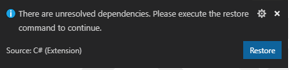
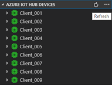
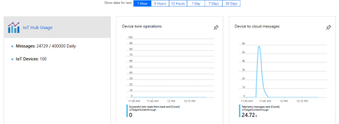

# Tutorial: Machine Learning and IoT Edge – generate device data

## 1 Generate device data

### 1.1 Role

The real-world equivalent to the work in this step would likely be
performed by device developers and cloud developers.

### 1.2 Introduction

As stated in the intro this walk-through uses the “Turbofan engine
degradation simulation data set” from
<https://c3.nasa.gov/dashlink/resources/139/> to simulate data from a
set of airplane engines for training and testing. The dataset is
included in this repository and can be downloaded in zip format from
<http://ti.arc.nasa.gov/c/6/>. From the accompanying readme.txt we know
that:

  - The data consists of multiple multivariate time series

  - Each data set is divided into training and test subsets

  - Each time series is from a different engine

  - Each engine starts with different degrees of initial wear and
    manufacturing variation

In this section we use the training data subset of a single data set
(FD003).

In reality, of course each engine would be an independent IoT device.
Assuming you do not have a collection of internet-connected turbofan
engines available, we will build a software stand-in for these devices.

The simulator is a C\# program that uses the IoT Hub APIs to
programmatically register virtual devices with IoT Hub.

We then read the data for each device from the NASA-provided data subset
and send it to the IoT Hub using a simulated IoT Device. All the code
for this section can be found in the DeviceHarness directory of the
repository.

The DeviceHarness is a .NET core project written in C\# consisting of 4
classes:

  - **Program:** The entry point for execution responsible for handling
    user input and overall coordination.

  - **TrainingFileManager:** responsible for reading and parsing the
    selected data file

  - **CycleData:** represents a single row of data in a file converted
    to message format

  - **TurbofanDevice:** responsible for creating an IoT Device that
    corresponds to a single device (time series) in the data and
    transmitting the data to IoT Hub via the IoT Device.

This will take about 20 minutes to complete.

### 1.3 Configure Visual Studio Code and build DeviceHarness project

1.  Open a remote desktop session to your VM

2.  Open Visual Studio Code

3.  After Visual Studio Code finishes initializing, click on **File-\>Open Folder...**

4.  In the “Folder” textbox type
    “c:\\source\\IoTEdgeAndMlSample\\DeviceHarness” and click the
    “Select Folder” button.
    
      - If OmniSharp errors appear in the output window, you’ll need to
        uninstall the C\# extension, close/reopen VS Code, install the
        c\# extension, and reload.

5.  Since this is the first time using extensions on this machine, some
    extensions will update and install their dependencies. You may be
    prompted to update extension, if so click “Reload Window”

6.  You will be prompted to add required assets for DeviceHarness, click
    “Yes” to add them
    
      - The notification may take a few seconds to appear.
    
      - If you missed this notification, check the “bell” icon in the
        lower right-hand corner.

    

7.  Then click “Restore” to restore the package dependencies  
    

8.  Validate that your environment is properly set up by triggering a
    build (Ctrl+Shift+B) or **Terminal-\>Run Build Task**

9.  You will be prompted to “Select the build task to run” click on
    “Build”

10. The build will run and give output like:  
    

11. You can make this build the default build task by clicking on
    **Terminal-\>Configure Default Build Task…** and choosing “build”
    from the “Select the task to be used as the default build task”
    prompt

### 1.4 Connect to IoT Hub and run DeviceHarness

Now that we have the project building, we need to connect to the IoT Hub
so that we can access the connection string and monitor the progress of
the data generation.

#### 1.4.1 Sign Visual Studio Code into Azure

1.  Sign into your Azure subscription in Visual Studio Code by opening
    the command palette (Ctrl+Shift+P) or **View-\>Command Palette…**

2.  At the prompt type “Azure: Sign In” and click on “Azure:Sign In”

3.  A browser window will open and prompt you for your credentials and
    redirect to a success page. Close the browser

#### 1.4.2 Connect Visual Studio Code to IoT Hub and copy hub connection string

1.  In bottom section of the Visual Studio Code explorer click on the
    “AZURE IOT HUB DEVICES” frame to expand it

2.  In the expanded frame, click on “Select IoT Hub”

3.  You will be prompted to select your Azure Subscription, then your
    IoT Hub

4.  Click on into the “AZURE IOT HUB DEVICES” frame and the click the
    “…” for more actions and click on “Copy IoT Hub Connection
    String”  
    

#### 1.4.3 Run the DeviceHarness project

1.  Open the Visual Studio Code terminal (Ctrl+Shit+\` for new window or
    use an existing one)
    
    1.  If you do not see a prompt, hit enter.

2.  Type “dotnet run”

3.  When prompted for the “IoT Hub Connection String” paste the
    connection string copied in the previous step and press ‘Enter’

4.  In the “AZURE IOT HUB DEVICE” pane click on the refresh button  
    

5.  Note that devices are added to the IoT Hub and that the devices show
    up in green to indicate that data is being sent via that device.

6.  You can view the messages being sent to the hub by right-clicking on
    any device and choosing “Start Monitoring D2C Message.” The messages
    will show in the output pane in Visual Studio Code.

7.  Stop monitoring by clicking in the “Azure IoT Hub Toolkit” output
    pane and choose “Stop Monitoring D2C Message”

8.  Let the application run to completion, which will take a few
    minutes.

### 1.5 Check IoT Hub for Activity

The data sent by the DeviceHarness went to our IoT Hub. It is easy to
verify that data has reached our hub using the Azure Portal.

1.  Open <http://portal.azure.com/> and navigate to your IoT Hub

2.  In the overview page you should see that data has been sent to the
    hub:  
    

### 1.6 Validate data in Azure Storage

The data we just sent to the IoT Hub will have been routed to the
storage container that we created above ([Create storage
container](#generate-device-data)). Let’s look at the data in our
storage account.

1.  Open <http://portal.azure.com> and navigate to your storage account

2.  From the storage account navigator click on “Storage Explorer
    (preview)”

3.  In the storage explorer click on “BLOB CONTAINERS” then “devicedata”

4.  In the content pane click on the folder for the name of the IoT Hub,
    then the year, then the month, then the day, the hour. You will see
    several folders representing the minutes when the data was
    written.  
    

5.  Click into one of those folders to find data files labelled “00” and
    “01” corresponding to the partition.

6.  The files are written in Avro (<http://avro.apache.org/>) format but
    double-clicking on one of these files will open another browser tab
    and partially render the data. If instead you are prompted to open
    the file in a program, you can choose VS Code and it will render
    fine. The result will look like:  
    

7.  There is no need to try to read or interpret the data right now; we
    will do it in subsequent steps.

### 1.7 Summary

In this section we used a .NET Core project to create a set of virtual
devices and send data through those devices through our IoT Hub and into
an Azure Storage container. This simulates a real-world scenario where
physical devices send data including sensor readings, operational
settings, failure signals and modes, etc. to an IoT Hub and onward into
a curated storage. Once enough data has been collected, we use it to
train models that predict the remaining useful life (RUL) for the
device, which we will demonstrate in the next section.
