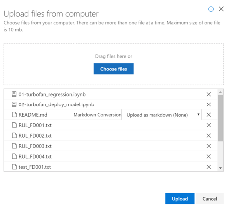

# Tutorial: Machine Learning and IoT Edge – train and deploy an ML model

## 1 Train and deploy ML model

### 1.1 Role

The steps in this section might be typically performed by data
scientists.

### 1.2 Introduction

In this section, we use Azure Notebooks first to train a machine
learning model using Azure Machine Learning and then to package the
model as a container image that can be deployed as an Azure IoT Edge
Module. The Azure Notebooks takes advantage of an Azure Machine Learning
service workspace, which is a foundational block used to experiment,
train, and deploy machine learning models.

The activities in this section are broken up across two notebooks.

  - **01-turbofan\_regression.ipynb:** This notebook walks through the
    steps to train and publish an ML model using Azure ML. Broadly, the
    steps involved are:
    
    1.  Download, prepare, and explore the training data
    
    2.  Use the service workspace to create and run an ML experiment
    
    3.  Evaluate the model results from the experiment
    
    4.  Publish the best model to the service workspace

  - **02-turbofan\_deploy\_model.ipynb:** This notebook takes the model
    created in the previous notebook and uses it to create a container
    image ready to be deployed to an Azure IoT Edge.
    
    5.  Create a scoring script for the model
    
    6.  Create and publish the image
    
    7.  Deploy the image as a web service on Azure Container Instance
    
    8.  Use the web service to validate the model and the image work as
        expected

### 1.3 Setup Azure Notebooks 

We use Azure Notebooks to host the two Jupyter Notebooks and supporting
files. Here we create and configure an Azure Notebooks project. If you
have not used Jupyter and/or Azure Notebooks here are a couple of
introductory documents:

  - **Quickstart:** [Create and share a
    notebook](https://docs.microsoft.com/en-us/azure/notebooks/quickstart-create-share-jupyter-notebook)

  - **Tutorial:** [Create and run a Jupyter notebook with
    Python](https://docs.microsoft.com/en-us/azure/notebooks/tutorial-create-run-jupyter-notebook)

As with the Dev VM before, we choose to use Azure notebooks to ensure a
consistent environment for the exercise.

> [!NOTE]
> Once setup the Azure Notebooks service can be accessed from any machine. During setup, you should use the development VM, which has all of the files that you will need.

#### 1.3.1 Create an Azure Notebooks account

Azure Notebook accounts are independent from Azure subscriptions. To use
Azure Notebooks, you need to create an account.

1.  Navigate to <http://notebooks.azure.com>

2.  Click “Sign In” in the upper, right-hand corner of the page

3.  Enter credentials using either and Azure Active Directory (AAD) or
    Microsoft Account

4.  If you have not used Azure Notebooks before you will be prompted to grant access for the Azure Notebooks app:

5.  Create a user id for Azure Notebooks:

    

#### 1.3.2 Create a project

1.  Click “My Projects” from the top menu bar

2.  Click “+ New Project” name and an ID. There is no need for the project to be public or have a readme.

#### 1.3.3 Upload Jupyter notebooks files

In this step, we upload files to the Azure Notebooks project we created
in the last section. Specifically, the files that we upload are:

  - **01-turbofan\_regression.ipynb**: Jupyter notebook file that walks
    through the process of downloading the device harness generated data
    from the Azure storage account; exploring and preparing the data for
    training the classifier; training the model; testing the data using
    the test dataset found in the Test\_FD003.txt file; and, finally
    saving the classifier model in the Machine Learning service
    workspace.

  - **02-turbofan\_deploy\_model.ipynb:** Jupyter notebook that guides
    you through the process of using the classifier model saved in the
    Machine Learning service workspace to produce a container image.
    Once the image is created the notebook walks you through the process
    of deploying the image as a web service so that you can validate it
    is working as expected. This validated image will be deployed to our
    edge device in the [Create IoT Edge Modules](#section) section.

  - **Test\_FD003.txt:** This file contains the data we will use as our
    test set when validating our trained classifier. We chose to use the
    test data as provided for the original contest as our test set for
    simplicity of the example.

  - **RUL\_FD003.txt:** This file contains the RUL for the last cycle of
    each device in the Test\_FD003.txt file. See the **readme.txt** and
    the **Damage Propagation Modeling.pdf** files in the
    C:\\source\\IoTEdgeAndMlSample\\data\\Turbofan for a detailed
    explanation of the data.

  - **Utils.py:** Contains a set of Python utility functions for working
    with data. The first notebook contains a detailed explanation of the
    functions.

  - **README.md:** Readme describing the use of the notebooks.

1.  Click on “Upload” and choose “From Computer”

2.   Click n “Choose files”

3.  Navigate to C:\\source\\IoTEdgeAndMlSample\\AzureNotebooks and select all files and click “Open”

4.  Click on upload  
    

5.  Click “Done”

### 1.4 Run Azure Notebooks

Now that that project is created, run the 01-turbofan\_regression.ipynb
by:

1.  From the turbofan project page click on "01-turbofan\_regression.ipynb"

    

2.  If prompted, choose the Python 3.6 Kernel from the dialog and click “Set Kernel”:

3.  If the notebook is listed as “Not Trusted”, click on the 'Not Trusted' widget in the top right of the notebook. When the dialog comes up click on 'Trust'

4.  Follow the instructions in the notebook.
    
      - **Helpful shortcuts**:
        
        - Ctrl + Enter runs a cell
        
        - Shift + Enter runs a cell and navigates to the next cell
    
      - **Note**: when a section is being run, it will have an asterisk between the square brackets (e.g. \[ \* \]). When it is complete, the asterisk will be replaced with a number and relevant output may be appear below. Sections usually build off the previous ones so wait to run the next section after the previous one has completed.

When you have finished running the 01-turbofan\_regression.ipynb return
to the project page and click on “02-turbofan\_deploy\_model.ipynb” to
run the second notebook.

### 1.5 Summary

In this section, we used 2 Jupyter Notebooks running in Azure Notebooks
to use the data from the turbofan devices to train a remaining useful
life (RUL) classifier, to save the classifier as a model, to create a
container image, and to deploy and test the image as a web service.