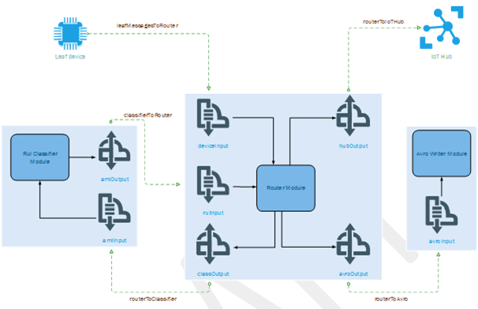
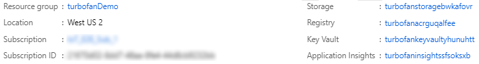
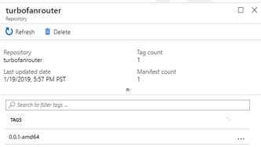

# Tutorial: Machine Learning and IoT Edge – create IoT Edge modules

## 1.1 Role

This step is typically performed by a cloud developer.

## 1.2 Introduction

Edge Hub facilitates module to module communication. Using Edge Hub as a message broker keeps modules independent from each other. Modules only need to specify the inputs on which they accept messages and the outputs to which they write messages.

We want the Edge device to accomplish four things for us:

* Receive data from the leaf devices
* Predict RUL for the device that sent the data
* Send a message with only the RUL for the device to IoT Hub (this could be modified to only send data if the RUL drops below some level)
* Persist the device data received by Edge to a local file. This data file is then periodically uploaded via file upload to the hub to refine training of the ML model. Using file upload instead of constant message streaming is significantly more cost effective.

To accomplish this, we will use 3 custom modules:

* **RUL Classifier:** The turboFanRulClassifier module we created in [02-turbofan\_deploy\_model.ipynb](onenote:#5.%20Set%20up%20Azure%20Notebooks%20&section-id={7269C301-14AA-4516-B6D7-BC34868F3492}&page-id={65B223B7-1603-47FB-B2CD-CBA105C37267}&end&base-path=https://microsoft.sharepoint.com/teams/IoTE2E/Shared%20Documents/General/IoTE2E/Onboarding.one) is a standard machine learning module, which exposes an input called "amlInput" and an output called "amlOutput". The "amlInput" expects its input to look exactly like the input that we sent to the ACI based web service. Likewise, "amlOutput" returns the same data as the web service.

* **Avro writer:** This module receives messages on the "avroModuleInput" input and persists the message in Avro format to disk for later upload to IoT Hub.

* **Router Module:** The router module receives messages from downstream leaf devices, formats and sends the messages to the classifier. The module then receives the messages from the classifier and forwards the message onto the Avro writer module. Finally, the module sends just the RUL prediction to the IoT Hub.
    
  * **Inputs**:
    * **deviceInput**: receives messages from leaf devices
    * **rulInput:** receives messages from the "amlOutput"
    
  * **Outputs:**
    * **classify:** sends messages to "amlInput"
    * **writeAvro:** sends messages "avroModuleInput"
    * **toIotHub:** sends messages to $upstream, which passes the messages to the connected IoT Hub

The diagram below shows the modules, inputs, outputs and the IoT Edge Hub routes for the full solution:



## 1.3 Create an Edge Solution with RUL Classifier Module

During execution of the second of our two Azure Notebooks, we created and published a container image containing our RUL model. Azure Machine Learning (AML), as part of the image creation process, built in the pieces to make the image deployable as an Azure IoT Edge module. In this step, we are going to create an Azure IoT Edge solution using the “Azure Machine Learning” module and point the module to the image we published using Azure Notebooks.

1.  Open a remote desktop session to your development machine.

2.  Open folder C:\\source\\IoTEdgeAndMlSample in Visual Studio Code.

3.  Right click on the explorer panel (in the blank space) and select **New IoT Edge Solution**.

    

4.  Accept the default solution name **EdgeSolution**.

5.  Choose **Azure Machine Learning** as the module template.

6.  Name the module **turbofanRulClassifier**.

7.  Choose your machine learning workspace.

8.  Select the image you created while running the Azure Notebook.

9.  Look at the solution and notice the files that have been created:
    
    * **deployment.template.json:** This file contains the definition of each of the modules in the solution. There are three sections to pay attention to in this file:
        
      * **Registry credentials:** defines the set of custom container registries you are using in your solution. Right now, it should contain the registry from your machine learning workspace, which is where your AML image was stored. You can have any number of container registries, but for simplicity we will use this one registry for all modules
      
        ```json
        "registryCredentials": {
          "turbofanacrptzrofnh": {
            "username": "$CONTAINER_REGISTRY_USERNAME_<your registry>",
            "password": "$CONTAINER_REGISTRY_PASSWORD_<your registry>",
            "address": "<your registry>.azurecr.io”
          }
        }
        ```

      * **Modules:** this section contains the set of user defined modules that go with this solution. You will notice that this section currently contains 2 modules, tempSensor and turbofanRulClassifier. The tempSensor was installed by the Visual Studio Code template and we don’t need it so delete the highlighted section below. Looking at the other module note that it points to the image in your container registry. As we add more modules to the solution they will show up in this section.
      
        ```json
        "modules": {
          "tempSensor": {
            "version": "1.0",
            "type": "docker",
            "status": "running",
            "restartPolicy": "always",
            "settings": {
              "image": "mcr.microsoft.com/azureiotedge-simulated-temperature-sensor:1.0",
              "createOptions": {}
            }
          },
          "turbofanRulClassifier": {
            "version": "1.0",
            "type": "docker",
            "status": "running",
            "restartPolicy": "always",
            "settings": {
              "image": "<your registry>.azurecr.io/edgemlsample:1",
              "createOptions": {}
            }
          }
        }
        ```

      * **Routes:** we will be working with routes quite a bit in the remainder of this portion of the walk-through. Routes define how loosely coupled modules communicate with each other. The two routes defined by the template do not match with the routing we need. The first route sends all the data from any output of the classifier to the IoT Hub ($upstream). The other route is for tempSensor, which we just deleted. Delete the routes by deleting the highlighted area.

        ```json
        "$edgeHub": {
          "properties.desired": {
            "schemaVersion": "1.0",
            "routes": {
              "turbofanRulClassifierToIoTHub": "FROM /messages/modules/turbofanRulClassifier/outputs/\* INTO $upstream",
              "sensorToturbofanRulClassifier": "FROM /messages/modules/tempSensor/outputs/temperatureOutput INTO BrokeredEndpoint(\\"/modules/turbofanRulClassifier/inputs/input1\\")"
            },
            "storeAndForwardConfiguration": {
              "timeToLiveSecs": 7200
            }
          }
        }
        ```

    * **deployment.debug.template.json:** this is the debug version of deployment.template.json. We should mirror all of the changes from the deployment.template.json into this file.

    * **.env:** this file contains the username and password for accessing your registry.

10. Right click on the deployment.template.json file in Visual Studio Code explorer and select **Build IoT Edge Solution**.

11. Notice that this creates a config folder with a deployment.amd64.json file. This file is the concrete deployment template for the solution.

## 1.4 Add Router module

Next, we add the Router module to our edge solution. The Router module handles several responsibilities for our solution:

* **Receive messages from leaf devices:** as messages arrive to the edge device from downstream devices, the Router module receives the message and begins orchestrating the routing of the message.
* **Send messages to the RUL Classifier module:** when a new message is received from a downstream device, the Router module transforms the message to the format that the RUL Classifier expects. The Router sends the message to the RUL Classifier for a RUL prediction. Once the classifier has made a prediction, it sends the message back to the Router module.
* **Send RUL messages to IoT Hub:** when the Router receives messages from the classifier, it transforms the message to contain only the essential information, device ID and RUL, and sends the abbreviated message to the IoT Hub reducing the size of the messages flowing to the hub. A further refinement, which we have not done here, would send messages to the IoT Hub only when the RUL prediction falls below a threshold (e.g. RUL \< 100 cycles). Filtering in this way, would reduce volume of messages and reduce cost of the IoT Hub.
* **Send message to the Avro Writer module:** to preserve all the data send by the downstream device, the Router module sends the entire message received from the classifier to the Avro Writer module, which will persist and upload the data using IoT Hub file upload.

> [!NOTE]
> the description of the module responsibilities may make the processing seem sequential, but the flow is message/event based. This is why we need an orchestration module like our Router module.

### 1.4.1 Create module and copy files

1.  Right click on the modules folder in Visual Studio Code and choose **Add IoT Edge Module**.

2.  Choose **C# module**.

3.  Name the module **turbofanRouter**.

4.  When prompted for your Docker Image Repository use the registry from the ML workspace (you can find the registry in the registryCredentials node of your *deployment.template.json* file). This will be the fully qualified address to the registry, like **\<your registry\>.azurecr.io/turbofanrouter**.

    > [!NOTE]
    > In this walk-through, we use the Azure Container Registry created by the Machine Learning service workspace, which we used to train and deploy our classifier. This is purely for convenience, we could have just as easily created a new container registry and published our modules there.

5.  Open a new terminal window in Visual Studio Code (`Ctrl + Shift + \``) and copy files from the modules directory.

    ```
    copy c:\source\IoTEdgeAndMlSample\EdgeModules\modules\turbofanRouter\*.cs c:\source\IoTEdgeAndMlSample\EdgeSolution\modules\turbofanRouter\
    ```

6.  When prompted to overwrite program.cs press `y` and then hit `Enter`.

### 1.4.2 Build router module

1.  In Visual Studio Code select **Terminal** > **Configure Default Build Task**.

2.  Click on **Create tasks.json file from template**.

3.  Click on **.NET Core**.

4.  When tasks.json opens replace the contents with:

    ```json
    {
      // See https://go.microsoft.com/fwlink/?LinkId=733558
      // for the documentation about the tasks.json format      
      "version": "2.0.0",
      "tasks": [
        {
          "label": "build",
          "command": "dotnet",
          "type": "shell",
          "group": {
            "kind": "build",
            "isDefault": true
          },
          "args": [
            "build",
            "${workspaceFolder}/modules/turbofanRouter"
          ],
          "presentation": {
            "reveal": "always"
          },
          "problemMatcher": "$msCompile"
        }
      ]
    }
    ```

5.  Save and close tasks.json.

6.  Run build with `Ctrl + Shift + B` or **Terminal** > **Run Build Task…**.

### 1.4.3 Setup module routes

As mentioned above, the Edge runtime uses routes configured in the *deployment.template.json* to manage communication between loosely coupled modules. In this section, we drill into how to set up the routes for the turbofanRouter module. We will cover the input routes first and then move on the outputs.

#### 1.4.3.1 Inputs

1.  In the Init() method of Program.cs we register 2 callbacks for the module:

    ```csharp
    await ioTHubModuleClient.SetInputMessageHandlerAsync(EndpointNames.FromLeafDevice, LeafDeviceInputMessageHandler, ioTHubModuleClient);
    await ioTHubModuleClient.SetInputMessageHandlerAsync(EndpointNames.FromClassifier, ClassifierCallbackMessageHandler, ioTHubModuleClient);
    ```

2.  The first callback listens for messages sent to the **deviceInput** sink. From the diagram above, we see that we want to route messages from any leaf device to this input. In the *deployment.template.json* file add a route that tells the edge hub to route any message received by the edge device that was not sent by an edge module into the input called "deviceInput" on the turbofanRouter module:

    ```json
    "leafMessagesToRouter": "FROM /messages/* WHERE NOT IS_DEFINED($connectionModuleId) INTO BrokeredEndpoint(\"/modules/turbofanRouter/inputs/deviceInput\")"
    ```

3.  Next add a route for messages from the rulClassifier module into the turbofanRouter module:

    ```json
    "classifierToRouter": "FROM /messages/modules/classifier/outputs/amloutput INTO BrokeredEndpoint(\"/modules/turbofanRouter/inputs/rulInput\")"
    ```
    
#### 1.4.3.2 Outputs

1.  Program.cs defines the method SendMessageToClassifier() uses the module client to send a message to the RUL classifier using the route:

    ```json
    "routerToClassifier": "FROM /messages/modules/turbofanRouter/outputs/classOutput INTO BrokeredEndpoint(\"/modules/classifier/inputs/amlInput\")"
    ```

2.  SendRulMessageToIotHub() uses the module client to send just the RUL data for the device to the IoT Hub via the route:

    ```json
    "routerToIoTHub": "FROM /messages/modules/turboFanRouter/outputs/hubOutput INTO $upstream"
    ```

3.  SendMessageToAvroWriter() uses the module client to send the message with the RUL data added to the avroFileWriter module.

    ```json
    "routerToAvro": "FROM /messages/modules/turbofanRouter/outputs/avroOutput INTO BrokeredEndpoint(\"/modules/avroFileWriter/inputs/avroModuleInput\")"
    ```

4.  HandleBadMessage() sends failed messages upstream the IoT Hub where they can be routed for later.

    ```json
    "deadLetter": "FROM /messages/modules/turboFanRouter/outputs/deadMessages INTO $upstream"
    ```

#### 1.4.3.3 Summary

With all the routes taken together your “$edgeHub” node should look like
the following (changes highlighted)

```json
"$edgeHub": {
  "properties.desired": {
    "schemaVersion": "1.0",
    "routes": {
      "leafMessagesToRouter": "FROM /messages/* WHERE NOT IS_DEFINED($connectionModuleId) INTO BrokeredEndpoint(\"/modules/turbofanRouter/inputs/deviceInput\")",
      "classifierToRouter": "FROM /messages/modules/turbofanRulClassifier/outputs/amlOutput INTO BrokeredEndpoint(\"/modules/turbofanRouter/inputs/rulInput\")",
      "routerToClassifier": "FROM /messages/modules/turbofanRouter/outputs/classOutput INTO BrokeredEndpoint(\"/modules/turbofanRulClassifier/inputs/amlInput\")",
      "routerToIoTHub": "FROM /messages/modules/turboFanRouter/outputs/hubOutput INTO $upstream",
      "routerToAvro": "FROM /messages/modules/turbofanRouter/outputs/avroOutput INTO BrokeredEndpoint(\"/modules/avroFileWriter/inputs/avroModuleInput\")",
      "deadLetter": "FROM /messages/modules/turboFanRouter/outputs/deadMessages INTO $upstream"
    },
    "storeAndForwardConfiguration": {
      "timeToLiveSecs": 7200
    }
  }
}
```

> [!NOTE]
> Adding the turbofanRouter module created a route like: "turbofanRouterToIoTHub": "FROM /messages/modules/turbofanRouter/outputs/\* INTO $upstream". Remove this route, leaving only the routes listed above in your deployment.template.json file.

#### 1.4.3.4 Copy routes to deployment.debug.template.json

As a final step, to keep our files in sync, mirror the changes you made to deployment.template.json in deployment.debug.template.json.

## 1.5 Add Avro Writer module

The Avro Writer module has two responsibilities in our solution, store messages and upload files.

* **Store messages**: when the Avro Writer module receives a message, it writes the message to the local file system in Avro format. We use a bind mount, which mounts a directory (in this case /data/avrofiles) into a path in the module’s container. This allows the module to write to a local path (/avrofiles) and have those files accessible directly from the edge device.

* **Upload files**: the Avro Writer module uses the Azure IoT Hub file upload feature to upload files to an Azure storage account. Once a file is successfully uploaded the module deletes the file from disk

## 1.5.1 Create module and copy files

1.  In the command palette, search for then select **Python: Select Interpreter**.

2.  Choose the interpreter found in c:\\Python37.

3.  Open the command palette again and search for then select **Terminal: Select Default Shell**.

4.  When prompted, choose **Command Prompt**.

5.  Open a new terminal shell, **Ctrl+Shift+\`** or **Terminal** > **New Terminal**.

6.  Install the Python module template.

    ```cmd
    pip install --upgrade --user cookiecutter
    ```

7.  Right click on the modules folder in Visual Studio Code and choose **Add IoT Edge Module**.

8.  Choose **Python Module**.

9.  Name the module "avroFileWriter".

10. When prompted for your Docker Image Repository use the same registry as you used when adding the Router module.

11. Copy files from the sample module into the solution. 

    ```cmd
    copy C:\source\IoTEdgeAndMlSample\EdgeModules\modules\avroFileWriter\*.py C:\source\IoTEdgeAndMlSample\EdgeSolution\modules\avroFileWriter\
    ```

12. If prompted to overwrite main.py, type `y` and then hit `Enter`.

13. Notice that filemanager.py and schema.py have been added to the solution and main.py has been updated.

> [!NOTE]
> When you open a Python file you may be prompted to install pylint. You do not need to install the linter to complete this walk-through.

### 1.5.2 Bind mount for data files

As mentioned in the intro, the writer module relies on the presence of bind mount to write Avro files to the edge device’s file system.

#### 1.5.2.1 Add directory to edge device

1.  Connect to your edge device VM using SSH.

    ```
    ssh -l \<user\>@IoTEdge-\<extension\>.\<region\>.cloudapp.azure.com
    ```

2.  Create the directory.

    ```bash
    sudo mkdir -p /data/avrofiles
    ```

3.  Update directory permissions to make it writeable by the container.

    ```bash
    sudo chmod ugo+rw /data/avrofiles
    ```

4.  Validate the directory now has write (w) permission for user, group and owner.

    ```bash
    ls -la /data
    ```

    

#### 1.5.2.2 Add directory to the module

To add the directory to the module’s container we will modify the Dockerfiles associated with the avroFileWriter module. You will note that there are 3 Dockerfiles associated with the module: Dockerfile.amd64, Dockerfile.amd64.debug, and Dockerfile.arm32v7. These files should be kept in sync in case we wish to debug or deploy to an arm32 device. For the walk-through we’ll focus only on Dockerfile.amd64.

1.  On your development machine open the files Dockerfile.amd64.

2.  Modify the file so that is looks like:

    ```dockerfile
    FROM ubuntu:xenial  
    
    WORKDIR /app

    RUN apt-get update && apt-get install -y --no-install-recommends libcurl4-openssl-dev
    python3-pip libboost-python1.58-dev libpython3-dev && rm -rf /var/lib/apt/lists/*

    RUN pip3 install --upgrade pip
    COPY requirements.txt ./
    RUN pip install -r requirements.txt

    COPY . .

    RUN useradd -ms /bin/bash moduleuser
    RUN mkdir /avrofiles && chown moduleuser /avrofiles
    USER moduleuser

    CMD [ "python3", "-u", "./main.py"
    ```

3.  These 2 lines instruct the Docker build process to create a top-level directory called /avrofiles in the image and then to make the moduleuser the owner of that directory. It is important that these commands are inserted after the module user is added to the image with the useradd command and before the context switches to the moduleuser (USER moduleuser).

4.  Make the corresponding changes to Dockerfile.amd64.debug and Dockerfile.arm32v7.

#### 1.5.2.3 Update the module configuration

The final step of creating the bind is to update the deployment.template.json (and deployment.debug.template.json) files with the bind information.

1.  Open deployment.template.json.

2.  Modify the module definition for avroFileWriter by adding the lines below, which points the container directory /avrofiles to the local directory on the edge device.

    ```json
    "avroFileWriter": {
      "version": "1.0",
      "type": "docker",
      "status": "running",
      "restartPolicy": "always",
      "settings": {
        "image": "${MODULES.avroFileWriter}",
        "createOptions": {
          "HostConfig": {
            "Binds": [
              "/data/avrofiles:/avrofiles"
            ]
          }
        }
      }
    }
    ```

3.  Make the corresponding changes to deployment.debug.template.json.

### 1.5.3 Bind mount for access to config.yaml

We need to add one more bind for the writer module. This bind gives the module access to read the connection string from the /etc/iotedge/config.yaml file on the edge device. We need the connection string to create an IoTHubClient so that we can call the upload\_blob\_async method to upload files to the IoT Hub. The steps for
adding this bind are similar to the ones above

#### 1.5.3.1 Update directory permission on edge device

1.  Open edge device using SSH.

    ```
    ssh -l <user>@IoTEdge-<extension>.<region>.cloudapp.azure.com
    ```

2.  Add read permission to the config.yaml file.

    ```bash
    sudo chmod +r /etc/iotedge/config.yaml
    ```

3.  Validate the permissions are set correctly.

    ```bash
    ls -la /etc/ioted ge/
    ```

4.  Ensure that the permissions for config.yaml are **-r--r--r--**.

#### 1.5.3.2 Add directory to module

1.  On your development machine, open the files Dockerfile.amd64.

2.  Modify the file so that is looks like:

    ```dockerfile
    FROM ubuntu:xenial

    WORKDIR /app

    RUN apt-get update && apt-get install -y --no-install-recommends libcurl4-openssl-dev
    python3-pip libboost-python1.58-dev libpython3-dev && rm -rf /var/lib/apt/lists/\*

    RUN pip3 install --upgrade pip
    COPY requirements.txt ./
    RUN pip install -r requirements.txt

    COPY . .
    
    RUN useradd -ms /bin/bash moduleuser
    RUN mkdir /avrofiles && chown moduleuser /avrofiles
    RUN mkdir -p /app/iotconfig && chown moduleuser /app/iotconfig

    USER moduleuser

    CMD "python3", "-u", "./main.py"
    ```

3.  Make the corresponding changes to Dockerfile.amd64.debug and
    Dockerfile.arm32v7.

#### 1.5.3.3 Update the module configuration

1.  Open deployment.template.json.

2.  Modify the module definition for avroFileWriter by adding the line below, which points the container directory /app/iotconfig to the local directory /etc/iotedge on the edge device.

    ```json
    "avroFileWriter": {
      "version": "1.0",
      "type": "docker",
      "status": "running",
      "restartPolicy": "always",
      "settings": {
        "image": "${MODULES.avroFileWriter}",
        "createOptions": {
          "HostConfig": {
            "Binds": [
              "/data/avrofiles:/avrofiles",
              "/etc/iotedge:/app/iotconfig"
            ]
          }
        }
      }
    }
    ```

3.  Make the corresponding changes to deployment.debug.template.json.

## 1.6 Install dependencies

The writer module takes a dependency on two Python libraries, fastavro and PyYAML. We need to install the dependencies on our development machine and instruct the Docker build process to install them in our module’s image.

### 1.6.1 PyYAML

1.  On your development machine open requirements.txt and add pyyaml.

    ```txt
    azure-iothub-device-client~=1.4.3
    pyyaml
    ```

2.  Open Dockerfile.amd64 and add a line to upgrade setuptools

    ```dockerfile
    FROM ubuntu:xenial

    WORKDIR /app

    RUN apt-get update && \
        apt-get install -y --no-install-recommends libcurl4-openssl-dev python3-pip libboost-python1.58-dev libpython3-dev && \
        rm -rf /var/lib/apt/lists/\*

    RUN pip3 install --upgrade pip
    RUN pip install -U pip setuptools
    COPY requirements.txt ./
    RUN pip install -r requirements.txt

    COPY . .

    RUN useradd -ms /bin/bash moduleuser
    RUN mkdir /avrofiles && chown moduleuser /avrofiles
    RUN mkdir -p /app/iotconfig && chown moduleuser /app/iotconfig
    USER moduleuser

    CMD [ "python3", "-u", "./main.py" ]
    ```

3.  Make the corresponding changes to Dockerfile.amd64.debug

4.  Install pyyaml locally by opening a terminal in Visual Studio Code and typing

    ```cmd
    pip install pyyaml
    ```

### 1.6.2 Fastavro

1.  Open requirements.txt and add fastavro making the file contents:

    ```txt
    azure-iothub-device-client~=1.4.3
    pyyaml
    fastavro
    ```

2.  Install fastavro to your development machine. Using Visual Studio Code terminal

    ```cmd
    pip install fastavro
    ```

## 1.7 Reconfigure IoT Hub 

By introducing the edge device and modules to the system, we have changed our expectations about what data will be sent to the hub and for what purpose. We need to reconfigure the routing in the hub to deal with our new reality.

> [!NOTE]
> We reconfigure the hub before deploying modules because some of the hub settings, specifically file upload, needs to be correctly set up for the avroFileWriter module to run correctly

### 1.7.1 Set up route for RUL messages in IoT Hub

With the router and classifier in place, we expect to receive regular messages containing only the device id and the RUL prediction for the device. We want to route the RUL data to its own storage location where we can monitor the status of the devices, build reports and fire alerts as needed. At the same time, we want any device data that is still being sent directly by a leaf device that has not yet been attached to our edge device to continue to route to the current storage location.

#### 1.7.1.1 Create a RUL message route

1.  In the Azure portal, navigate to your IoT Hub.

2.  From the left navigation choose “Message routing".

3.  Click on “+Add”.

4.  Name the route “RulMessageRoute”.

5.  Click on “+Add -\> Blob storage” next to the “Endpoint” selector.

6.  In “Add a storage endpoint” name the endpoint “ruldata”.

7.  Click on “Pick a container”.

8.  Choose the storage account used throughout this walkthrough, which is named like “iotedgeandml\<unique suffix\>”.

9.  Choose the “ruldata” container and click “Select”.

10. Click “Create” to create the storage endpoint.

11. For the 'Routing query' enter:

    ```sql
    IS_DEFINED($body.PredictedRul) AND NOT IS_DEFINED($body.OperationalSetting1)
    ```

12. Expand 'Test' and the 'Message body' and replace the message with (an example of our expected messages)

    ```json
    {
      "ConnectionDeviceId": "aaLeafDevice\_1",
      "CorrelationId": "b27e97bb-06c5-4553-a064-e9ad59c0fdd3",
      "PredictedRul": 132.62721409309165,
      "CycleTime": 64.0
    }
    ```

13. Click on “Test route”. If the test is successful, you see “The message matched the query.”

14. Click “Save”.

#### 1.7.1.2 Update turbofanDeviceToStorage route

We don't want to route the new prediction data to our old storage location so update the route to prevent it.

1.  In the IoT Hub “Message routing” page click on “Routes”.

2.  Click "turbofanDeviceDataToStorage" (or whatever name you gave to your initial device data route).

3.  Update the routing query to

    ```sql
    IS_DEFINED($body.OperationalSetting1)
    ```

4.  Open “Test” and “Message body” and add the message

    ```json
    {
      "Sensor13": 2387.96,
      "OperationalSetting1": -0.0008,
      "Sensor6": 21.61,
      "Sensor11": 47.2,
      "Sensor9": 9061.45,
      "Sensor4": 1397.86,
      "Sensor14": 8140.39,
      "Sensor18": 2388.0,
      "Sensor12": 522.87,
      "Sensor2": 642.42,
      "Sensor17": 391.0,
      "OperationalSetting3": 100.0,
      "Sensor1": 518.67,
      "OperationalSetting2": 0.0002,
      "Sensor20": 39.03,
      "DeviceId": 19.0,
      "Sensor5": 14.62,
      "PredictedRul": 212.00132402791962,
      "Sensor8": 2388.01,
      "Sensor16": 0.03,
      "CycleTime": 42.0,
      "Sensor21": 23.3188,
      "Sensor15": 8.3773,
      "Sensor3": 1580.09,
      "Sensor10": 1.3,
      "Sensor7": 554.57,
      "Sensor19": 100.0
    }
    ```

5.  Click on “Test route”. If the test is successful, you see “The message matched the query.”

6.  Click “Save”.

### 1.7.2 Configure file upload

The IoT Hub file upload feature needs to be configured to enable the file writer module to upload files to storage.

1.  From the left navigator in your IoT Hub choose “File upload”.

2.  Click on “Azure Storage Container”.

3.  Select your storage account from the list.

4.  Select the “uploadturbofanfiles” container and click “Select”.

5.  Click on 'Save'; the portal will notify you when the save is complete.

> [!Note]
> We aren't turning on upload notification for this walk-through, but see [Receive a file upload notification](../iot-hub/iot-hub-java-java-file-upload.md#receive-a-file-upload-notification) for details on how to handle file upload notification.

## 1.8  Build, publish and deploy modules

Now that we have made the configuration changes, we are ready to build the images and publish them to our Azure Container Registry. The build process uses the deployment.template.json file to determine which modules need to be built. The settings for each module, including version, is found in the module.json file in the module folder. The build will first run a Docker build on the Dockerfiles matching the current configuration found in the module.json file to create an image. Then the build will publish the image to the registry from the module.json file with a version tag matching the one in the module.json file. Finally, the build will produce a configuration specific deployment template (e.g. deployment.amd64.json), which we will deploy to the IoT Hub edge device. The edge device will read the information from the IoT Hub, and based on the instructions will download the modules, configure the routes, set any desired properties. This deployment method has 2 side effects that you should be aware of:

* **Deployment lag:** since the Edge runtime must recognize the change to the hub before it starts to reconfigure, it can take some amount of time after you deploy your modules until the runtime picks them up and starts to update the edge device.

* **Module versions matter:** if you publish a new version of a module’s container to your container registry using the same version tags as the previous module the runtime will not download the new version of the module. It does a comparison of the version tag of the local image and the desired image from the deployment manifest, if those versions match the runtime takes no further action. It is, therefore, important to bump the version of your module each time you wish to deploy new changes. Do this by changing the “version” property under the “tag” property in the module.json file for the module you are changing. Then build and publish the module.

    ```json
    {
      "$schema-version": "0.0.1",
      "description": "",
      "image": {
        "repository": "turbofanacrptzrofnh.azurecr.io/avrofilewriter",
        "tag": {
          "version": "0.0.1",
          "platforms": {
            "amd64": "./Dockerfile.amd64",
            "amd64.debug": "./Dockerfile.amd64.debug",
            "arm32v7": "./Dockerfile.arm32v7"
          }
        },
        "buildOptions": []
      },
      "language": "python"
    }
    ```

### 1.8.1 Build and publish

1.  In Visual Studio Code on your development VM, open the .env file in your solution, it will look like:

    ```env
    CONTAINER_REGISTRY_USERNAME_<your registry name>=<ACR username>
    CONTAINER_REGISTRY_PASSWORD_<your registry name>=<ACR password>
    ```

3.  Open the deployment.template.json file and find the “registryCredentials” property.

    ```json
    "registryCredentials": {
      "turbofanacrptzrofnh": {
        "username": "$CONTAINER_REGISTRY_USERNAME_<your registry name>",
        "password": "$CONTAINER_REGISTRY_PASSWORD_<your registry name>",
        "address": "<ACR login server>"
      }
    }
    ```

4.  Open a Visual Studio Code terminal window and login to your container registry.

    ```cmd
    docker login -u <ACR username> -p <ACR password> <ACR login server>
    ```

5.  In Visual Studio Code right-click on deployment.template.json and choose “Build and Push IoT Edge Solution”.

### 1.8.2 View modules in the registry

Once the build successfully completes, we will be able to use the Azure Portal to review our published modules.

1.  In the Azure portal, navigate to your Machine Learning service workspace and click the hyperlink for “Registry”.

    

2.  From the registry side navigator click “Repositories”.

3.  Note that “avrofilewriter” and “turbofanrouter” appear as repositories.

4.  Click on “turbofanrouter” and note that you have published one image tagged as 0.0.1-amd64.

    

### 1.8.3 Deploy modules to IoT Edge device

We have built and configured the modules in our solution, now we will deploy the modules to edge device.

1.  In Visual Studio Code right click on the file deployment.amd64.json in the config folder.

2.  Choose “Create Deployment for Single Device”.

3.  Choose your edge device, "aaTurboFanEdgeDevice".

4.  Refresh the 'AZURE IOT HUB DEVICES' panel in Visual Studio Code explorer, you will see the 3 modules are deployed but not yet running.

5.  Refresh again after several minutes and you will see the modules running.  

    

> [!NOTE]
> It can take several minutes for the modules to get installed and running on the edge device and settle into a steady running state. During that time, you may see modules start and stop as they try to establish a connection with the hub module.

## 1.9 Diagnosing failures

In this section we share a few techniques for understanding what has gone wrong with a module or modules. Often a failure can first be spotted from the status in the Visual Studio Code.

### 1.9.1 Identify failed modules

* **Visual Studio Code:** Look at the “AZURE IOT HUB DEVICES” panel if most modules are in a running state, but one is stopped you need to investigate that module further. If all modules are in a stopped state for a long period of time this may indicate failure as well.

* **Azure Portal:** By navigating to the IoT Hub in the portal and then finding the device details page (under IoT Edge, drill into your device) you may find that a module has reported an error or has never reported anything to the IoT Hub.

### 1.9.2 Diagnosing from the edge device

By logging into the edge device, you can gain access to a good deal of information about the status of your modules. The main mechanism we use are the Docker commands that let us examine the containers and images on
the device.

1.  List all running containers, we expect to see a container for each module with a name that corresponds to the module. Also, this lists the exact image for the container including version so you can match with your expectation. You can also list images by substituting “image” for “container” in the command.

    ```bash
    sudo docker container ls
    ```

2.  Get the logs for a container. This outputs whatever has been written to StdErr and StdOut in the container. This command will work for containers that have started and then died for some reason. It is also useful for understanding what has been happening with the edgeAgent or edgeHub.

    ```bash
    sudo docker container logs <container name>
    ```

3.  Inspect a container. This gives a ton of information about the image. The data can be filtered depending on what you are looking for. As an example, if you want to see if the binds on the avroFileWriter are correct you can use the command:

    ```bash
    sudo docker container inspect -f "{{ json .Mounts }}" avroFileWriter | python -m json.tool
    ```

4.  Connect to a running container. This can be helpful if you want to examine the container while it is running:

    ```bash
    sudo docker exec -it avroFileWriter bash
    ```

## 1.10 Summary

In this section, we created an IoT Edge Solution in Visual Studio Code with three modules, a classifier, a router, and a file writer/uploader. We set up the routes to allow the modules to communicate with each other on the edge device, modified the configuration of the edge device, and updated the Dockerfiles to install dependencies and add bind mounts to the modules’ containers. Next, we updated the configuration of the IoT Hub to route our messages based on type and to handle file uploads. With everything in place, we deployed the modules to the IoT Edge device and ensured the modules were running correctly.

More information can be found at the following pages:

* [Deploy Azure Machine Learning as an IoT Edge module](tutorial-deploy-machine-learning.md)

* [Develop a C# IoT Edge module and deploy to your simulated device](tutorial-csharp-module.md)

* [Develop and deploy a Python IoT Edge module to your simulated device](tutorial-python-module.md)

* [Deploy your first IoT Edge module to a Linux x64 device](quickstart-linux.md)

* [Learn how to deploy modules and establish routes in IoT Edge](module-composition.md)

* [IoT Hub message routing query syntax](../iot-hub/iot-hub-devguide-routing-query-syntax.md)

* [IoT Hub message routing: now with routing on message body](https://azure.microsoft.com/en-us/blog/iot-hub-message-routing-now-with-routing-on-message-body/)

* [Upload files with IoT Hub](../iot-hub/iot-hub-devguide-file-upload.md)

* [Upload files from your device to the cloud with IoT Hub](../iot-hub/iot-hub-python-python-file-upload.md)
