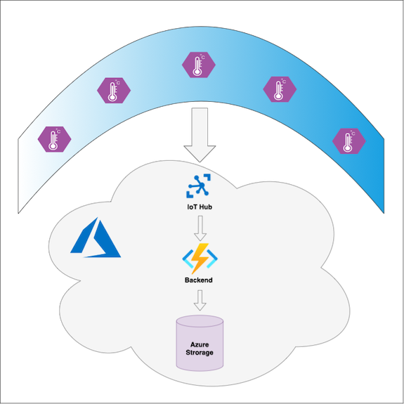
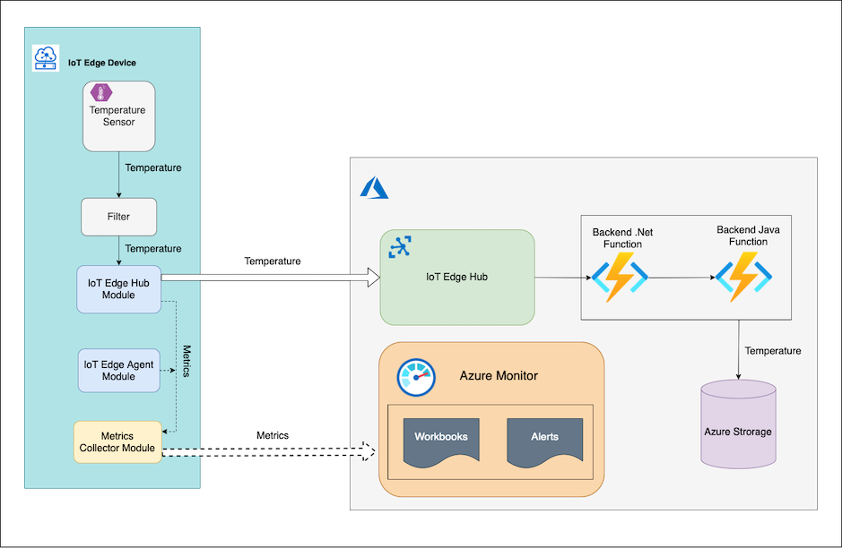
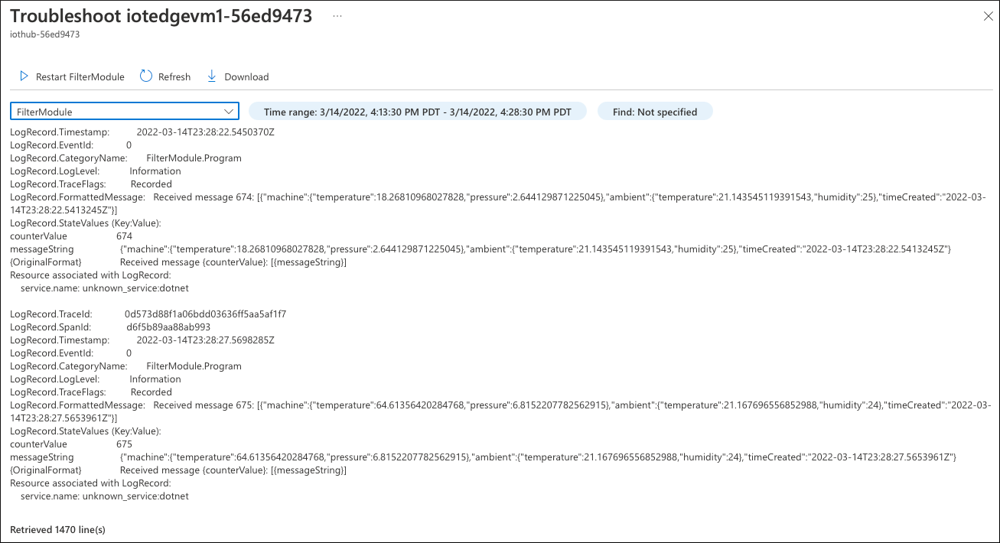
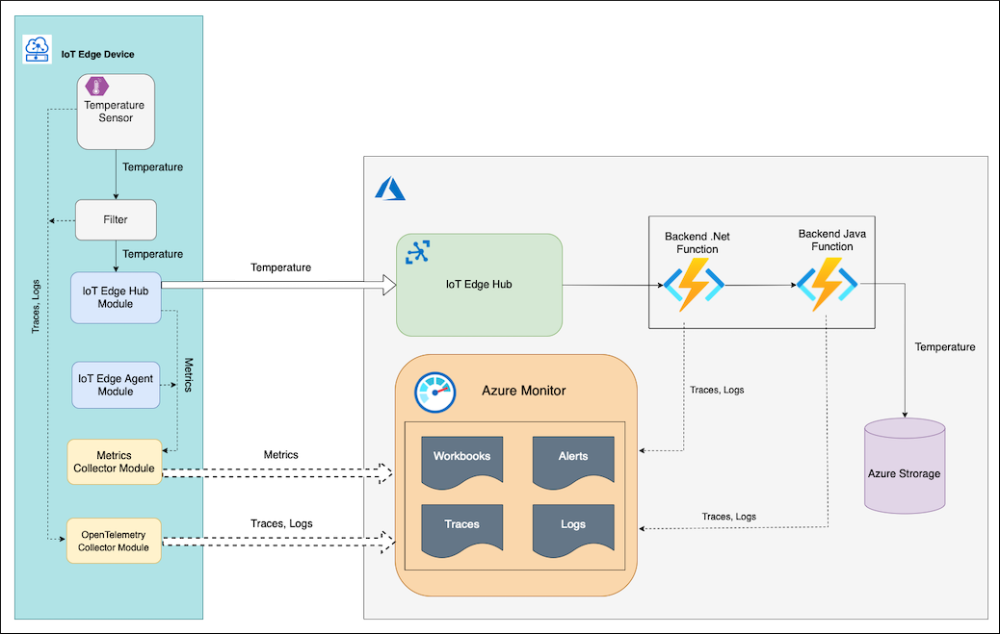

# Tutorial: End-to-end Observability for IoT Edge

[!INCLUDE [iot-edge-version-all-supported](../../includes/iot-edge-version-all-supported.md)]

In this tutorial, you will build an observability solution for a common IoT Edge service. You will learn the concepts and techniques of implementing both observability pillars _Measuring and Monitoring_ and _Troubleshooting_. You will accomplish the following tasks:
* Define what indicators of the service performance to monitor 
* Measure service performance indicators with metrics 
* Monitor service measurements and detect issues with Azure Monitor workbooks  
* Perform basic troubleshooting with the curated workbooks
* Perform deep troubleshooting with distributed tracing and correlated logs analysis

## Prerequisites

It is recommended to work with this tutorial in the following order:
* Read it. Follow the considerations and steps to understand the concept and the approach.
* Optionally, `Deploy the Tutorial sample to Azure with this blue button` to reproduce the tutorial steps and play with your own use cases. You will need an Azure Subscription for this.

## Use Case 

In order to go beyond just abstract considerations, the tutorial flow is based on a "real-life" use case:

### La Niña



The La Niña service measures surface temperature in Pacific Ocean to predict La Niña winters. There is a number of buoys in the ocean with IoT Edge devices sending the surface temperature to Azure Cloud. The telemetry data with the temperature is pre-processed by a custom module on the IoT Edge device before sending it to the cloud. In the cloud the data is processed by backend Azure Functions and saved to Azure Blob Storage. The clients of the service (ML inference workflows, decision making systems, various UIs, etc.) can pick up messages with temperature data from the Blob Storage.

## Measuring and Monitoring

### What do we measure and monitor

We are building measuring and monitoring solution for the La Niña service focusing on its business value. To understand what we're going to monitor, we must understand what the service actually does and what the service clients expect from the system. In this use case the expectations of a common La Niña service consumer may be categorized by the following factors:

* **_Coverage_**. The data is coming from the majority of installed buoys
* **_Freshness_**. The data coming from the buoys is fresh and relevant
* **_Throughput_**. The temperature data is delivered from the buoys without significant delays
* **_Correctness_**. The ratio of lost messages (errors) is small

The satisfaction regarding these factors means that the service works according to the client's expetactions.

The next step is to define instruments to measure values of these factors. This job ca be done by the following Service Level Indicators (SLI):

|**Indicator** | **Factors** |
|----------|------|
|Ratio of on-line devices to the total number of devices| Coverage|
|Ratio of devices reporting frequently to the number of reporting devices| Freshness, Throughput|
|Ratio of devices successfully delivering messages to the total number of devices|Correctness|
|Ratio of devices delivering messages fast to the total number of devices| Throughput | 

With that done, we can position a slider on each indicator and define exact threshold values that represent what it means for the client to be "satisfied". The result of this exercise is a list of formal Service Level Objectives (SLOs):

|**Statement**|**Factor**|
|-------------|----------|
|90% of devices reported metrics no longer than 10 mins ago (were online) for the observation interval| Coverage |
|95% of online devices send temperature 10 times per minute for the observation interval| Freshness, Throughput |
|99% of online devices deliver messages successfully with less than 5% of errors for the observation interval| Correctness |
|95% of online devices deliver 90th percentile of messages within 50ms for the observation interval|Throughput|

We should also define parameters of how the indicator values are measured:

- Observation interval: 24h
- Aggregation interval: 10 mins
- Measurements frequency: 5 min
- What is measured: interaction between IoT Device and the cloud, further consumption of the temperature data is out of scope.


### How do we measure

At this point it's clear what we're going to measure and what threshold values we're going to use to determine if the service performs according to the expectations.  

It's a common practice to measure service level indicators, like the ones we have defined, by the means of **_Metrics_**. This type of observability data is considered to be relatively small in values. It's produced by various system components and collected in a central observability backend to be monitored and analyzed with dashboards, workbooks and alerts.

Let's clarify what components the La Niña service consists of.



There is an IoT Edge device with `Temperature Sensor` custom module (C#) that generates some temperature value and sends it upstream with a telemetry message. This message is routed to another custom module `Filter` (C#). This module checks the received temperature against a threshold window (0-100 degrees) and if it the temperature is within the window, the FilterModule sends the telemetry message to the cloud.

In the cloud the message is processed by the backend. The backend consists of a chain of two Azure Functions and a Storage Account. 
Azure .Net Function picks up the telemetry message from the IoT Hub events endpoint, processes it and sends it to Azure Java Function. The Java function saves the message to the storage account blob container.

An IoT Hub device comes with system modules `edgeHub` and `edgeAgent`. These modules expose through a Prometheus endpoint [a list of built-in metrics](https://docs.microsoft.com/azure/iot-edge/how-to-access-built-in-metrics). These metrics are collected and pushed to Azure Monitor Log Analytics service by the [Metrics Collector module](https://docs.microsoft.com/azure/iot-edge/how-to-collect-and-transport-metrics) running on the IoT Edge device. In addition to the system modules, the `Temperature Sensor` and `Filter` modules can be instrumented with some business specific metrics too. However, the service level indicators that we have defined can be measured with the built-in metrics only, so we don't really need to implement anything else at this point. 

### How do we monitor

We're going to monitor Service Level Objectives (SLO) and corresponding Service Level Indicators (SLI) with Azure Monitor Workbooks. This tutorial deploys the "La Nina SLO/SLI" workbook assigned to the IoT Hub. 


To achieve the best user experience the workbooks are designed to follow the _glance_ -> _scan_ -> _commit_ concept:

**_Glance_**
 
At this level we can see the whole picture at a single glance. The data is aggregated and represented at the fleet level:


From what we can see, the service is not functioning according to the expectations. There is a violation of the "Data Freshness" SLO.
Only 90% of the devices send the data frequently, and the service clients expect 95%.

**_Scan_**

By clicking on the violated SLO we can drill down to the Scan level and see how the devices contribute to the aggregated SLI value. 


There is a single device (out of 10) that sends the telemetry data to the cloud "rarely". In our SLO definition we have stated that "frequently" means at least 10 times per minute. The frequency of this device is way below that threshold.

**_Commit_**

By clicking on the problematic device, we're drilling down to the Commit level. This is a curated workbook "Device Details" that comes out of the box with IoT Hub monitoring offering. The "La Nina SLO/SLI" workbook reuses it to bring the details of the specific device performance. 


## Troubleshooting

While Measuring and Monitoring allows us to observe and predict the system behavior, compare it to the defined expectations and ultimately detect existing or potential issues, the Troubleshooting lets identify and locate the cause of the issue.

### Basic Troubleshooting

The Commit level workbook gives a lot of detailed information about the device health. That includes resources consumption at the module and device level, message latency, frequency, QLen, etc. In many cases this information may help locate the root of the issue. 

In this tutorial all parameters of the trouble device look normal and it's not clear why the device sends messages less frequent than expected. This fact is also confirmed by the Messaging tab of the device-level workbook:


The `Temperature` module produced 120 telemetry messages, but only 49 of them went upstream to the cloud.

The first thing we want to do is to check the logs produced by the `Filter` module. We can click the `Troubleshoot live!` button and select the the `Filter` module.



Analysis of the module logs doesn't bring the light on the issue. The module receives messages, there is no errors. Everything looks good here.

### Deep Troubleshooting

There are two observability instruments serving the deep troubleshooting purposes: Traces and Logs. In this tutorial Traces show how a telemetry message with the ocean surface temperature is traveling from the sensor to the storage in the cloud, what is invoking what and with what parameters. Logs give information on what is happening inside each system component during this process. The real power of Traces and Logs comes when they are correlated. With that it's possible to read the logs of a specific system component, such as a module on IoT device or a backend function, while it was processing a specific telemetry message.

The La Niña service leverages [OpenTelemetry](https://opentelemetry.io) to produce and collect traces and logs in Azure Monitor.



IoT Edge modules `Tempperature Sensor` and `Filter` export the logs and tracing data via OTLP protocol to the [OpenTelemetryCollector](https://opentelemetry.io/docs/collector/) module, running on the same edge device. The `OpenTelemetryCollector` module, in its turn, exports logs and traces to Azure Monitor Application Insights service.

The Azure .Net backend Function sends the tracing data to Application Insights with [Azure Monitor Open Telemetry direct exporter](https://docs.microsoft.com/azure/azure-monitor/app/opentelemetry-enable). It also sends correlated logs directly to Application Insights with a configured ILogger instance.

The Java backend function uses [OpenTelemetry auto-instrumentation Java agent](../azure-monitor/app/java-in-process-agent) to produce and export tracing data and correlated logs to the Application Insights instance.

By default IoT Edge modules on the devices of the La Niña service are configured to not produce any tracing data and the logging level is set to `Information`. So the devices don't flood the Azure Monitor with the detailed observability data if it's not requested.

We have analyzed the `Information` level logs of the `Filter` module and realized that we need to dive deeper to locate the cause of the issue. We're going to update properties in the `Temperature Sensor` and `Filter` module twins and increase the logging level to `Debug` and change the traces sampling ratio from 0 to 1:


With that in place, we have to restart the `Temperature Sensor` and `Filter` modules:


In a few minutes the traces and detailed logs will arrive to Azure Monitor from the trouble device. The entire end-to-end message flow from the sensor on the device to the storage in the cloud will be available for monitoring with Application Map in Application Insights:


From this map we can drill down to the traces and we can see that some of them look normal and contain all the steps of the flow, and some of them, are very short, so nothing happens after the `Filter` module. 


Let's analyze one of those short traces and find out what was happening in the `Filter` module, why it didn't send the message upstream to the cloud. 

Our logs are correlated with the traces, so we can query logs specifying the `TraceId` and `SpanId` to retrieve logs corresponding exactly to this execution instance of the `Filter` module:


The logs show that the module received a message with 70.465 degrees temperature, but the filtering threshold configured on this device is 30 to 70. So the message simply didn't pass the threshold. Apparently this specific device was configured wrong. This is the cause of the issue we detected while monitoring the La Niña service performance with the workbook.

## Clean up resources

If you're not going to continue playing with the resources for this tutorial, delete the resource group created at the beginning of the article:

```azurecli
  az group delete --name RG_NAME
```
## Next steps

In this tutorial you have set up a solution with end-to-end observability capabilities for monitoring and troubleshooting. The common challenge in such solutions for IoT systems is delivering observability data from the devices to the cloud. The devices in this tutorial are supposed to be online and have a stable connection to Azure Monitor, which is not always the case in real life. 

Advance to our follow up articles (e.g. [Distributed Tracing with IoT Edge](https://github.com/eedorenko/iotedge-logging-and-monitoring-solution/blob/eedorenko/e2e/docs/iot-edge-distributed-tracing.md) - a candidate to move under Architectures area in Azure Docs) with the recommendations and techniques to handle scenarios when the devices are normally offline or have limited or restricted connection to the observability backend in the cloud. 
