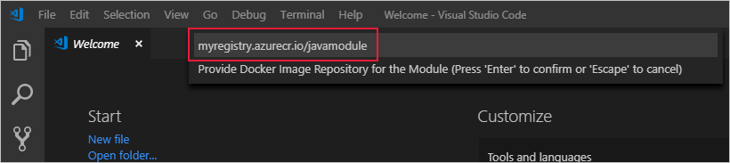
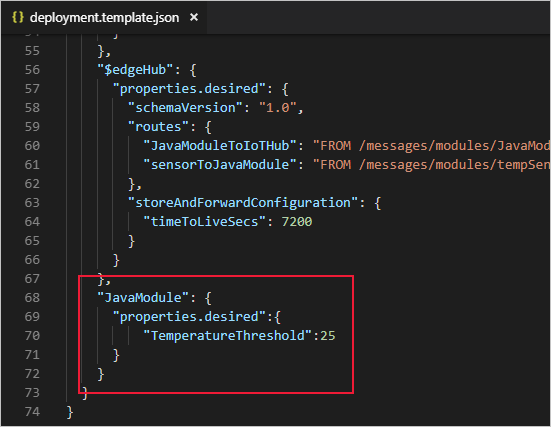

---
# Mandatory fields. See more on aka.ms/skyeye/meta.
title: Custom Java module tutorial - Azure IoT Edge | Microsoft Docs 
description: This tutorial shows you how to create an IoT Edge module with Java code and deploy it to an edge device.
services: iot-edge
author: kgremban
manager: philmea

ms.author: kgremban
ms.date: 04/04/2019
ms.topic: tutorial
ms.service: iot-edge
ms.custom: "mvc, seodec18"
---

# Tutorial: Develop a Java IoT Edge module for Linux devices

You can use Azure IoT Edge modules to deploy code that implements your business logic directly to your IoT Edge devices. This tutorial walks you through creating and deploying an IoT Edge module that filters sensor data. You'll use the simulated IoT Edge device that you created in the Deploy Azure IoT Edge on a simulated device in [Linux](quickstart-linux.md) quickstart. In this tutorial, you learn how to:    

> [!div class="checklist"]
> * Use Visual Studio Code to create an IoT Edge Java module based on the Azure IoT Edge maven template package and Azure IoT Java device SDK.
> * Use Visual Studio Code and Docker to create a Docker image and publish it to your registry.
> * Deploy the module to your IoT Edge device.
> * View generated data.


The IoT Edge module that you create in this tutorial filters the temperature data that's generated by your device. It only sends messages upstream if the temperature is above a specified threshold. This type of analysis at the edge is useful for reducing the amount of data that's communicated to and stored in the cloud. 

[!INCLUDE [quickstarts-free-trial-note](../../includes/quickstarts-free-trial-note.md)]

## Solution scope

This tutorial demonstrates how to develop a module in **Java** using **Visual Studio Code**, and how to deploy it to a **Linux device**. IoT Edge does not support Java modules for Windows devices. 

Use the following table to understand your options for developing and deploying Java modules: 

| Java | Visual Studio Code | Visual Studio 2017/2019 | 
| - | ------------------ | ------------------ |
| **Linux AMD64** |  |  |
| **Linux ARM32** |  |  |

## Prerequisites

Before beginning this tutorial, you should have gone through the previous tutorial to set up your development environment for Linux container development: [Develop IoT Edge modules for Linux devices](tutorial-develop-for-linux.md). By completing either of those tutorials, you should have the following prerequisites in place: 

* A free or standard-tier [IoT Hub](../iot-hub/iot-hub-create-through-portal.md) in Azure.
* A [Linux device running Azure IoT Edge](quickstart-linux.md)
* A container registry, like [Azure Container Registry](https://docs.microsoft.com/azure/container-registry/).
* [Visual Studio Code](https://code.visualstudio.com/) configured with the [Azure IoT Tools](https://marketplace.visualstudio.com/items?itemName=vsciot-vscode.azure-iot-tools).
* [Docker CE](https://docs.docker.com/install/) configured to run Linux containers.

To develop an IoT Edge module in Java, install the following additional prerequisites on your development machine: 

* [Java Extension Pack](https://marketplace.visualstudio.com/items?itemName=vscjava.vscode-java-pack) for Visual Studio Code.
* [Java SE Development Kit 10](https://aka.ms/azure-jdks), and [set the `JAVA_HOME` environment variable](https://docs.oracle.com/cd/E19182-01/820-7851/inst_cli_jdk_javahome_t/) to point to your JDK installation.
* [Maven](https://maven.apache.org/)

## Create a module project
The following steps create an IoT Edge module project that's based on the Azure IoT Edge maven template package and Azure IoT Java device SDK. You create the project by using Visual Studio Code and the Azure IoT Tools.

### Create a new project

Create a Java solution template that you can customize with your own code. 

1. In Visual Studio Code, select **View** > **Command Palette** to open the VS Code command palette. 

2. In the command palette, enter and run the command **Azure IoT Edge: New IoT Edge solution**. Follow the prompts in the command palette to create your solution.

   | Field | Value |
   | ----- | ----- |
   | Select folder | Choose the location on your development machine for VS Code to create the solution files. |
   | Provide a solution name | Enter a descriptive name for your solution or accept the default **EdgeSolution**. |
   | Select module template | Choose **Java Module**. |
   | Provide value for groupId | Enter a group ID value or accept the default **com.edgemodule**. |
   | Provide a module name | Name your module **JavaModule**. |
   | Provide Docker image repository for the module | An image repository includes the name of your container registry and the name of your container image. Your container image is prepopulated from the name you provided in the last step. Replace **localhost:5000** with the login server value from your Azure container registry. You can retrieve the login server from the Overview page of your container registry in the Azure portal. <br><br>The final image repository looks like \<registry name\>.azurecr.io/javamodule. |
 
   
   
If it's the first time to create Java module, it might take several minutes to download maven packages. Then the VS Code window loads your IoT Edge solution workspace. The solution workspace contains five top-level components. The **modules** folder contains the Java code for your module as well as Docker files for building your module as a container image. The **\.env** file stores your container registry credentials. The **deployment.template.json** file contains the information that the IoT Edge runtime uses to deploy modules on a device. And **deployment.debug.template.json** file containers the debug version of modules. You won't edit the **\.vscode** folder or **\.gitignore** file in this tutorial. 

If you didn't specify a container registry when creating your solution, but accepted the default localhost:5000 value, you won't have a \.env file. 

### Add your registry credentials

The environment file stores the credentials for your container registry and shares them with the IoT Edge runtime. The runtime needs these credentials to pull your private images onto the IoT Edge device. 

1. In the VS Code explorer, open the .env file. 
2. Update the fields with the **username** and **password** values that you copied from your Azure container registry. 
3. Save this file. 

### Select your target architecture

Currently, Visual Studio Code can develop Java modules for Linux AMD64 and Linux ARM32v7 devices. You need to select which architecture you're targeting with each solution, because the container is built and run differently for each architecture type. The default is Linux AMD64. 

1. Open the command palette and search for **Azure IoT Edge: Set Default Target Platform for Edge Solution**, or select the shortcut icon in the side bar at the bottom of the window. 

2. In the command palette, select the target architecture from the list of options. For this tutorial, we're using an Ubuntu virtual machine as the IoT Edge device, so will keep the default **amd64**. 

### Update the module with custom code

1. In the VS Code explorer, open **modules** > **JavaModule** > **src** > **main** > **java** > **com** > **edgemodule** > **App.java**.

2. Add the following code at the top of the file to import new referenced classes.

    ```java
    import java.io.StringReader;
    import java.util.concurrent.atomic.AtomicLong;
    import java.util.HashMap;
    import java.util.Map;
    
    import javax.json.Json;
    import javax.json.JsonObject;
    import javax.json.JsonReader;
    
    import com.microsoft.azure.sdk.iot.device.DeviceTwin.Pair;
    import com.microsoft.azure.sdk.iot.device.DeviceTwin.Property;
    import com.microsoft.azure.sdk.iot.device.DeviceTwin.TwinPropertyCallBack;
    ```

3. Add the following definition into class **App**. This variable sets a temperature threshold. The measured machine temperature won't be reported to IoT Hub until it goes over this value. 

    ```java
    private static final String TEMP_THRESHOLD = "TemperatureThreshold";
    private static AtomicLong tempThreshold = new AtomicLong(25);
    ```

4. Replace the execute method of **MessageCallbackMqtt** with the following code. This method is called whenever the module receives an MQTT message from the IoT Edge hub. It filters out messages that report temperatures below the temperature threshold set via the module twin.

    ```java
    protected static class MessageCallbackMqtt implements MessageCallback {
        private int counter = 0;
        @Override
        public IotHubMessageResult execute(Message msg, Object context) {
            this.counter += 1;
 
            String msgString = new String(msg.getBytes(), Message.DEFAULT_IOTHUB_MESSAGE_CHARSET);
            System.out.println(
                   String.format("Received message %d: %s",
                            this.counter, msgString));
            if (context instanceof ModuleClient) {
                try (JsonReader jsonReader = Json.createReader(new StringReader(msgString))) {
                    final JsonObject msgObject = jsonReader.readObject();
                    double temperature = msgObject.getJsonObject("machine").getJsonNumber("temperature").doubleValue();
                    long threshold = App.tempThreshold.get();
                    if (temperature >= threshold) {
                        ModuleClient client = (ModuleClient) context;
                        System.out.println(
                            String.format("Temperature above threshold %d. Sending message: %s",
                            threshold, msgString));
                        client.sendEventAsync(msg, eventCallback, msg, App.OUTPUT_NAME);
                    }
                } catch (Exception e) {
                    e.printStackTrace();
                }
            }
            return IotHubMessageResult.COMPLETE;
        }
    }
    ```

5. Add the following two static inner classes into class **App**. These classes update the tempThreshold variable when the module twin's desired property changes. All modules have their own module twin, which lets you configure the code that's running inside a module directly from the cloud.

    ```java
    protected static class DeviceTwinStatusCallBack implements IotHubEventCallback {
        @Override
        public void execute(IotHubStatusCode status, Object context) {
            System.out.println("IoT Hub responded to device twin operation with status " + status.name());
        }
    }
 
    protected static class OnProperty implements TwinPropertyCallBack {
        @Override
        public void TwinPropertyCallBack(Property property, Object context) {
            if (!property.getIsReported()) {
                if (property.getKey().equals(App.TEMP_THRESHOLD)) {
                    try {
                        long threshold = Math.round((double) property.getValue());
                        App.tempThreshold.set(threshold);
                    } catch (Exception e) {
                        System.out.println("Faile to set TemperatureThread with exception");
                        e.printStackTrace();
                    }
                }
            }
        }
    }
    ```

6. Add the following lines in to **main** method after **client.open()** to subscribe the module twin updates.

    ```java
    client.startTwin(new DeviceTwinStatusCallBack(), null, new OnProperty(), null);
    Map<Property, Pair<TwinPropertyCallBack, Object>> onDesiredPropertyChange = new HashMap<Property, Pair<TwinPropertyCallBack, Object>>() {
        {
            put(new Property(App.TEMP_THRESHOLD, null), new Pair<TwinPropertyCallBack, Object>(new OnProperty(), null));
        }
    };
    client.subscribeToTwinDesiredProperties(onDesiredPropertyChange);
    client.getTwin();
    ```

7. Save the App.java file.

8. In the VS Code explorer, open the **deployment.template.json** file in your IoT Edge solution workspace.

9. Add the **JavaModule** module twin to the deployment manifest. Insert the following JSON content at the bottom of the **moduleContent** section, after the **$edgeHub** module twin: 

   ```json
     "JavaModule": {
         "properties.desired":{
             "TemperatureThreshold":25
         }
     }
   ```

   

10. Save the deployment.template.json file.

## Build and push your module

In the previous section, you created an IoT Edge solution and added code to the **JavaModule** to filter out messages where the reported machine temperature is below the acceptable limit. Now, build the solution as a container image and push it to your container registry. 

1. Open the VS Code integrated terminal by selecting **View** > **Terminal**.

1. Sign in to Docker by entering the following command in the terminal. Sign in with the username, password, and login server from your Azure container registry. You can retrieve these values from the **Access keys** section of your registry in the Azure portal.
     
   ```bash
   docker login -u <ACR username> -p <ACR password> <ACR login server>
   ```

   You may receive a security warning recommending the use of `--password-stdin`. While that best practice is recommended for production scenarios, it's outside the scope of this tutorial. For more information, see the [docker login](https://docs.docker.com/engine/reference/commandline/login/#provide-a-password-using-stdin) reference.

2. In the VS Code explorer, right-click the **deployment.template.json** file and select **Build and Push IoT Edge solution**.

   The build and push command starts three operations. First, it creates a new folder in the solution called **config** that holds the full deployment manifest, built out of information in the deployment template and other solution files. Second, it runs `docker build` to build the container image based on the appropriate dockerfile for your target architecture. Then, it runs `docker push` to push the image repository to your container registry.

## Deploy modules to device

Use the Visual Studio Code explorer and the Azure IoT Tools extension to deploy the module project to your IoT Edge device. You already have a deployment manifest prepared for your scenario, the **deployment.json** file in the config folder. All you need to do now is select a device to receive the deployment.

Make sure that your IoT Edge device is up and running.

1. In the Visual Studio Code explorer, expand the **Azure IoT Hub Devices** section to see your list of IoT devices.

2. Right-click the name of your IoT Edge device, then select **Create Deployment for Single Device**.

3. Select the **deployment.json** file in the **config** folder and then click **Select Edge Deployment Manifest**. Do not use the deployment.template.json file.

4. Click the refresh button. You should see the new **JavaModule** running along with the **TempSensor** module and the **$edgeAgent** and **$edgeHub**.  

## View generated data

Once you apply the deployment manifest to your IoT Edge device, the IoT Edge runtime on the device collects the new deployment information and starts executing on it. Any modules running on the device that aren't included in the deployment manifest are stopped. Any modules missing from the device are started.

You can view the status of your IoT Edge device using the **Azure IoT Hub Devices** section of the Visual Studio Code explorer. Expand the details of your device to see a list of deployed and running modules.

1. In the Visual Studio Code explorer, right-click the name of your IoT Edge device and select **Start Monitoring Built-in Event Endpoint**.

2. View the messages arriving at your IoT Hub. It may take a while for the messages to arrive, because the IoT Edge device has to receive its new deployment and start all the modules. Then, the changes we made to the JavaModule code wait until the machine temperature reaches 25 degrees before sending messages. It also adds the message type **Alert** to any messages that reach that temperature threshold. 

## Edit the module twin

We used the JavaModule module twin in the deployment manifest to set the temperature threshold at 25 degrees. You can use the module twin to change the functionality without having to update the module code.

1. In Visual Studio Code, expand the details under your IoT Edge device to see the running modules. 

2. Right-click **JavaModule** and select **Edit module twin**. 

3. Find **TemperatureThreshold** in the desired properties. Change its value to a new temperature 5 degrees to 10 degrees higher than the latest reported temperature. 

4. Save the module twin file.

5. Right-click anywhere in the module twin editing pane and select **Update module twin**. 

6. Monitor the incoming device-to-cloud messages. You should see the messages stop until the new temperature threshold is reached. 

## Clean up resources 

If you plan to continue to the next recommended article, you can keep the resources and configurations that you created and reuse them. You can also keep using the same IoT Edge device as a test device. 

Otherwise, you can delete the local configurations and the Azure resources that you created in this article to avoid charges. 

[!INCLUDE [iot-edge-clean-up-cloud-resources](../../includes/iot-edge-clean-up-cloud-resources.md)]

## Next steps

In this tutorial, you created an IoT Edge module that contains code to filter raw data generated by your IoT Edge device. When you're ready to build your own modules, you can learn more about [developing your own IoT Edge modules](module-development.md) or how to [develop modules with Visual Studio Code](how-to-vs-code-develop-module.md). You can continue on to the next tutorials to learn how Azure IoT Edge can help you deploy Azure cloud services to process and analyze data at the edge.

> [!div class="nextstepaction"]
> [Functions](tutorial-deploy-function.md)
> [Stream Analytics](tutorial-deploy-stream-analytics.md)
> [Machine Learning](tutorial-deploy-machine-learning.md)
> [Custom Vision Service](tutorial-deploy-custom-vision.md)
