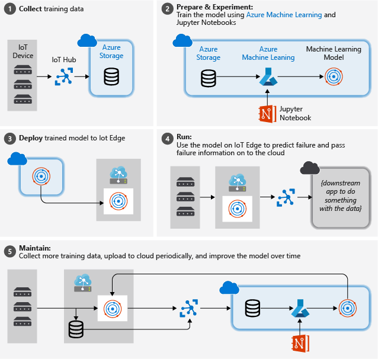

# Tutorial: An end-to-end solution using Azure Machine Learning and IoT Edge

Frequently, IoT applications want to take advantage of the intelligent cloud and the intelligent edge. In this tutorial, we walk you through training a machine learning model with data collected from IoT devices in the cloud, deploying that model to IoT Edge, and maintaining and refining the model periodically.

The primary objective of this tutorial is to introduce the processing of IoT data with machine learning, specifically on the edge. While we touch many aspects of a general machine learning workflow, this tutorial is not intended as an in-depth introduction to machine learning. As a case in point, we do not attempt to create a highly optimized model for the use case – we just do enough to illustrate the process of creating and using a viable model for IoT data processing.

## Target audience and roles

This set of articles is intended for developers without previous experience in IoT development or machine learning. Deploying machine learning at the edge requires knowledge of how to connect a wide range of technologies. Therefore, this tutorial covers an entire end-to-end scenario to demonstrate one way of joining these technologies together for an IoT solution. In a real-world environment, these tasks might be distributed among several people with different specializations. For example, developers would focus on either device or cloud code, while data scientists designed the analytics models. To enable an individual developer to successfully complete this tutorial, we have provided supplemental guidance with insights and links to more information we hope is sufficient to understand what is being done, as well as why.

Alternatively, you may team up with coworkers of different roles to follow the tutorial together, bringing your full expertise to bear, and learn as a team how things fit together.

In either case, to help orient the reader(s), each article in this tutorial indicates the role of the user. Those roles include:

* Cloud development (including a cloud developer working in a DevOps capacity)
* Data analytics

## Use case: Predictive maintenance

We based this scenario on a use case presented at the Conference on Prognostics and Health Management (PHM08) in 2008. The goal is to predict remaining useful life (RUL) of a set of turbofan airplane engines. This data was generated using C-MAPSS, the commercial version of MAPSS (Modular Aero-Propulsion System Simulation) software. This software provides a flexible turbofan engine simulation environment to conveniently simulate the health, control, and engine parameters.

The data used in this tutorial is taken from the [Turbofan engine degradation simulation data set](https://ti.arc.nasa.gov/tech/dash/groups/pcoe/prognostic-data-repository/#turbofan).

From the readme file:

***Experimental Scenario***

*Data sets consist of multiple multivariate time series. Each data set is further divided into training and test subsets. Each time series is from a different engine – i.e., the data can be considered to be from a fleet of engines of the same type. Each engine starts with different degrees of initial wear and manufacturing variation which is unknown to the user. This wear and variation is considered normal, i.e., it is not considered a fault condition. There are three operational settings that have a substantial effect on engine performance. These settings are also included in the data. The data is contaminated with sensor noise.*

*The engine is operating normally at the start of each time series and develops a fault at some point during the series. In the training set, the fault grows in magnitude until system failure. In the test set, the time series ends some time prior to system failure. The objective of the competition is to predict the number of remaining operational cycles before failure in the test set, i.e., the number of operational cycles after the last cycle that the engine will continue to operate. Also provided a vector of true Remaining Useful Life (RUL) values for the test data.*

Because the data was published for a competition, several approaches to derive machine learning models have been published independently. We found that studying examples is helpful in understanding the process and reasoning involved in the creation of a specific machine learning model. See for example:

[Aircraft engine failure prediction model](https://github.com/jancervenka/turbofan_failure) by GitHub user jancervenka.

[Turbofan engine degradation](https://github.com/hankroark/Turbofan-Engine-Degradation) by GitHub user hankroark.

## Process

The picture below illustrates the rough steps we follow in this tutorial:

1. **Collect training data**: The process begins by collecting training data. In some cases, data has already been collected and is available in a database, or in form of data files. In other cases, especially for IoT scenarios, the data needs to be collected from IoT devices and sensors and stored in the cloud.

   We assume that you don't have a collection of turbofan engines, so the project files include a simple device simulator that sends the NASA device data to the cloud.

1. **Prepare data**. In most cases, the raw data as collected from devices and sensors will require preparation for machine learning. This step may involve data clean up, data reformatting, or preprocessing to inject additional information machine learning can key off.

   For our airplane engine machine data, data preparation involves calculating explicit time-to-failure times for every data point in the sample based on the actual observations on the data. This information allows the machine learning algorithm to find correlations between actual sensor data patterns and the expected remaining life time of the engine. This step is highly domain-specific.

1. **Build a machine learning model**. Based on the prepared data, we can now experiment with different machine learning algorithms and parameterizations to train models and compare the results to one another.

   In this case, for testing we compare the predicted outcome computed by the model with the real outcome observed on a set of engines. In Azure Machine Learning, we can manage the different iterations of models we create in a model registry.

1. **Deploy the model**. Once we have a model that satisfies our success criteria, we can move to deployment. That involves wrapping the model into a web service app that can be fed with data using REST calls and return analysis results. The web service app is then packaged into a docker container, which in turn can be deployed either in the cloud or as an IoT Edge module. In this example, we focus on deployment to IoT Edge.

1. **Maintain and refine the model**. Our work is not done once the model is deployed. In many cases, we want to continue collecting data and periodically upload that data to the cloud. We can then use this data to retrain and refine our model, which we then can redeploy to IoT Edge.

## Prerequisites

To complete the tutorial, you need access to an Azure subscription in which you have rights to create resources. Several of the services used in this tutorial will incur Azure charges. If you do not already have an Azure subscription, you may be able to get started with an [Azure Free Account](https://azure.microsoft.com/offers/ms-azr-0044p/).

You also need a machine with PowerShell installed where you can run scripts to set up an Azure Virtual Machine as your development machine.

In this document, we use the following set of tools:

* An Azure IoT hub for data capture

* Azure Notebooks as our main front end for data preparation and machine learning experimentation. Running python code in a notebook on a subset of the sample data is a great way to get fast iterative and interactive turnaround during data preparation. Jupyter notebooks can also be used to prepare scripts to run at scale in a compute backend.

* Azure Machine Learning as a backend for machine learning at scale and for machine learning image generation. We drive the Azure Machine Learning backend using scripts prepared and tested in Jupyter notebooks.

* Azure IoT Edge for off-cloud application of a machine learning image

Obviously, there are other options available. In certain scenarios, for example, IoT Central can be used as a no-code alternative to capture initial training data from IoT devices.

## Next steps

This tutorial is divided into the following sections:

1. Set up your development machine and Azure services.
2. Generate the training data for the machine learning module.
3. Train and deploy the machine learning module.
4. Configure an IoT Edge device to act as a transparent gateway.
5. Create and deploy IoT Edge modules.
6. Send data to your IoT Edge device.

Continue to the next article to set up a development machine and provision Azure resources.

> [!div class="nextstepaction"]
> [Set up an environment for machine learning on IoT Edge](tutorial-machine-learning-edge-02-prepare-environment.md)
