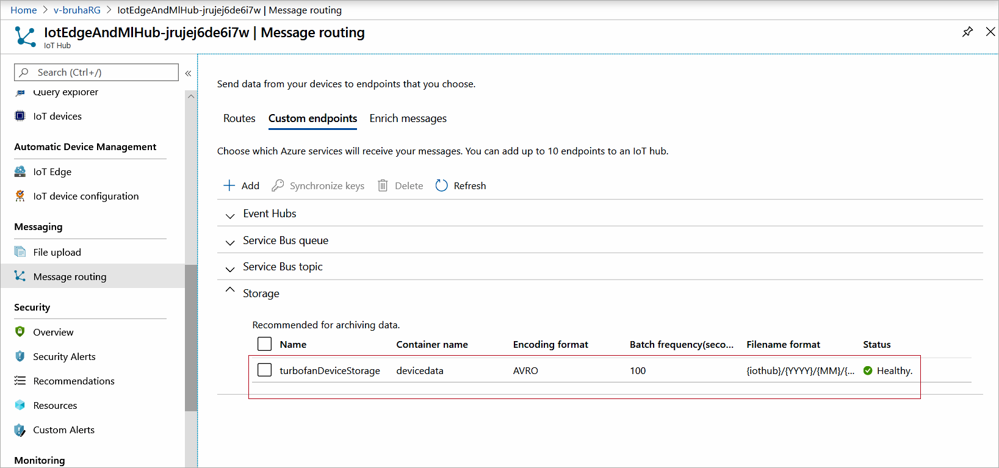
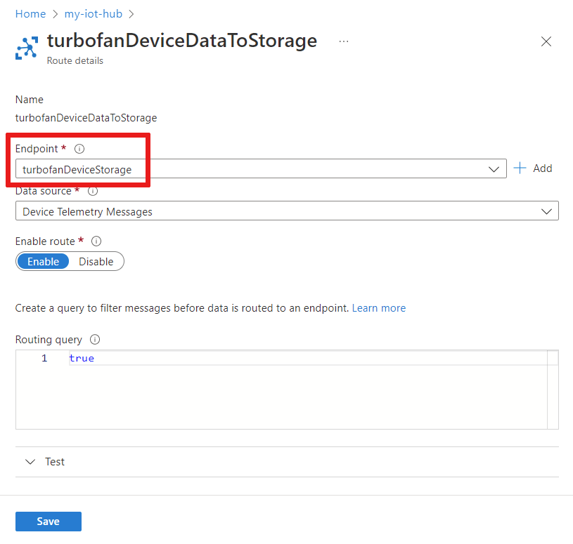

# Tutorial: Set up an environment for machine learning on IoT Edge

> [!NOTE]
> This article is part of a series for a tutorial about using Azure Machine Learning on IoT Edge. If you have arrived at this article directly, we encourage you to begin with the [first article](tutorial-machine-learning-edge-01-intro.md) in the series for the best results.

This article helps you prepare your environment for development and deployment. First, set up a development machine with all the tools you need. Then, create the necessary cloud resources in Azure.

## Set up the development VM

This step is typically performed by a cloud developer. Some of the software may also be helpful for a data scientist.

We created a PowerShell script that creates an Azure virtual machine with many of the prerequisites already configured. The VM that we create needs to be able to handle [nested virtualization](https://docs.microsoft.com/azure/virtual-machines/windows/nested-virtualization), which is why we chose a [Standard_D8s_v3](../virtual-machines/dv3-dsv3-series.md) machine size.

The development VM will be set up with:

* Windows 10
* [Chocolatey](https://chocolatey.org/)
* [Docker Desktop for Windows](https://www.docker.com/products/docker-desktop)
* [Git for Windows](https://gitforwindows.org/)
* [Git Credential Manager for Windows](https://github.com/Microsoft/Git-Credential-Manager-for-Windows)
* [.NET Core SDK](https://dotnet.microsoft.com/)
* [Python 3](https://www.python.org/)
* [Visual Studio Code](https://code.visualstudio.com/)
* [Azure PowerShell](https://docs.microsoft.com/powershell/azure/overview?view=azps-1.1.0)
* [VS Code Extensions](https://marketplace.visualstudio.com/search?target=VSCode)
  * [Azure IoT Tools](https://marketplace.visualstudio.com/items?itemName=vsciot-vscode.azure-iot-tools)
  * [Python](https://marketplace.visualstudio.com/items?itemName=ms-python.python)
  * [C#](https://marketplace.visualstudio.com/items?itemName=ms-dotnettools.csharp)
  * [Docker](https://marketplace.visualstudio.com/items?itemName=PeterJausovec.vscode-docker)
  * [PowerShell](https://marketplace.visualstudio.com/items?itemName=ms-vscode.PowerShell)

The developer VM is not strictly necessary – all the development tools can be run on a local machine. However, we strongly recommend using the VM to ensure a level playing field.

It takes about 30 minutes to create and configure the virtual machine.

1. Clone or download the [Machine Learning and IoT Edge](https://github.com/Azure-Samples/IoTEdgeAndMlSample) sample repository to your local computer.

1. Open PowerShell as an administrator and navigate to the **\IoTEdgeAndMlSample\DevVM** directory located under the root directory where you downloaded the code. We will refer to the root directory for your source as `srcdir`.

    ```powershell
    cd c:\srcdir\IoTEdgeAndMlSample\DevVM
    ```

   The DevVM directory contains the files needed to create an Azure virtual machine appropriate for completing this tutorial.

1. Run the following command to allow execution of scripts. Choose **Yes to All** when prompted.

    ```powershell
    Set-ExecutionPolicy Bypass -Scope Process
    ```

1. Run Create-AzureDevVM.ps1.

    ```powershell
    .\Create-AzureDevVm.ps1
    ```

    When prompted, provide the following information:

    * **Azure Subscription ID**: Your subscription ID, which can be found in [Azure Subscriptions](https://ms.portal.azure.com/#blade/Microsoft_Azure_Billing/SubscriptionsBlade) in portal.
    * **Resource Group Name**: The name of a new or existing resource group in Azure.
    * **Location**: Choose an Azure location where the virtual machine will be created. For example, 'West US 2' or 'North Europe'. For more information, see [Azure locations](https://azure.microsoft.com/global-infrastructure/locations/).
    * **Username**: Provide a memorable name for the administrator account for the VM.
    * **Password**: Set a password for the administrator account for the VM.

   The script runs for several minutes as it executes the following steps:

    1. Installs the [Azure PowerShell Az module](https://docs.microsoft.com/powershell/azure/new-azureps-module-az?view=azps-1.1.0).
    1. Prompts you to sign in to Azure.
    1. Confirms the information for the creation of your VM. Press **y** or **Enter** to continue.
    1. Creates the resource group if it does not exist.
    1. Deploys the virtual machine.
    1. Enables Hyper-V on the VM.
    1. Installs software need for development and clone the sample repository.
    1. Restarts the VM.
    1. Creates an RDP file on your desktop for connecting to the VM.

   If you are prompted for the name of the VM to restart it, you can copy its name from the script output. The output also shows the path to the RDP file for connecting to the VM.

### Set auto-shutdown schedule

To help you reduce cost, the development VM has been created with an automatic shutdown schedule that is set to 1900 PST. You may need to update this setting depending on your location and schedule. To update the shutdown schedule:

1. In the Azure portal, navigate to the VM that the script created.

1. From the left pane menu, under **Operations**, select **Auto-shutdown**.

1. Adjust the **Scheduled shutdown** and **Time zone** as desired and select **Save**.

## Connect to the development VM

Now that we have created a VM we need to finish installing the software needed to complete the tutorial.

1. Double-click on the RDP file that the script created on your desktop.

1. You will be presented with a dialog saying the publisher of the remote connection is unknown. This is acceptable, so select **Connect**.

1. Provide the administrator password that you provided to create the VM and click **OK**.

1. You will be prompted to accept the certificate for the VM. Select **Yes**.

## Install Visual Studio Code extensions

Now that you have connected to the development machine, add some useful extensions to Visual Studio Code to make the development experience easier.

1. Connect to the development VM, open a PowerShell window, and navigate to the **C:\source\IoTEdgeAndMlSample\DevVM** directory. This directory was created by the script that created the VM.

    ```powershell
    cd C:\source\IoTEdgeAndMlSample\DevVM
    ```

1. Run the following command to allow execution of scripts. Choose **Yes to All** when prompted.

    ```powershell
    Set-ExecutionPolicy Bypass -Scope Process
    ```

1. Run the Visual Studio Code extensions script.

    ```powershell
    .\Enable-CodeExtensions.ps1
    ```

1. The script will run for a few minutes installing VS code extensions:

    * Azure IoT Tools
    * Python
    * C#
    * Docker
    * PowerShell

## Set up IoT Hub and Storage

These steps are typically performed by a cloud developer.

Azure IoT Hub is the heart of any IoT application as it handles secure communication between IoT devices and the cloud. It is the main coordination point for the operation of the IoT Edge machine learning solution.

* IoT Hub uses routes to direct incoming data from IoT devices to other downstream services. We will take advantage of IoT Hub routes to send device data to Azure Storage. In Azure Storage, the device data is consumed by Azure Machine Learning to train our remaining useful life (RUL) classifier.

* Later in the tutorial, we will use IoT Hub to configure and manage our Azure IoT Edge device.

In this section, you use a script to create an Azure IoT hub and an Azure Storage account. Then in the Azure portal, you configure a route that forwards data received by the hub to an Azure Storage container. These steps take about 10 minutes to complete.

1. Connect to the development VM, open a PowerShell window, and navigate to the **IoTHub** directory.

    ```powershell
    cd C:\source\IoTEdgeAndMlSample\IoTHub
    ```

1. Run the creation script. Use the same values for subscription ID, location, and resource group as you did when creating the development VM.

    ```powershell
    .\New-HubAndStorage.ps1 -SubscriptionId <subscription id> -Location <location> -ResourceGroupName <resource group>
    ```

    * You will be prompted to sign in to Azure.
    * The script confirms the information for the creation of your Hub and Storage account. Press **y** or **Enter** to continue.

The script takes about two minutes to run. Once complete, the script outputs the name of the IoT hub and the storage account.

## Review route to storage in IoT Hub

As part of creating the IoT hub, the script that we ran in the previous section also created a custom endpoint and a route. IoT Hub routes consist of a query expression and an endpoint. If a message matches the expression, the data is sent along the route to the associated endpoint. Endpoints can be Event Hubs, Service Bus Queues, and Topics. In this case, the endpoint is a blob container in a storage account. Let's use the Azure portal to review the route created by our script.

1. Open the [Azure portal](https://portal.azure.com) and go to the resource group you're using for this tutorial.

1. In the list of resources, select the IoT Hub that the script created. It will have a name ending with random characters such as `IotEdgeAndMlHub-jrujej6de6i7w`.

1. From the left pane menu, under **Messaging**, select **Message routing**.

1. On the **Message routing** page, select the **Custom endpoints** tab.

1. Expand the **Storage** section:

   

   We see **turbofanDeviceStorage** is in the custom endpoints list. Note the following characteristics about this endpoint:

   * It points to the blob storage container you created named `devicedata` as indicated by **Container name**.
   * Its **Filename format** has partition as the last element in the name. We find this format is more convenient for the file operations we will do with Azure Notebooks later in the tutorial.
   * Its **Status** should be healthy.

1. Select the **Routes** tab.

1. Select the route named **turbofanDeviceDataToStorage**.

1. On the **Routes details** page, note that the route's endpoint is the **turbofanDeviceStorage** endpoint.

   

1. Look at the **Routing query**, which is set to **true**. This setting means that all device telemetry messages will match this route; and therefore all messages will be sent to the **turbofanDeviceStorage** endpoint.

1. Since no edits were made, just close this page.

## Next steps

In this article, we created an IoT Hub and configured a route to an Azure Storage account. Next, we will send data from a set of simulated devices through the IoT Hub into the storage account. Later in the tutorial, after we have configured our IoT Edge device and modules, we will revisit routes and look a little more at the routing query.

For more information about the steps covered in this portion of the Machine Learning on IoT Edge tutorial, see:

* [Azure IoT Fundamentals](https://docs.microsoft.com/azure/iot-fundamentals/)
* [Configure message routing with IoT Hub](../iot-hub/tutorial-routing.md)
* [Create an IoT hub using the Azure portal](../iot-hub/iot-hub-create-through-portal.md)

Continue to the next article to create a simulated device to monitor.

> [!div class="nextstepaction"]
> [Generate device data](tutorial-machine-learning-edge-03-generate-data.md)
