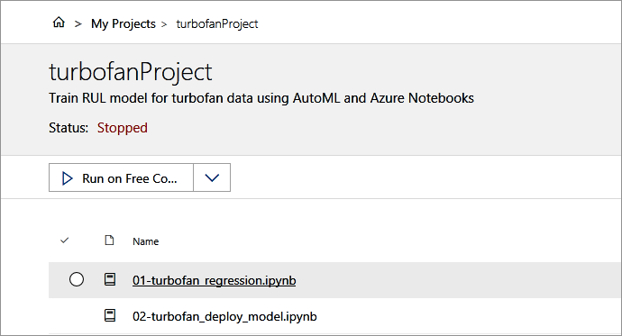
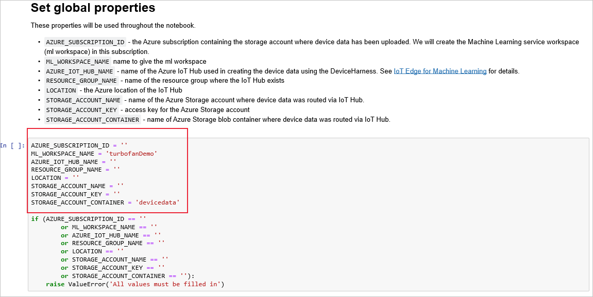
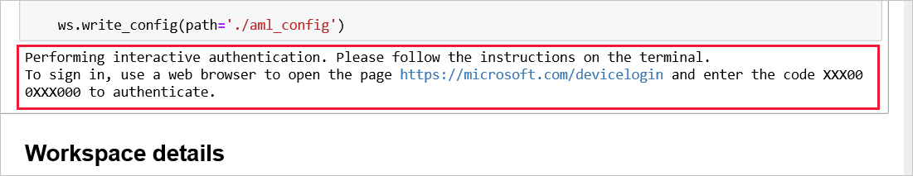
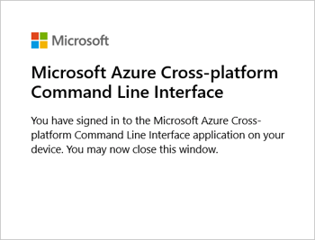
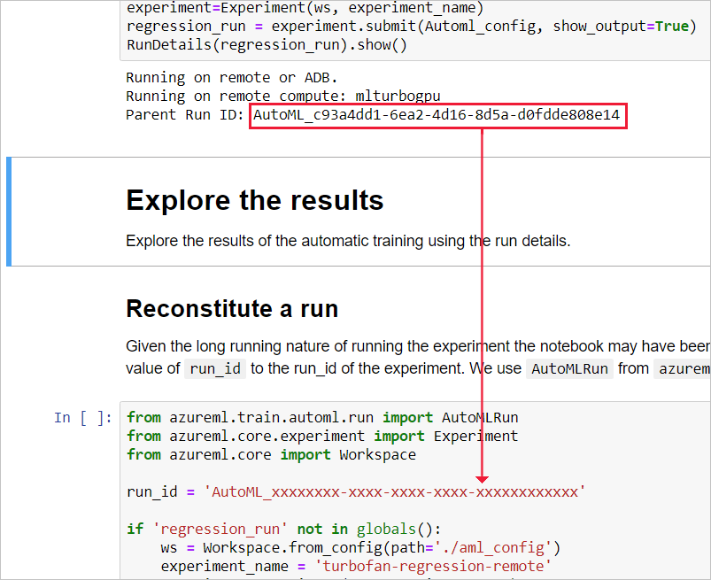

# Tutorial: Train and deploy an Azure Machine Learning model

> [!NOTE]
> This article is part of a series for a tutorial about using Azure Machine Learning on IoT Edge. If you have arrived at this article directly, we encourage you to begin with the [first article](tutorial-machine-learning-edge-01-intro.md) in the series for the best results.

In this article, we do the following tasks:

* Use Azure Notebooks to train a machine learning model.
* Package the trained model as a container image.
* Deploy the container image as an Azure IoT Edge module.

The Azure Notebooks take advantage of an Azure Machine Learning workspace, a foundational block used to experiment, train, and deploy machine learning models.

The steps in this article might be typically performed by data scientists.

## Set up Azure Notebooks

We use Azure Notebooks to host the two Jupyter Notebooks and supporting files. Here we create and configure an Azure Notebooks project. If you have not used Jupyter and/or Azure Notebooks, here are a couple of introductory documents:

* **Quickstart:** [Create and share a notebook](../notebooks/quickstart-create-share-jupyter-notebook.md)
* **Tutorial:** [Create and run a Jupyter notebook with Python](../notebooks/tutorial-create-run-jupyter-notebook.md)

Using Azure notebooks ensures a consistent environment for the exercise.

> [!NOTE]
> Once set up, the Azure Notebooks service can be accessed from any machine. During setup, you should use the development VM, which has all of the files that you will need.

### Create an Azure Notebooks account

To use Azure Notebooks, you need to create an account. Azure Notebook accounts are independent from Azure subscriptions.

1. Navigate to [Azure notebooks](https://notebooks.azure.com).

1. Click **Sign In** in the upper right corner of the page.

1. Sign in with either your work or school account (Azure Active Directory) or your personal account (Microsoft Account).

1. If you have not used Azure Notebooks before, you will be prompted to grant access for the Azure Notebooks app.

1. Create a user ID for Azure Notebooks.

### Upload Jupyter notebook files

We will upload sample notebook files into a new Azure Notebooks project.

1. From the user page of your new account, select **My Projects** from the top menu bar.

1. Add a new project by selecting the **+** button.

1. On the **Create New Project** dialog  box, provide a **Project Name**. 

1. Leave **Public** and **README** unchecked as there is no need for the project to be public or to have a readme.

1. Select **Create**.

1. Select **Upload** (the up arrow icon) and choose **From Computer**.

1. Select **Choose files**.

1. Navigate to **C:\source\IoTEdgeAndMlSample\AzureNotebooks**. Select all the files in the list and click **Open**.

1. Check the **I trust the content of these files** box.

1. Select **Upload** to begin uploading and then select **Done** once the process is complete.

### Azure notebook files

Let's review the files you uploaded into your Azure Notebooks project. The activities in this portion of the tutorial span across two notebook files, which use a few supporting files.

* **01-turbofan\_regression.ipynb:** This notebook uses the Machine Learning service workspace to create and run a machine learning experiment. Broadly, the notebook does the following steps:

  1. Downloads data from the Azure Storage account that was generated by the device harness.
  1. Explores and prepares the data, then uses the data to train the classifier model.
  1. Evaluate the model from the experiment using a test dataset (Test\_FD003.txt).
  1. Publishes the best classifier model to the Machine Learning service workspace.

* **02-turbofan\_deploy\_model.ipynb:** This notebook takes the model created in the previous notebook and uses it to create a container image ready to be deployed to an Azure IoT Edge device. The notebook performs the following steps:

  1. Creates a scoring script for the model.
  1. Produces a container image using the classifier model that was saved in the Machine Learning service workspace.
  1. Deploys the image as a web service on Azure Container Instance.
  1. Uses the web service to validate the model and the image work as expected. The validated image will be deployed to our IoT Edge device in the [Create and deploy custom IoT Edge modules](tutorial-machine-learning-edge-06-custom-modules.md) portion of this tutorial.

* **Test\_FD003.txt:** This file contains the data we will use as our test set when validating our trained classifier. We chose to use the test data, as provided for the original contest, as our test set for its simplicity.

* **RUL\_FD003.txt:** This file contains the Remaining Useful Life (RUL) for the last cycle of each device in the Test\_FD003.txt file. See the readme.txt and the Damage Propagation Modeling.pdf files in the C:\\source\\IoTEdgeAndMlSample\\data\\Turbofan for a detailed explanation of the data.

* **Utils.py:** Contains a set of Python utility functions for working with data. The first notebook contains a detailed explanation of the functions.

* **README.md:** Readme describing the use of the notebooks.  

## Run Azure Notebooks

Now that the project is created, you can run the notebooks. 

1. From your project page, select **01-turbofan\_regression.ipynb**.

    

1. If the notebook is listed as **Not Trusted**, click on the **Not Trusted** widget in the top right of the notebook. When the dialog comes up, select **Trust**.

1. For best results, read the documentation for each cell and run it individually. Select **Run** on the toolbar. Later on, you will find it expedient to run multiple cells. You can disregard upgrade and deprecation warnings.

    When a cell is running, it displays an asterisk between the square brackets ([\*]). When the cell's operation is complete, the asterisk is replaced with a number and relevant output may appear. The cells in a notebook build sequentially and only one can be running at a time.

    You can also use run options from the **Cell** menu, `Ctrl` + `Enter` to run a cell, and `Shift` + `Enter` to run a cell and advance to the next cell.

    > [!TIP]
    > For consistent cell operations, avoid running the same notebook from multiple tabs in your browser.

1. In the cell that follows the **Set global properties** instructions, write in the values for your Azure subscription, settings, and resources. Then run the cell.

    

1. In the cell previous to **Workspace details**, after it has run, look for the link that instructs you to sign in to authenticate:

    

    Open the link and enter the specified code. This sign-in procedure authenticates the Jupyter notebook to access Azure resources using the Microsoft Azure Cross-Platform Command Line Interface.  

    

1. In the cell that precedes **Explore the results**, copy the value from the run ID and paste it for the run ID in the cell that follows **Reconstitute a run**.

   

1. Run the remaining cells in the notebook.

1. Save the notebook and return to your project page.

1. Open **02-turbofan\_deploy\_model.ipynb** and run each cell. You will need to sign-into to authenticate in the cell that follows **Configure workspace**.

1. Save the notebook and return to your project page.

### Verify success

To verify that the notebooks have completed successfully, verify that a few items were created.

1. On your Azure Notebooks project page, select **Show hidden items** so that item names that begin with a period appear.

1. Verify that the following files were created:

    | File | Description |
    | --- | --- |
    | ./aml_config/.azureml/config.json | Configuration file used to create the Azure Machine Learning Workspace. |
    | ./aml_config/model_config.json | Configuration file that we will need to deploy the model in the **turbofanDemo** Machine Learning workspace in Azure. |
    | myenv.yml| Provides information about the dependencies for the deployed Machine Learning model.|

1. Verify that the following Azure resources were created. Some resources names are appended with random characters.

    | Azure resource | Name |
    | --- | --- |
    | Machine Learning workspace | turborfanDemo |
    | Container Registry | turbofandemoxxxxxxxx |
    | Applications Insights | turbofaninsightxxxxxxxx |
    | Key Vault | turbofankeyvaultbxxxxxxxx |
    | Storage | turbofanstoragexxxxxxxxx |

### Debugging

You can insert Python statements into the notebook for debugging, such as the `print()` command to show values. If you see variables or objects that are not defined, run the cells where they are first declared or instantiated.

You may have to delete previously created files and Azure resources if you need to redo the notebooks.

## Next steps

In this article, we used two Jupyter Notebooks running in Azure Notebooks to use the data from the turbofan devices to train a remaining useful life (RUL) classifier, to save the classifier as a model, to create a container image, and to deploy and test the image as a web service.

Continue to the next article to create an IoT Edge device.

> [!div class="nextstepaction"]
> [Configure an IoT Edge device](tutorial-machine-learning-edge-05-configure-edge-device.md)
