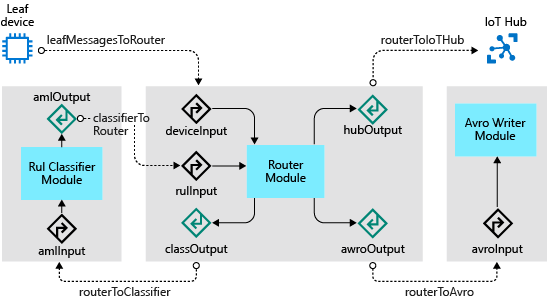
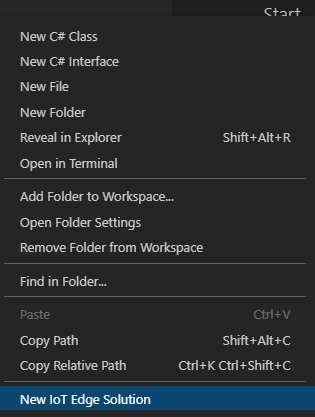
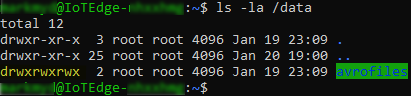
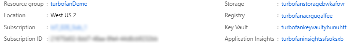
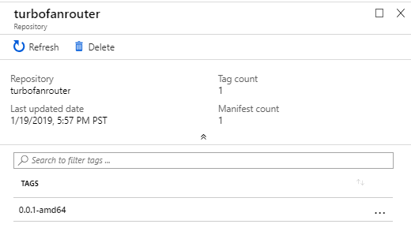
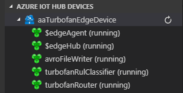

# Tutorial: Create and deploy custom IoT Edge modules

> [!NOTE]
> This article is part of a series for a tutorial about using Azure Machine Learning on IoT Edge. If you have arrived at this article directly, we encourage you to begin with the [first article](tutorial-machine-learning-edge-01-intro.md) in the series for the best results.

In this article, we create three IoT Edge modules that receive messages from leaf devices, run the data through your machine learning model, and then forward insights to IoT Hub.

IoT Edge hub facilitates module to module communication. Using the IoT Edge hub as a message broker keeps modules independent from each other. Modules only need to specify the inputs on which they accept messages and the outputs to which they write messages.

We want the IoT Edge device to accomplish four things for us:

* Receive data from the leaf devices
* Predict RUL for the device that sent the data
* Send a message with only the RUL for the device to IoT Hub (this function could be modified to only send data if the RUL drops below some level)
* Save the leaf device data to a local file on the IoT Edge device. This data file is periodically uploaded to IoT Hub via file upload to refine training of the machine learning model. Using file upload instead of constant message streaming is more cost effective.

To accomplish these tasks, we use three custom modules:

* **RUL Classifier:** The turboFanRulClassifier module we created in [Train and deploy an Azure Machine Learning model](tutorial-machine-learning-edge-04-train-model.md) is a standard machine learning module, which exposes an input called "amlInput" and an output called "amlOutput". The "amlInput" expects its input to look exactly like the input that we sent to the ACI-based web service. Likewise, "amlOutput" returns the same data as the web service.

* **Avro writer:** This module receives messages on the "avroModuleInput" input and persists the message in Avro format to disk for later upload to IoT Hub.

* **Router Module:** The router module receives messages from downstream leaf devices, then formats and sends the messages to the classifier. The module then receives the messages from the classifier and forwards the message onto the Avro writer module. Finally, the module sends just the RUL prediction to the IoT Hub.

  * Inputs:
    * **deviceInput**: receives messages from leaf devices
    * **rulInput:** receives messages from the "amlOutput"

  * Outputs:
    * **classify:** sends messages to "amlInput"
    * **writeAvro:** sends messages "avroModuleInput"
    * **toIotHub:** sends messages to $upstream, which passes the messages to the connected IoT Hub

The diagram below shows the modules, inputs, outputs, and the IoT Edge Hub routes for the full solution:



The steps in this article are typically performed by a cloud developer.

## Create a new IoT Edge solution

During execution of the second of our two Azure Notebooks, we created and published a container image containing our RUL model. Azure Machine Learning, as part of the image creation process, built in the pieces to make the image deployable as an Azure IoT Edge module. In this step, we are going to create an Azure IoT Edge solution using the “Azure Machine Learning” module and point the module to the image we published using Azure Notebooks.

1. Open a remote desktop session to your development machine.

2. Open folder **C:\\source\\IoTEdgeAndMlSample** in Visual Studio Code.

3. Right click on the explorer panel (in the blank space) and select **New IoT Edge Solution**.

    

4. Accept the default solution name **EdgeSolution**.

5. Choose **Azure Machine Learning** as the module template.

6. Name the module **turbofanRulClassifier**.

7. Choose your machine learning workspace.

8. Select the image you created while running the Azure Notebook.

9. Look at the solution and notice the files that have been created:

   * **deployment.template.json:** This file contains the definition of each of the modules in the solution. There are three sections to pay attention to in this file:

     * **Registry credentials:** Defines the set of custom container registries you are using in your solution. Right now, it should contain the registry from your machine learning workspace, which is where your Azure Machine Learning image was stored. You can have any number of container registries, but for simplicity we will use this one registry for all modules

       ```json
       "registryCredentials": {
         "<your registry>": {
           "username": "$CONTAINER_REGISTRY_USERNAME_<your registry>",
           "password": "$CONTAINER_REGISTRY_PASSWORD_<your registry>",
           "address": "<your registry>.azurecr.io”
         }
       }
       ```

     * **Modules:** This section contains the set of user-defined modules that go with this solution. You will notice that this section currently contains two modules: tempSensor and turbofanRulClassifier. The tempSensor was installed by the Visual Studio Code template, but we don’t need it for this solution. You can delete the tempSensor module definition from the modules section. Note that the turbofanRulClassifier module definition points to the image in your container registry. As we add more modules to the solution, they will show up in this section.

       ```json
       "modules": {
         "tempSensor": {
           "version": "1.0",
           "type": "docker",
           "status": "running",
           "restartPolicy": "always",
           "settings": {
             "image": "mcr.microsoft.com/azureiotedge-simulated-temperature-sensor:1.0",
             "createOptions": {}
           }
         },
         "turbofanRulClassifier": {
           "version": "1.0",
           "type": "docker",
           "status": "running",
           "restartPolicy": "always",
           "settings": {
             "image": "<your registry>.azurecr.io/edgemlsample:1",
             "createOptions": {}
           }
         }
       }
       ```

     * **Routes:** we will be working with routes quite a bit in this tutorial. Routes define how modules communicate with each other. The two routes defined by the template do not match with the routing we need. The first route sends all the data from any output of the classifier to the IoT Hub ($upstream). The other route is for tempSensor, which we just deleted. Delete the two default routes.

       ```json
       "$edgeHub": {
         "properties.desired": {
           "schemaVersion": "1.0",
           "routes": {
             "turbofanRulClassifierToIoTHub": "FROM /messages/modules/turbofanRulClassifier/outputs/\* INTO $upstream",
             "sensorToturbofanRulClassifier": "FROM /messages/modules/tempSensor/outputs/temperatureOutput INTO BrokeredEndpoint(\\"/modules/turbofanRulClassifier/inputs/input1\\")"
           },
           "storeAndForwardConfiguration": {
             "timeToLiveSecs": 7200
           }
         }
       }
       ```

   * **deployment.debug.template.json:** this file is the debug version of deployment.template.json. We should mirror all of the changes from the deployment.template.json into this file.

   * **.env:** this file is where you should supply the username and password for accessing your registry.

      ```env
      CONTAINER_REGISTRY_USERNAME_<your registry name>=<ACR username>
      CONTAINER_REGISTRY_PASSWORD_<your registry name>=<ACR password>
      ```

10. Right click on the deployment.template.json file in Visual Studio Code explorer and select **Build IoT Edge Solution**.

11. Notice that this command creates a config folder with a deployment.amd64.json file. This file is the concrete deployment template for the solution.

## Add Router module

Next, we add the Router module to our solution. The Router module handles several responsibilities for our solution:

* **Receive messages from leaf devices:** as messages arrive to the IoT Edge device from downstream devices, the Router module receives the message and begins orchestrating the routing of the message.
* **Send messages to the RUL Classifier module:** when a new message is received from a downstream device, the Router module transforms the message to the format that the RUL Classifier expects. The Router sends the message to the RUL Classifier for a RUL prediction. Once the classifier has made a prediction, it sends the message back to the Router module.
* **Send RUL messages to IoT Hub:** when the Router receives messages from the classifier, it transforms the message to contain only the essential information, device ID and RUL, and sends the abbreviated message to the IoT hub. A further refinement, which we have not done here, would send messages to the IoT Hub only when the RUL prediction falls below a threshold (for example, when the RUL is fewer than 100 cycles). Filtering in this way would reduce volume of messages and reduce cost of the IoT hub.
* **Send message to the Avro Writer module:** to preserve all the data sent by the downstream device, the Router module sends the entire message received from the classifier to the Avro Writer module, which will persist and upload the data using IoT Hub file upload.

> [!NOTE]
> The description of the module responsibilities may make the processing seem sequential, but the flow is message/event based. This is why we need an orchestration module like our Router module.

### Create module and copy files

1. Right click on the modules folder in Visual Studio Code and choose **Add IoT Edge Module**.

2. Choose **C# module**.

3. Name the module **turbofanRouter**.

4. When prompted for your Docker Image Repository, use the registry from the machine learning workspace (you can find the registry in the registryCredentials node of your *deployment.template.json* file). This value is the fully qualified address to the registry, like **\<your registry\>.azurecr.io/turbofanrouter**.

    > [!NOTE]
    > In this article, we use the Azure Container Registry created by the Azure Machine Learning service workspace, which we used to train and deploy our classifier. This is purely for convenience. We could have created a new container registry and published our modules there.

5. Open a new terminal window in Visual Studio Code (**View** > **Terminal**) and copy files from the modules directory.

    ```cmd
    copy c:\source\IoTEdgeAndMlSample\EdgeModules\modules\turbofanRouter\*.cs c:\source\IoTEdgeAndMlSample\EdgeSolution\modules\turbofanRouter\
    ```

6. When prompted to overwrite program.cs, press `y` and then hit `Enter`.

### Build router module

1. In Visual Studio Code, select **Terminal** > **Configure Default Build Task**.

2. Click on **Create tasks.json file from template**.

3. Click on **.NET Core**.

4. When tasks.json opens replace the contents with:

    ```json
    {
      // See https://go.microsoft.com/fwlink/?LinkId=733558
      // for the documentation about the tasks.json format
      "version": "2.0.0",
      "tasks": [
        {
          "label": "build",
          "command": "dotnet",
          "type": "shell",
          "group": {
            "kind": "build",
            "isDefault": true
          },
          "args": [
            "build",
            "${workspaceFolder}/modules/turbofanRouter"
          ],
          "presentation": {
            "reveal": "always"
          },
          "problemMatcher": "$msCompile"
        }
      ]
    }
    ```

5. Save and close tasks.json.

6. Run build with `Ctrl + Shift + B` or **Terminal** > **Run Build Task**.

### Set up module routes

As mentioned above, the IoT Edge runtime uses routes configured in the *deployment.template.json* file to manage communication between loosely coupled modules. In this section, we drill into how to set up the routes for the turbofanRouter module. We will cover the input routes first and then move on the outputs.

#### Inputs

1. In the Init() method of Program.cs we register two callbacks for the module:

   ```csharp
   await ioTHubModuleClient.SetInputMessageHandlerAsync(EndpointNames.FromLeafDevice, LeafDeviceInputMessageHandler, ioTHubModuleClient);
   await ioTHubModuleClient.SetInputMessageHandlerAsync(EndpointNames.FromClassifier, ClassifierCallbackMessageHandler, ioTHubModuleClient);
   ```

2. The first callback listens for messages sent to the **deviceInput** sink. From the diagram above, we see that we want to route messages from any leaf device to this input. In the *deployment.template.json* file, add a route that tells the edge hub to route any message received by the IoT Edge device that was not sent by an IoT Edge module into the input called "deviceInput" on the turbofanRouter module:

   ```json
   "leafMessagesToRouter": "FROM /messages/* WHERE NOT IS_DEFINED($connectionModuleId) INTO BrokeredEndpoint(\"/modules/turbofanRouter/inputs/deviceInput\")"
   ```

3. Next add a route for messages from the rulClassifier module into the turbofanRouter module:

   ```json
   "classifierToRouter": "FROM /messages/modules/turbofanRulClassifier/outputs/amloutput INTO BrokeredEndpoint(\"/modules/turbofanRouter/inputs/rulInput\")"
   ```

#### Outputs

Add four additional routes to the $edgeHub route parameter, to handle outputs from the Router module.

1. Program.cs defines the method SendMessageToClassifier(), which uses the module client to send a message to the RUL classifier using the route:

   ```json
   "routerToClassifier": "FROM /messages/modules/turbofanRouter/outputs/classOutput INTO BrokeredEndpoint(\"/modules/turbofanRulClassifier/inputs/amlInput\")"
   ```

2. SendRulMessageToIotHub() uses the module client to send just the RUL data for the device to the IoT Hub via the route:

   ```json
   "routerToIoTHub": "FROM /messages/modules/turboFanRouter/outputs/hubOutput INTO $upstream"
   ```

3. SendMessageToAvroWriter() uses the module client to send the message with the RUL data added to the avroFileWriter module.

   ```json
   "routerToAvro": "FROM /messages/modules/turbofanRouter/outputs/avroOutput INTO BrokeredEndpoint(\"/modules/avroFileWriter/inputs/avroModuleInput\")"
   ```

4. HandleBadMessage() sends failed messages upstream the IoT Hub where they can be routed for later.

   ```json
   "deadLetter": "FROM /messages/modules/turboFanRouter/outputs/deadMessages INTO $upstream"
   ```

With all the routes taken together your “$edgeHub” node should look like
the following JSON:

```json
"$edgeHub": {
  "properties.desired": {
    "schemaVersion": "1.0",
    "routes": {
      "leafMessagesToRouter": "FROM /messages/* WHERE NOT IS_DEFINED($connectionModuleId) INTO BrokeredEndpoint(\"/modules/turbofanRouter/inputs/deviceInput\")",
      "classifierToRouter": "FROM /messages/modules/turbofanRulClassifier/outputs/amlOutput INTO BrokeredEndpoint(\"/modules/turbofanRouter/inputs/rulInput\")",
      "routerToClassifier": "FROM /messages/modules/turbofanRouter/outputs/classOutput INTO BrokeredEndpoint(\"/modules/turbofanRulClassifier/inputs/amlInput\")",
      "routerToIoTHub": "FROM /messages/modules/turboFanRouter/outputs/hubOutput INTO $upstream",
      "routerToAvro": "FROM /messages/modules/turbofanRouter/outputs/avroOutput INTO BrokeredEndpoint(\"/modules/avroFileWriter/inputs/avroModuleInput\")",
      "deadLetter": "FROM /messages/modules/turboFanRouter/outputs/deadMessages INTO $upstream"
    },
    "storeAndForwardConfiguration": {
      "timeToLiveSecs": 7200
    }
  }
}
```

> [!NOTE]
> Adding the turbofanRouter module created the following additional route: `turbofanRouterToIoTHub": "FROM /messages/modules/turbofanRouter/outputs/* INTO $upstream`. Remove this route, leaving only the routes listed above in your deployment.template.json file.

#### Copy routes to deployment.debug.template.json

As a final step, to keep our files in sync, mirror the changes you made to deployment.template.json in deployment.debug.template.json.

## Add Avro Writer module

The Avro Writer module has two responsibilities in our solution, to store messages and upload files.

* **Store messages**: when the Avro Writer module receives a message, it writes the message to the local file system in Avro format. We use a bind mount, which mounts a directory (in this case /data/avrofiles) into a path in the module’s container. This mount allows the module to write to a local path (/avrofiles) and have those files accessible directly from the IoT Edge device.

* **Upload files**: the Avro Writer module uses the Azure IoT Hub file upload feature to upload files to an Azure storage account. Once a file is successfully uploaded, the module deletes the file from disk

### Create module and copy files

1. In the command palette, search for then select **Python: Select Interpreter**.

1. Choose the interpreter found in C:\\Python37.

1. Open the command palette again and search for then select **Terminal: Select Default Shell**.

1. When prompted, choose **Command Prompt**.

1. Open a new terminal shell, **Terminal** > **New Terminal**.

1. Right click on the modules folder in Visual Studio Code and choose **Add IoT Edge Module**.

1. Choose **Python Module**.

1. Name the module "avroFileWriter".

1. When prompted for your Docker Image Repository, use the same registry as you used when adding the Router module.

1. Copy files from the sample module into the solution.

   ```cmd
   copy C:\source\IoTEdgeAndMlSample\EdgeModules\modules\avroFileWriter\*.py C:\source\IoTEdgeAndMlSample\EdgeSolution\modules\avroFileWriter\
   ```

1. If prompted to overwrite main.py, type `y` and then hit `Enter`.

1. Notice that filemanager.py and schema.py have been added to the solution and main.py has been updated.

> [!NOTE]
> When you open a Python file you may be prompted to install pylint. You do not need to install the linter to complete this tutorial.

### Bind mount for data files

As mentioned in the intro, the writer module relies on the presence of bind mount to write Avro files to the device’s file system.

#### Add directory to device

1. Connect to your IoT Edge device VM using SSH.

   ```bash
   ssh -l <user>@IoTEdge-<extension>.<region>.cloudapp.azure.com
   ```

2. Create the directory that will hold the saved leaf device messages.

   ```bash
   sudo mkdir -p /data/avrofiles
   ```

3. Update directory permissions to make it writeable by the container.

   ```bash
   sudo chmod ugo+rw /data/avrofiles
   ```

4. Validate the directory now has write (w) permission for user, group, and owner.

   ```bash
   ls -la /data
   ```

   

#### Add directory to the module

To add the directory to the module’s container, we will modify the Dockerfiles associated with the avroFileWriter module. There are three Dockerfiles associated with the module: Dockerfile.amd64, Dockerfile.amd64.debug, and Dockerfile.arm32v7. These files should be kept in sync in case we wish to debug or deploy to an arm32 device. For this article, focus only on Dockerfile.amd64.

1. On your development machine, open the **Dockerfile.amd64** file.

2. Modify the file so that is looks like the following example:

   ```dockerfile
   FROM ubuntu:xenial

   WORKDIR /app

   RUN apt-get update && apt-get install -y --no-install-recommends libcurl4-openssl-dev
   python3-pip libboost-python1.58-dev libpython3-dev && rm -rf /var/lib/apt/lists/*

   RUN pip3 install --upgrade pip
   COPY requirements.txt ./
   RUN pip install -r requirements.txt

   COPY . .

   RUN useradd -ms /bin/bash moduleuser
   RUN mkdir /avrofiles && chown moduleuser /avrofiles
   USER moduleuser

   CMD [ "python3", "-u", "./main.py" ]
   ```

   The `mkdir` and `chown` commands instruct the Docker build process to create a top-level directory called /avrofiles in the image and then to make the moduleuser the owner of that directory. It is important that these commands are inserted after the module user is added to the image with the `useradd` command and before the context switches to the moduleuser (USER moduleuser).

3. Make the corresponding changes to Dockerfile.amd64.debug and Dockerfile.arm32v7.

#### Update the module configuration

The final step of creating the bind is to update the deployment.template.json (and deployment.debug.template.json) files with the bind information.

1. Open deployment.template.json.

2. Modify the module definition for avroFileWriter by adding the `Binds` parameter that points the container directory /avrofiles to the local directory on the edge device. Your module definition should match this example:

   ```json
   "avroFileWriter": {
     "version": "1.0",
     "type": "docker",
     "status": "running",
     "restartPolicy": "always",
     "settings": {
       "image": "${MODULES.avroFileWriter}",
       "createOptions": {
         "HostConfig": {
           "Binds": [
             "/data/avrofiles:/avrofiles"
           ]
         }
       }
     }
   }
   ```

3. Make the corresponding changes to deployment.debug.template.json.

### Bind mount for access to config.yaml

We need to add one more bind for the writer module. This bind gives the module access to read the connection string from the /etc/iotedge/config.yaml file on the IoT Edge device. We need the connection string to create an IoTHubClient so that we can call the upload\_blob\_async method to upload files to the IoT hub. The steps for adding this bind are similar to the ones in the previous section.

#### Update directory permission

1. Connect to your IoT Edge device using SSH.

   ```bash
   ssh -l <user>@IoTEdge-<extension>.<region>.cloudapp.azure.com
   ```

2. Add read permission to the config.yaml file.

   ```bash
   sudo chmod +r /etc/iotedge/config.yaml
   ```

3. Validate the permissions are set correctly.

   ```bash
   ls -la /etc/iotedge/
   ```

4. Ensure that the permissions for config.yaml are **-r--r--r--**.

#### Add directory to module

1. On your development machine, open the **Dockerfile.amd64** file.

2. Add an additional set of `mkdir` and `chown` commands to the file so that is looks like:

   ```dockerfile
   FROM ubuntu:xenial

   WORKDIR /app

   RUN apt-get update && apt-get install -y --no-install-recommends libcurl4-openssl-dev
   python3-pip libboost-python1.58-dev libpython3-dev && rm -rf /var/lib/apt/lists/\*

   RUN pip3 install --upgrade pip
   COPY requirements.txt ./
   RUN pip install -r requirements.txt

   COPY . .

   RUN useradd -ms /bin/bash moduleuser
   RUN mkdir /avrofiles && chown moduleuser /avrofiles
   RUN mkdir -p /app/iotconfig && chown moduleuser /app/iotconfig

   USER moduleuser

   CMD "python3", "-u", "./main.py"]
   ```

3. Make the corresponding changes to Dockerfile.amd64.debug and
    Dockerfile.arm32v7.

#### Update the module configuration

1. Open the **deployment.template.json** file.

2. Modify the module definition for avroFileWriter by adding a second line to the `Binds` parameter that points the container directory (/app/iotconfig) to the local directory on the device (/etc/iotedge).

   ```json
   "avroFileWriter": {
     "version": "1.0",
     "type": "docker",
     "status": "running",
     "restartPolicy": "always",
     "settings": {
       "image": "${MODULES.avroFileWriter}",
       "createOptions": {
         "HostConfig": {
           "Binds": [
             "/data/avrofiles:/avrofiles",
             "/etc/iotedge:/app/iotconfig"
           ]
         }
       }
     }
   }
   ```

3. Make the corresponding changes to deployment.debug.template.json.

## Install dependencies

The writer module takes a dependency on two Python libraries, fastavro and PyYAML. We need to install the dependencies on our development machine and instruct the Docker build process to install them in our module’s image.

### PyYAML

1. On your development machine, open the **requirements.txt** file and add pyyaml.

   ```txt
   azure-iothub-device-client~=1.4.3
   pyyaml
   ```

2. Open the **Dockerfile.amd64** file and add a `pip install` command to upgrade setuptools.

   ```dockerfile
   FROM ubuntu:xenial

   WORKDIR /app

   RUN apt-get update && \
       apt-get install -y --no-install-recommends libcurl4-openssl-dev python3-pip libboost-python1.58-dev libpython3-dev && \
       rm -rf /var/lib/apt/lists/\*

   RUN pip3 install --upgrade pip
   RUN pip install -U pip setuptools
   COPY requirements.txt ./
   RUN pip install -r requirements.txt

   COPY . .

   RUN useradd -ms /bin/bash moduleuser
   RUN mkdir /avrofiles && chown moduleuser /avrofiles
   RUN mkdir -p /app/iotconfig && chown moduleuser /app/iotconfig
   USER moduleuser

   CMD [ "python3", "-u", "./main.py" ]
   ```

3. Make the corresponding changes to Dockerfile.amd64.debug. <!--may not be necessary. Add 'if needed'?-->

4. Install pyyaml locally by opening a terminal in Visual Studio Code and typing

   ```cmd
   pip install pyyaml
   ```

### Fastavro

1. In requirements.txt, add fastavro after pyyaml.

   ```txt
   azure-iothub-device-client~=1.4.3
   pyyaml
   fastavro
   ```

2. Install fastavro to your development machine using the Visual Studio Code terminal.

   ```cmd
   pip install fastavro
   ```

## Reconfigure IoT Hub

By introducing the IoT Edge device and modules to the system, we have changed our expectations about what data will be sent to the hub and for what purpose. We need to reconfigure the routing in the hub to deal with our new reality.

> [!NOTE]
> We reconfigure the hub before deploying modules because some of the hub settings, specifically file upload, needs to be correctly set up for the avroFileWriter module to run correctly

### Set up route for RUL messages in IoT Hub

With the router and classifier in place, we expect to receive regular messages containing only the device ID and the RUL prediction for the device. We want to route the RUL data to its own storage location where we can monitor the status of the devices, build reports and fire alerts as needed. At the same time, we want any device data that is still being sent directly by a leaf device that has not yet been attached to our IoT Edge device to continue to route to the current storage location.

#### Create a RUL message route

1. In the Azure portal, navigate to your IoT Hub.

2. From the left navigation, choose **Message routing**.

3. Select **Add**.

4. Name the route **RulMessageRoute**.

5. Select **Add** next to the **Endpoint** selector and choose **Blob storage**.

6. In the **Add a storage endpoint** form, name the endpoint **ruldata**.

7. Select **Pick a container**.

8. Choose the storage account used throughout this tutorial, which is named like **iotedgeandml\<unique suffix\>**.

9. Choose the **ruldata** container and click **Select**.

10. Click **Create** to create the storage endpoint.

11. For the **Routing query**, enter the following query:

    ```sql
    IS_DEFINED($body.PredictedRul) AND NOT IS_DEFINED($body.OperationalSetting1)
    ```

12. Expand the **Test** section and then the **Message body** section. Replace the message with this example of our expected messages:

    ```json
    {
      "ConnectionDeviceId": "aaLeafDevice_1",
      "CorrelationId": "b27e97bb-06c5-4553-a064-e9ad59c0fdd3",
      "PredictedRul": 132.62721409309165,
      "CycleTime": 64.0
    }
    ```

13. Select **Test route**. If the test is successful, you see “The message matched the query.”

14. Click **Save**.

#### Update turbofanDeviceToStorage route

We don't want to route the new prediction data to our old storage location, so update the route to prevent it.

1. In the IoT Hub **Message routing** page, select the **Routes** tab.

2. Select **turbofanDeviceDataToStorage**, or whatever name you gave to your initial device data route.

3. Update the routing query to

   ```sql
   IS_DEFINED($body.OperationalSetting1)
   ```

4. Expand the **Test** section and then the **Message body** section. Replace the message with this example of our expected messages:

   ```json
   {
     "Sensor13": 2387.96,
     "OperationalSetting1": -0.0008,
     "Sensor6": 21.61,
     "Sensor11": 47.2,
     "Sensor9": 9061.45,
     "Sensor4": 1397.86,
     "Sensor14": 8140.39,
     "Sensor18": 2388.0,
     "Sensor12": 522.87,
     "Sensor2": 642.42,
     "Sensor17": 391.0,
     "OperationalSetting3": 100.0,
     "Sensor1": 518.67,
     "OperationalSetting2": 0.0002,
     "Sensor20": 39.03,
     "DeviceId": 19.0,
     "Sensor5": 14.62,
     "PredictedRul": 212.00132402791962,
     "Sensor8": 2388.01,
     "Sensor16": 0.03,
     "CycleTime": 42.0,
     "Sensor21": 23.3188,
     "Sensor15": 8.3773,
     "Sensor3": 1580.09,
     "Sensor10": 1.3,
     "Sensor7": 554.57,
     "Sensor19": 100.0
   }
   ```

5. Select **Test route**. If the test is successful, you see “The message matched the query.”

6. Select **Save**.

### Configure file upload

Configure the IoT Hub file upload feature to enable the file writer module to upload files to storage.

1. From the left navigator in your IoT Hub, choose **File upload**.

2. Select **Azure Storage Container**.

3. Select your storage account from the list.

4. Select the **uploadturbofanfiles** container and click **Select**.

5. Select **Save**. The portal notifies you when the save is complete.

> [!Note]
> We aren't turning on upload notification for this tutorial, but see [Receive a file upload notification](../iot-hub/iot-hub-java-java-file-upload.md#receive-a-file-upload-notification) for details on how to handle file upload notification.

## Build, publish, and deploy modules

Now that we have made the configuration changes, we are ready to build the images and publish them to our Azure container registry. The build process uses the deployment.template.json file to determine which modules need to be built. The settings for each module, including version, are found in the module.json file in the module folder. The build process first runs a Docker build on the Dockerfiles matching the current configuration found in the module.json file to create an image. Then it publishes the image to the registry from the module.json file with a version tag matching the one in the module.json file. Finally, it produces a configuration-specific deployment manifest (for example, deployment.amd64.json), which we will deploy to the IoT Edge device. The IoT Edge device reads the information from the deployment manifest, and based on the instructions will download the modules, configure the routes, and set any desired properties. This deployment method has two side effects that you should be aware of:

* **Deployment lag:** since the IoT Edge runtime must recognize the change to its desired properties before it starts to reconfigure, it can take some amount of time after you deploy your modules until the runtime picks them up and starts to update the IoT Edge device.

* **Module versions matter:** if you publish a new version of a module’s container to your container registry using the same version tags as the previous module, the runtime will not download the new version of the module. It does a comparison of the version tag of the local image and the desired image from the deployment manifest. If those versions match, the runtime takes no action. Therefore, it is important to increment the version of your module each time you wish to deploy new changes. Increment the version by changing the **version** property under the **tag** property in the module.json file for the module you are changing. Then build and publish the module.

    ```json
    {
      "$schema-version": "0.0.1",
      "description": "",
      "image": {
        "repository": "<your registry>.azurecr.io/avrofilewriter",
        "tag": {
          "version": "0.0.1",
          "platforms": {
            "amd64": "./Dockerfile.amd64",
            "amd64.debug": "./Dockerfile.amd64.debug",
            "arm32v7": "./Dockerfile.arm32v7"
          }
        },
        "buildOptions": []
      },
      "language": "python"
    }
    ```

### Build and publish

1. In Visual Studio Code on your development VM, open a Visual Studio Code terminal window and login to your container registry.

   ```cmd
   docker login -u <ACR username> -p <ACR password> <ACR login server>
   ```

1. In Visual Studio Code, right-click on deployment.template.json and choose **Build and Push IoT Edge Solution**.

### View modules in the registry

Once the build successfully completes, we will be able to use the Azure portal to review our published modules.

1. In the Azure portal, navigate to your Azure Machine Learning service workspace and click the hyperlink for **Registry**.

    

2. From the registry side navigator, select **Repositories**.

3. Note that both modules you created, **avrofilewriter** and **turbofanrouter**, appear as repositories.

4. Select **turbofanrouter** and note that you have published one image tagged as 0.0.1-amd64.

   

### Deploy modules to IoT Edge device

We have built and configured the modules in our solution, now we will deploy the modules to the IoT Edge device.

1. In Visual Studio Code, right click on the **deployment.amd64.json** file in the config folder.

2. Choose **Create Deployment for Single Device**.

3. Choose your IoT Edge device, **aaTurboFanEdgeDevice**.

4. Refresh the Azure IoT Hub devices panel in Visual Studio Code explorer. You should see that the three new modules are deployed but not yet running.

5. Refresh again after a few minutes and you will see the modules running.

   

> [!NOTE]
> It can take several minutes for the modules to start and settle into a steady running state. During that time, you may see modules start and stop as they try to establish a connection with the IoT Edge hub module.

## Diagnosing failures

In this section, we share a few techniques for understanding what has gone wrong with a module or modules. Often a failure can first be spotted from the status in the Visual Studio Code.

### Identify failed modules

* **Visual Studio Code:** Look at the Azure IoT Hub devices panel. If most modules are in a running state but one is stopped, you need to investigate that stopped module further. If all modules are in a stopped state for a long period of time, it may indicate failure as well.

* **Azure portal:** By navigating to your IoT hub in the portal and then finding the device details page (under IoT Edge, drill into your device) you may find that a module has reported an error or has never reported anything to the IoT hub.

### Diagnosing from the device

By logging into the IoT Edge device, you can gain access to a good deal of information about the status of your modules. The main mechanism we use are the Docker commands that let us examine the containers and images on
the device.

1. List all running containers. We expect to see a container for each module with a name that corresponds to the module. Also, this command lists the exact image for the container including version so you can match with your expectation. You can also list images by substituting “image” for “container” in the command.

   ```bash
   sudo docker container ls
   ```

2. Get the logs for a container. This command outputs whatever has been written to StdErr and StdOut in the container. This command works for containers that have started and then died for some reason. It is also useful for understanding what has been happening with the edgeAgent or edgeHub containers.

   ```bash
   sudo docker container logs <container name>
   ```

3. Inspect a container. This command gives a ton of information about the image. The data can be filtered depending on what you are looking for. As an example, if you want to see if the binds on the avroFileWriter are correct you can use the command:

   ```bash
   sudo docker container inspect -f "{{ json .Mounts }}" avroFileWriter | python -m json.tool
   ```

4. Connect to a running container. This command can be helpful if you want to examine the container while it is running:

   ```bash
   sudo docker exec -it avroFileWriter bash
   ```

## Next steps

In this article, we created an IoT Edge Solution in Visual Studio Code with three modules, a classifier, a router, and a file writer/uploader. We set up the routes to allow the modules to communicate with each other on the edge device, modified the configuration of the edge device, and updated the Dockerfiles to install dependencies and add bind mounts to the modules’ containers. Next, we updated the configuration of the IoT Hub to route our messages based on type and to handle file uploads. With everything in place, we deployed the modules to the IoT Edge device and ensured the modules were running correctly.

More information can be found at the following pages:

* [Learn how to deploy modules and establish routes in IoT Edge](module-composition.md)
* [IoT Hub message routing query syntax](../iot-hub/iot-hub-devguide-routing-query-syntax.md)
* [IoT Hub message routing: now with routing on message body](https://azure.microsoft.com/blog/iot-hub-message-routing-now-with-routing-on-message-body/)
* [Upload files with IoT Hub](../iot-hub/iot-hub-devguide-file-upload.md)
* [Upload files from your device to the cloud with IoT Hub](../iot-hub/iot-hub-python-python-file-upload.md)

Continue to the next article to start sending data and see your solution in action.

> [!div class="nextstepaction"]
> [Send data via transparent gateway](tutorial-machine-learning-edge-07-send-data-to-hub.md)
