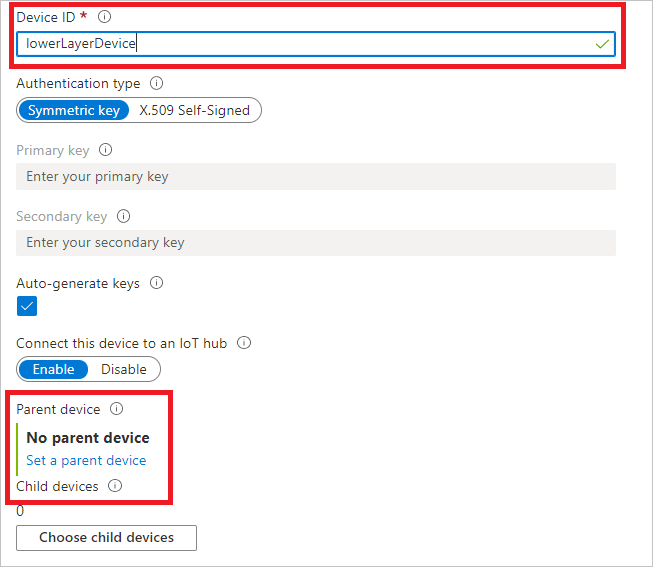
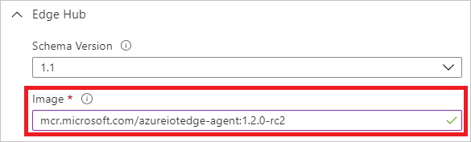
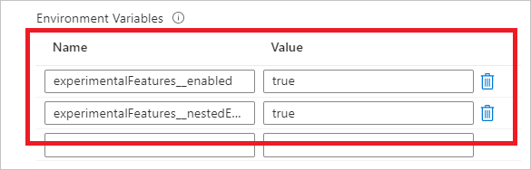
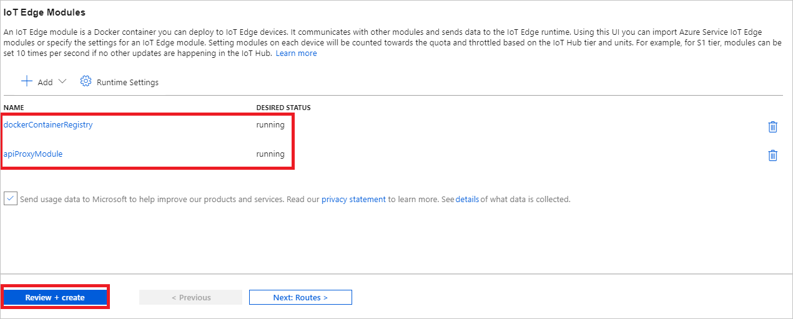
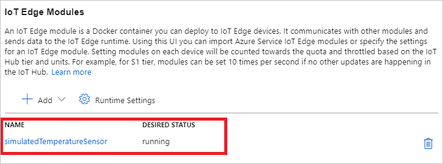

# Tutorial: Create a hierarchy of IoT Edge devices (Preview)

Deploy Azure IoT Edge nodes across networks organized in hierarchical layers. Each layer in a hierarchy is a gateway device that handles messages and requests from devices in the layer beneath it.

>[!NOTE]
>This feature requires IoT Edge version 1.2, which is in public preview, running Linux containers.

You can structure a hierarchy of devices so that only the top layer has connectivity to the cloud, and the lower layers can only communicate with adjacent north and south layers. This network layering is the foundation of most industrial networks, which follow the [ISA-95 standard](https://en.wikipedia.org/wiki/ANSI/ISA-95).

The goal of this tutorial is to create a hierarchy of IoT Edge devices that simulates a production environment. At the end, you will deploy the [Simulated Temperature Sensor module](https://azuremarketplace.microsoft.com/marketplace/apps/azure-iot.simulated-temperature-sensor) to a lower layer device without internet access by downloading container images through the hierarchy.

To accomplish this goal, this tutorial walks you through creating a hierarchy of IoT Edge devices, deploying IoT Edge runtime containers to your devices, and configuring your devices locally. In this tutorial, you learn how to:

> [!div class="checklist"]
>
> * Create and define the relationships in a hierarchy of IoT Edge devices.
> * Configure the IoT Edge runtime on the devices in your hierarchy.
> * Install consistent certificates across your device hierarchy.
> * Add workloads to the devices in your hierarchy.
> * Use an API proxy module to securely route HTTP traffic over a single port from your lower layer devices.

In this tutorial, the following network layers are defined:

* **Top layer**: IoT Edge devices at this layer can connect directly to the cloud.

* **Lower layer**: IoT Edge devices at this layer cannot connect directly to the cloud. They need to go through one or more intermediary IoT Edge devices to send and receive data.

This tutorial uses a two device hierarchy for simplicity. One device, **topLayerDevice**, represents a device at the top layer of the hierarchy, which can connect directly to the cloud. This device will also be referred to as the **parent device**. The other device, **lowerLayerDevice**, represents a device at the lower layer of the hierarchy, which cannot connect directly to the cloud. This device will also be referred to as the **child device**. You can add additional lower layer devices to represent your production environment. The configuration of any additional lower layer devices will follow **lowerLayerDevice**'s configuration.

## Prerequisites

To create a hierarchy of IoT Edge devices, you will need:

* A computer (Windows or Linux) with internet connectivity.
* Two Linux devices to configure as IoT Edge devices. If you don't have devices available, you can use [Azure virtual machines](https://docs.microsoft.com/azure/virtual-machines/linux/).
* An Azure account with a valid subscription. If you don't have an [Azure subscription](https://docs.microsoft.com/azure/guides/developer/azure-developer-guide#understanding-accounts-subscriptions-and-billing), create a [free account](https://azure.microsoft.com/free/) before you begin.
* A free or standard tier [IoT Hub](../iot-hub/iot-hub-create-through-portal.md) in Azure.
* Azure CLI v2.3.1 with the Azure IoT extension v0.9.10 or higher installed. This tutorial uses the [Azure Cloud Shell](https://docs.microsoft.com/azure/cloud-shell/overview). If you're unfamiliar with the Azure Cloud Shell, [check out a quickstart for details](https://docs.microsoft.com/azure/iot-edge/quickstart-linux#use-azure-cloud-shell).

You can also try out this scenario by following the scripted [Azure IoT Edge for Industrial IoT sample](https://aka.ms/iotedge-nested-sample), which deploys Azure virtual machines as preconfigured devices to simulate a factory environment.

## Configure your IoT Edge device hierarchy

### Create a hierarchy of IoT Edge devices

The first step, creating your IoT Edge devices, can be done through the Azure portal or Azure CLI. This tutorial will create a hierarchy of two IoT Edge devices: **topLayerDevice** and its child **lowerLayerDevice**.

# [Portal](#tab/azure-portal)

1. In the [Azure portal](https://ms.portal.azure.com/), navigate to your IoT Hub.

1. From the menu on the left pane, under **Automatic Device Management**, select **IoT Edge**.

1. Select **+ Add an IoT Edge device**. This device will be the top layer device, so enter an appropriate unique device ID. Select **Save**.

1. Select **+ Add an IoT Edge device** again. This device will be the edge lower layer device, so enter an appropriate unique device ID.

1. Choose **Set a parent device**, choose your top layer device from the list of devices, and select **Ok**. Select **Save**.

   

# [Azure CLI](#tab/azure-cli)

1. In the [Azure Cloud Shell](https://shell.azure.com/), enter the following command to create an IoT Edge device in your hub. This device will be the top layer device, so enter an appropriate unique device ID:

   ```azurecli-interactive
   az iot hub device-identity create --device-id {top_layer_device_id} --edge-enabled --hub-name {hub_name}
   ```

1. Enter the following command to create your child IoT Edge device and create the parent-child relationship between devices:

    ```azurecli-interactive
    az iot hub device-identity create --device-id {lower_layer_device_id} --edge-enabled --pd {top_layer_device_id} --hub-name {iothub_name}
    ```

---

Make note of each IoT Edge device's connection string. They will be used later.

# [Portal](#tab/azure-portal)

1. In the [Azure portal](https://ms.portal.azure.com/), navigate to the **IoT Edge** section of your IoT Hub.

1. Click on the device ID of one of the devices in the list of devices.

1. Select **Copy** on the **Primary Connection String** field and record it in a place of your choice.

1. Repeat for all other devices.

# [Azure CLI](#tab/azure-cli)

1. In the [Azure Cloud Shell](https://shell.azure.com/), for each device, enter the following command to retrieve the connection string of your device and record it in a place of your choice:

   ```azurecli-interactive
   az iot hub device-identity connection-string show --device-id {device_id} --hub-name {hub_name}
   ```

---

### Create certificates

All devices in a [gateway scenario](iot-edge-as-gateway.md) need a shared certificate to set up secure connections between them. Use the following steps to create demo certificates for both devices in this scenario.

To create demo certificates on a Linux device, you need to clone the generation scripts and set them up to run locally in bash.

1. Clone the IoT Edge git repo, which contains scripts to generate demo certificates.

   ```bash
   git clone https://github.com/Azure/iotedge.git
   ```

1. Navigate to the directory in which you want to work. All certificate and key files will be created in this directory.

1. Copy the config and script files from the cloned IoT Edge repo into your working directory.

   ```bash
   cp <path>/iotedge/tools/CACertificates/*.cnf .
   cp <path>/iotedge/tools/CACertificates/certGen.sh .
   ```

1. Create the root CA certificate and one intermediate certificate.

   ```bash
   ./certGen.sh create_root_and_intermediate
   ```

   This script command creates several certificate and key files, but we are using the following file as the **root CA certificate** for the gateway hierarchy:

   * `<WRKDIR>/certs/azure-iot-test-only.root.ca.cert.pem`  

1. Create two sets of IoT Edge device CA certificates and private keys with the following command: one set for the top layer device and one set for the lower layer device. Provide memorable names for the CA certificates to distinguish them from each other.

   ```bash
   ./certGen.sh create_edge_device_ca_certificate "top-layer-device"
   ./certGen.sh create_edge_device_ca_certificate "lower-layer-device"
   ```

   This script command creates several certificate and key files, but we are using the following certificate and key pair on each IoT Edge device and referenced in the config.yaml file:

   * `<WRKDIR>/certs/iot-edge-device-<CA cert name>-full-chain.cert.pem`
   * `<WRKDIR>/private/iot-edge-device-<CA cert name>.key.pem`

Each device needs a copy of the root CA certificate and a copy of its own device CA certificate and private key. You can use a USB drive or [secure file copy](https://www.ssh.com/ssh/scp/) to move the certificates to each device.

1. After the certificates are transferred, install the root CA for each device.

   ```bash
   sudo cp <path>/azure-iot-test-only.root.ca.cert.pem /usr/local/share/ca-certificates/azure-iot-test-only.root.ca.cert.pem.crt
   sudo update-ca-certificates
   ```

   This command should output that one certificate has been added in /etc/ssl/certs.

### Install IoT Edge on the devices

Install IoT Edge by following these steps on both devices.

1. Update package lists on your device.

   ```bash
   sudo apt-get update
   ```

1. Install the Moby engine.

   ```bash
   sudo apt-get install moby-engine
   ```

1. Install the hsmlib and IoT Edge daemon <!-- Update with proper image links on release -->

   ```bash
   curl -L https://github.com/Azure/azure-iotedge/releases/download/1.2.0-rc1/libiothsm-std_1.2.0.rc1-1-1_debian9_amd64.deb -o libiothsm-std.deb
   curl -L https://github.com/Azure/azure-iotedge/releases/download/1.2.0-rc1/iotedge_1.2.0_rc1-1_debian9_amd64.deb -o iotedge.deb
   sudo dpkg -i ./libiothsm-std.deb
   sudo dpkg -i ./iotedge.deb
   ```

### Configure the IoT Edge runtime

Configure the IoT Edge runtime by following these steps on both your devices. Configuring the IoT Edge runtime for your devices consists of four steps, all accomplished by editing the IoT Edge configuration file:

1. Manually provision each device by adding that device's connection string to the configuration file.

1. Finish setting up your device's certificates by pointing the configuration file to the device CA certificate, device CA private key, and root CA certificate.

1. Bootstrap the system using the IoT Edge agent.

1. Update the **hostname** parameter for your **top layer** device, and update both the **hostname** parameter and **parent_hostname** parameter for your **lower layer** devices.

Complete these steps and restart the IoT Edge service to configure your devices.

1. On each device, open the IoT Edge configuration file.

   ```bash
   sudo nano /etc/iotedge/config.yaml
   ```

1. Find the provisioning configurations of the file and uncomment the **Manual provisioning configuration using a connection string** section.

1. Update the value of **device_connection_string** with the connection string from your IoT Edge device. Make sure any other provisioning sections are commented out. Make sure the **provisioning:** line has no preceding whitespace and that nested items are indented by two spaces.

   ```yml
   # Manual provisioning configuration using a connection string
   provisioning:
     source: "manual"
     device_connection_string: "<ADD DEVICE CONNECTION STRING HERE>"
     dynamic_reprovisioning: false
   ```

   >[!TIP]
   >To paste clipboard contents into Nano `Shift+Right Click` or press `Shift+Insert`.

1. Find the **certificates** section. Uncomment and update the three certificate fields to point to the certificates that you created in the previous section and moved to the IoT Edge device. Provide the file URI paths, which take the format `file:///<path>/<filename>`.

   ```yml
   certificates:
     device_ca_cert: "<File URI path to the device CA certificate unique to this device.>"
     device_ca_pk: "<File URI path to the device CA private key unique to this device.>"
     trusted_ca_certs: "<File URI path to the root CA certificate shared by all devices in the gateway hierarchy.>"
   ```

1. For your **top layer** device, find the **hostname** parameter. Update the value to be the fully qualified domain name (FQDN) or IP address of the IoT Edge device. Use whichever value you choose consistently across the devices in your hierarchy.

   ```yml
   hostname: <device fqdn or IP>
   ```

1. For IoT Edge devices in **lower layers**, update the config file to point to the FQDN or IP of the parent device, matching whatever is in the parent device's **hostname** field. For IoT Edge devices in the **top layer**, leave this parameter blank.

   ```yml
   parent_hostname: <parent device fqdn or IP>
   ```

   > [!NOTE]
   > For hierarchies with more than one lower layer, update the *parent_hostname* field with the FQDN of the device in the layer immediately above.

1. For your **top layer** device, find the **agent** yaml section and update the image value to the correct version of the IoT Edge agent. In this case, we will point the top layer's IoT Edge agent at the Azure Container Registry with the public preview version of IoT Edge agent image available.

   ```yml
   agent:
     name: "edgeAgent"
     type: "docker"
     env: {}
     config:
       image: "mcr.microsoft.com/azureiotedge-agent:1.2.0-rc1"
       auth: {}
   ```

1. For IoT Edge devices in **lower layers**, update the image value's domain name to point to the parent device's FQDN or IP followed by the API proxy port, 8000. You will add the API proxy module in the next section.

   ```yml
   agent:
     name: "edgeAgent"
     type: "docker"
     env: {}
     config:
       image: "<parent_device_fqdn_or_ip>:8000/azureiotedge-agent:1.2.0-rc1"
       auth: {}
   ```

1. Save and close the file.

   `CTRL + X`, `Y`, `Enter`

1. After entering the provisioning information in the configuration file, restart the daemon:

   ```bash
   sudo systemctl restart iotedge
   ```

## Deploy modules to the top layer device

The remaining steps to complete the configuration of the IoT Edge runtime and deploy workloads are done from the Cloud either via the Azure portal or Azure CLI.

# [Portal](#tab/azure-portal)

In the [Azure portal](https://ms.portal.azure.com/):

1. Navigate to your IoT Hub.

1. From the menu on the left pane, under **Automatic Device Management**, select **IoT Edge**.

1. Click on the device ID of your **top layer** edge device in the list of devices.

1. On the upper bar, select **Set Modules**.

1. Select **Runtime Settings**, next to the gear icon.

1. Under **Edge Hub**, in the image field, enter `mcr.microsoft.com/azureiotedge-hub:1.2.0-rc1`.

   

1. Add the following environment variables to your Edge Hub module:

    | Name | Value |
    | - | - |
    | `experimentalFeatures__enabled` | `true` |
    | `experimentalFeatures__nestedEdgeEnabled` | `true` |

   

1. Under **Edge Agent**, in the image field, enter `mcr.microsoft.com/azureiotedge-agent:1.2.0-rc1`. Select **Save**.

1. Add the Docker registry module to your top layer device. Select **+ Add** and choose **IoT Edge Module** from the dropdown. Provide the name `registry` for your Docker registry module and enter `registry:latest` for the image URI. Next, add environment variables and create options to point your local registry module at the Microsoft container registry to download container images from and to serve these images at registry:5000.

1. Under the environment variables tab, enter the following environment variable name-value pair:

    | Name | Value |
    | - | - |
    | `REGISTRY_PROXY_REMOTEURL` | `https://mcr.microsoft.com` |

1. Under the container create options tab, enter the following JSON:

   ```json
   {
    "HostConfig": {
        "PortBindings": {
            "5000/tcp": [
                {
                    "HostPort": "5000"
                }
            ]
         }
      }
   }
   ```

1. Next, add the API proxy module to your top layer device. Select **+ Add** and choose **Marketplace Module** from the dropdown. Search for `IoT Edge API Proxy` and select the module. The IoT Edge API proxy uses port 8000 and is configured to use your registry module named `registry` on port 5000 by default.

1. Select **Review + create**, then **Create** to complete the deployment. Your top layer device's IoT Edge runtime, which has access to the internet, will pull and run the **public preview** configs for IoT Edge hub and IoT Edge agent.

   

# [Azure CLI](#tab/azure-cli)

1. In the [Azure Cloud Shell](https://shell.azure.com/), enter the following command to create a deployment.json file:

   ```azurecli-interactive
   code deploymentTopLayer.json
   ```

1. Copy the contents of the JSON below into your deployment.json, save it, and close it.

   ```json
   {
       "modulesContent": {
           "$edgeAgent": {
               "properties.desired": {
                   "modules": {
                       "dockerContainerRegistry": {
                           "settings": {
                               "image": "registry:latest",
                               "createOptions": "{\"HostConfig\":{\"PortBindings\":{\"5000/tcp\":[{\"HostPort\":\"5000\"}]}}}"
                           },
                           "type": "docker",
                           "version": "1.0",
                           "env": {
                               "REGISTRY_PROXY_REMOTEURL": {
                                   "value": "https://mcr.microsoft.com"
                           },
                           "status": "running",
                           "restartPolicy": "always"
                       },
                       "IoTEdgeAPIProxy": {
                           "settings": {
                               "image": "mcr.microsoft.com/azureiotedge-api-proxy",
                               "createOptions": "{\"HostConfig\": {\"PortBindings\": {\"8000/tcp\": [{\"HostPort\":\"8000\"}]}}}"
                           },
                           "type": "docker",
                           "env": {
                               "NGINX_DEFAULT_PORT": {
                                   "value": "8000"
                               },
                               "DOCKER_REQUEST_ROUTE_ADDRESS": {
                                   "value": "registry:5000"
                               },
                               "BLOB_UPLOAD_ROUTE_ADDRESS": {
                                   "value": "AzureBlobStorageonIoTEdge:11002"
                               }
                           },
                           "status": "running",
                           "restartPolicy": "always",
                           "version": "1.0"
                       }
                   },
                   "runtime": {
                       "settings": {
                           "minDockerVersion": "v1.25",
                       },
                       "type": "docker"
                   },
                   "schemaVersion": "1.1",
                   "systemModules": {
                       "edgeAgent": {
                           "settings": {
                               "image": "mcr.microsoft.com/azureiotedge-agent:1.2.0-rc1",
                               "createOptions": ""
                           },
                           "type": "docker"
                       },
                       "edgeHub": {
                           "settings": {
                               "image": "mcr.microsoft.com/azureiotedge-hub:1.2.0-rc1",
                               "createOptions": "{\"HostConfig\":{\"PortBindings\":{\"443/tcp\":[{\"HostPort\":\"443\"}],\"5671/tcp\":[{\"HostPort\":\"5671\"}],\"8883/tcp\":[{\"HostPort\":\"8883\"}]}}}"
                           },
                           "type": "docker",
                           "env": {
                               "experimentalFeatures__enabled": {
                                   "value": "true"
                               },
                               "experimentalFeatures__nestedEdgeEnabled": {
                                   "value": "true"
                               }
                           },
                           "status": "running",
                           "restartPolicy": "always"
                       }
                   }
               }
           },
           "$edgeHub": {
               "properties.desired": {
                   "routes": {
                       "route": "FROM /messages/* INTO $upstream"
                   },
                   "schemaVersion": "1.1",
                   "storeAndForwardConfiguration": {
                       "timeToLiveSecs": 7200
                   }
               }
           }
       }
   }
   ```

1. Enter the following command to create a deployment to your top layer edge device:

   ```azurecli-interactive
   az iot edge set-modules --device-id <top_layer_device_id> --hub-name <iot_hub_name> --content ./deploymentTopLayer.json
   ```

---

## Deploy modules to the lower layer device

You can use both the Azure portal and Azure CLI to deploy workloads from the Cloud to your **lower layer** devices.

# [Portal](#tab/azure-portal)

In the [Azure portal](https://ms.portal.azure.com/):

1. Navigate to your IoT Hub.

1. From the menu on the left pane, under **Automatic Device Management**, select **IoT Edge**.

1. Click on the device ID of your lower layer device in the list of IoT Edge devices.

1. On the upper bar, select **Set Modules**.

1. Select **Runtime Settings**, next to the gear icon.

1. Under **Edge Hub**, in the image field, enter `$upstream:8000/azureiotedge-hub:1.2.0-rc1`.

1. Add the following environment variables to your Edge Hub module:

    | Name | Value |
    | - | - |
    | `experimentalFeatures__enabled` | `true` |
    | `experimentalFeatures__nestedEdgeEnabled` | `true` |

1. Under **Edge Agent**, in the image field, enter `$upstream:8000/azureiotedge-agent:1.2.0-rc1`. Select **Save**.

1. Add the temperature sensor module. Select **+ Add** and choose **Marketplace Module** from the dropdown. Search for `Simulated Temperature Sensor` and select the module.

1. Under **IoT Edge Modules**, select the `Simulated Temperature Sensor` module you just added and update its image URI to point to `$upstream:8000/azureiotedge-simulated-temperature-sensor:1.0`.

1. Select **Save**, **Review + create**, and **Create** to complete the deployment.

   

# [Azure CLI](#tab/azure-cli)

1. In the [Azure Cloud Shell](https://shell.azure.com/), enter the following command to create a deployment.json file:

   ```azurecli-interactive
   code deploymentLowerLayer.json
   ```

1. Copy the contents of the JSON below into your deployment.json, save it, and close it.

   ```json
   {
       "modulesContent": {
           "$edgeAgent": {
               "properties.desired": {
                   "modules": {
                       "simulatedTemperatureSensor": {
                           "settings": {
                               "image": "$upstream:8000/azureiotedge-simulated-temperature-sensor:1.0",
                               "createOptions": ""
                           },
                           "type": "docker",
                           "status": "running",
                           "restartPolicy": "always",
                           "version": "1.0"
                       }
                   },
                   "runtime": {
                       "settings": {
                           "minDockerVersion": "v1.25",
                       },
                       "type": "docker"
                   },
                   "schemaVersion": "1.1",
                   "systemModules": {
                       "edgeAgent": {
                           "settings": {
                               "image": "$upstream:8000/azureiotedge-agent:1.2.0-rc1",
                               "createOptions": ""
                           },
                           "type": "docker"
                       },
                       "edgeHub": {
                           "settings": {
                               "image": "$upstream:8000/azureiotedge-hub:1.2.0-rc1",
                               "createOptions": "{\"HostConfig\":{\"PortBindings\":{\"443/tcp\":[{\"HostPort\":\"443\"}],\"5671/tcp\":[{\"HostPort\":\"5671\"}],\"8883/tcp\":[{\"HostPort\":\"8883\"}]}}}"
                           },
                           "type": "docker",
                           "env": {
                               "experimentalFeatures__enabled": {
                                   "value": "true"
                               },
                               "experimentalFeatures__nestedEdgeEnabled": {
                                   "value": "true"
                               }
                           },
                           "status": "running",
                           "restartPolicy": "always"
                       }
                   }
               }
           },
           "$edgeHub": {
               "properties.desired": {
                   "routes": {
                       "route": "FROM /messages/* INTO $upstream"
                   },
                   "schemaVersion": "1.1",
                   "storeAndForwardConfiguration": {
                       "timeToLiveSecs": 7200
                   }
               }
           }
       }
   }
   ```

1. Enter the following command to create a set modules deployment to your lower layer edge device:

   ```azurecli-interactive
   az iot edge set-modules --device-id <lower_layer_device_id> --hub-name <iot_hub_name> --content ./deploymentLowerLayer.json

---

Notice that the image URI that we used for the simulated temperature sensor module pointed to `$upstream:8000` instead of to a container registry. We configured this device to not have direct connections to the cloud, because it's in a lower layer. To pull container images, this device requests the image from its parent device instead. At the top layer, the API proxy module routes this container request to the registry module, which handles the image pull.

On the device details page for your lower layer IoT Edge device, you should now see the temperature sensor module listed along the system modules as **Specified in deployment**. It may take a few minutes for the device to receive its new deployment, request the container image, and start the module. Refresh the page until you see the temperature sensor module listed as **Reported by device**.

You can also watch the messages arrive at your IoT hub by using the [Azure IoT Hub extension for Visual Studio Code](https://marketplace.visualstudio.com/items?itemName=vsciot-vscode.azure-iot-toolkit).

## Clean up resources

You can delete the local configurations and the Azure resources that you created in this article to avoid charges.

To delete the resources:

1. Sign in to the [Azure portal](https://portal.azure.com) and select **Resource groups**.

2. Select the name of the resource group that contains your IoT Edge test resources. 

3. Review the list of resources contained in your resource group. If you want to delete all of them, you can select **Delete resource group**. If you want to delete only some of them, you can click into each resource to delete them individually. 

## Next steps

In this tutorial, you configured two IoT Edge devices as gateways and set one as the parent device of the other. Then, you demonstrated pulling a container image onto the child device through a gateway. You can also try out this scenario by following the scripted [Azure IoT Edge for Industrial IoT sample](https://aka.ms/iotedge-nested-sample), which deploys Azure virtual machines as preconfigured devices to simulate a factory environment.

To see how Azure IoT Edge can create more solutions for your business, continue on to the other tutorials.

> [!div class="nextstepaction"]
> [Deploy an Azure Machine Learning model as a module](tutorial-deploy-machine-learning.md)
