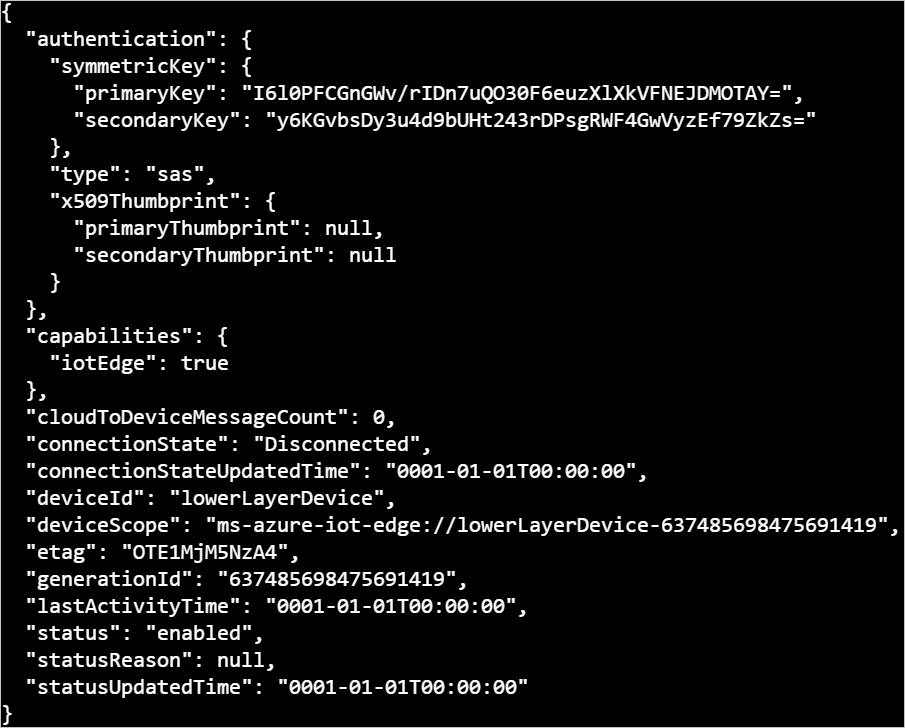

# Tutorial: Create a hierarchy of IoT Edge devices (Preview)

[!INCLUDE [iot-edge-version-202011](../../includes/iot-edge-version-202011.md)]

Deploy Azure IoT Edge nodes across networks organized in hierarchical layers. Each layer in a hierarchy is a gateway device that handles messages and requests from devices in the layer beneath it.

>[!NOTE]
>This feature requires IoT Edge version 1.2, which is in public preview, running Linux containers.

You can structure a hierarchy of devices so that only the top layer has connectivity to the cloud, and the lower layers can only communicate with adjacent north and south layers. This network layering is the foundation of most industrial networks, which follow the [ISA-95 standard](https://en.wikipedia.org/wiki/ANSI/ISA-95).

The goal of this tutorial is to create a hierarchy of IoT Edge devices that simulates a production environment. At the end, you will deploy the [Simulated Temperature Sensor module](https://azuremarketplace.microsoft.com/marketplace/apps/azure-iot.simulated-temperature-sensor) to a lower layer device without internet access by downloading container images through the hierarchy.

To accomplish this goal, this tutorial walks you through creating a hierarchy of IoT Edge devices, deploying IoT Edge runtime containers to your devices, and configuring your devices locally. In this tutorial, you learn how to:

> [!div class="checklist"]
>
> * Create and define the relationships in a hierarchy of IoT Edge devices.
> * Configure the IoT Edge runtime on the devices in your hierarchy.
> * Install consistent certificates across your device hierarchy.
> * Add workloads to the devices in your hierarchy.
> * Use the [IoT Edge API Proxy module](https://azuremarketplace.microsoft.com/marketplace/apps/azure-iot.azureiotedge-api-proxy?tab=Overview) to securely route HTTP traffic over a single port from your lower layer devices.

In this tutorial, the following network layers are defined:

* **Top layer**: IoT Edge devices at this layer can connect directly to the cloud.

* **Lower layers**: IoT Edge devices at layers below the top layer cannot connect directly to the cloud. They need to go through one or more intermediary IoT Edge devices to send and receive data.

This tutorial uses a two device hierarchy for simplicity, pictured below. One device, the **top layer device**, represents a device at the top layer of the hierarchy, which can connect directly to the cloud. This device will also be referred to as the **parent device**. The other device, the **lower layer device**, represents a device at the lower layer of the hierarchy, which cannot connect directly to the cloud. You can add additional lower layer devices to represent your production environment, as needed. Devices at lower layers will also be referred to as **child devices**. The configuration of any additional lower layer devices will follow the **lower layer device**'s configuration.


## Prerequisites

To create a hierarchy of IoT Edge devices, you will need:

* A computer (Windows or Linux) with internet connectivity.
* An Azure account with a valid subscription. If you don't have an [Azure subscription](../guides/developer/azure-developer-guide.md#understanding-accounts-subscriptions-and-billing), create a [free account](https://azure.microsoft.com/free/) before you begin.
* A free or standard tier [IoT Hub](../iot-hub/iot-hub-create-through-portal.md) in Azure.
* Azure CLI v2.3.1 with the Azure IoT extension v0.10.6 or higher installed. This tutorial uses the [Azure Cloud Shell](../cloud-shell/overview.md). If you're unfamiliar with the Azure Cloud Shell, [check out a quickstart for details](./quickstart-linux.md#prerequisites).
  * To see your current versions of the Azure CLI modules and extensions, run [az version](/cli/azure/reference-index?#az_version).
* A Linux device to configure as an IoT Edge device for each device in your hierarchy. This tutorial uses two devices. If you don't have devices available, you can create Azure virtual machines for each device in your hierarchy by replacing the placeholder text in the following command and running it:

   ```azurecli-interactive
   az vm create \
    --resource-group <REPLACE_WITH_RESOURCE_GROUP> \
    --name <REPLACE_WITH_UNIQUE_NAMES_FOR_EACH_VM> \
    --image UbuntuLTS \
    --admin-username azureuser \
    --admin-password <REPLACE_WITH_PASSWORD>
   ```

* Make sure that the following ports are open inbound: 8000, 443, 5671, 8883:
  * 8000: Used to pull Docker container images through the API proxy.
  * 443: Used between parent and child edge hubs for REST API calls.
  * 5671, 8883: Used for AMQP and MQTT.

  For more information, see [How to open ports to a virtual machine with the Azure portal](../virtual-machines/windows/nsg-quickstart-portal.md).

>[!TIP]
>If you would like an automated look at setting up a hierarchy of IoT Edge devices, you can follow the scripted [Azure IoT Edge for Industrial IoT sample](https://aka.ms/iotedge-nested-sample). This scripted scenario deploys Azure virtual machines as preconfigured devices to simulate a factory environment.
>
>If you would like to proceed though the creation of the sample hierarchy step-by-step, continue with the tutorial steps below.

## Configure your IoT Edge device hierarchy

### Create a hierarchy of IoT Edge devices

IoT Edge devices make up the layers of your hierarchy. This tutorial will create a hierarchy of two IoT Edge devices: the **top layer device** and its child, the **lower layer device**. You can create additional child devices, as needed.

To create your IoT Edge devices, you can use the Azure portal or Azure CLI.

# [Portal](#tab/azure-portal)

1. In the [Azure portal](https://ms.portal.azure.com/), navigate to your IoT Hub.

1. From the menu on the left pane, under **Automatic Device Management**, select **IoT Edge**.

1. Select **+ Add an IoT Edge device**. This device will be the top layer device, so enter an appropriate unique device ID. Select **Save**.

1. Select **+ Add an IoT Edge device** again. This device will be a lower layer device, so enter an appropriate unique device ID.

1. Choose **Set a parent device**, choose your top layer device from the list of devices, and select **Ok**. Select **Save**.

   

# [Azure CLI](#tab/azure-cli)

1. In the [Azure Cloud Shell](https://shell.azure.com/), enter the following command to create an IoT Edge device in your hub. This device will be the top layer device, so enter an appropriate unique device ID:

   ```azurecli-interactive
   az iot hub device-identity create --device-id {top_layer_device_id} --edge-enabled --hub-name {hub_name}
   ```

   A successful device creation will output the JSON configuration of the device.

   

1. Enter the following command to create a lower layer IoT Edge device. You can create more than one lower layer device if you want more layer in your hierarchy. Make sure to provide unique device identities to each.

   ```azurecli-interactive
   az iot hub device-identity create --device-id {lower_layer_device_id} --edge-enabled --hub-name {hub_name}
   ```

1. Enter the following command to define each parent-child relationship between the **top layer device** and each **lower layer device**. Make sure to run this command for each lower layer device in your hierarchy.

   ```azurecli-interactive
   az iot hub device-identity parent set --device-id {lower_layer_device_id} --parent-device-id {top_layer_device_id} --hub-name {hub_name}
   ```

   This command does not have explicit output.

---

Next, make note of each IoT Edge device's connection string. They will be used later.

# [Portal](#tab/azure-portal)

1. In the [Azure portal](https://ms.portal.azure.com/), navigate to the **IoT Edge** section of your IoT Hub.

1. Click on the device ID of one of the devices in the list of devices.

1. Select **Copy** on the **Primary Connection String** field and record it in a place of your choice.

1. Repeat for all other devices.

# [Azure CLI](#tab/azure-cli)

1. In the [Azure Cloud Shell](https://shell.azure.com/), for each device, enter the following command to retrieve the connection string of your device and record it in a place of your choice:

   ```azurecli-interactive
   az iot hub device-identity connection-string show --device-id {device_id} --hub-name {hub_name}
   ```

---

If you completed the above steps correctly, you can use the following steps to check that your parent-child relationships are correct in the Azure portal or Azure CLI.

# [Portal](#tab/azure-portal)

1. In the [Azure portal](https://ms.portal.azure.com/), navigate to the **IoT Edge** section of your IoT Hub.

1. Click on the device ID of a **lower layer device** in the list of devices.

1. On the device's details page, you should see your **top layer device**'s identity listed beside the **Parent device** field.

   [Parent device acknowledged by child device](./media/tutorial-nested-iot-edge/lower-layer-device-parent.png)

You can also child your hierarchy relationship's through your **top layer device**.

1. Click on the device ID of a **top layer device** in the list of devices.

1. Select the **Manage child devices** tab at the top.

1. Under the list of devices, you should see your **lower layer device**.

   [Child device acknowledged by parent device](./media/tutorial-nested-iot-edge/top-layer-device-child.png)

# [Azure CLI](#tab/azure-cli)

1. In the [Azure Cloud Shell](https://shell.azure.com/) you can verify that any of your child devices successfully established their relationship with the parent device by getting the identity of the child device's acknowledged parent device. This will output the JSON configuration of the parent device, pictured above:

   ```azurecli-interactive
   az iot hub device-identity parent show --device-id {lower_layer_device_id} --hub-name {hub_name}
   ```

You can also child your hierarchy relationship's through querying your **top layer device**.

1. List the child devices the parent device knows:

    ```azurecli-interactive
    az iot hub device-identity children list --device-id {top_layer_device_id} --hub-name {hub_name}
    ```

---

Once you are satisfied your hierarchy is correctly structured, you are ready to proceed.

### Create certificates

All devices in a [gateway scenario](iot-edge-as-gateway.md) need a shared certificate to set up secure connections between them. Use the following steps to create demo certificates for both devices in this scenario.

To create demo certificates on a Linux device, you need to clone the generation scripts and set them up to run locally in bash.

1. Clone the IoT Edge git repo, which contains scripts to generate demo certificates.

   ```bash
   git clone https://github.com/Azure/iotedge.git
   ```

1. Navigate to the directory in which you want to work. All certificate and key files will be created in this directory.

1. Copy the config and script files from the cloned IoT Edge repo into your working directory.

   ```bash
   cp <path>/iotedge/tools/CACertificates/*.cnf .
   cp <path>/iotedge/tools/CACertificates/certGen.sh .
   ```

1. Create the root CA certificate and one intermediate certificate.

   ```bash
   ./certGen.sh create_root_and_intermediate
   ```

   This script command creates several certificate and key files, but we are using the following file as the **root CA certificate** for the gateway hierarchy:

   * `<WRKDIR>/certs/azure-iot-test-only.root.ca.cert.pem`  

1. Create two sets of IoT Edge device CA certificates and private keys with the following command: one set for the top layer device and one set for the lower layer device. Provide memorable names for the CA certificates to distinguish them from each other.

   ```bash
   ./certGen.sh create_edge_device_ca_certificate "{top_layer_certificate_name}"
   ./certGen.sh create_edge_device_ca_certificate "{lower_layer_certificate_name}"
   ```

   This script command creates several certificate and key files, but we are using the following certificate and key pair on each IoT Edge device and referenced in the config file:

   * `<WRKDIR>/certs/iot-edge-device-<CA cert name>-full-chain.cert.pem`
   * `<WRKDIR>/private/iot-edge-device-<CA cert name>.key.pem`

Each device needs a copy of the root CA certificate and a copy of its own device CA certificate and private key. You can use a USB drive or [secure file copy](https://www.ssh.com/ssh/scp/) to move the certificates to each device.

1. After the certificates are transferred, install the root CA for each device.

   ```bash
   sudo cp <path>/azure-iot-test-only.root.ca.cert.pem /usr/local/share/ca-certificates/azure-iot-test-only.root.ca.cert.pem.crt
   sudo update-ca-certificates
   ```

   This command should output that one certificate has been added in `/etc/ssl/certs`.

   [Successful certificate installation message](./media/tutorial-nested-iot-edge/certificates-success-output.png)

If you completed the above steps correctly, you can check that your certificates are installed in `/etc/ssl/certs` by navigating to that directory and searching for your installed certs.

1. Navigate to `/etc/ssl/certs`:

   ```bash
   cd /etc/ssl/certs
   ```

1. List the installed certs and `grep` for `azure`:

   ```bash
   ll | grep azure
   ```

   You should see a certificate hash linked to your root CA Certificate and your root CA certificate linked to the copy in your `usr/local/share` directory.

   [Results of search for Azure certificates](./media/tutorial-nested-iot-edge/certificate-list-results.png)

Once you are satisfied your certificates are installed on each device, you are ready to proceed.

### Install IoT Edge on the devices

Installing the IoT Edge version 1.2 runtime images gives your devices access to the features necessary to operate as a hierarchy of devices.

To install IoT Edge, you need to install the appropriate repository configuration, install prerequisites, and install the necessary release assets.

1. Install the repository configuration that matches your device operating system.

   * **Ubuntu Server 18.04**:

     ```bash
     curl https://packages.microsoft.com/config/ubuntu/18.04/multiarch/prod.list > ./microsoft-prod.list
     ```

   * **Raspberry Pi OS Stretch**:

     ```bash
     curl https://packages.microsoft.com/config/debian/stretch/multiarch/prod.list > ./microsoft-prod.list
     ```

1. Copy the generated list to the sources.list.d directory.

   ```bash
   sudo cp ./microsoft-prod.list /etc/apt/sources.list.d/
   ```

1. Install the Microsoft GPG public key.

   ```bash
   curl https://packages.microsoft.com/keys/microsoft.asc | gpg --dearmor > microsoft.gpg
   sudo cp ./microsoft.gpg /etc/apt/trusted.gpg.d/
   ```

1. Update package lists on your device.

   ```bash
   sudo apt-get update
   ```

1. Install the Moby engine.

   ```bash
   sudo apt-get install moby-engine
   ```

1. Install IoT Edge and the IoT identity service.

   ```bash
   sudo apt-get install aziot-edge
   ```

If you completed the above steps correctly, you saw the Azure IoT Edge banner message requesting that you update the Azure IoT Edge configuration file, `/etc/aziot/config.toml`, on each device in your hierarchy. If so, you are ready to proceed.

### Configure the IoT Edge runtime

In addition to the provisioning of your devices, the configuration steps establish trusted communication between the devices in your hierarchy using the certificates you created earlier. The steps also begin to establish the network structure of your hierarchy. The top layer device will maintain internet connectivity, allowing it to pull images for its runtime from the cloud, while lower layer devices will route through the top layer device to access these images.

To configure the IoT Edge runtime, you need to modify several components of the configuration file. The configurations slightly differ between the **top layer device** and a **lower layer device**, so be mindful of which device's configuration file you are editing for each step. Configuring the IoT Edge runtime for your devices consists of four steps, all accomplished by editing the IoT Edge configuration file:

* Manually provision each device by adding that device's connection string to the configuration file.

* Finish setting up your device's certificates by pointing the configuration file to the device CA certificate, device CA private key, and root CA certificate.

* Bootstrap the system using the IoT Edge agent.

* Update the **hostname** parameter for your **top layer** device, and update both the **hostname** parameter and **parent_hostname** parameter for your **lower layer** devices.

Complete these steps and restart the IoT Edge service to configure your devices.

>[!TIP]
>When navigating the configuration file in Nano, you can use **Ctrl + W** to search for keywords in the file.

1. On each device, create a configuration file based on the included template.

   ```bash
   sudo cp /etc/aziot/config.toml.edge.template /etc/aziot/config.toml

1. On each device, open the IoT Edge configuration file.

   ```bash
   sudo nano /etc/aziot/config.toml
   ```

1. For your **top layer** device, find the **Hostname** section. Uncomment the line with the `hostname` parameter and update the value to be the fully qualified domain name (FQDN) or IP address of the IoT Edge device. Use whichever value you choose consistently across the devices in your hierarchy.

   ```toml
   hostname = "<device fqdn or IP>"
   ```

   >[!TIP]
   >To paste clipboard contents into Nano `Shift+Right Click` or press `Shift+Insert`.

1. For any IoT Edge device in **lower layers**, find the **Parent hostname** section. Uncomment the line with the `parent_hostname` parameter and update the value to point to the FQDN or IP of the parent device. Use the exact value that you put in the parent device's **hostname** field. For the IoT Edge device in the **top layer**, leave this parameter commented out.

   ```toml
   parent_hostname = "<parent device fqdn or IP>"
   ```

   > [!NOTE]
   > For hierarchies with more than one lower layer, update the *parent_hostname* field with the FQDN of the device in the layer immediately above.

1. Find the **Trust bundle cert** section of the file. Uncomment the line with the `trust_bundle_cert` parameter and update the value with the file URI path to the root CA certificate shared by all devices in the gateway hierarchy.

   ```toml
   trust_bundle_cert = "<root CA certificate>"
   ```

1. Find the **Provisioning** section of the file. Uncomment the lines for **Manual provisioning with connection string**. For each device in your hierarchy, update the value of **connection_string** with the connection string from your IoT Edge device.

   ```toml
   # Manual provisioning with connection string
   [provisioning]
   source = "manual"
   connection_string: "<Device connection string>"
   ```

1. Find the **Default Edge Agent** section.

   * For your **top layer** device, update the edgeAgent image value to the public preview version of the module in Azure Container Registry.
   
     ```toml
     [agent.config]
     image = "mcr.microsoft.com/azureiotedge-agent:1.2.0-rc4"
     ```

   * For each IoT Edge device in **lower layers**, update the edgeAgent image to point to the parent device followed by the port that the API proxy is listening on. You will deploy the API proxy module to the parent device in the next section.
   
     ```toml
     [agent.config]
     image = "<parent hostname value>:8000/azureiotedge-agent:1.2.0-rc4"
     ```

1. Find the **Edge CA certificate** section. Uncomment the first three lines of this section. Then, update the two parameters to point to the device CA certificate and device CA private key files that you created in the previous section and moved to the IoT Edge device. Provide the file URI paths, which take the format `file:///<path>/<filename>`, such as `file:///certs/iot-edge-device-ca-top-layer-device.key.pem`.

   ```yml
   [edge_ca]
   cert = "<File URI path to the device full chain CA certificate unique to this device.>"
   pk = "<File URI path to the device CA private key unique to this device.>"
   ```

   >[!NOTE]
   >Make sure to use the **full chain** CA certificate pathway and filename to populate the `device_ca_cert` field.

1. Save and close the file.

   `CTRL + X`, `Y`, `Enter`

1. After entering the provisioning information in the configuration file, apply the changes:

   ```bash
   sudo iotedge config apply
   ```

Before you continue, make sure that you have updated the configuration file of each device in the hierarchy. Depending on your hierarchy structure, you configured one **top layer device** and one or more **lower layer device(s)**.

If you completed the above steps correctly, you can check your devices are configured correctly.

1. Run the configuration and connectivity checks on your devices:

   ```bash
   sudo iotedge check
   ```

On your **top layer device**, expect to see an output with several passing evaluations and at least one warning. The check for the `latest security daemon` will warn you that another IoT Edge version is the latest stable version, because IoT Edge version 1.2 is in public preview. You may see additional warnings about logs policies and, depending on your network, DNS policies.

On a **lower layer device**, expect to see an output similar to the top layer device, but with an additional warning indicating the EdgeAgent module cannot be pulled from upstream. This is acceptable, as the IoT Edge API Proxy module and Docker Container Registry module, which lower layer devices will pull images through, are not yet deployed to the **top layer device**.

A sample output of `iotedge check` is shown below:

[Sample configuration and connectivity results](./media/tutorial-nested-iot-edge/configuration-and-connectivity-check-results.png)

Once you are satisfied your configurations are correct on each device, you are ready to proceed.

## Deploy modules to the top layer device

Modules serve to complete the deployment and the IoT Edge runtime to your devices and further define the structure of your hierarchy. The IoT Edge API Proxy module securely routs HTTP traffic over a single port from your lower layer devices. The Docker Registry module allows for a repository of Docker images that your lower layer devices can access by routing image pulls to the top layer device.

To deploy modules to your top layer device, you can use the Azure portal or Azure CLI.

>[!NOTE]
>The remaining steps to complete the configuration of the IoT Edge runtime and deploy workloads are not done on your IoT Edge devices.

# [Portal](#tab/azure-portal)

In the [Azure portal](https://ms.portal.azure.com/):

1. Navigate to your IoT Hub.

1. From the menu on the left pane, under **Automatic Device Management**, select **IoT Edge**.

1. Click on the device ID of your **top layer** edge device in the list of devices.

1. On the upper bar, select **Set Modules**.

1. Select **Runtime Settings**, next to the gear icon.

1. Under **Edge Hub**, in the image field, enter `mcr.microsoft.com/azureiotedge-hub:1.2.0-rc4`.

   

1. Add the following environment variables to your Edge Hub module:

    | Name | Value |
    | - | - |
    | `experimentalFeatures__enabled` | `true` |
    | `experimentalFeatures__nestedEdgeEnabled` | `true` |

   

1. Under **Edge Agent**, in the image field, enter `mcr.microsoft.com/azureiotedge-agent:1.2.0-rc4`. Select **Save**.

1. Add the Docker registry module to your top layer device. Select **+ Add** and choose **IoT Edge Module** from the dropdown. Provide the name `registry` for your Docker registry module and enter `registry:latest` for the image URI. Next, add environment variables and create options to point your local registry module at the Microsoft container registry to download container images from and to serve these images at registry:5000.

1. Under the environment variables tab, enter the following environment variable name-value pair:

    | Name | Value |
    | - | - |
    | `REGISTRY_PROXY_REMOTEURL` | `https://mcr.microsoft.com` |

1. Under the container create options tab, enter the following JSON:

   ```json
   {
    "HostConfig": {
        "PortBindings": {
            "5000/tcp": [
                {
                    "HostPort": "5000"
                }
            ]
         }
      }
   }
   ```

1. Next, add the API proxy module to your top layer device. Select **+ Add** and choose **Marketplace Module** from the dropdown. Search for `IoT Edge API Proxy` and select the module. The IoT Edge API proxy uses port 8000 and is configured to use your registry module named `registry` on port 5000 by default.

1. Select **Review + create**, then **Create** to complete the deployment. Your top layer device's IoT Edge runtime, which has access to the internet, will pull and run the **public preview** configs for IoT Edge hub and IoT Edge agent.

   

# [Azure CLI](#tab/azure-cli)

1. In the [Azure Cloud Shell](https://shell.azure.com/), enter the following command to create a deployment.json file:

   ```azurecli-interactive
   code deploymentTopLayer.json
   ```

1. Copy the contents of the JSON below into your deployment.json, save it, and close it.

   ```json
   {
       "modulesContent": {
           "$edgeAgent": {
               "properties.desired": {
                   "modules": {
                       "registry": {
                           "settings": {
                               "image": "registry:latest",
                               "createOptions": "{\"HostConfig\":{\"PortBindings\":{\"5000/tcp\":[{\"HostPort\":\"5000\"}]}}}"
                           },
                           "type": "docker",
                           "version": "1.0",
                           "env": {
                               "REGISTRY_PROXY_REMOTEURL": {
                                   "value": "https://mcr.microsoft.com"
                               } 
                           },
                           "status": "running",
                           "restartPolicy": "always"
                       },
                       "IoTEdgeAPIProxy": {
                           "settings": {
                               "image": "mcr.microsoft.com/azureiotedge-api-proxy",
                               "createOptions": "{\"HostConfig\": {\"PortBindings\": {\"8000/tcp\": [{\"HostPort\":\"8000\"}]}}}"
                           },
                           "type": "docker",
                           "env": {
                               "NGINX_DEFAULT_PORT": {
                                   "value": "8000"
                               },
                               "DOCKER_REQUEST_ROUTE_ADDRESS": {
                                   "value": "registry:5000"
                               },
                               "BLOB_UPLOAD_ROUTE_ADDRESS": {
                                   "value": "AzureBlobStorageonIoTEdge:11002"
                               }
                           },
                           "status": "running",
                           "restartPolicy": "always",
                           "version": "1.0"
                       }
                   },
                   "runtime": {
                       "settings": {
                           "minDockerVersion": "v1.25"
                       },
                       "type": "docker"
                   },
                   "schemaVersion": "1.1",
                   "systemModules": {
                       "edgeAgent": {
                           "settings": {
                               "image": "mcr.microsoft.com/azureiotedge-agent:1.2.0-rc4",
                               "createOptions": ""
                           },
                           "type": "docker"
                       },
                       "edgeHub": {
                           "settings": {
                               "image": "mcr.microsoft.com/azureiotedge-hub:1.2.0-rc4",
                               "createOptions": "{\"HostConfig\":{\"PortBindings\":{\"443/tcp\":[{\"HostPort\":\"443\"}],\"5671/tcp\":[{\"HostPort\":\"5671\"}],\"8883/tcp\":[{\"HostPort\":\"8883\"}]}}}"
                           },
                           "type": "docker",
                           "env": {
                               "experimentalFeatures__enabled": {
                                   "value": "true"
                               },
                               "experimentalFeatures__nestedEdgeEnabled": {
                                   "value": "true"
                               }
                           },
                           "status": "running",
                           "restartPolicy": "always"
                       }
                   }
               }
           },
           "$edgeHub": {
               "properties.desired": {
                   "routes": {
                       "route": "FROM /messages/* INTO $upstream"
                   },
                   "schemaVersion": "1.1",
                   "storeAndForwardConfiguration": {
                       "timeToLiveSecs": 7200
                   }
               }
           }
       }
   }
   ```

1. Enter the following command to create a deployment to your top layer edge device:

   ```azurecli-interactive
   az iot edge set-modules --device-id <top_layer_device_id> --hub-name <iot_hub_name> --content ./deploymentTopLayer.json
   ```

---

If you completed the above steps correctly, your **top layer device** should report the four modules: the IoT Edge API Proxy Module, the Docker Container Registry module, and the system modules, as **Specified in Deployment**. It may take a few minutes for the device to receive its new deployment and start the modules. Refresh the page until you see the temperature sensor module listed as **Reported by Device**. Once the modules are reported by the device, you are ready to continue.

## Deploy modules to the lower layer device

Modules also serve as the workloads of your lower layer devices. The Simulated Temperature Sensor module creates sample telemetry data to provide a functional flow of data through your hierarchy of devices.

To deploy modules to your lower layer devices, you can use the Azure portal or Azure CLI.

# [Portal](#tab/azure-portal)

In the [Azure portal](https://ms.portal.azure.com/):

1. Navigate to your IoT Hub.

1. From the menu on the left pane, under **Automatic Device Management**, select **IoT Edge**.

1. Click on the device ID of your lower layer device in the list of IoT Edge devices.

1. On the upper bar, select **Set Modules**.

1. Select **Runtime Settings**, next to the gear icon.

1. Under **Edge Hub**, in the image field, enter `$upstream:8000/azureiotedge-hub:1.2.0-rc4`.

1. Add the following environment variables to your Edge Hub module:

    | Name | Value |
    | - | - |
    | `experimentalFeatures__enabled` | `true` |
    | `experimentalFeatures__nestedEdgeEnabled` | `true` |

1. Under **Edge Agent**, in the image field, enter `$upstream:8000/azureiotedge-agent:1.2.0-rc4`. Select **Save**.

1. Add the temperature sensor module. Select **+ Add** and choose **Marketplace Module** from the dropdown. Search for `Simulated Temperature Sensor` and select the module.

1. Under **IoT Edge Modules**, select the `Simulated Temperature Sensor` module you just added and update its image URI to point to `$upstream:8000/azureiotedge-simulated-temperature-sensor:1.0`.

1. Select **Save**, **Review + create**, and **Create** to complete the deployment.

   

# [Azure CLI](#tab/azure-cli)

1. In the [Azure Cloud Shell](https://shell.azure.com/), enter the following command to create a deployment.json file:

   ```azurecli-interactive
   code deploymentLowerLayer.json
   ```

1. Copy the contents of the JSON below into your deployment.json, save it, and close it.

   ```json
   {
       "modulesContent": {
           "$edgeAgent": {
               "properties.desired": {
                   "modules": {
                       "simulatedTemperatureSensor": {
                           "settings": {
                               "image": "$upstream:8000/azureiotedge-simulated-temperature-sensor:1.0",
                               "createOptions": ""
                           },
                           "type": "docker",
                           "status": "running",
                           "restartPolicy": "always",
                           "version": "1.0"
                       }
                   },
                   "runtime": {
                       "settings": {
                           "minDockerVersion": "v1.25"
                       },
                       "type": "docker"
                   },
                   "schemaVersion": "1.1",
                   "systemModules": {
                       "edgeAgent": {
                           "settings": {
                               "image": "$upstream:8000/azureiotedge-agent:1.2.0-rc4",
                               "createOptions": ""
                           },
                           "type": "docker"
                       },
                       "edgeHub": {
                           "settings": {
                               "image": "$upstream:8000/azureiotedge-hub:1.2.0-rc4",
                               "createOptions": "{\"HostConfig\":{\"PortBindings\":{\"443/tcp\":[{\"HostPort\":\"443\"}],\"5671/tcp\":[{\"HostPort\":\"5671\"}],\"8883/tcp\":[{\"HostPort\":\"8883\"}]}}}"
                           },
                           "type": "docker",
                           "env": {
                               "experimentalFeatures__enabled": {
                                   "value": "true"
                               },
                               "experimentalFeatures__nestedEdgeEnabled": {
                                   "value": "true"
                               }
                           },
                           "status": "running",
                           "restartPolicy": "always"
                       }
                   }
               }
           },
           "$edgeHub": {
               "properties.desired": {
                   "routes": {
                       "route": "FROM /messages/* INTO $upstream"
                   },
                   "schemaVersion": "1.1",
                   "storeAndForwardConfiguration": {
                       "timeToLiveSecs": 7200
                   }
               }
           }
       }
   }
   ```

1. Enter the following command to create a set modules deployment to your lower layer edge device:

   ```azurecli-interactive
   az iot edge set-modules --device-id <lower_layer_device_id> --hub-name <iot_hub_name> --content ./deploymentLowerLayer.json

---

Notice that the image URI that we used for the simulated temperature sensor module pointed to `$upstream:8000` instead of to a container registry. We configured this device to not have direct connections to the cloud, because it's in a lower layer. To pull container images, this device requests the image from its parent device instead. At the top layer, the API proxy module routes this container request to the registry module, which handles the image pull.

If you completed the above steps correctly, your **lower layer device** should report three modules: the temperature sensor module and the system modules, as **Specified in Deployment**. It may take a few minutes for the device to receive its new deployment, request the container image, and start the module. Refresh the page until you see the temperature sensor module listed as **Reported by Device**. Once the modules are reported by the device, you are ready to continue.

## Troubleshooting

Run the `iotedge check` command to verify the configuration and to troubleshoot errors.

You can run `iotedge check` in a nested hierarchy, even if the child machines don't have direct internet access.

When you run `iotedge check` from the lower layer, the program tries to pull the image from the parent through port 443.

In this tutorial, we use port 8000, so we need to specify it:

```bash
sudo iotedge check --diagnostics-image-name <parent_device_fqdn_or_ip>:8000/azureiotedge-diagnostics:1.2.0-rc4
```

The `azureiotedge-diagnostics` value is pulled from the container registry that's linked with the registry module. This tutorial has it set by default to https://mcr.microsoft.com:

| Name | Value |
| - | - |
| `REGISTRY_PROXY_REMOTEURL` | `https://mcr.microsoft.com` |

If you're using a private container registry, make sure that all the images (for example, IoTEdgeAPIProxy, edgeAgent, edgeHub, and diagnostics) are present in the container registry.

## View generated data

The **Simulated Temperature Sensor** module that you pushed generates sample environment data. It sends messages that include ambient temperature and humidity, machine temperature and pressure, and a timestamp.

You can watch the messages arrive at your IoT hub by using the [Azure IoT Hub extension for Visual Studio Code](https://marketplace.visualstudio.com/items?itemName=vsciot-vscode.azure-iot-toolkit).

You can also view these messages through the [Azure Cloud Shell](https://shell.azure.com/):

   ```azurecli-interactive
   az iot hub monitor-events -n <iothub_name> -d <lower-layer-device-name>
   ```

## Clean up resources

You can delete the local configurations and the Azure resources that you created in this article to avoid charges.

To delete the resources:

1. Sign in to the [Azure portal](https://portal.azure.com) and select **Resource groups**.

2. Select the name of the resource group that contains your IoT Edge test resources. 

3. Review the list of resources contained in your resource group. If you want to delete all of them, you can select **Delete resource group**. If you want to delete only some of them, you can click into each resource to delete them individually. 

## Next steps

In this tutorial, you configured two IoT Edge devices as gateways and set one as the parent device of the other. Then, you demonstrated pulling a container image onto the child device through a gateway.

To see how Azure IoT Edge can create more solutions for your business, continue on to the other tutorials.

> [!div class="nextstepaction"]
> [Deploy an Azure Machine Learning model as a module](tutorial-deploy-machine-learning.md)
