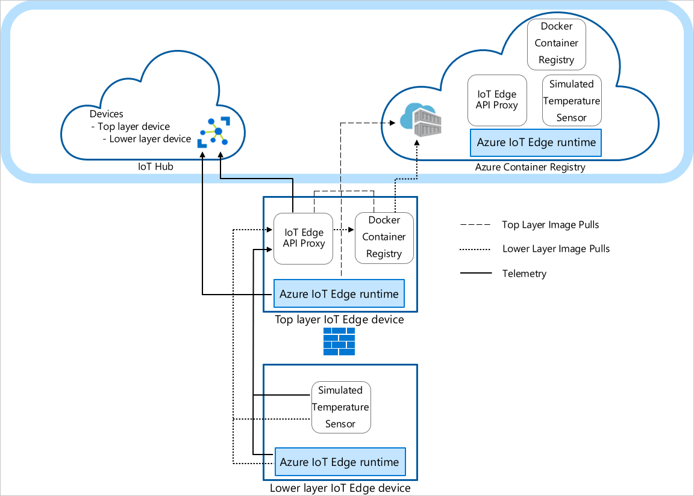
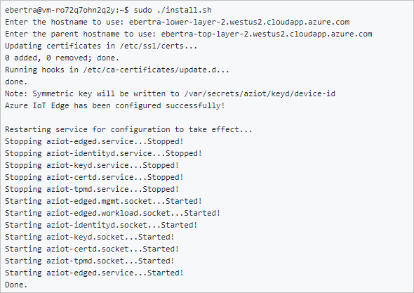

# Tutorial: Create a hierarchy of IoT Edge devices

[!INCLUDE [iot-edge-version-1.4](includes/iot-edge-version-1.4.md)]

You can deploy Azure IoT Edge nodes across networks organized in hierarchical layers. Each layer in a hierarchy is a gateway device that handles messages and requests from devices in the layer beneath it. This configuration is also known as *nested edge*.

You can structure a hierarchy of devices so that only the top layer has connectivity to the cloud, and the lower layers can only communicate with adjacent upstream and downstream layers. This network layering is the foundation of most industrial networks that follow the [ISA-95 standard](https://en.wikipedia.org/wiki/ANSI/ISA-95).

This tutorial walks you through creating a hierarchy of IoT Edge devices, deploying IoT Edge runtime containers to your devices, and configuring your devices locally. You do the following tasks:

> [!div class="checklist"]
>
> * Create and define the relationships in a hierarchy of IoT Edge devices.
> * Configure the IoT Edge runtime on the devices in your hierarchy.
> * Install consistent certificates across your device hierarchy.
> * Add workloads to the devices in your hierarchy.
> * Use the [IoT Edge API Proxy module](https://azuremarketplace.microsoft.com/marketplace/apps/azure-iot.azureiotedge-api-proxy?tab=Overview) to securely route HTTP traffic over a single port from your lower layer devices.

>[!TIP]
>This tutorial includes a mixture of manual and automated steps to provide a showcase of nested IoT Edge features.
>
>If you'd like an entirely automated look at setting up a hierarchy of IoT Edge devices, follow the scripted [Azure IoT Edge for Industrial IoT sample](https://aka.ms/iotedge-nested-sample). This scripted scenario deploys Azure virtual machines as preconfigured devices to simulate a factory environment.
>
>If you'd like an in-depth look at the manual steps to create and manage a hierarchy of IoT Edge devices, see [the how-to guide on IoT Edge device gateway hierarchies](how-to-connect-downstream-iot-edge-device.md).

In this tutorial, the following network layers are defined:

* **Top layer**: IoT Edge devices at this layer can connect directly to the cloud.

* **Lower layers**: IoT Edge devices at layers below the top layer can't connect directly to the cloud. They need to go through one or more intermediary IoT Edge devices to send and receive data.

This tutorial uses a two device hierarchy for simplicity. The **top layer device** represents a device at the top layer of the hierarchy that can connect directly to the cloud. This device is referred to as the **parent device**. The **lower layer device** represents a device at the lower layer of the hierarchy that can't connect directly to the cloud. You can add more devices to represent your production environment, as needed. Devices at lower layers are referred to as **child devices**.



> [!NOTE]
> A child device can be a downstream device or a gateway device in a nested topology.

## Prerequisites

To create a hierarchy of IoT Edge devices, you need:

* A computer (Windows or Linux) with internet connectivity.
* An Azure account with a valid subscription. If you don't have an [Azure subscription](../guides/developer/azure-developer-guide.md#understanding-accounts-subscriptions-and-billing), create a [free account](https://azure.microsoft.com/free/) before you begin.
* A free or standard tier [IoT Hub](../iot-hub/iot-hub-create-through-portal.md) in Azure.
* A Bash shell in Azure Cloud Shell using [Azure CLI](/cli/azure/install-azure-cli) with the [Azure IoT extension](https://github.com/Azure/azure-iot-cli-extension) installed. This tutorial uses the [Azure Cloud Shell](../cloud-shell/overview.md). To see your current versions of the Azure CLI modules and extensions, run [az version](/cli/azure/reference-index?#az-version).
* Two Linux devices to configure your hierarchy. If you don't have devices available, you can create Azure virtual machines for each device in your hierarchy using the [IoT Edge Azure Resource Manager template](https://github.com/Azure/iotedge-vm-deploy). IoT Edge version 1.4 is preinstalled with this Resource Manager template. If you're installing IoT Edge on your own devices, see [Install Azure IoT Edge for Linux](how-to-provision-single-device-linux-symmetric.md) or [Update IoT Edge](how-to-update-iot-edge.md).
* To simplify network communication between devices, the virtual machines should be on the same virtual network or use virtual network peering.
* Make sure that the following ports are open inbound for all devices except the lowest layer device: 443, 5671, 8883:
   * 443: Used between parent and child edge hubs for REST API calls and to pull docker container images.
   * 5671, 8883: Used for AMQP and MQTT.

   For more information, see [how to open ports to a virtual machine with the Azure portal](../virtual-machines/windows/nsg-quickstart-portal.md).

   >[!TIP]
   >You use the SSH handle and either the FQDN or IP address of each virtual machine for configuration in later steps, so keep track of this information. 
   >You can find the IP address and FQDN on the Azure portal. For the IP address, navigate to your list of virtual machines and note the **Public IP address field**. For the FQDN, go to each virtual machine's *overview* page and look for the **DNS name** field. For the SSH handle, go to each virtual machine's *connect* page.

## Create your IoT Edge device hierarchy

IoT Edge devices make up the layers of your hierarchy. This tutorial creates a hierarchy of two IoT Edge devices: the *top layer device* and the *lower layer device*. You can create more downstream devices as needed.

To create and configure your hierarchy of IoT Edge devices, you use the [az iot edge devices create](/cli/azure/iot/edge/devices#az-iot-edge-devices-create) Azure CLI command. The command simplifies the configuration of the hierarchy by automating and condensing several steps:

   * Creates devices in your IoT Hub
   * Sets the parent-child relationships to authorize communication between devices
   * Applies the deployment manifest to each device
   * Generates a chain of certificates for each device to establish secure communication between them
   * Generates configuration files for each device

### Create device configuration

You create a group of nested edge devices with containing a parent device with one child device. In this tutorial, we use basic sample deployment manifests. For other scenario examples, review the [configuration example templates](https://github.com/Azure-Samples/iotedge_config_cli/tree/main/templates).

1. Before you use the [az iot edge devices create](/cli/azure/iot/edge/devices#az-iot-edge-devices-create) command, you need to define the deployment manifest for the top layer and lower layer devices. Download the [deploymentTopLayer.json](https://github.com/Azure-Samples/iotedge_config_cli/blob/main/templates/tutorial/deploymentTopLayer.json) sample file to your local machine.

   The top layer device deployment manifest defines the [IoT Edge API Proxy module](how-to-configure-api-proxy-module.md) and declares the [route](module-composition.md#declare-routes) from the lower layer device to IoT Hub.

1. Download the [deploymentLowerLayer.json](https://github.com/Azure-Samples/iotedge_config_cli/blob/main/templates/tutorial/deploymentLowerLayer.json) sample file to your local machine.

   The lower layer device deployment manifest includes the simulated temperature sensor module and declares the [route](module-composition.md#declare-routes) to the top layer device. You can see within **systemModules** section that the runtime modules are set to pull from **$upstream:443**, instead of **mcr.microsoft.com**. The *lower layer device* sends Docker image requests the *IoT Edge API Proxy* module on port 443, as it can't directly pull the images from the cloud. The other module deployed to the *lower layer device*, the *Simulated Temperature Sensor* module, also makes its image request to `$upstream:443`.

   For more information on how to create a lower layer deployment manifest, see [Connect Azure IoT Edge devices to create a hierarchy](how-to-connect-downstream-iot-edge-device.md#deploy-modules-to-lower-layer-devices).

1. In the [Azure Cloud Shell](https://shell.azure.com/), use the [az iot edge devices create](/cli/azure/iot/edge/devices#az-iot-edge-devices-create) Azure CLI command to create devices in IoT Hub and configuration bundles for each device in your hierarchy. Replace the following placeholders with the appropriate values:

   | Placeholder | Description |
   |-------------|-------------|
   | \<hub-name\> | The name of your IoT Hub. |
   | \<config-bundle-output-path\> | The folder path where you want to save the configuration bundles. |
   | \<parent-device-name\> | The *top layer* parent device ID name. |
   | \<parent-deployment-manifest\> | The parent device deployment manifest file. |
   | \<parent-fqdn-or-ip\> | Parent device fully qualified domain name (FQDN) or IP address. |
   | \<child-device-name\> | The *lower layer* child device ID name. |
   | \<child-deployment-manifest\> | The child device deployment manifest file. |
   | \<child-fqdn-or-ip\> | Child device fully qualified domain name (FQDN) or IP address. |

   ```azurecli
   az iot edge devices create \
      --hub-name <hub-name> \
      --output-path <config-bundle-output-path> \
      --default-edge-agent "mcr.microsoft.com/azureiotedge-agent:1.4" \
      --device id=<parent-device-name> \
         deployment=<parent-deployment-manifest> \
         hostname=<parent-fqdn-or-ip> \
      --device id=child-1 \
         parent=parent-1 \
         deployment=<child-deployment-manifest> \
         hostname=<child-fqdn-or-ip>
   ```

   For example, the following command creates a hierarchy of two IoT Edge devices in IoT Hub. A top layer device named *parent-1* and a lower layer device named *child-1**. The command saves the configuration bundles for each device in the *output* directory. The command also generates self-signed test certificates and includes them in the configuration bundle. The configuration bundles are installed on each device using an install script.

   ```azurecli
   az iot edge devices create \
      --hub-name my-iot-hub \
      --output-path ./output \
      --default-edge-agent "mcr.microsoft.com/azureiotedge-agent:1.4" \
      --device id=parent-1 \
         deployment=./deploymentTopLayer.json \
         hostname=10.0.0.4 \
      --device id=child-1 \
         parent=parent-1 \
         deployment=./deploymentLowerLayer.json \
         hostname=10.1.0.4
   ```

After running the command, you can find the device configuration bundles in the output directory. For example:

```Output
PS C:\nested-edge\output> dir

   Directory: C:\nested-edge\output

Mode                 LastWriteTime         Length Name
----                 -------------         ------ ----
-a---           4/10/2023  4:12 PM           7192 child-1.tgz
-a---           4/10/2023  4:12 PM           6851 parent-1.tgz
```

You can use your own certificates and keys passed as arguments to the command or create a more complex device hierarchy. For more information about creating nested devices using the *az* command, see [az iot edge devices create](/cli/azure/iot/edge/devices#az-iot-edge-devices-create). If you're unfamiliar with how certificates are used in a gateway scenario, see [the how-to guide's certificate section](how-to-connect-downstream-iot-edge-device.md#generate-certificates). 

In this tutorial, you use inline arguments to create the devices and configuration bundles. You can also use a configuration file in YAML or JSON format. For a sample configuration file, see the example [sample_devices_config.yaml](https://aka.ms/aziotcli-edge-devices-config).

## Configure the IoT Edge runtime

In addition to the provisioning of your devices, the configuration steps establish trusted communication between the devices in your hierarchy using the certificates you created earlier. The steps also begin to establish the network structure of your hierarchy. The top layer device maintains internet connectivity, allowing it to pull images for its runtime from the cloud, while lower layer devices route through the top layer device to access these images.

To configure the IoT Edge runtime, you need to apply the configuration bundles to your devices. The configurations differ between the *top layer device* and a *lower layer device*, so be mindful of the device configuration file you're applying to each device.

1. Copy each configuration bundle archive file to its corresponding device. You can use a USB drive, a service like [Azure Key Vault](../key-vault/general/overview.md), or with a function like [Secure file copy](https://www.ssh.com/ssh/scp/). Choose one of these methods that best matches your scenario. 

   For example, to send the *parent-1* configuration bundle to the home directory on the *parent-1* VM, you could use a command like the following example:

   ```bash
   scp ./output/parent-1.tgz admin@parent-1-vm.westus.cloudapp.azure.com:~
   ```

1. On each device, extract the configuration bundle archive. For example, use the *tar* command to extract the *parent-1* archive file:

   ```bash
   tar -xzf ./parent-1.tgz
   ```

1. Set execute permission for the install script.

   ```bash
   chmod +x install.sh
   ```

1. On each device, apply the configuration bundle to the device using root permission:

   ```bash
   sudo ./install.sh
   ```

   

   If you want a closer look at what modifications are being made to your device's configuration file, see [Connect Azure IoT Edge devices together to create a hierarchy](how-to-connect-downstream-iot-edge-device.md).

To verify your devices are configured correctly, run the configuration and connectivity checks on your devices.

```bash
sudo iotedge check
```

```Output
admin@child-1-vm:~$ sudo iotedge check

Configuration checks (aziot-identity-service)
---------------------------------------------
√ keyd configuration is well-formed - OK
√ certd configuration is well-formed - OK
√ tpmd configuration is well-formed - OK
√ identityd configuration is well-formed - OK
√ daemon configurations up-to-date with config.toml - OK
√ identityd config toml file specifies a valid hostname - OK
√ host time is close to reference time - OK
√ preloaded certificates are valid - OK
√ keyd is running - OK
√ certd is running - OK
√ identityd is running - OK
√ read all preloaded certificates from the Certificates Service - OK
√ read all preloaded key pairs from the Keys Service - OK
√ check all EST server URLs utilize HTTPS - OK
√ ensure all preloaded certificates match preloaded private keys with the same ID - OK

Connectivity checks (aziot-identity-service)
--------------------------------------------
√ host can connect to and perform TLS handshake with iothub AMQP port - OK
√ host can connect to and perform TLS handshake with iothub HTTPS / WebSockets port - OK
√ host can connect to and perform TLS handshake with iothub MQTT port - OK

Configuration checks
--------------------
√ aziot-edged configuration is well-formed - OK
√ configuration up-to-date with config.toml - OK
√ container engine is installed and functional - OK
√ configuration has correct parent_hostname - OK
√ configuration has correct URIs for daemon mgmt endpoint - OK
√ container time is close to host time - OK
‼ DNS server - Warning
    Container engine is not configured with DNS server setting, which may impact connectivity to IoT Hub.
    Please see https://aka.ms/iotedge-prod-checklist-dns for best practices.
    You can ignore this warning if you are setting DNS server per module in the Edge deployment.
‼ production readiness: logs policy - Warning
    Container engine is not configured to rotate module logs which may cause it run out of disk space.
    Please see https://aka.ms/iotedge-prod-checklist-logs for best practices.
    You can ignore this warning if you are setting log policy per module in the Edge deployment.
‼ production readiness: Edge Agent's storage directory is persisted on the host filesystem - Warning
    The edgeAgent module is not configured to persist its /tmp/edgeAgent directory on the host filesystem.
    Data might be lost if the module is deleted or updated.
    Please see https://aka.ms/iotedge-storage-host for best practices.
‼ production readiness: Edge Hub's storage directory is persisted on the host filesystem - Warning
    The edgeHub module is not configured to persist its /tmp/edgeHub directory on the host filesystem.
    Data might be lost if the module is deleted or updated.
    Please see https://aka.ms/iotedge-storage-host for best practices.
√ Agent image is valid and can be pulled from upstream - OK
√ proxy settings are consistent in aziot-edged, aziot-identityd, moby daemon and config.toml - OK

Connectivity checks
-------------------
√ container on the default network can connect to upstream AMQP port - OK
√ container on the default network can connect to upstream HTTPS / WebSockets port - OK
√ container on the IoT Edge module network can connect to upstream AMQP port - OK
√ container on the IoT Edge module network can connect to upstream HTTPS / WebSockets port - OK
30 check(s) succeeded.
4 check(s) raised warnings. Re-run with --verbose for more details.
2 check(s) were skipped due to errors from other checks. Re-run with --verbose for more details.
```

On your **top layer device**, expect to see an output with several passing evaluations. You may see some warnings about logs policies and, depending on your network, DNS policies.

## Device module deployment

The module deployment for your devices were applied when the devices were created in IoT Hub. The *az iot edge devices create* command applied the deployment JSON files for the top and lower layer devices.
After those deployments completed, the **lower layer device** uses the **IoT Edge API Proxy** module to pull its necessary images.

In addition the runtime modules **IoT Edge Agent** and **IoT Edge Hub**, the **top layer device** receives the **Docker registry** module and **IoT Edge API Proxy** module.

The **Docker registry** module points to an existing Azure Container Registry. In this case, `REGISTRY_PROXY_REMOTEURL` points to the Microsoft Container Registry. By default, **Docker registry** listens on port 5000.

The *IoT Edge API Proxy* module routes HTTP requests to other modules, allowing lower layer devices to pull container images or push blobs to storage. In this tutorial, it communicates on port 443 and is configured to send Docker container image pull requests route to your **Docker registry** module on port 5000. Also, any blob storage upload requests route to module AzureBlobStorageonIoTEdge on port 11002. For more information about the **IoT Edge API Proxy** module and how to configure it, see the module's [how-to guide](how-to-configure-api-proxy-module.md).

If you'd like a look at how to create a deployment like this through the Azure portal or Azure Cloud Shell, see [top layer device section of the how-to guide](how-to-connect-downstream-iot-edge-device.md#deploy-modules-to-top-layer-devices).

You can view the status of your modules using the command:

```azurecli
az iot hub module-twin show --device-id <edge-device-id> --module-id '$edgeAgent' --hub-name <iot-hub-name> --query "properties.reported.[systemModules, modules]"
```

This command outputs all the edgeAgent reported properties. Here are some helpful ones for monitoring the status of the device: *runtime status*, *runtime start time*, *runtime last exit time*, *runtime restart count*.

You can also see the status of your modules on the [Azure portal](https://portal.azure.com/). Navigate to the **Devices** section of your IoT Hub to see your devices and modules.

## View generated data

The **Simulated Temperature Sensor** module that you pushed generates sample environment data. It sends messages that include ambient temperature and humidity, machine temperature and pressure, and a timestamp.

You can also view these messages through the [Azure Cloud Shell](https://shell.azure.com/):

```azurecli
az iot hub monitor-events -n <iot-hub-name> -d <lower-layer-device-name>
```

For example:

```azurecli
az iot hub monitor-events -n my-iot-hub -d child-1
```

```Output
{
    "event": {
        "origin": "child-1",
        "module": "simulatedTemperatureSensor",
        "interface": "",
        "component": "",
        "payload": "{\"machine\":{\"temperature\":104.29281270901808,\"pressure\":10.48905461241978},\"ambient\":{\"temperature\":21.086561171611102,\"humidity\":24},\"timeCreated\":\"2023-04-17T21:50:30.1082487Z\"}"
    }
}
```

## Troubleshooting

Run the `iotedge check` command to verify the configuration and to troubleshoot errors.

You can run `iotedge check` in a nested hierarchy, even if the downstream machines don't have direct internet access.

When you run `iotedge check` from the lower layer, the program tries to pull the image from the parent through port 443.

The `azureiotedge-diagnostics` value is pulled from the container registry that's linked with the registry module. This tutorial has it set by default to https://mcr.microsoft.com:

| Name | Value |
| - | - |
| `REGISTRY_PROXY_REMOTEURL` | `https://mcr.microsoft.com` |

If you're using a private container registry, make sure that all the images (IoTEdgeAPIProxy, edgeAgent, edgeHub, Simulated Temperature Sensor, and diagnostics) are present in the container registry.

If a downstream device has a different processor architecture from the parent device, you need the appropriate architecture image. You can use a [connected registry](/azure/container-registry/intro-connected-registry) or you can specify the correct image for the *edgeAgent* and *edgeHub* modules in the downstream device *config.toml* file. For example, if the parent device is running on an ARM32v7  architecture and the downstream device is running on an AMD64 architecture, you need to specify the matching version and architecture image tag in the downstream device *config.toml* file.

```toml
[agent.config]
image = "$upstream:443/azureiotedge-agent:1.4.10-linux-amd64"

"systemModules": {
   "edgeAgent": {
      "settings": {
            "image": "$upstream:443/azureiotedge-agent:1.4.10-linux-amd64"
      },
   },
   "edgeHub": {
      "settings": {
            "image": "$upstream:443/azureiotedge-hub:1.4.10-linux-amd64",
      }
   }
}
```

## Clean up resources

You can delete the local configurations and the Azure resources that you created in this article to avoid charges.

To delete the resources:

1. Sign in to the [Azure portal](https://portal.azure.com) and select **Resource groups**.

2. Select the name of the resource group that contains your IoT Edge test resources. 

3. Review the list of resources contained in your resource group. If you want to delete all of them, you can select **Delete resource group**. If you want to delete only some of them, you can select each resource to delete them individually. 

## Next steps

In this tutorial, you configured two IoT Edge devices as gateways and set one as the parent device of the other. Then, you pulled a container image onto the downstream device through a gateway using the IoT Edge API Proxy module. See [the how-to guide on the proxy module's use](how-to-configure-api-proxy-module.md) if you want to learn more.

To learn more about using gateways to create hierarchical layers of IoT Edge devices, see the following article.

> [!div class="nextstepaction"]
> [Connect Azure IoT Edge devices to create a hierarchy](how-to-connect-downstream-iot-edge-device.md)
