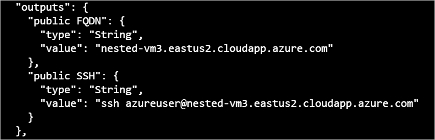
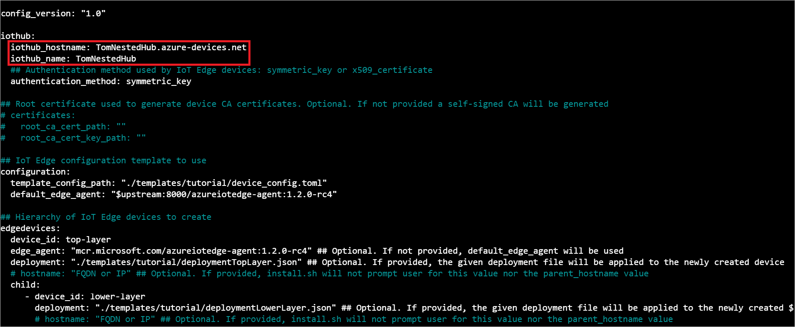
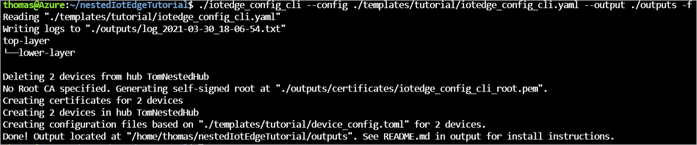
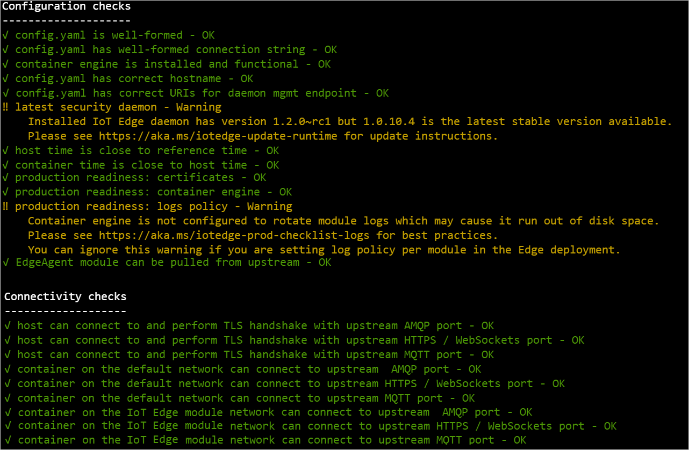

# Tutorial: Create a hierarchy of IoT Edge devices

[!INCLUDE [iot-edge-version-202011](../../includes/iot-edge-version-202011.md)]

Deploy Azure IoT Edge nodes across networks organized in hierarchical layers. Each layer in a hierarchy is a gateway device that handles messages and requests from devices in the layer beneath it.

You can structure a hierarchy of devices so that only the top layer has connectivity to the cloud, and the lower layers can only communicate with adjacent north and south layers. This network layering is the foundation of most industrial networks, which follow the [ISA-95 standard](https://en.wikipedia.org/wiki/ANSI/ISA-95).

The goal of this tutorial is to create a hierarchy of IoT Edge devices that simulates a simplified production environment. At the end, you will deploy the [Simulated Temperature Sensor module](https://azuremarketplace.microsoft.com/marketplace/apps/azure-iot.simulated-temperature-sensor) to a lower layer device without internet access by downloading container images through the hierarchy.

To accomplish this goal, this tutorial walks you through creating a hierarchy of IoT Edge devices, deploying IoT Edge runtime containers to your devices, and configuring your devices locally. In this tutorial, you use an automated configuration tool to:

> [!div class="checklist"]
>
> * Create and define the relationships in a hierarchy of IoT Edge devices.
> * Configure the IoT Edge runtime on the devices in your hierarchy.
> * Install consistent certificates across your device hierarchy.
> * Add workloads to the devices in your hierarchy.
> * Use the [IoT Edge API Proxy module](https://azuremarketplace.microsoft.com/marketplace/apps/azure-iot.azureiotedge-api-proxy?tab=Overview) to securely route HTTP traffic over a single port from your lower layer devices.

>[!TIP]
>This tutorial includes a mixture of manual and automated steps to provide a showcase of nested IoT Edge features.
>
>If you would like an entirely automated look at setting up a hierarchy of IoT Edge devices, you can follow the scripted [Azure IoT Edge for Industrial IoT sample](https://aka.ms/iotedge-nested-sample). This scripted scenario deploys Azure virtual machines as preconfigured devices to simulate a factory environment.
>
>If you would like an in-depth look at the manual steps to create and manage a hierarchy of IoT Edge devices, see [the how-to guide on IoT Edge device gateway hierarchies](how-to-connect-downstream-iot-edge-device.md).

In this tutorial, the following network layers are defined:

* **Top layer**: IoT Edge devices at this layer can connect directly to the cloud.

* **Lower layers**: IoT Edge devices at layers below the top layer cannot connect directly to the cloud. They need to go through one or more intermediary IoT Edge devices to send and receive data.

This tutorial uses a two device hierarchy for simplicity, pictured below. One device, the **top layer device**, represents a device at the top layer of the hierarchy, which can connect directly to the cloud. This device will also be referred to as the **parent device**. The other device, the **lower layer device**, represents a device at the lower layer of the hierarchy, which cannot connect directly to the cloud. You can add more lower layer devices to represent your production environment, as needed. Devices at lower layers will also be referred to as **child devices**.


## Prerequisites

To create a hierarchy of IoT Edge devices, you will need:

* A computer (Windows or Linux) with internet connectivity.
* An Azure account with a valid subscription. If you don't have an [Azure subscription](../guides/developer/azure-developer-guide.md#understanding-accounts-subscriptions-and-billing), create a [free account](https://azure.microsoft.com/free/) before you begin.
* A free or standard tier [IoT Hub](../iot-hub/iot-hub-create-through-portal.md) in Azure.
* A Bash shell in Azure Cloud Shell using Azure CLI v2.3.1 with the Azure IoT extension v0.10.6 or higher installed. This tutorial uses the [Azure Cloud Shell](../cloud-shell/overview.md). If you're unfamiliar with the Azure Cloud Shell, [check out a quickstart for details](./quickstart-linux.md#prerequisites).
  * To see your current versions of the Azure CLI modules and extensions, run [az version](/cli/azure/reference-index?#az_version).
* A Linux device to configure as an IoT Edge device for each device in your hierarchy. This tutorial uses two devices. If you don't have devices available, you can create Azure virtual machines for each device in your hierarchy using the command below.

   Replace the placeholder text in the following command and run it twice, once for each virtual machine. Each virtual machine needs a unique DNS prefix, which will also serve as its name. The DNS prefix must conform to the following regular expression: `[a-z][a-z0-9-]{1,61}[a-z0-9]`.

   ```bash
   az deployment group create \
    --resource-group <REPLACE_WITH_YOUR_RESOURCE_GROUP> \
    --template-uri "https://raw.githubusercontent.com/Azure/iotedge-vm-deploy/1.2.0/edgeDeploy.json" \
    --parameters dnsLabelPrefix='<REPLACE_WITH_UNIQUE_DNS_FOR_VIRTUAL_MACHINE>' \
    --parameters adminUsername='azureuser' \
    --parameters authenticationType='sshPublicKey' \
    --parameters adminPasswordOrKey="$(< ~/.ssh/id_rsa.pub)" \
    --query "properties.outputs.[publicFQDN.value, publicSSH.value]" -o tsv
   ```

   The virtual machine uses SSH keys for authenticating users. If you are unfamiliar with creating and using SSH keys, you can follow [the instructions for SSH public-private key pairs for Linux VMs in Azure](https://docs.microsoft.com/azure/virtual-machines/linux/mac-create-ssh-keys).

   IoT Edge version 1.2 is preinstalled with this ARM template, saving the need to manually install the assets on the virtual machines. If you are installing IoT Edge on your own devices, see [Install Azure IoT Edge for Linux (version 1.2)](how-to-install-iot-edge.md) or [Update IoT Edge to version 1.2](how-to-update-iot-edge.md#special-case-update-from-10-or-11-to-12).

   A successful creation of a virtual machine using this ARM template will output your virtual machine's `SSH` handle and fully-qualified domain name (`FQDN`). You will use the SSH handle and either the FQDN or IP address of each virtual machine for configuration in later steps, so keep track of this information. A sample output is pictured below.

   >[!TIP]
   >You can also find the IP address and FQDN on the Azure portal. For the IP address, navigate to your list of virtual machines and note the **Public IP address field**. For the FQDN, go to each virtual machine's overview page and look for the **DNS name** field.

   

* Make sure that the following ports are open inbound for all devices except the lowest layer device: 8000, 443, 5671, 8883:
  * 8000: Used to pull Docker container images through the API proxy.
  * 443: Used between parent and child edge hubs for REST API calls.
  * 5671, 8883: Used for AMQP and MQTT.

  For more information, see [how to open ports to a virtual machine with the Azure portal](../virtual-machines/windows/nsg-quickstart-portal.md).

## Configure your IoT Edge device hierarchy

### Create a hierarchy of IoT Edge devices

IoT Edge devices make up the layers of your hierarchy. This tutorial will create a hierarchy of two IoT Edge devices: the **top layer device** and its child, the **lower layer device**. You can create additional child devices as needed.

To create and configure your hierarchy of IoT Edge devices, you'll use the `iotedge-config` tool. This tool simplifies the configuration of the hierarchy by automating and condensing several steps into two:

1. Setting up the cloud configuration and preparing each device configuration, which includes:

   * Creating devices in your IoT Hub
   * Setting the parent-child relationships to authorize communication between devices
   * Generating a chain of certificates for each device to establish secure communication between them
   * Generating configuration files for each device

1. Installing each device configuration, which includes:

   * Installing certificates on each device
   * Applying the configuration files for each device

The `iotedge-config` tool will also make the module deployments to your IoT Edge device automatically.

To use the `iotedge-config` tool to create and configure your hierarchy, follow the steps below in the Azure CLI:

1. In the [Azure Cloud Shell](https://shell.azure.com/), make a directory for your tutorial's resources:

   ```bash
   mkdir nestedIotEdgeTutorial
   ```

1. Download the release of the configuration tool and configuration templates:

   ```bash
   cd ~/nestedIotEdgeTutorial
   wget -O iotedge_config.tar "https://github.com/Azure-Samples/iotedge_config_cli/releases/download/latest/iotedge_config_cli.tar.gz"
   tar -xvf iotedge_config.tar
   ```

   This will create the `iotedge_config_cli_release` folder in your tutorial directory.

   The template file used to create your device hierarchy is the `iotedge_config.yaml` file found in `~/nestedIotEdgeTutorial/iotedge_config_cli_release/templates/tutorial`. In the same directory, `deploymentLowerLayer.json` is a JSON deployment file containing instructions for which modules to deploy to your **lower layer device**. The `deploymentTopLayer.json` file is the same, but for your **top layer device**, as the modules deployed to each device are not the same. The `device_config.toml` file is a template for IoT Edge device configurations and will be used to automatically generate the configuration bundles for the devices in your hierarchy.

   If you'd like to take a look at the source code and scripts for the `iotedge-config` tool, check out [the Azure-Samples repository on GitHub](https://github.com/Azure-Samples/iotedge_config_cli).

1. Open the tutorial configuration template and edit it with your information:

   ```bash
   code ~/nestedIotEdgeTutorial/iotedge_config_cli_release/templates/tutorial/iotedge_config.yaml
   ```

   In the **iothub** section, populate the `iothub_hostname` and `iothub_name` fields with your information. This information can be found on the overview page of your IoT Hub on the Azure portal.

   In the optional **certificates** section, you can populate the fields with the absolute paths to your certificate and key. If you leave these fields blank, the script will automatically generate self-signed test certificates for your use. If you're unfamiliar with how certificates are used in a gateway scenario, check out [the how-to guide's certificate section](how-to-connect-downstream-iot-edge-device.md#prepare-certificates).

   In the **configuration** section, the `template_config_path` is the path to the `device_config.toml` template used to create your device configurations. The `default_edge_agent` field determines what Edge Agent image lower layer devices will pull and from where.

   In the **edgedevices** section, for a production scenario, you can edit the hierarchy tree to reflect your desired structure. For the purposes of this tutorial, accept the default tree. For each device, there is a `device_id` field, where you can name your devices. There is also the `deployment` field, which specifies the path to the deployment JSON for that device.

   You can also manually register IoT Edge devices in your IoT Hub through the Azure portal or Azure Cloud Shell. To learn how, see [the guide on how to register an IoT Edge device](how-to-register-device.md).

   You can define the parent-child relationships manually as well. See the [create a gateway hierarchy](how-to-connect-downstream-iot-edge-device.md#create-a-gateway-hierarchy) section of the how-to guide to learn more.

   

1. Save and close the file:

   `CTRL + S`, `CTRL + Q`

1. Create an outputs directory for the configuration bundles in your tutorial resources directory:

   ```bash
   mkdir ~/nestedIotEdgeTutorial/iotedge_config_cli_release/outputs
   ```

1. Navigate to your `iotedge_config_cli_release` directory and run the tool to create your hierarchy of IoT Edge devices:

   ```bash
   cd ~/nestedIotEdgeTutorial/iotedge_config_cli_release
   ./iotedge_config --config ~/nestedIotEdgeTutorial/iotedge_config_cli_release/templates/tutorial/iotedge_config.yaml --output ~/nestedIotEdgeTutorial/iotedge_config_cli_release/outputs -f
   ```

   With the `--output` flag, the tool creates the device certificates, certificate bundles, and a log file in a directory of your choice. With the `-f` flag set, the tool will automatically look for existing IoT Edge devices in your IoT Hub and remove them, to avoid errors and keep your hub clean.

   The configuration tool creates your IoT Edge devices and sets up the parent-child relationships between them. Optionally, it creates certificates for your devices to use. If paths to deployment JSONs are provided, the tool will automatically create these deployments to your devices, but this is not required. Finally, the tool will generate the configuration bundles for your devices and place them in the output directory. For a thorough look at the steps taken by the configuration tool, see the log file in the output directory.

   

Double-check that the topology output from the script looks correct. Once you are satisfied your hierarchy is correctly structured, you are ready to proceed.

### Configure the IoT Edge runtime

In addition to the provisioning of your devices, the configuration steps establish trusted communication between the devices in your hierarchy using the certificates you created earlier. The steps also begin to establish the network structure of your hierarchy. The top layer device will maintain internet connectivity, allowing it to pull images for its runtime from the cloud, while lower layer devices will route through the top layer device to access these images.

To configure the IoT Edge runtime, you need to apply the configuration bundles created by the setup script to your devices. The configurations slightly differ between the **top layer device** and a **lower layer device**, so be mindful of which device's configuration file you are applying to each device.

1. Each device needs its corresponding configuration bundle. You can use a USB drive or [secure file copy](https://www.ssh.com/ssh/scp/) to move the configuration bundles to each device.

   Be sure to send the correct configuration bundle to each device.

   ```bash
   scp <PATH_TO_CONFIGURATION_BUNDLE> <USER>@<VM_IP_OR_FQDN>:~
   ```

   The `:~` means that the configuration folder will be placed in the home directory on the virtual machine.

1. Log on to your virtual machine to apply the configuration bundle to the device:

   ```bash
   ssh <USER>@<VM_IP_OR_FQDN>
   ```

1. On each device, unzip the configuration bundle. You'll need to install zip first:

   ```bash
   sudo apt install zip
   unzip ~/<PATH_TO_CONFIGURATION_BUNDLE>/<CONFIGURATION_BUNDLE>.zip
   ```

1. On each device, apply the configuration bundle to the device:

   ```bash
   sudo ./install.sh
   ```

   On the **top layer device**, you will receive a prompt to enter the hostname. On the **lower layer device**, it will ask for the hostname and parent's hostname. Supply the appropriate IP or FQDN for each prompt. You can use either, but be consistent in your choice across devices. The output of the install script is pictured below.

   If you want a closer look at what modifications are being made to your device's configuration file, see [the configure IoT Edge on devices section of the how-to guide](how-to-connect-downstream-iot-edge-device.md#configure-iot-edge-on-devices).

  

If you completed the above steps correctly, you can check your devices are configured correctly.

Run the configuration and connectivity checks on your devices. For the **top layer device**:

   ```bash
   sudo iotedge check
   ```

For the **lower layer device**, the diagnostics image needs to be manually passed in the command:

   ```bash
   sudo iotedge check --diagnostics-image-name <parent_device_fqdn_or_ip>:8000/azureiotedge-diagnostics:1.2
   ```

On your **top layer device**, expect to see an output with several passing evaluations. You may see some warnings about logs policies and, depending on your network, DNS policies.

<!-- Add pic after GA -->
<!-- KEEP! A sample output of the `iotedge check` is shown below: -->

<!-- KEEP!  -->

Once you are satisfied your configurations are correct on each device, you are ready to proceed.

## Deploy modules to your devices

The module deployments to your devices were automatically generated when the devices were created. The `iotedge-config-cli` tool fed deployment JSONs for the **top and lower layer devices** after they were created. The module deployment were pending while you configured the IoT Edge runtime on each device. Once you configured the runtime, the deployments to the **top layer device** began. After those deployments completed, the **lower layer device** could use the **IoT Edge API Proxy** module to pull its necessary images.

In the [Azure Cloud Shell](https://shell.azure.com/), you can take a look at the **top layer device's** deployment JSON to understand what modules were deployed to your device:

   ```bash
   cat ~/nestedIotEdgeTutorial/iotedge_config_cli_release/templates/tutorial/deploymentTopLayer.json
   ```

In addition the runtime modules **IoT Edge Agent** and **IoT Edge Hub**, the **top layer device** receives the **Docker registry** module and **IoT Edge API Proxy** module.

The **Docker registry** module points to an existing Azure Container Registry. In this case, `REGISTRY_PROXY_REMOTEURL` points to the Microsoft Container Registry. In the `createOptions`, you can see it communicates on port 5000.

The **IoT Edge API Proxy** module routes HTTP requests to other modules, allowing lower layer devices to pull container images or push blobs to storage. In this tutorial, it communicates on port 8000 and is configured to send Docker container image pull requests route to your **Docker registry** module on port 5000. Also, any blob storage upload requests route to module AzureBlobStorageonIoTEdge on port 11002. For more information about the **IoT Edge API Proxy** module and how to configure it, see the module's [how-to guide](how-to-configure-api-proxy-module.md).

If you'd like a look at how to create a deployment like this through the Azure portal or Azure Cloud Shell, see [top layer device section of the how-to guide](how-to-connect-downstream-iot-edge-device.md#deploy-modules-to-top-layer-devices).

In the [Azure Cloud Shell](https://shell.azure.com/), you can take a look at the **lower layer device's** deployment JSON to understand what modules were deployed to your device:

   ```bash
   cat ~/nestedIotEdgeTutorial/iotedge_config_cli_release/templates/tutorial/deploymentLowerLayer.json
   ```

You can see under `systemModules` that the **lower layer device's** runtime modules are set to pull from `$upstream:8000`, instead of `mcr.microsoft.com`, as the **top layer device** did. The **lower layer device** sends Docker image requests the **IoT Edge API Proxy** module on port 8000, as it cannot directly pull the images from the cloud. The other module deployed to the **lower layer device**, the **Simulated Temperature Sensor** module, also makes its image request to `$upstream:8000`.

If you'd like a look at how to create a deployment like this through the Azure portal or Azure Cloud Shell, see [lower layer device section of the how-to guide](how-to-connect-downstream-iot-edge-device.md#deploy-modules-to-lower-layer-devices).

You can view the status of your modules using the command:

   ```bash
   az iot hub module-twin show --device-id <edge_device_id> --module-id '$edgeAgent' --hub-name <iot_hub_name> --query "properties.reported.[systemModules, modules]"
   ```

   This command will output all the edgeAgent reported properties. Here are some helpful ones for monitoring the status of the device: *runtime status*, *runtime start time*, *runtime last exit time*, *runtime restart count*.

You can also see the status of your modules on the [Azure portal](https://ms.portal.azure.com/). Navigate to the **IoT Edge** section of your IoT Hub to see your devices and modules.

Once you are satisfied with your module deployments, you are ready to proceed.

## View generated data

The **Simulated Temperature Sensor** module that you pushed generates sample environment data. It sends messages that include ambient temperature and humidity, machine temperature and pressure, and a timestamp.

You can also view these messages through the [Azure Cloud Shell](https://shell.azure.com/):

   ```azurecli-interactive
   az iot hub monitor-events -n <iothub_name> -d <lower-layer-device-name>
   ```

## Troubleshooting

Run the `iotedge check` command to verify the configuration and to troubleshoot errors.

You can run `iotedge check` in a nested hierarchy, even if the child machines don't have direct internet access.

When you run `iotedge check` from the lower layer, the program tries to pull the image from the parent through port 443.

In this tutorial, we use port 8000, so we need to specify it:

```bash
sudo iotedge check --diagnostics-image-name $upstream:8000/azureiotedge-diagnostics:1.2
```

The `azureiotedge-diagnostics` value is pulled from the container registry that's linked with the registry module. This tutorial has it set by default to https://mcr.microsoft.com:

| Name | Value |
| - | - |
| `REGISTRY_PROXY_REMOTEURL` | `https://mcr.microsoft.com` |

If you're using a private container registry, make sure that all the images (IoTEdgeAPIProxy, edgeAgent, edgeHub, Simulated Temperature Sensor, and diagnostics) are present in the container registry.

## Clean up resources

You can delete the local configurations and the Azure resources that you created in this article to avoid charges.

To delete the resources:

1. Sign in to the [Azure portal](https://portal.azure.com) and select **Resource groups**.

2. Select the name of the resource group that contains your IoT Edge test resources. 

3. Review the list of resources contained in your resource group. If you want to delete all of them, you can select **Delete resource group**. If you want to delete only some of them, you can click into each resource to delete them individually. 

## Next steps

In this tutorial, you configured two IoT Edge devices as gateways and set one as the parent device of the other. Then, you demonstrated pulling a container image onto the child device through a gateway using the IoT Edge API Proxy module. See [the how-to guide on the proxy module's use](how-to-configure-api-proxy-module.md) if you want to learn more.

To learn more about using gateways to create hierarchical layers of IoT Edge devices, see [the how-to guide on connecting downstream IoT Edge devices](how-to-connect-downstream-iot-edge-device.md).

To see how Azure IoT Edge can create more solutions for your business, continue on to the other tutorials.

> [!div class="nextstepaction"]
> [Deploy an Azure Machine Learning model as a module](tutorial-deploy-machine-learning.md)
