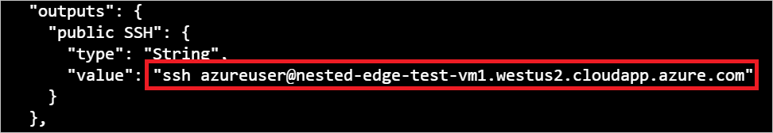

# Tutorial: Create a hierarchy of IoT Edge devices (Preview)

Deploy Azure IoT Edge nodes across networks organized in hierarchical layers. Each layer in a hierarchy is a gateway device that handles messages and requests from devices in the layer beneath it.

>[!NOTE]
>This feature requires IoT Edge version 1.2, which is in public preview, running Linux containers.

You can structure a hierarchy of devices so that only the top layer has connectivity to the cloud, and the lower layers can only communicate with adjacent north and south layers. This network layering is the foundation of most industrial networks, which follow the [ISA-95 standard](https://en.wikipedia.org/wiki/ANSI/ISA-95).

The goal of this tutorial is to create a hierarchy of IoT Edge devices that simulates a production environment. At the end, you will deploy the [Simulated Temperature Sensor module](https://azuremarketplace.microsoft.com/marketplace/apps/azure-iot.simulated-temperature-sensor) to a lower layer device without internet access by downloading container images through the hierarchy.

To accomplish this goal, this tutorial walks you through creating a hierarchy of IoT Edge devices, deploying IoT Edge runtime containers to your devices, and configuring your devices locally. In this tutorial, you learn how to:

> [!div class="checklist"]
>
> * Create and define the relationships in a hierarchy of IoT Edge devices.
> * Configure the IoT Edge runtime on the devices in your hierarchy.
> * Install consistent certificates across your device hierarchy.
> * Add workloads to the devices in your hierarchy.
> * Use the [IoT Edge API Proxy module](https://azuremarketplace.microsoft.com/marketplace/apps/azure-iot.azureiotedge-api-proxy?tab=Overview) to securely route HTTP traffic over a single port from your lower layer devices.

>[!NOTE]
>This tutorial provides a scripted nested IoT Edge experience, as it is an advanced scenario. For details on how to manually complete the steps taken by the setup script, see the guide on [connecting downstream IoT Edge devices to an Azure IoT Edge gateway](how-to-connect-downstream-iot-edge-device.md).

In this tutorial, the following network layers are defined:

* **Top layer**: IoT Edge devices at this layer can connect directly to the cloud.

* **Lower layers**: IoT Edge devices at layers below the top layer cannot connect directly to the cloud. They need to go through one or more intermediary IoT Edge devices to send and receive data.

This tutorial uses a two device hierarchy for simplicity, pictured below. One device, the **top layer device**, represents a device at the top layer of the hierarchy, which can connect directly to the cloud. This device will also be referred to as the **parent device**. The other device, the **lower layer device**, represents a device at the lower layer of the hierarchy, which cannot connect directly to the cloud. You can add additional lower layer devices to represent your production environment, as needed. Devices at lower layers will also be referred to as **child devices**. The configuration of any additional lower layer devices will follow the **lower layer device**'s configuration.


## Prerequisites

To create a hierarchy of IoT Edge devices, you will need:

* A computer (Windows or Linux) with internet connectivity.
* An Azure account with a valid subscription. If you don't have an [Azure subscription](../guides/developer/azure-developer-guide.md#understanding-accounts-subscriptions-and-billing), create a [free account](https://azure.microsoft.com/free/) before you begin.
* A free or standard tier [IoT Hub](../iot-hub/iot-hub-create-through-portal.md) in Azure.
* Azure CLI v2.3.1 with the Azure IoT extension v0.10.6 or higher installed. This tutorial uses the [Azure Cloud Shell](../cloud-shell/overview.md). If you're unfamiliar with the Azure Cloud Shell, [check out a quickstart for details](./quickstart-linux.md#prerequisites).
  * To see your current versions of the Azure CLI modules and extensions, run [az version](/cli/azure/reference-index?#az_version).
* A Linux device to configure as an IoT Edge device for each device in your hierarchy. This tutorial uses two devices. If you don't have devices available, you can create Azure virtual machines for each device in your hierarchy by replacing the placeholder text in the following command and running it:

   ```azurecli-interactive
   az deployment group create \
    --name TestVM1 \
    --resource-group TomsNestedEdgeResources \
    --template-uri "https://raw.githubusercontent.com/ebertrams/iotedge-vm-deploy/1.2.0-rc4-nested/edgeDeploy.json" \
    --parameters dnsLabelPrefix='nested-edge-test-vm1' \
    --parameters adminUsername='azureuser' \
    --parameters authenticationType='sshPublicKey' \
    --parameters adminPasswordOrKey="$(< ~/.ssh/id_rsa.pub)
   ```

    The virtual machine using SSH keys for authenticating users. If you are unfamiliar with creating and using SSH keys, you can follow [the instructions for SSH public-private key pairs for Linux VMs in Azure](https://docs.microsoft.com/azure/virtual-machines/linux/mac-create-ssh-keys).

    IoT Edge version 1.2 is preinstalled with this ARM template, saving the need to manually install the assets on your devices.

    A successful creation of a virtual machine using this ARM template will create an output JSON. This JSON output contains the SSH handle, which you can use to log onto your virtual machines. Find the `public SSH` block in the `outputs` section, pictured below.

   

   >[!NOTE]
   >You will use the public IP addresses or fully-qualified domain names (FQDN) of your virtual machines for configuration in later steps. If you wish to use the FQDN, they are included in the SSH handle in the form: `azureuser@<FQDN>`. 
   >
   >A method for obtaining the public IP addresses of your virtual machines is provided later in the tutorial.

* Make sure that the following ports are open inbound for all devices except the lowest layer device: 8000, 443, 5671, 8883:
  * 8000: Used to pull Docker container images through the API proxy.
  * 443: Used between parent and child edge hubs for REST API calls.
  * 5671, 8883: Used for AMQP and MQTT.

  For more information, see [How to open ports to a virtual machine with the Azure portal](../virtual-machines/windows/nsg-quickstart-portal.md).

>[!TIP]
>If you would like an automated look at setting up a hierarchy of IoT Edge devices, you can follow the scripted [Azure IoT Edge for Industrial IoT sample](https://aka.ms/iotedge-nested-sample). This scripted scenario deploys Azure virtual machines as preconfigured devices to simulate a factory environment.
>
>If you would like to proceed though the creation of the sample hierarchy step-by-step, continue with the tutorial steps below.

## Configure your IoT Edge device hierarchy

### Create a hierarchy of IoT Edge devices

IoT Edge devices make up the layers of your hierarchy. This tutorial will create a hierarchy of two IoT Edge devices: the **top layer device** and its child, the **lower layer device**. You can create additional child devices, as needed.

To create and configure your hierarchy of IoT Edge devices, you'll use the `iotedge-config-cli` tool. This tool simplifies the configuration of the hierarchy by automating and condensing several steps into two:

1. Setting up the cloud configuration and preparing each device configuration, which includes:

   * Creating devices in your IoT Hub
   * Setting the parent-child relationships to authorize communication between devices
   * Generating a chain of certificates for each device to establish secure communication between them
   * Generating configuration files for each device

1. Installing each device configuration, which includes:

   * Installing certificates on each device
   * Applying the configuration files for each device

To use the `iotedge-config-cli` tool to create and configure your hierarchy, follow the steps below in the Azure CLI:

1. In the [Azure Cloud Shell](https://shell.azure.com/), download the setup tool from OneDrive:

   ```bash
   git clone https://github.com/Azure-Samples/iot-edge-for-iiot.git
   ```

1. Make the script executable by changing its permissions:

   <!-- Update once repo for setup tool created -->

   ```bash
   cd ./iotedge-config-cli-tool
   find -name '*.sh' -print0 | xargs -0 chmod +x
   ```

1. Open the script configuration and edit it with your information:

   ```bash
   nano hierarchy-tutorial.txt
   ```

   In the **iothub** section, populate the `iothub_hostname` and `iothub_name` fields with your information.

   In the optional **certificates** section, you can populate the fields with the absolute paths to your certificate and key. If you leave these fields blank, the script will automatically generate self-signed test certificates for your use.

   In the **edgedevices** section, for a production scenario, you could edit the hierarchy tree to reflect your desired structure. For the purposes of this tutorial, accept the default tree.

   

1. Save and close the file:

   `CTRL + X`, `Y`, `Enter`

1. Run the script to create your hierarchy of IoT Edge devices:

   ```bash
   ./iotedge_config_cli -c ./nested_quickstart_config.yaml -o ./outputs -f
   ```

   Once completed, the script displays a topology of your hierarchy. The script also creates a configuration bundle for each device in your hierarchy, which will be stored in the `./outputs` folder from the above command.

   

Double-check that the topology output from the script looks correct. Once you are satisfied your hierarchy is correctly structured, you are ready to proceed.

### Configure the IoT Edge runtime

In addition to the provisioning of your devices, the configuration steps establish trusted communication between the devices in your hierarchy using the certificates you created earlier. The steps also begin to establish the network structure of your hierarchy. The top layer device will maintain internet connectivity, allowing it to pull images for its runtime from the cloud, while lower layer devices will route through the top layer device to access these images.

To configure the IoT Edge runtime, you need to apply the configuration bundles created by the setup script to your devices. The configurations slightly differ between the **top layer device** and a **lower layer device**, so be mindful of which device's configuration file you are applying to each device.

Complete the steps below and restart the IoT Edge service to configure your devices.

1. Acquire the IP address or FQDN of each of your virtual machines.

   If want to find the IP addresses, you can use the Azure CLI or Azure portal. In the portal, navigate to each of your virtual machines and look for the **Public IP address** field. In the Azure CLI, run the following command from the Azure CLI once for each virtual machine:

   ```azurecli-interactive
   az vm show --show-details --resource-group <REPLACE_WITH_RESOURCE_GROUP> --name <REPLACE_WITH_UNIQUE_NAMES_FOR_EACH_VM> --query publicIps -o tsv
   ```

   The FQDN is part of the SSH handle, as described previously when you created your virtual machines. However, you can also find the FQDN through the Azure portal. In the portal, navigate to each of your virtual machines and look for the **DNS name** field.

1. Each device needs its corresponding configuration bundle. You can use a USB drive or [secure file copy](https://www.ssh.com/ssh/scp/) to move the configuration bundles to each device. Be sure to send the correct configuration bundle to each device.

   ```bash
   scp <PATH_TO_CONFIGURATION_BUNDLE> <USER>@<VM_IP_OR_FQDN>
   ```

1. You need to be logged on to your virtual machine to apply the configuration bundle to the device:

   ```bash
   ssh <USER>@<VM_IP_OR_FQDN>
   ```

1. On each device, unzip the configuration bundle and make the configuration executable by changing its permissions. You'll need to install zip first:

   ```bash
   sudo apt-get install zip
   unzip ./<PATH_TO_CONFIGURATION_BUNDLE>/<CONFIGURATION_BUNDLE>.zip
   find -name '*.sh' -print0 | xargs -0 chmod +x
   ```

1. On each device, apply the configuration bundle to the device:

   ```bash
   ./<PATH_TO_UNZIPPED_BUNDLE>/install.sh
   ```

   You will receive prompts to enter the device address and the parent device's address in the form of an IP or FQDN. You can use either, but be consistent in your choice across devices. Leave the parent device address empty for the **top layer device**.

  

1. On your **lower layer device**, there is one change to the `config.toml` that must be applied manually. On **lower layer device**, open the `config.toml`:

   ```bash
   nano ~/config.toml
   ```

1. Edit the bootstrapping Edge Agent version to `$upstream:8000/azureiotedge-agent:1.2.0-rc4`, pictured below.

   <!-- picture from config.toml here -->

1. Save and close the file:

   `CTRL + X`, `Y`, `Enter`

1. Manually apply the configuration file:

   ```bash
   sudo iotedge config apply -c ~/config.toml
   ```

If you completed the above steps correctly, you can check your devices are configured correctly.

1. Run the configuration and connectivity checks on your devices:

   ```bash
   sudo iotedge check
   ```

On your **top layer device**, expect to see an output with several passing evaluations and at least one warning. The check for the `latest security daemon` will warn you that another IoT Edge version is the latest stable version, because IoT Edge version 1.2 is in public preview. You may see additional warnings about logs policies and, depending on your network, DNS policies.

A sample output of the `iotedge check` for the **top layer device** is shown below:

[Sample configuration and connectivity results](./media/tutorial-nested-iot-edge/configuration-and-connectivity-check-results.png)

On a **lower layer device**, expect to see an output similar to the top layer device, but with an additional warning indicating the EdgeAgent module cannot be pulled from upstream. This is acceptable, as the IoT Edge API Proxy module and Docker Container Registry module, which lower layer devices will pull images through, are not yet deployed to the **top layer device**.

A sample output of the `iotedge check` for a **lower layer device** is shown below:

<!-- Image of lower layer device iotedge check output -->

Once you are satisfied your configurations are correct on each device, you are ready to proceed.

## Deploy modules to the top layer device

Modules serve to complete the deployment and the IoT Edge runtime to your devices and further define the structure of your hierarchy. The IoT Edge API Proxy module securely routs HTTP traffic over a single port from your lower layer devices. The Docker Registry module allows for a repository of Docker images that your lower layer devices can access by routing image pulls to the top layer device.

<!-- Give the why here -->

To deploy modules to your top layer device, you can use the Azure CLI.

>[!NOTE]
>The remaining steps to complete the configuration of the IoT Edge runtime and deploy workloads are not done on your IoT Edge devices.

1. In the [Azure Cloud Shell](https://shell.azure.com/), enter the following command to create a deployment.json file:

   ```azurecli-interactive
   code deploymentTopLayer.json
   ```

1. Copy the contents of the JSON below into your deployment.json, save it, and close it.

<!-- Remove experimental variables for GA -->

   ```json
   {
       "modulesContent": {
           "$edgeAgent": {
               "properties.desired": {
                   "modules": {
                       "dockerContainerRegistry": {
                           "settings": {
                               "image": "registry:latest",
                               "createOptions": "{\"HostConfig\":{\"PortBindings\":{\"5000/tcp\":[{\"HostPort\":\"5000\"}]}}}"
                           },
                           "type": "docker",
                           "version": "1.0",
                           "env": {
                               "REGISTRY_PROXY_REMOTEURL": {
                                   "value": "https://mcr.microsoft.com"
                               } 
                           },
                           "status": "running",
                           "restartPolicy": "always"
                       },
                       "IoTEdgeAPIProxy": {
                           "settings": {
                               "image": "mcr.microsoft.com/azureiotedge-api-proxy",
                               "createOptions": "{\"HostConfig\": {\"PortBindings\": {\"8000/tcp\": [{\"HostPort\":\"8000\"}]}}}"
                           },
                           "type": "docker",
                           "env": {
                               "NGINX_DEFAULT_PORT": {
                                   "value": "8000"
                               },
                               "DOCKER_REQUEST_ROUTE_ADDRESS": {
                                   "value": "registry:5000"
                               },
                               "BLOB_UPLOAD_ROUTE_ADDRESS": {
                                   "value": "AzureBlobStorageonIoTEdge:11002"
                               }
                           },
                           "status": "running",
                           "restartPolicy": "always",
                           "version": "1.0"
                       }
                   },
                   "runtime": {
                       "settings": {
                           "minDockerVersion": "v1.25"
                       },
                       "type": "docker"
                   },
                   "schemaVersion": "1.1",
                   "systemModules": {
                       "edgeAgent": {
                           "settings": {
                               "image": "mcr.microsoft.com/azureiotedge-agent:1.2.0-rc4",
                               "createOptions": ""
                           },
                           "type": "docker"
                       },
                       "edgeHub": {
                           "settings": {
                               "image": "mcr.microsoft.com/azureiotedge-hub:1.2.0-rc4",
                               "createOptions": "{\"HostConfig\":{\"PortBindings\":{\"443/tcp\":[{\"HostPort\":\"443\"}],\"5671/tcp\":[{\"HostPort\":\"5671\"}],\"8883/tcp\":[{\"HostPort\":\"8883\"}]}}}"
                           },
                           "type": "docker",
                           "env": {
                               "experimentalFeatures__enabled": {
                                   "value": "true"
                               },
                               "experimentalFeatures__nestedEdgeEnabled": {
                                   "value": "true"
                               }
                           },
                           "status": "running",
                           "restartPolicy": "always"
                       }
                   }
               }
           },
           "$edgeHub": {
               "properties.desired": {
                   "routes": {
                       "route": "FROM /messages/* INTO $upstream"
                   },
                   "schemaVersion": "1.1",
                   "storeAndForwardConfiguration": {
                       "timeToLiveSecs": 7200
                   }
               }
           }
       }
   }
   ```

1. Enter the following command to create a deployment to your top layer edge device:

   ```azurecli-interactive
   az iot edge set-modules --device-id <top_layer_device_id> --hub-name <iot_hub_name> --content ./deploymentTopLayer.json
   ```

If you completed the above steps correctly, your **top layer device** should report the four modules in the [Azure portal](https://ms.portal.azure.com/): the IoT Edge API Proxy Module, the Docker Container Registry module, and the system modules, as **Specified in Deployment**. It may take a few minutes for the device to receive its new deployment and start the modules. Refresh the page until you see the temperature sensor module listed as **Reported by Device**. Once the modules are reported by the device, you are ready to continue.

## Deploy modules to the lower layer device

Modules also serve as the workloads of your lower layer devices. The Simulated Temperature Sensor module creates sample telemetry data to provide a functional flow of data through your hierarchy of devices.

<!-- Give the why here -->

To deploy modules to your lower layer devices, you can use the Azure CLI.

1. In the [Azure Cloud Shell](https://shell.azure.com/), enter the following command to create a deployment.json file:

   ```azurecli-interactive
   code deploymentLowerLayer.json
   ```

1. Copy the contents of the JSON below into your deployment.json, save it, and close it.

<!-- Remove experimental variables for GA -->

   ```json
   {
       "modulesContent": {
           "$edgeAgent": {
               "properties.desired": {
                   "modules": {
                       "simulatedTemperatureSensor": {
                           "settings": {
                               "image": "$upstream:8000/azureiotedge-simulated-temperature-sensor:1.0",
                               "createOptions": ""
                           },
                           "type": "docker",
                           "status": "running",
                           "restartPolicy": "always",
                           "version": "1.0"
                       }
                   },
                   "runtime": {
                       "settings": {
                           "minDockerVersion": "v1.25"
                       },
                       "type": "docker"
                   },
                   "schemaVersion": "1.1",
                   "systemModules": {
                       "edgeAgent": {
                           "settings": {
                               "image": "$upstream:8000/azureiotedge-agent:1.2.0-rc4",
                               "createOptions": ""
                           },
                           "type": "docker"
                       },
                       "edgeHub": {
                           "settings": {
                               "image": "$upstream:8000/azureiotedge-hub:1.2.0-rc4",
                               "createOptions": "{\"HostConfig\":{\"PortBindings\":{\"443/tcp\":[{\"HostPort\":\"443\"}],\"5671/tcp\":[{\"HostPort\":\"5671\"}],\"8883/tcp\":[{\"HostPort\":\"8883\"}]}}}"
                           },
                           "type": "docker",
                           "env": {
                               "experimentalFeatures__enabled": {
                                   "value": "true"
                               },
                               "experimentalFeatures__nestedEdgeEnabled": {
                                   "value": "true"
                               }
                           },
                           "status": "running",
                           "restartPolicy": "always"
                       }
                   }
               }
           },
           "$edgeHub": {
               "properties.desired": {
                   "routes": {
                       "route": "FROM /messages/* INTO $upstream"
                   },
                   "schemaVersion": "1.1",
                   "storeAndForwardConfiguration": {
                       "timeToLiveSecs": 7200
                   }
               }
           }
       }
   }
   ```

1. Enter the following command to create a set modules deployment to your lower layer edge device:

   ```azurecli-interactive
   az iot edge set-modules --device-id <lower_layer_device_id> --hub-name <iot_hub_name> --content ./deploymentLowerLayer.json

Notice that the image URI that we used for the simulated temperature sensor module pointed to `$upstream:8000` instead of to a container registry. We configured this device to not have direct connections to the cloud, because it's in a lower layer. To pull container images, this device requests the image from its parent device instead. At the top layer, the API proxy module routes this container request to the registry module, which handles the image pull.

If you completed the above steps correctly, your **lower layer device** should report three modules in the [Azure portal](https://ms.portal.azure.com/): the temperature sensor module and the system modules, as **Specified in Deployment**. It may take a few minutes for the device to receive its new deployment, request the container image, and start the module. Refresh the page until you see the temperature sensor module listed as **Reported by Device**. Once the modules are reported by the device, you are ready to continue.

## View generated data

The **Simulated Temperature Sensor** module that you pushed generates sample environment data. It sends messages that include ambient temperature and humidity, machine temperature and pressure, and a timestamp.

You can watch the messages arrive at your IoT hub by using the [Azure IoT Hub extension for Visual Studio Code](https://marketplace.visualstudio.com/items?itemName=vsciot-vscode.azure-iot-toolkit).

You can also view these messages through the [Azure Cloud Shell](https://shell.azure.com/):

   ```azurecli-interactive
   az iot hub monitor-events -n <iothub_name> -d <lower-layer-device-name>
   ```

## Troubleshooting

Run the `iotedge check` command to verify the configuration and to troubleshoot errors.

You can run `iotedge check` in a nested hierarchy, even if the child machines don't have direct internet access.

When you run `iotedge check` from the lower layer, the program tries to pull the image from the parent through port 443.

In this tutorial, we use port 8000, so we need to specify it:

```bash
sudo iotedge check --diagnostics-image-name <parent_device_fqdn_or_ip>:8000/azureiotedge-diagnostics:1.2.0-rc4
```

The `azureiotedge-diagnostics` value is pulled from the container registry that's linked with the registry module. This tutorial has it set by default to https://mcr.microsoft.com:

| Name | Value |
| - | - |
| `REGISTRY_PROXY_REMOTEURL` | `https://mcr.microsoft.com` |

If you're using a private container registry, make sure that all the images (for example, IoTEdgeAPIProxy, edgeAgent, edgeHub, and diagnostics) are present in the container registry.

## Clean up resources

You can delete the local configurations and the Azure resources that you created in this article to avoid charges.

To delete the resources:

1. Sign in to the [Azure portal](https://portal.azure.com) and select **Resource groups**.

2. Select the name of the resource group that contains your IoT Edge test resources. 

3. Review the list of resources contained in your resource group. If you want to delete all of them, you can select **Delete resource group**. If you want to delete only some of them, you can click into each resource to delete them individually. 

## Next steps

In this tutorial, you configured two IoT Edge devices as gateways and set one as the parent device of the other. Then, you demonstrated pulling a container image onto the child device through a gateway.

To see how Azure IoT Edge can create more solutions for your business, continue on to the other tutorials.

> [!div class="nextstepaction"]
> [Deploy an Azure Machine Learning model as a module](tutorial-deploy-machine-learning.md)
