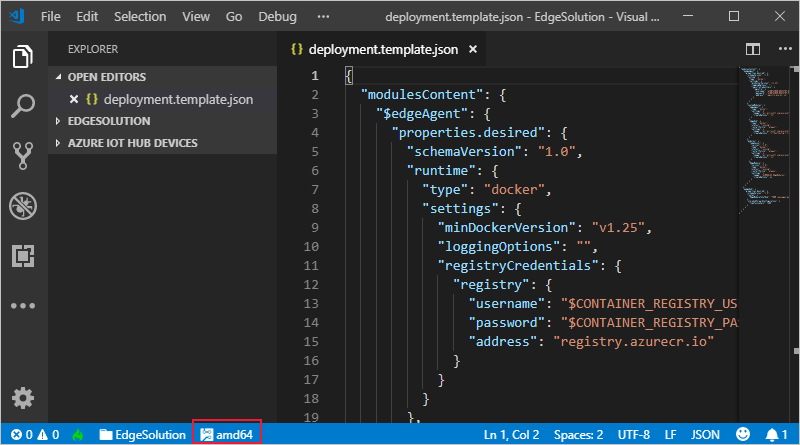

---
# Mandatory fields. See more on aka.ms/skyeye/meta.
title: Tutorial create custom Node.js module - Azure IoT Edge | Microsoft Docs 
description: This tutorial shows you how to create an IoT Edge module with Node.js code and deploy it to an edge device
services: iot-edge
author: shizn
manager: philmea

ms.author: xshi
ms.date: 01/04/2019
ms.topic: tutorial
ms.service: iot-edge
ms.custom: "mvc, seodec18"
---

# Tutorial: Develop and deploy a Node.js IoT Edge module to your simulated device

You can use IoT Edge modules to deploy code that implements your business logic directly to your IoT Edge devices. This tutorial walks you through creating and deploying an IoT Edge module that filters sensor data. You'll use the simulated IoT Edge device that you created in the quickstarts. In this tutorial, you learn how to:    

> [!div class="checklist"]
> * Use Visual Studio Code to create an IoT Edge Node.js module
> * Use Visual Studio Code and Docker to create a docker image and publish it to your registry 
> * Deploy the module to your IoT Edge device
> * View generated data


The IoT Edge module that you create in this tutorial filters the temperature data generated by your device. It only sends messages upstream if the temperature is above a specified threshold. This type of analysis at the edge is useful for reducing the amount of data communicated to and stored in the cloud. 

[!INCLUDE [quickstarts-free-trial-note](../../includes/quickstarts-free-trial-note.md)]

## Prerequisites

An Azure IoT Edge device:

* You can use your development machine or a virtual machine as an Edge device by following the steps in the quickstart for [Linux](quickstart-linux.md).
* Node.js modules for IoT Edge do not support Windows containers. 

Cloud resources:

* A free or standard-tier [IoT Hub](../iot-hub/iot-hub-create-through-portal.md) in Azure. 

Development resources:

* [Visual Studio Code](https://code.visualstudio.com/). 
* [Azure IoT Tools](https://marketplace.visualstudio.com/items?itemName=vsciot-vscode.azure-iot-edge) for Visual Studio Code. 
* [Docker CE](https://docs.docker.com/engine/installation/). 
   * If you're developing on a Windows device, make sure Docker is [configured to use Linux containers](https://docs.docker.com/docker-for-windows/#switch-between-windows-and-linux-containers). 
* [Node.js and npm](https://nodejs.org). The npm package is distributed with Node.js, which means that when you download Node.js, you automatically get npm installed on your computer.

## Create a container registry

In this tutorial, you use the Azure IoT Tools for Visual Studio Code to build a module and create a **container image** from the files. Then you push this image to a **registry** that stores and manages your images. Finally, you deploy your image from your registry to run on your IoT Edge device.  

You can use any Docker-compatible registry to hold your container images. Two popular Docker registry services are [Azure Container Registry](https://docs.microsoft.com/azure/container-registry/) and [Docker Hub](https://docs.docker.com/docker-hub/repos/#viewing-repository-tags). This tutorial uses Azure Container Registry. 

If you don't already have a container registry, follow these steps to create a new one in Azure:

1. In the [Azure portal](https://portal.azure.com), select **Create a resource** > **Containers** > **Container Registry**.

2. Provide the following values to create your container registry:

   | Field | Value |
   | ----- | ----- |
   | Registry name | Provide a unique name. |
   | Subscription | Select a subscription from the drop-down list. |
   | Resource group | We recommend that you use the same resource group for all of the test resources that you create during the IoT Edge quickstarts and tutorials. For example, **IoTEdgeResources**. |
   | Location | Choose a location close to you. |
   | Admin user | Set to **Enable**. |
   | SKU | Select **Basic**. |

5. Select **Create**.

6. After your container registry is created, browse to it, and then select **Access keys**. 

7. Copy the values for **Login server**, **Username**, and **Password**. You use these values later in the tutorial to provide access to the container registry. 

## Create an IoT Edge module project
The following steps show you how to create an IoT Edge Node.js module using Visual Studio Code and the Azure IoT Tools.

### Create a new solution

Use **npm** to create a Node.js solution template that you can build on top of. 

1. In Visual Studio Code, select **View** > **Integrated Terminal** to open the VS Code integrated terminal.

2. In the integrated terminal, enter the following command to install **yeoman** and the generator for Node.js Azure IoT Edge module: 

    ```cmd/sh
    npm install -g yo generator-azure-iot-edge-module
    ```

3. Select **View** > **Command Palette** to open the VS Code command palette. 

3. In the command palette, type and run the command **Azure: Sign in** and follow the instructions to sign in your Azure account. If you've already signed in, you can skip this step.

4. In the command palette, type and run the command **Azure IoT Edge: New IoT Edge solution**. Follow the prompts in the command palette to create your solution.

   | Field | Value |
   | ----- | ----- |
   | Select folder | Choose the location on your development machine for VS Code to create the solution files. |
   | Provide a solution name | Enter a descriptive name for your solution or accept the default **EdgeSolution**. |
   | Select module template | Choose **Node.js Module**. |
   | Provide a module name | Name your module **NodeModule**. |
   | Provide Docker image repository for the module | An image repository includes the name of your container registry and the name of your container image. Your container image is prepopulated from the name you provided in the last step. Replace **localhost:5000** with the login server value from your Azure container registry. You can retrieve the login server from the Overview page of your container registry in the Azure portal. <br><br>The final image repository looks like \<registry name\>.azurecr.io/nodemodule. |
 
   

The VS Code window loads your IoT Edge solution workspace. The solution workspace contains five top-level components. The **modules** folder contains the Node.js code for your module as well as Dockerfiles for building your module as a container image. The **\.env** file stores your container registry credentials. The **deployment.template.json** file contains the information that the IoT Edge runtime uses to deploy modules on a device and **deployment.debug.template.json** file contains the debug version of modules. You won't edit the **\.vscode** folder or **\.gitignore** file in this tutorial. 

If you didn't specify a container registry when creating your solution, but accepted the default localhost:5000 value, you won't have a \.env file. 

<!--
   
-->

### Add your registry credentials

The environment file stores the credentials for your container repository and shares those with the IoT Edge runtime. The runtime needs these credentials to pull your private images onto the IoT Edge device. 

1. In the VS Code explorer, open the **.env** file. 
2. Update the fields with the **username** and **password** values that you copied from your Azure container registry. 
3. Save this file. 

### Update the module with custom code

Each template comes with sample code included, which takes simulated sensor data from the **tempSensor** module and routes it to IoT Hub. In this section, add code to have NodeModule analyze the messages before sending them. 

1. In the VS Code explorer, open **modules** > **NodeModule** > **app.js**.

5. Add a temperature threshold variable below required node modules. The temperature threshold sets the value that the measured temperature must exceed in order for the data to be sent to IoT Hub.

    ```javascript
    var temperatureThreshold = 25;
    ```

6. Replace the entire `PipeMessage` function with the `FilterMessage` function.
    
    ```javascript
    // This function filters out messages that report temperatures below the temperature threshold.
    // It also adds the MessageType property to the message with the value set to Alert.
    function filterMessage(client, inputName, msg) {
        client.complete(msg, printResultFor('Receiving message'));
        if (inputName === 'input1') {
            var message = msg.getBytes().toString('utf8');
            var messageBody = JSON.parse(message);
            if (messageBody && messageBody.machine && messageBody.machine.temperature && messageBody.machine.temperature > temperatureThreshold) {
                console.log(`Machine temperature ${messageBody.machine.temperature} exceeds threshold ${temperatureThreshold}`);
                var outputMsg = new Message(message);
                outputMsg.properties.add('MessageType', 'Alert');
                client.sendOutputEvent('output1', outputMsg, printResultFor('Sending received message'));
            }
        }
    }

    ```

7. Replace the function name `pipeMessage` with `filterMessage` in `client.on()` function.

    ```javascript
    client.on('inputMessage', function (inputName, msg) {
        filterMessage(client, inputName, msg);
        });
    ```

8. Copy the following code snippet into the `client.open()` function callback, after `client.on()` inside the `else` statement. This function is invoked when the desired properties are updated.

    ```javascript
    client.getTwin(function (err, twin) {
        if (err) {
            console.error('Error getting twin: ' + err.message);
        } else {
            twin.on('properties.desired', function(delta) {
                if (delta.TemperatureThreshold) {
                    temperatureThreshold = delta.TemperatureThreshold;
                }
            });
        }
    });
    ```

9. Save the app.js file.

10. In the VS Code explorer, open the **deployment.template.json** file in your IoT Edge solution workspace. This file tells the IoT Edge agent which modules to deploy, in this case **tempSensor** and **NodeModule**, and tells the IoT Edge hub how to route messages between them. The Visual Studio Code extension automatically populates most of the information that you need in the deployment template, but verify that everything is accurate for your solution: 

   1. The default platform of your IoT Edge is set to **amd64** in your VS Code status bar, which means your **NodeModule** is set to Linux amd64 version of the image. Change the default platform in status bar from **amd64** to **arm32v7** if that is your IoT Edge device's architecture. 

      

   2. Verify that the template has the correct module name, not the default **SampleModule** name that you changed when you created the IoT Edge solution.

   3. The **registryCredentials** section stores your Docker registry credentials, so that the IoT Edge agent can pull your module image. The actual username and password pairs are stored in the .env file, which is ignored by git. Add your credentials to the .env file if you haven't already.  

   4. If you want to learn more about deployment manifests, see [Learn how to deploy modules and establish routes in IoT Edge](module-composition.md).

11. Add the NodeModule module twin to the deployment manifest. Insert the following JSON content at the bottom of the `moduleContent` section, after the `$edgeHub` module twin: 

   ```json
     "NodeModule": {
         "properties.desired":{
             "TemperatureThreshold":25
         }
     }
   ```

   

12. Save the deployment.template.json file.


## Build your IoT Edge solution

In the previous section you created an IoT Edge solution and added code to the NodeModule that will filter out messages where the reported machine temperature is below the acceptable threshold. Now you need to build the solution as a container image and push it to your container registry. 

1. Sign in to Docker by entering the following command in the Visual Studio Code integrated terminal, so you can push your module image to the ACR: 
     
   ```csh/sh
   docker login -u <ACR username> -p <ACR password> <ACR login server>
   ```
   Use the username, password, and login server that you copied from your Azure Container Registry in the first section. Or retrieve them again from the **Access keys** section of your registry in the Azure portal.

2. In the VS Code explorer, right-click the **deployment.template.json** file and select **Build and Push IoT Edge solution**. 

When you tell Visual Studio Code to build your solution, it first takes the information in the deployment template and generates a `deployment.json` file in a new **config** folder. Then it runs two commands in the integrated terminal: `docker build` and `docker push`. These two commands build your code, containerize your Node.js code, and then push it to the container registry that you specified when you initialized the solution. 

You can see the full container image address with tag in the `docker build` command that runs in the VS Code integrated terminal. The image address is built from information in the `module.json` file, with the format **\<repository\>:\<version\>-\<platform\>**. For this tutorial, it should look like **registryname.azurecr.io/nodemodule:0.0.1-amd64**.

>[!TIP]
>If you receive an error trying to build and push your module, make the following checks:
>* Did you sign in to Docker in Visual Studio Code using the credentials from your container registry? These credentials are different than the ones you use to sign in to the Azure portal.
>* Is your container repository correct? Open **modules** > **nodemodule** > **module.json** and find the **repository** field. The image repository should look like **\<registryname\>.azurecr.io/nodemodule**. 
>* Are you building the same type of containers that your development machine is running? Visual Studio Code defaults to Linux amd64 containers. If your development machine is running Linux arm32v7 containers, update the platform on the blue status bar at the bottom of your VS Code window to match your container platform.
>* Node.js modules for IoT Edge do not support Windows containers.

## Deploy and run the solution

In the quickstart article that you used to set up your IoT Edge device, you deployed a module by using the Azure portal. You can also deploy modules using the Azure IoT Hub Toolkit extension (formerly Azure IoT Toolkit extension) for Visual Studio Code. You already have a deployment manifest prepared for your scenario, the **deployment.json** file. All you need to do now is select a device to receive the deployment.

1. In the VS Code command palette, run **Azure IoT Hub: Select IoT Hub**. 

2. Choose the subscription and IoT hub that contain the IoT Edge device that you want to configure. 

3. In the VS Code explorer, expand the **Azure IoT Hub Devices** section. 

4. Right-click the name of your IoT Edge device, then select **Create Deployment for Single Device**. 

   

5. Select the **deployment.json** file in the **config** folder and then click **Select Edge Deployment Manifest**. Do not use the deployment.template.json file. 

6. Click the refresh button. You should see the new **NodeModule** running along with the **TempSensor** module and the **$edgeAgent** and **$edgeHub**. 


## View generated data

Once you apply the deployment manifest to your IoT Edge device, the IoT Edge runtime on the device collects the new deployment information and starts executing on it. Any modules running on the device that aren't included in the deployment manifest are stopped. Any modules missing from the device are started. 

You can view the status of your IoT Edge device using the **Azure IoT Hub Devices** section of the Visual Studio Code explorer. Expand the details of your device to see a list of deployed and running modules. 

On the IoT Edge device itself you can see the status of your deployment modules using the command `iotedge list`. You should see four modules: the two IoT Edge runtime modules, tempSensor, and the custom module that you created in this tutorial. It may take a few minutes for all the modules to start, so rerun the command if you don't see them all initially. 

To view the messages being generated by any module, use the command `iotedge logs <module name>`. 

You can view the messages as they arrive at your IoT hub using Visual Studio Code. 

1. To monitor data arriving at the IoT hub, click **...**, and select **Start Monitoring D2C Messages**.
2. To monitor the D2C message for a specific device, right-click the device in the list, and select **Start Monitoring D2C Messages**.
3. To stop monitoring data, run the command **Azure IoT Hub: Stop monitoring D2C message** in command palette. 
4. To view or update module twin, right-click the module in the list, and select **Edit module twin**. To update the module twin, save the twin JSON file and right-click the editor area and select **Update Module Twin**.
5. To view Docker logs, you can install [Docker](https://marketplace.visualstudio.com/items?itemName=PeterJausovec.vscode-docker) for VS Code and find your running modules locally in Docker explorer. In the context menu, click **Show Logs** to view in integrated terminal. 

## Clean up resources 

If you plan to continue to the next recommended article, you can keep the resources and configurations that you created and reuse them. You can also keep using the same IoT Edge device as a test device. 

Otherwise, you can delete the local configurations and the Azure resources that you created in this article to avoid charges. 

[!INCLUDE [iot-edge-clean-up-cloud-resources](../../includes/iot-edge-clean-up-cloud-resources.md)]

[!INCLUDE [iot-edge-clean-up-local-resources](../../includes/iot-edge-clean-up-local-resources.md)]


## Next steps

In this tutorial, you created an IoT Edge module that contains code to filter raw data generated by your IoT Edge device. You can continue on to either of the following tutorials to learn about other ways that Azure IoT Edge can help you turn data into business insights at the edge.

> [!div class="nextstepaction"]
> [Deploy Azure Function as a module](tutorial-deploy-function.md)
> [Deploy Azure Stream Analytics as a module](tutorial-deploy-stream-analytics.md)

