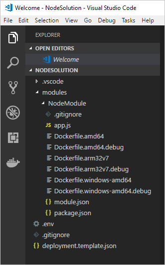
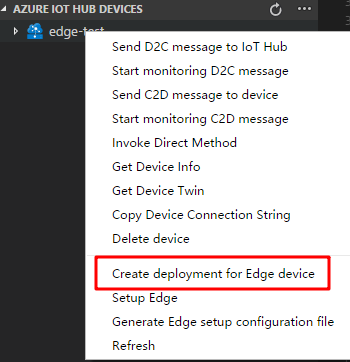

---
# Mandatory fields. See more on aka.ms/skyeye/meta.
title: Azure IoT Edge Node.js tutorial | Microsoft Docs 
description: This tutorial shows you how to create an IoT Edge module with Node.js code and deploy it to an edge device
services: iot-edge
author: shizn
manager: timlt

ms.author: xshi
ms.date: 09/21/2018
ms.topic: tutorial
ms.service: iot-edge
ms.custom: mvc

---

# Tutorial: Develop and deploy a Node.js IoT Edge module to your simulated device

You can use IoT Edge modules to deploy code that implements your business logic directly to your IoT Edge devices. This tutorial walks you through creating and deploying an IoT Edge module that filters sensor data. You'll use the simulated IoT Edge device that you created in the Deploy Azure IoT Edge on a simulated device in [Windows][lnk-tutorial1-win] or [Linux][lnk-tutorial1-lin] tutorials. In this tutorial, you learn how to:    

> [!div class="checklist"]
> * Use Visual Studio Code to create an IoT Edge Node.js module
> * Use Visual Studio Code and Docker to create a docker image and publish it to your registry 
> * Deploy the module to your IoT Edge device
> * View generated data


The IoT Edge module that you create in this tutorial filters the temperature data generated by your device. It only sends messages upstream if the temperature is above a specified threshold. This type of analysis at the edge is useful for reducing the amount of data communicated to and stored in the cloud. 

[!INCLUDE [quickstarts-free-trial-note](../../includes/quickstarts-free-trial-note.md)]

## Prerequisites

An Azure IoT Edge device:

* You can use your development machine or a virtual machine as an Edge device by following the steps in the quickstart for [Linux](quickstart-linux.md) or [Windows devices](quickstart.md).

Cloud resources:

* A free or standard-tier [IoT Hub](../iot-hub/iot-hub-create-through-portal.md) in Azure. 

Development resources:

* [Visual Studio Code](https://code.visualstudio.com/). 
* [Azure IoT Edge extension](https://marketplace.visualstudio.com/items?itemName=vsciot-vscode.azure-iot-edge) for Visual Studio Code. 
* [Docker CE](https://docs.docker.com/engine/installation/). 
* [Node.js and npm](https://nodejs.org). The npm package is distributed with Node.js, which means that when you download Node.js, you automatically get npm installed on your computer.

## Create a container registry
In this tutorial, you use the Azure IoT Edge extension for VS Code to build a module and create a **container image** from the files. Then you push this image to a **registry** that stores and manages your images. Finally, you deploy your image from your registry to run on your IoT Edge device.  

You can use any Docker-compatible registry for this tutorial. Two popular Docker registry services available in the cloud are [Azure Container Registry](https://docs.microsoft.com/azure/container-registry/) and [Docker Hub](https://docs.docker.com/docker-hub/repos/#viewing-repository-tags). This tutorial uses Azure Container Registry. 

1. In the [Azure portal](https://portal.azure.com), select **Create a resource** > **Containers** > **Azure Container Registry**.
2. Give your registry a name, choose a subscription, choose a resource group, and set the SKU to **Basic**. 
3. Select **Create**.
4. Once your container registry is created, navigate to it and select **Access keys**. 
5. Toggle **Admin user** to **Enable**.
6. Copy the values for **Login server**, **Username**, and **Password**. You'll use these values later in the tutorial. 

## Create an IoT Edge module project
The following steps show you how to create an IoT Edge Node.js module using Visual Studio Code and the Azure IoT Edge extension.

### Create a new solution

Use **npm** to create a Node.js solution template that you can build on top of. 

1. In Visual Studio Code, select **View** > **Integrated Terminal** to open the VS Code integrated terminal.

2. In the integrated terminal, enter the following command to install **yeoman** and the generator for Node.js Azure IoT Edge module: 

    ```cmd/sh
    npm install -g yo generator-azure-iot-edge-module
    ```

3. Select **View** > **Command Palette** to open the VS Code command palette. 

3. In the command palette, type and run the command **Azure: Sign in** and follow the instructions to sign in your Azure account. If you've already signed in, you can skip this step.

4. In the command palette, type and run the command **Azure IoT Edge: New IoT Edge solution**. In the command palette, provide the following information to create your solution: 

   1. Select the folder where you want to create the solution. 
   2. Provide a name for your solution or accept the default **EdgeSolution**.
   3. Choose **Node.js Module** as the module template. 
   4. Name your module **NodeModule**. 
   5. Specify the Azure Container Registry that you created in the previous section as the image repository for your first module. Replace **localhost:5000** with the login server value that you copied. The final string looks like **\<registry name\>.azurecr.io/nodemodule**.

   

The VS Code window loads your IoT Edge solution workspace. The solution workspace contains five top-level components. You won't edit the **\.vscode** folder or **\.gitignore** file in this tutorial. The **modules** folder contains the Node.js code for your module as well as Dockerfiles for building your module as a container image. The **\.env** file stores your container registry credentials. The **deployment.template.json** file contains the information that the IoT Edge runtime uses to deploy modules on a device. 

If you didn't specify a container registry when creating your solution, but accepted the default localhost:5000 value, you won't have a \.env file. 

   

### Add your registry credentials

The environment file stores the credentials for your container repository and shares those with the IoT Edge runtime. The runtime needs these credentials to pull your private images onto the IoT Edge device. 

1. In the VS Code explorer, open the **.env** file. 
2. Update the fields with the **username** and **password** values that you copied from your Azure container registry. 
3. Save this file. 

### Update the module with custom code

Each template comes with sample code included, which takes simulated sensor data from the **tempSensor** module and routes it to IoT Hub. In this section, add code to have NodeModule analyze the messages before sending them. 

1. In the VS Code explorer, open **modules** > **NodeModule** > **app.js**.

5. Add a temperature threshold variable below required node modules. The temperature threshold sets the value that the measured temperature must exceed in order for the data to be sent to IoT Hub.

    ```javascript
    var temperatureThreshold = 25;
    ```

6. Replace the entire `PipeMessage` function with the `FilterMessage` function.
    
    ```javascript
    // This function filters out messages that report temperatures below the temperature threshold.
    // It also adds the MessageType property to the message with the value set to Alert.
    function filterMessage(client, inputName, msg) {
        client.complete(msg, printResultFor('Receiving message'));
        if (inputName === 'input1') {
            var message = msg.getBytes().toString('utf8');
            var messageBody = JSON.parse(message);
            if (messageBody && messageBody.machine && messageBody.machine.temperature && messageBody.machine.temperature > temperatureThreshold) {
                console.log(`Machine temperature ${messageBody.machine.temperature} exceeds threshold ${temperatureThreshold}`);
                var outputMsg = new Message(message);
                outputMsg.properties.add('MessageType', 'Alert');
                client.sendOutputEvent('output1', outputMsg, printResultFor('Sending received message'));
            }
        }
    }

    ```

7. Replace the function name `pipeMessage` with `filterMessage` in `client.on()` function.

    ```javascript
    client.on('inputMessage', function (inputName, msg) {
        filterMessage(client, inputName, msg);
        });
    ```

8. Copy the following code snippet into the `client.open()` function callback, after `client.on()` inside the `else` statement. This function is invoked when the desired properties are updated.

    ```javascript
    client.getTwin(function (err, twin) {
        if (err) {
            console.error('Error getting twin: ' + err.message);
        } else {
            twin.on('properties.desired', function(delta) {
                if (delta.TemperatureThreshold) {
                    temperatureThreshold = delta.TemperatureThreshold;
                }
            });
        }
    });
    ```

9. Save this file.

## Build your IoT Edge solution

In the previous section you created an IoT Edge solution and added code to the NodeModule that will filter out messages where the reported machine temperature is below the acceptable threshold. Now you need to build the solution as a container image and push it to your container registry. 

1. Sign in to Docker by entering the following command in the Visual Studio Code integrated terminal, so you can push your module image to the ACR: 
     
   ```csh/sh
   docker login -u <ACR username> -p <ACR password> <ACR login server>
   ```
   Use the username, password, and login server that you copied from your Azure Container Registry in the first section. Or retrieve them again from the **Access keys** section of your registry in the Azure portal.

2. In the VS Code explorer, open the **deployment.template.json** file in your IoT Edge solution workspace. 

   This file tells the `$edgeAgent` to deploy two modules: **tempSensor**, which simulates device data, and **NodeModule**. The `NodeModule.image` value is set to a Linux amd64 version of the image. To learn more about deployment manifests, see [Understand how IoT Edge modules can be used, configured, and reused](module-composition.md).

   This file also contains your registry credentials. In the template file, your username and password are filled in with placeholders. When you generate the deployment manifest, the fields are updated with the values you added to **.env**. 

4. Add the NodeModule module twin to the deployment manifest. Insert the following JSON content at the bottom of the `moduleContent` section, after the `$edgeHub` module twin: 
    ```json
        "NodeModule": {
            "properties.desired":{
                "TemperatureThreshold":25
            }
        }
    ```
5. Save this file.
6. In the VS Code explorer, right-click the **deployment.template.json** file and select **Build and Push IoT Edge solution**. 

When you tell Visual Studio Code to build your solution, it first takes the information in the deployment template and generates a `deployment.json` file in a new **config** folder. Then it runs two commands in the integrated terminal: `docker build` and `docker push`. These two commands build your code, containerize the your Node.js code, and the push it to the container registry that you specified when you initialized the solution. 

You can see the full container image address with tag in the `docker build` command that runs in the VS Code integrated terminal. The image address is built from information in the `module.json` file, with the format **\<repository\>:\<version\>-\<platform\>**. For this tutorial, it should look like **registryname.azurecr.io/nodemodule:0.0.1-amd64**.

## Deploy and run the solution

In the quickstart article that you used to set up your IoT Edge device, you deployed a module by using the Azure portal. You can also deploy modules using the Azure IoT Toolkit extension for Visual Studio Code. You already have a deployment manifest prepared for your scenario, the **deployment.json** file. All you need to do now is select a device to receive the deployment.

1. In the VS Code command palette, run **Azure IoT Hub: Select IoT Hub**. 

2. Choose the subscription and IoT hub that contain the IoT Edge device that you want to configure. 

3. In the VS Code explorer, expand the **Azure IoT Hub Devices** section. 

4. Right-click the name of your IoT Edge device, then select **Create Deployment for Single Device**. 

   

5. Select the **deployment.json** file in the **config** folder and then click **Select Edge Deployment Manifest**. Do not use the deployment.template.json file. 

6. Click the refresh button. You should see the new **NodeModule** running along with the **TempSensor** module and the **$edgeAgent** and **$edgeHub**. 


## View generated data

Once you apply the deployment manifest to your IoT Edge device, the IoT Edge runtime on the device collects the new deployment information and starts executing on it. Any modules running on the device that aren't included in the deployment manifest are stopped. Any modules missing from the device are started. 

You can view the status of your IoT Edge device using the **Azure IoT Hub Devices** section of the Visual Studio Code explorer. Expand the details of your device to see a list of deployed and running modules. 

On the IoT Edge device itself you can see the status of your deployment modules using the command `iotedge list`. You should see four modules: the two IoT Edge runtime modules, tempSensor, and the custom module that you created in this tutorial. It may take a few minutes for all the modules to start, so rerun the command if you don't see them all initially. 

To view the messages being generated by any module, use the command `iotedge logs <module name>`. 

You can view the messages as they arrive at your IoT hub using Visual Studio Code. 

1. To monitor data arriving at the IoT hub, click **...**, and select **Start Monitoring D2C Messages**.
2. To monitor the D2C message for a specific device, right-click the device in the list, and select **Start Monitoring D2C Messages**.
3. To stop monitoring data, run the command **Azure IoT Hub: Stop monitoring D2C message** in command palette. 
4. To view or update module twin, right-click the module in the list, and select **Edit module twin**. To update the module twin, save the twin JSON file and right-click the editor area and select **Update Module Twin**.
5. To view Docker logs, you can install [Docker](https://marketplace.visualstudio.com/items?itemName=PeterJausovec.vscode-docker) for VS Code and find your running modules locally in Docker explorer. In the context menu, click **Show Logs** to view in integrated terminal. 

## Clean up resources 

If you plan to continue to the next recommended article, you can keep the resources and configurations that you created and reuse them. You can also keep using the same IoT Edge device as a test device. 

Otherwise, you can delete the local configurations and the Azure resources that you created in this article to avoid charges. 

[!INCLUDE [iot-edge-clean-up-cloud-resources](../../includes/iot-edge-clean-up-cloud-resources.md)]

[!INCLUDE [iot-edge-clean-up-local-resources](../../includes/iot-edge-clean-up-local-resources.md)]


## Next steps

In this tutorial, you created an IoT Edge module that contains code to filter raw data generated by your IoT Edge device. You can continue on to either of the following tutorials to learn about other ways that Azure IoT Edge can help you turn data into business insights at the edge.

> [!div class="nextstepaction"]
> [Deploy Azure Function as a module](tutorial-deploy-function.md)
> [Deploy Azure Stream Analytics as a module](tutorial-deploy-stream-analytics.md)


<!-- Links -->
[lnk-tutorial1-win]: quickstart.md
[lnk-tutorial1-lin]: quickstart-linux.md

<!-- Images -->
[1]: ./media/tutorial-csharp-module/programcs.png
[2]: ./media/tutorial-csharp-module/build-module.png
[3]: ./media/tutorial-csharp-module/docker-os.png
