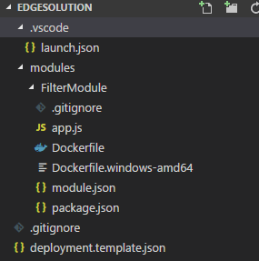
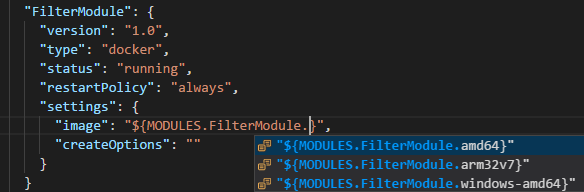
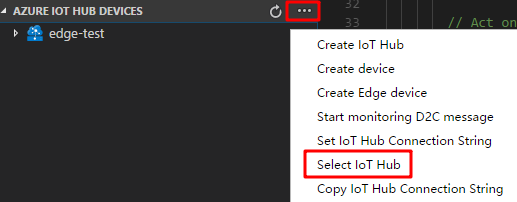
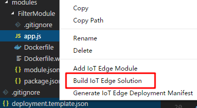
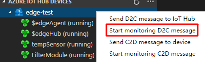
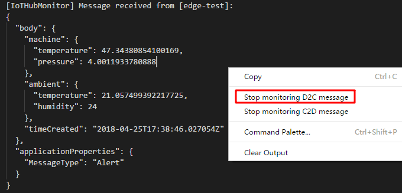

---
# Mandatory fields. See more on aka.ms/skyeye/meta.
title: Azure IoT Edge Python module | Microsoft Docs 
description: Create an IoT Edge module with Node.js code and deploy it to an edge device
services: iot-edge
keywords: 
author: shizn
manager: timlt

ms.author: xshi
ms.date: 04/27/2018
ms.topic: article
ms.service: iot-edge

# Optional fields. Don't forget to remove # if you need a field.
# ms.custom: can-be-multiple-comma-separated
# ms.devlang:devlang-from-white-list
# ms.suite: 
# ms.tgt_pltfrm:
# ms.reviewer:
---

# Develop and deploy a Node.js IoT Edge module to your simulated device - preview

You can use IoT Edge modules to deploy code that implements your business logic directly to your IoT Edge devices. This tutorial walks you through creating and deploying an IoT Edge module that filters sensor data. You'll use the simulated IoT Edge device that you created in the Deploy Azure IoT Edge on a simulated device in [Windows][lnk-tutorial1-win] or [Linux][lnk-tutorial1-lin] tutorials. In this tutorial, you learn how to:    

> [!div class="checklist"]
> * Use Visual Studio Code to create an IoT Edge soltuion with an IoT Edge Node.js module
> * Use Visual Studio Code and Docker to create a docker image and publish it to your registry 
> * Deploy the module to your IoT Edge device
> * View generated data


The IoT Edge module that you create in this tutorial filters the temperature data generated by your device. It only sends messages upstream if the temperature is above a specified threshold. This type of analysis at the edge is useful for reducing the amount of data communicated to and stored in the cloud. 


## Prerequisites

* The Azure IoT Edge device that you created in the quickstart or first tutorial.
* The primary key connection string for the IoT Edge device.  
* [Visual Studio Code](https://code.visualstudio.com/). 
* **[Bugbash only]** Private build of Azure IoT Edge VS Code extension, install via VSIX. [Download Private VSIX package](https://github.com/Microsoft/vscode-azure-iot-edge/releases/download/v0.3.0-alpha/azure-iot-edge-0.3.0-alpha.vsix).
* [Docker](https://docs.docker.com/engine/installation/) on the same computer that has Visual Studio Code. The Community Edition (CE) is sufficient for this tutorial. 
* [Node.js](https://nodejs.org/).
* [Yeoman](http://yeoman.io/) Use npm to install yeoman. `npm install -g yo`
* **[Bugbash only]** Private build of Yeoman generator for IoT Edge Node.js module. `npm i -g https://github.com/Azure/generator-azure-iot-edge-module/archive/v0.1.0-rc2.tar.gz`

## Create a container registry
In this tutorial, you use the Azure IoT Edge extension for VS Code to build a module and create a **container image** from the files. Then you push this image to a **registry** that stores and manages your images. Finally, you deploy your image from your registry to run on your IoT Edge device.  

You can use any Docker-compatible registry for this tutorial. Two popular Docker registry services available in the cloud are [Azure Container Registry](https://docs.microsoft.com/azure/container-registry/) and [Docker Hub](https://docs.docker.com/docker-hub/repos/#viewing-repository-tags). This tutorial uses Azure Container Registry. 

1. In the [Azure portal](https://portal.azure.com), select **Create a resource** > **Containers** > **Azure Container Registry**.
2. Give your registry a name, choose a subscription, choose a resource group, and set the SKU to **Basic**. 
3. Select **Create**.
4. Once your container registry is created, navigate to it and select **Access keys**. 
5. Toggle **Admin user** to **Enable**.
6. Copy the values for **Login server**, **Username**, and **Password**. You'll use these values later in the tutorial. 

## Create an IoT Edge solution project
The following steps show you how to create an IoT Edge solution with a Node.js module using Visual Studio Code and the Azure IoT Edge extension.
1. In Visual Studio Code, select **View** > **Command Palette...** (or press **Command + Shift + P**) to open the VS Code Command Palette.

2. Create a project for the new IoT Edge soltuion. Type and run the command **Edge: New IoT Edge solution** in the Command Palette. Then select your workspace folder, provide the solution name (The default name is **EdgeSolution**). Then select **Node.js Module** as your first module in this solution. Then provide the module name, **FilterModule**  The following command creates the project folder, **FilterModule**. You also need to specify the Docker image repository for your first module. it should be in the form of `<your container registry name>.azurecr.io/filtermodule` if you are using Azure container registry.
 
3. The VS Code window will load your IoT Edge solution workspace. There is a `modules` folder, a `.vscode` folder, and a deployment manifest template file in the root folder. You can see debug configurations in `.vscode` folder. All user module codes will be subfolders under the folder `modules`. The `deployment.template.json` is the deployment manifest template. Some of the parameters in this file will be parsed from the `module.json`, which exists in every module folder.

    

4. The default Node.js module acts as a pipe message module. Browse to the **FilterModule** folder and click **app.js** to open it.

5. Add the `temperatureThreshold` under the required libraries. The temperature threshold sets the value that the measured temperature must exceed in order for the data to be sent to IoT Hub.

    ```javascript
    var temperatureThreshold = 25;
    ```

6. Replace the entire function `pipeMessage` with below `filterMessage` function.

    ```javascript
    function filterMessage(inputName, msg) {
      client.complete(msg, printResultFor('Receiving message'));

      if (inputName === 'input1') {
        var message = msg.getBytes().toString('utf8');
        var messageBody = JSON.parse(message);
        if (messageBody && messageBody.machine && messageBody.machine.temperature && messageBody.machine.temperature > temperatureThreshold) {
          console.log(`Machine temperature ${messageBody.machine.temperature} exceeds threshold ${temperatureThreshold}`);
          var outputMsg = new Message(message);
          outputMsg.properties.add('MessageType', 'Alert');
          client.sendOutputEvent('output1', outputMsg, printResultFor('Sending received message'));
        }
      }
    }
    ```

7. Replace the function name `pipeMessage` with `filterMessage` in `client.on()` function.

    ```javascript
        client.on('inputMessage', function (inputName, msg) {
          filterMessage(inputName, msg);
        });
    ```

8. Add a new function under `client.on()`. This function will be invoked when the desired properties are updated.

    ```javascript
        client.getTwin(function(err, twin) {
          if (err) {
            console.error('Error getting twin: ' + err.message);
          } else {
            twin.on('properties.desired', function(delta) {
              if (delta.TemperatureThreshold) {
                temperatureThreshold = delta.TemperatureThreshold;
              }
            });
          }
        });
    ```
9. Save this file.

## Update the solution deployment manifest

1. Click and open **deployment.template.json** in the solution folder. In the `"modules"` section, you have two modules. The **tempSensor** module is automatically populated. And the **FilterModule** is the module you are developing now. The image URL is parsed from the **module.json** file in your module folder. Update the `amd64` to other value if your module if for Windows containers or for ARM devices. You can get the full container image address with tag in the VS Code integrated terminal. For more information about the build and push definition, you can refer to the `module.json` file.

         

2. Modules publish all messages to the Edge runtime. Declarative rules in the runtime define where the messages flow. In this tutorial, you need two routes. In the **"routes"** section, you can see these two routes with below JSON. The first route transports messages from the temperature sensor to the filter module via the "input1" endpoint, which is the endpoint that you configured with the  **FilterMessages** handler. The second route transports messages from the filter module to IoT Hub. In this route, `upstream` is a special destination that tells Edge Hub to send messages to IoT Hub. 

    ```json
        "routes": {
          "sensorToFilterModule": "FROM /messages/modules/tempSensor/outputs/temperatureOutput INTO BrokeredEndpoint(\"/modules/FilterModule/inputs/input1\")",
          "FilterModuleToIoTHub": "FROM /messages/modules/FilterModule/outputs/output1 INTO $upstream"
        },
    ```

3. Save this file.

## Add registry credentials to Edge runtime
Add the credentials for your registry to the Edge runtime on the computer where you are running your Edge device. These credentials give the runtime access to pull the container. 

- For Windows, run the following command in VS Code integrated terminal:
    
    ```cmd/sh
    iotedgectl login --address <your container registry address> --username <username> --password <password> 
    ```

- For Linux, run the following command:
    
    ```cmd/sh
    sudo iotedgectl login --address <your container registry address> --username <username> --password <password> 
    ```

## Build and run the solution

1. Sign in to Docker by entering the following command in the VS Code integrated terminal: 
     
   ```csh/sh
   docker login -u <ACR username> -p <ACR password> <ACR login server>
   ```
   To find the user name, password and login server to use in this command, go to the [Azure portal] (https://portal.azure.com). From **All resources**, click the tile for your Azure container registry to open its properties, then click **Access keys**. Copy the values in the **Username**, **password**, and **Login server** fields. 

2. List your IoT Edge device in the Azure IoT Hub device explorer. Click the **...** button in the explorer, and select the command **Select IoT Hub**. Follow the wizard to log in your Azure Account and select the IoT Hub you provisioned.

    

3. Build your solution. In VS Code explorer, Right-click the **deployment.template.json** file and click **Build IoT Edge solution**. There will be a **deployment.json** file generated under the **config** folder. In the integrated terminal, you can see the underlying docker build CLI and the build process. It might take several minutes for the first time.

    

4. Deploy your solution to your IoT Edge device. In the device explorer, select one of your IoT Edge devices, in the context menu, select **Create deployment for Edge device**. Then select the **deployment.json** file under **config** folder. You can find the deployment response in the output window.

    


## View generated data

To monitor device to cloud messages sent from your IoT Edge device to your IoT hub:

1. To monitor data arriving at the IoT hub, in the context menu of your IoT Edge device, select **Start monitoring D2C messages**.

    

2. To stop monitoring data, use the **IoT: Stop monitoring D2C message** or select **Stop monitoring D2C message** in the context menu of the output window. 

    

## Next steps

In this tutorial, you created an IoT Edge module that contains code to filter raw data generated by your IoT Edge device. You can continue on to either of the following tutorials to learn about other ways that Azure IoT Edge can help you turn data into business insights at the edge.

> [!div class="nextstepaction"]
> [Deploy Azure Function as a module](tutorial-deploy-function.md)
> [Deploy Azure Stream Analytics as a module](tutorial-deploy-stream-analytics.md)


<!-- Links -->
[lnk-tutorial1-win]: tutorial-simulate-device-windows.md
[lnk-tutorial1-lin]: tutorial-simulate-device-linux.md

<!-- Images -->
[1]: ./media/tutorial-csharp-module/programcs.png
[2]: ./media/tutorial-csharp-module/build-module.png
[3]: ./media/tutorial-csharp-module/docker-os.png
