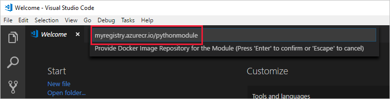

---
# Mandatory fields. See more on aka.ms/skyeye/meta.
title: Create custom Python module - Azure IoT Edge | Microsoft Docs 
description: This tutorial shows you how to create an IoT Edge module with Python code and deploy it to an edge device.
services: iot-edge
author: shizn
manager: philmea
ms.reviewer: kgremban
ms.author: xshi
ms.date: 10/14/2019
ms.topic: tutorial
ms.service: iot-edge
ms.custom: mvc
---

# Tutorial: Develop and deploy a Python IoT Edge module for Linux devices

Use Visual Studio Code to develop Python code and deploy it to a Linux device running Azure IoT Edge.

You can use Azure IoT Edge modules to deploy code that implements your business logic directly to your IoT Edge devices. This tutorial walks you through creating and deploying an IoT Edge module that filters sensor data on the IoT Edge device that you set up in the quickstart. In this tutorial, you learn how to:

> [!div class="checklist"]
>
> * Use Visual Studio Code to create an IoT Edge Python module.
> * Use Visual Studio Code and Docker to create a Docker image and publish it to your registry.
> * Deploy the module to your IoT Edge device.
> * View generated data.

The IoT Edge module that you create in this tutorial filters the temperature data that's generated by your device. It only sends messages upstream if the temperature is above a specified threshold. This type of analysis at the edge is useful for reducing the amount of data that's communicated to and stored in the cloud.

[!INCLUDE [quickstarts-free-trial-note](../../includes/quickstarts-free-trial-note.md)]

## Solution scope

This tutorial demonstrates how to develop a module in **Python** using **Visual Studio Code**, and how to deploy it to a **Linux device**. IoT Edge does not support Python modules for Windows devices.

Use the following table to understand your options for developing and deploying Python modules to Linux:

| Python | Visual Studio Code | Visual Studio 2017/2019 |
| - | ------------------ | ------------------ |
| **Linux AMD64** |  |  |
| **Linux ARM32** |  |  |

## Prerequisites

Before beginning this tutorial, you should have gone through the previous tutorial to set up your development environment for Linux container development: [Develop IoT Edge modules for Linux devices](tutorial-develop-for-linux.md). By completing that tutorial, you should have the following prerequisites in place:

* A free or standard-tier [IoT Hub](../iot-hub/iot-hub-create-through-portal.md) in Azure.
* A [Linux device running Azure IoT Edge](quickstart-linux.md)
* A container registry, like [Azure Container Registry](https://docs.microsoft.com/azure/container-registry/).
* [Visual Studio Code](https://code.visualstudio.com/) configured with the [Azure IoT Tools](https://marketplace.visualstudio.com/items?itemName=vsciot-vscode.azure-iot-tools).
* [Docker CE](https://docs.docker.com/install/) configured to run Linux containers.

To develop an IoT Edge module in Python, install the following additional prerequisites on your development machine:

* [Python extension](https://marketplace.visualstudio.com/items?itemName=ms-python.python) for Visual Studio Code.
* [Python](https://www.python.org/downloads/).
* [Pip](https://pip.pypa.io/en/stable/installing/#installation) for installing Python packages (typically included with your Python installation).

>[!Note]
>Ensure that your `bin` folder is on your path for your platform. Typically `~/.local/` for UNIX and macOS, or `%APPDATA%\Python` on Windows.

## Create a module project

The following steps create an IoT Edge Python module by using Visual Studio Code and the Azure IoT Tools.

### Create a new project

Use the VS Code to create a Python solution template that you can build on top of.

1. In Visual Studio Code, select **View** > **Terminal** to open the VS Code integrated terminal.

1. Select **View** > **Command Palette** to open the VS Code command palette.

1. In the command palette, enter and run the command **Azure: Sign in** and follow the instructions to sign in your Azure account. If you're already signed in, you can skip this step.

1. In the command palette, enter and run the command **Azure IoT Edge: New IoT Edge solution**. Follow the prompts and provide the following information to create your solution:

   | Field | Value |
   | ----- | ----- |
   | Select folder | Choose the location on your development machine for VS Code to create the solution files. |
   | Provide a solution name | Enter a descriptive name for your solution or accept the default **EdgeSolution**. |
   | Select module template | Choose **Python Module**. |
   | Provide a module name | Name your module **PythonModule**. |
   | Provide Docker image repository for the module | An image repository includes the name of your container registry and the name of your container image. Your container image is prepopulated from the name you provided in the last step. Replace **localhost:5000** with the login server value from your Azure container registry. You can retrieve the login server from the Overview page of your container registry in the Azure portal. <br><br>The final image repository looks like \<registry name\>.azurecr.io/pythonmodule. |

   

### Add your registry credentials

The environment file stores the credentials for your container repository and shares them with the IoT Edge runtime. The runtime needs these credentials to pull your private images onto the IoT Edge device.

1. In the VS Code explorer, open the **.env** file.
2. Update the fields with the **username** and **password** values that you copied from your Azure container registry.
3. Save the .env file.

### Select your target architecture

Currently, Visual Studio Code can develop Python modules for Linux AMD64 and Linux ARM32v7 devices. You need to select which architecture you're targeting with each solution, because the container is built and run differently for each architecture type. The default is Linux AMD64.

1. Open the command palette and search for **Azure IoT Edge: Set Default Target Platform for Edge Solution**, or select the shortcut icon in the side bar at the bottom of the window.

2. In the command palette, select the target architecture from the list of options. For this tutorial, we're using an Ubuntu virtual machine as the IoT Edge device, so will keep the default **amd64**.

### Update the module with custom code

Each template includes sample code, which takes simulated sensor data from the **SimulatedTemperatureSensor** module and routes it to the IoT hub. In this section, add the code that expands the **PythonModule** to analyze the messages before sending them.

1. In the VS Code explorer, open **modules** > **PythonModule** > **main.py**.

2. At the top of the **main.py** file, import the **json** library:

    ```python
    import json
    ```

3. Add the **TEMPERATURE_THRESHOLD** and **TWIN_CALLBACKS** variables under the global counters. The temperature threshold sets the value that the measured machine temperature must exceed for the data to be sent to the IoT hub.

    ```python
    # global counters
    TEMPERATURE_THRESHOLD = 25
    TWIN_CALLBACKS = 0
    RECEIVED_MESSAGES = 0
    ```

4. Replace the **input1_listener** function with the following code:

    ```python
        # Define behavior for receiving an input message on input1
        # Because this is a filter module, we forward this message to the "output1" queue.
        async def input1_listener(module_client):
            global RECEIVED_MESSAGES
            global TEMPERATURE_THRESHOLD
            while True:
                try:
                    input_message = await module_client.receive_message_on_input("input1")  # blocking call
                    message = input_message.data
                    size = len(message)
                    message_text = message.decode('utf-8')
                    print ( "    Data: <<<%s>>> & Size=%d" % (message_text, size) )
                    custom_properties = input_message.custom_properties
                    print ( "    Properties: %s" % custom_properties )
                    RECEIVED_MESSAGES += 1
                    print ( "    Total messages received: %d" % RECEIVED_MESSAGES )
                    data = json.loads(message_text)
                    if "machine" in data and "temperature" in data["machine"] and data["machine"]["temperature"] > TEMPERATURE_THRESHOLD:
                        custom_properties["MessageType"] = "Alert"
                        print ( "Machine temperature %s exceeds threshold %s" % (data["machine"]["temperature"], TEMPERATURE_THRESHOLD))
                        await module_client.send_message_to_output(input_message, "output1")
                except Exception as ex:
                    print ( "Unexpected error in input1_listener: %s" % ex )

        # twin_patch_listener is invoked when the module twin's desired properties are updated.
        async def twin_patch_listener(module_client):
            global TWIN_CALLBACKS
            global TEMPERATURE_THRESHOLD
            while True:
                try:
                    data = await module_client.receive_twin_desired_properties_patch()  # blocking call
                    print( "The data in the desired properties patch was: %s" % data)
                    if "TemperatureThreshold" in data:
                        TEMPERATURE_THRESHOLD = data["TemperatureThreshold"]
                    TWIN_CALLBACKS += 1
                    print ( "Total calls confirmed: %d\n" % TWIN_CALLBACKS )
                except Exception as ex:
                    print ( "Unexpected error in twin_patch_listener: %s" % ex )
    ```

5. Update the **listeners** to also listen twin updates.

    ```python
        # Schedule task for C2D Listener
        listeners = asyncio.gather(input1_listener(module_client), twin_patch_listener(module_client))

        print ( "The sample is now waiting for messages. ")
    ```

6. Save the main.py file.

7. In the VS Code explorer, open the **deployment.template.json** file in your IoT Edge solution workspace.

8. Add the **PythonModule** module twin to the deployment manifest. Insert the following JSON content at the bottom of the **moduleContent** section, after the **$edgeHub** module twin:

   ```json
       "PythonModule": {
           "properties.desired":{
               "TemperatureThreshold":25
           }
       }
   ```

   

9. Save the deployment.template.json file.

## Build and push your module

In the previous section, you created an IoT Edge solution and added code to the PythonModule that will filter out messages where the reported machine temperature is within the acceptable limits. Now you need to build the solution as a container image and push it to your container registry.

1. Open the VS Code integrated terminal by selecting **View** > **Terminal**.

1. Sign in to Docker by entering the following command in the terminal. Sign in with the username, password, and login server from your Azure container registry. You can retrieve these values from the **Access keys** section of your registry in the Azure portal.

   ```bash
   docker login -u <ACR username> -p <ACR password> <ACR login server>
   ```

   You may receive a security warning recommending the use of `--password-stdin`. While that best practice is recommended for production scenarios, it's outside the scope of this tutorial. For more information, see the [docker login](https://docs.docker.com/engine/reference/commandline/login/#provide-a-password-using-stdin) reference.

1. In the VS Code explorer, right-click the **deployment.template.json** file and select **Build and Push IoT Edge solution**.

   The build and push command starts three operations. First, it creates a new folder in the solution called **config** that holds the full deployment manifest, built out of information in the deployment template and other solution files. Second, it runs `docker build` to build the container image based on the appropriate dockerfile for your target architecture. Then, it runs `docker push` to push the image repository to your container registry.

## Deploy modules to device

Use the Visual Studio Code explorer and the Azure IoT Tools extension to deploy the module project to your IoT Edge device. You already have a deployment manifest prepared for your scenario, the **deployment.json** file in the config folder. All you need to do now is select a device to receive the deployment.

Make sure that your IoT Edge device is up and running.

1. In the Visual Studio Code explorer, expand the **Azure IoT Hub Devices** section to see your list of IoT devices.

2. Right-click the name of your IoT Edge device, then select **Create Deployment for Single Device**.

3. Select the **deployment.json** file in the **config** folder and then click **Select Edge Deployment Manifest**. Do not use the deployment.template.json file.

4. Click the refresh button. You should see the new **PythonModule** running along with the **SimulatedTemperatureSensor** module and the **$edgeAgent** and **$edgeHub**.

## View The generated data

Once you apply the deployment manifest to your IoT Edge device, the IoT Edge runtime on the device collects the new deployment information and starts executing on it. Any modules running on the device that aren't included in the deployment manifest are stopped. Any modules missing from the device are started.

You can view the status of your IoT Edge device using the **Azure IoT Hub Devices** section of the Visual Studio Code explorer. Expand the details of your device to see a list of deployed and running modules.

1. In the Visual Studio Code explorer, right-click the name of your IoT Edge device and select **Start Monitoring Built-in Event Endpoint**.

2. View the messages arriving at your IoT Hub. It may take a while for the messages to arrive. The IoT Edge device has to receive its new deployment and start all the modules. Then, the changes we made to the PythonModule code wait until the machine temperature reaches 25 degrees before sending messages. It also adds the message type **Alert** to any messages that reach that temperature threshold.

## Edit the module twin

We used the PythonModule module twin in the deployment manifest to set the temperature threshold at 25 degrees. You can use the module twin to change the functionality without having to update the module code.

1. In Visual Studio Code, expand the details under your IoT Edge device to see the running modules.

2. Right-click **PythonModule** and select **Edit module twin**.

3. Find **TemperatureThreshold** in the desired properties. Change its value to a new temperature 5 degrees to 10 degrees higher than the latest reported temperature.

4. Save the module twin file.

5. Right-click anywhere in the module twin editing pane and select **Update module twin**.

6. Monitor the incoming device-to-cloud messages. You should see the messages stop until the new temperature threshold is reached.

## Clean up resources

If you plan to continue to the next recommended article, you can keep the resources and configurations that you created and reuse them. You can also keep using the same IoT Edge device as a test device.

Otherwise, you can delete the local configurations and the Azure resources that you used in this article to avoid charges.

[!INCLUDE [iot-edge-clean-up-cloud-resources](../../includes/iot-edge-clean-up-cloud-resources.md)]

## Next steps

In this tutorial, you created an IoT Edge module that contains code to filter raw data generated by your IoT Edge device. When you're ready to build your own modules, you can learn more about [developing your own IoT Edge modules](module-development.md) or how to [develop modules with Visual Studio Code](how-to-vs-code-develop-module.md). For examples of IoT Edge modules, including the simulated temperature module, see [IoT Edge module samples](https://github.com/Azure/iotedge/tree/master/edge-modules) and [IoT Python SDK samples](https://github.com/Azure/azure-iot-sdk-python/tree/master/azure-iot-device/samples/async-edge-scenarios).

You can continue on to the next tutorials to learn how Azure IoT Edge can help you deploy Azure cloud services to process and analyze data at the edge.

> [!div class="nextstepaction"]
> [Functions](tutorial-deploy-function.md)
> [Stream Analytics](tutorial-deploy-stream-analytics.md)
> [Machine Learning](tutorial-deploy-machine-learning.md)
> [Custom Vision Service](tutorial-deploy-custom-vision.md)
