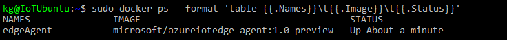
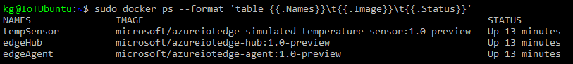
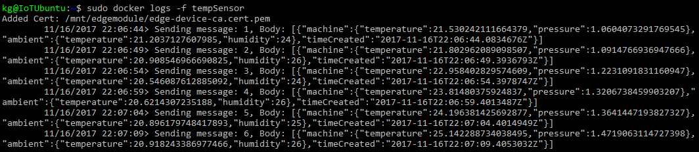

# Deploy Azure IoT Edge on a simulated device in Linux - preview

Azure IoT Edge enables you to perform analytics and data processing on your devices, instead of having to push all the data to the cloud. The IoT Edge tutorials demonstrate how to deploy different types of modules, built from Azure services or custom code, but first you need a device to test. 

In this tutorial you learn how to:

1. Create an IoT Hub
2. Register an IoT Edge device
3. Start the IoT Edge runtime
4. Deploy a module

![Tutorial architecture][2]

The simulated device that you create in this tutorial is a monitor that generates temperature, humidity, and pressure data. The other Azure IoT Edge tutorials build upon the work you do here by deploying modules that analyze the data for business insights. 

## Prerequisites

This tutorial assumes that you're using a computer or virtual machine running Linux to simulate an Internet of Things device. The following services are required to successfully deploy an IoT Edge device:

- [Install Docker for Linux][lnk-docker-ubuntu] and make sure it's running. 
- Most Linux distributions, including Ubuntu, already have Python 2.7 installed. Use the following command to make sure that pip is installed: `sudo apt-get install python-pip`.

## Create an IoT hub

Start the tutorial by creating your IoT Hub.
![Create IoT Hub][3]

[!INCLUDE [iot-hub-create-hub](../../includes/iot-hub-create-hub.md)]

## Register an IoT Edge device

Register an IoT Edge device with your newly created IoT Hub.
![Register a device][4]

[!INCLUDE [iot-edge-register-device](../../includes/iot-edge-register-device.md)]

## Install and start the IoT Edge runtime

Install and start the Azure IoT Edge runtime on your device. 
![Register a device][5]

The IoT Edge runtime is deployed on all IoT Edge devices. It comprises two modules. The **IoT Edge agent** facilitates deployment and monitoring of modules on the IoT Edge device. The **IoT Edge hub** manages communications between modules on the IoT Edge device, and between the device and IoT Hub. When you configure the runtime on your new device, only the IoT Edge agent will start at first. The IoT Edge hub comes later when you deploy a module. 

On the machine where you'll run the IoT Edge device, download the IoT Edge control script:
```cmd
sudo pip install -U azure-iot-edge-runtime-ctl
```

Configure the runtime with your IoT Edge device connection string from the previous section:
```cmd
sudo iotedgectl setup --connection-string "{device connection string}" --auto-cert-gen-force-no-passwords
```

Start the runtime:
```cmd
sudo iotedgectl start
```

Check Docker to see that the IoT Edge agent is running as a module:
```cmd
sudo docker ps
```



## Deploy a module

Manage your Azure IoT Edge device from the cloud to deploy a module which will send telemetry data to IoT Hub.
![Register a device][6]

[!INCLUDE [iot-edge-deploy-module](../../includes/iot-edge-deploy-module.md)]

## View generated data

In this tutorial, you created a new IoT Edge device and installed the IoT Edge runtime on it. Then, you used the Azure portal to push an IoT Edge module to run on the device without having to make changes to the device itself. In this case, the module that you pushed creates environmental data that you can use for the tutorials. 

Open the command prompt on the computer running your simulated device again. Confirm that the module deployed from the cloud is running on your IoT Edge device:

```cmd
sudo docker ps
```



View the messages being sent from the tempSensor module to the cloud:

```cmd
sudo docker logs -f tempSensor
```



You can also view the telemetry the device is sending by using the [IoT Hub explorer tool][lnk-iothub-explorer]. 

## Next steps

In this tutorial, you created a new IoT Edge device and used the Azure IoT Edge cloud interface to deploy code onto the device. Now, you have a simulated device generating raw data about its environment. 

This tutorial is the prerequisite for all of the other IoT Edge tutorials. You can continue on to any of the other tutorials to learn how Azure IoT Edge can help you turn this data into business insights at the edge.

> [!div class="nextstepaction"]
> [Develop and deploy C# code as a module](tutorial-csharp-module.md)


<!-- Images -->
[1]: ./media/tutorial-install-iot-edge/view-module.png
[2]: ./media/tutorial-install-iot-edge/install-edge-full.png
[3]: ./media/tutorial-install-iot-edge/create-iot-hub.png
[4]: ./media/tutorial-install-iot-edge/register-device.png
[5]: ./media/tutorial-install-iot-edge/start-runtime.png
[6]: ./media/tutorial-install-iot-edge/deploy-module.png

<!-- Links -->
[lnk-docker-ubuntu]: https://docs.docker.com/engine/installation/linux/docker-ce/ubuntu/ 
[lnk-iothub-explorer]: https://github.com/azure/iothub-explorer
