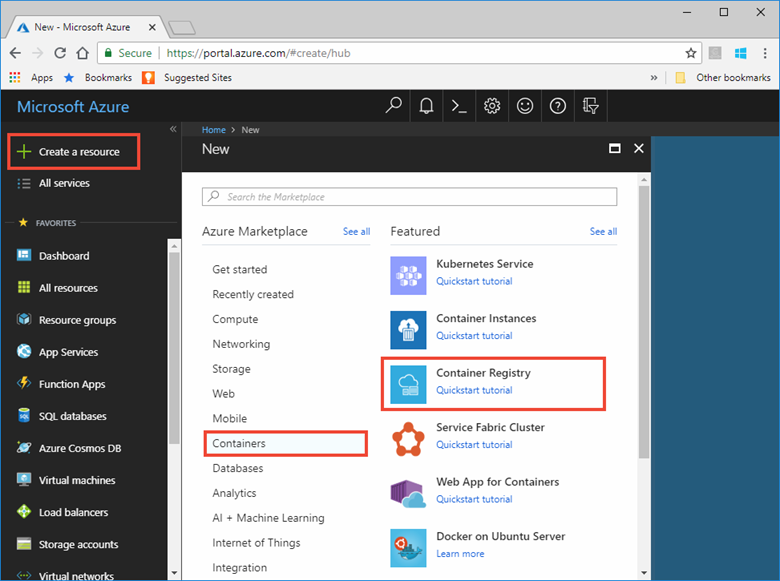

---
# Mandatory fields. See more on aka.ms/skyeye/meta.
title: Store data with Azure IoT Edge SQL module | Microsoft Docs 
description: Learn how to store data locally on your IoT Edge device with a SQL Server module
services: iot-edge
author: kgremban
manager: timlt
ms.author: kgremban
ms.date: 09/21/2018
ms.topic: tutorial
ms.service: iot-edge
ms.custom: mvc
#Customer intent: As an IoT developer, I want to use SQL Service to execute logic on edge devices to filter data and communications that is sent to the cloud.
---

# Tutorial: Store data at the edge with SQL Server databases

Use Azure IoT Edge and SQL Server to store and query data at the edge. Azure IoT Edge comes built-in with basic storage features that cache messages if a device goes offline and then forwards them when the connection is reestablished. However, you may want more advanced storage capabilities, like being able to query data locally. By incorporating local databases, your IoT Edge devices can perform more complex computing without having to maintain a connection to IoT Hub. For example, a field technician can visualize the last few days of sensor data on a machine locally, even though that data is only uploaded to the cloud once a month to help improve a machine learning model.

This article provides instructions for deploying a SQL Server database to an IoT Edge device. Azure Functions, running on the IoT Edge device, structures the incoming data then sends it to the database. The steps in this article can also be applied to other databases that work in containers, like MySQL or PostgreSQL.

In this tutorial, you learn how to: 

> [!div class="checklist"]
> * Use Visual Studio Code to create an Azure Function
> * Deploy a SQL database to your IoT Edge device
> * Use Visual Studio Code to build modules and deploy them to your IoT Edge device
> * View generated data

[!INCLUDE [quickstarts-free-trial-note](../../includes/quickstarts-free-trial-note.md)]

## Prerequisites

An Azure IoT Edge device:

* You can use your development machine or a virtual machine as an Edge device by following the steps in the quickstart for [Linux](quickstart-linux.md) or [Windows devices](quickstart.md).

Cloud resources:

* A free or standard-tier [IoT Hub](../iot-hub/iot-hub-create-through-portal.md) in Azure. 

Development resources:

* [Visual Studio Code](https://code.visualstudio.com/). 
* [C# for Visual Studio Code (powered by OmniSharp)](https://marketplace.visualstudio.com/items?itemName=ms-vscode.csharp) extension for Visual Studio Code. 
* [Azure IoT Edge](https://marketplace.visualstudio.com/items?itemName=vsciot-vscode.azure-iot-edge) extension for Visual Studio Code. 
* [.NET Core 2.1 SDK](https://www.microsoft.com/net/download). 
* [Docker CE](https://docs.docker.com/install/). 

## Create a container registry
In this tutorial, you use the Azure IoT Edge extension for VS Code to build a module and create a **container image** from the files. Then you push this image to a **registry** that stores and manages your images. Finally, you deploy your image from your registry to run on your IoT Edge device.  

You can use any Docker-compatible registry for this tutorial. Two popular Docker registry services available in the cloud are [Azure Container Registry](https://docs.microsoft.com/azure/container-registry/) and [Docker Hub](https://docs.docker.com/docker-hub/repos/#viewing-repository-tags). This tutorial uses Azure Container Registry. 

1. In the [Azure portal](https://portal.azure.com), select **Create a resource** > **Containers** > **Container Registry**.

    

2. Give your registry a name, and choose a subscription.
3. For the resource group, it is recommended that you use the same resource group name that contains your IoT Hub. By keeping all the resources together in the same group, you can manage them together. For example, deleting the resource group used for testing deletes all test resources contained in the group. 
4. Set the SKU to **Basic**, and toggle **Admin user** to **Enable**. 
5. Click **Create**.
6. Once your container registry is created, navigate to it and select **Access keys**. 
7. Copy the values for **Login server**, **Username**, and **Password**. You'll use these values later in the tutorial. 

## Create a function project

To send data into a database, you need a module that can structure the data properly and then stores it in a table. 

The following steps show you how to create an IoT Edge function using Visual Studio Code and the Azure IoT Edge extension.

1. Open Visual Studio Code.
2. Open the VS Code integrated terminal by selecting **View** > **Terminal**.
3. Open the VS Code command palette by selecting **View** > **Command palette**.
4. In the command palette, type and run the command **Azure: Sign in** and follow the instructions to sign in your Azure account. If you've already signed in, you can skip this step.
3. In the command palette, type and run the command **Azure IoT Edge: New IoT Edge solution**. In the command palette, provide the following information to create your solution: 
   1. Select the folder where you want to create the solution. 
   2. Provide a name for your solution or accept the default **EdgeSolution**.
   3. Choose **Azure Functions - C#** as the module template. 
   4. Name your module **sqlFunction**. 
   5. Specify the Azure Container Registry that you created in the previous section as the image repository for your first module. Replace **localhost:5000** with the login server value that you copied. The final string looks like **\<registry name\>.azurecr.io/sqlFunction**.

4. The VS Code window loads your IoT Edge solution workspace. There is a **modules** folder, a **.vscode** folder, and a deployment manifest template file. Open **modules** > **sqlFunction** > **EdgeHubTrigger-Csharp** > **run.csx**.

5. Replace the contents of the file with the following code:

   ```csharp
   #r "Microsoft.Azure.Devices.Client"
   #r "Newtonsoft.Json"
   #r "System.Data.SqlClient"

   using System.IO;
   using Microsoft.Azure.Devices.Client;
   using Newtonsoft.Json;
   using Sql = System.Data.SqlClient;
   using System.Threading.Tasks;

   // Filter messages based on the temperature value in the body of the message and the temperature threshold value.
   public static async Task Run(Message messageReceived, IAsyncCollector<Message> output, TraceWriter log)
   {
       const int temperatureThreshold = 25;
       byte[] messageBytes = messageReceived.GetBytes();
       var messageString = System.Text.Encoding.UTF8.GetString(messageBytes);

       if (!string.IsNullOrEmpty(messageString))
       {
           // Get the body of the message and deserialize it
           var messageBody = JsonConvert.DeserializeObject<MessageBody>(messageString);

           //Store the data in SQL db
           const string str = "<sql connection string>";
           using (Sql.SqlConnection conn = new Sql.SqlConnection(str))
           {
           conn.Open();
           var insertMachineTemperature = "INSERT INTO MeasurementsDB.dbo.TemperatureMeasurements VALUES (CONVERT(DATETIME2,'" + messageBody.timeCreated + "', 127), 'machine', " + messageBody.machine.temperature + ");";
           var insertAmbientTemperature = "INSERT INTO MeasurementsDB.dbo.TemperatureMeasurements VALUES (CONVERT(DATETIME2,'" + messageBody.timeCreated + "', 127), 'ambient', " + messageBody.ambient.temperature + ");"; 
               using (Sql.SqlCommand cmd = new Sql.SqlCommand(insertMachineTemperature + "\n" + insertAmbientTemperature, conn))
               {
               //Execute the command and log the # rows affected.
               var rows = await cmd.ExecuteNonQueryAsync();
               log.Info($"{rows} rows were updated");
               }
           }

           if (messageBody != null && messageBody.machine.temperature > temperatureThreshold)
           {
               // Send the message to the output as the temperature value is greater than the threshold
               var filteredMessage = new Message(messageBytes);
               // Copy the properties of the original message into the new Message object
               foreach (KeyValuePair<string, string> prop in messageReceived.Properties)
               {
                   filteredMessage.Properties.Add(prop.Key, prop.Value);
               }
               // Add a new property to the message to indicate it is an alert
               filteredMessage.Properties.Add("MessageType", "Alert");
               // Send the message        
               await output.AddAsync(filteredMessage);
               log.Info("Received and transferred a message with temperature above the threshold");
           }
       }
   }

   //Define the expected schema for the body of incoming messages
   class MessageBody
   {
       public Machine machine {get;set;}
       public Ambient ambient {get; set;}
       public string timeCreated {get; set;}
   }
   class Machine
   {
      public double temperature {get; set;}
      public double pressure {get; set;}         
   }
   class Ambient
   {
      public double temperature {get; set;}
      public int humidity {get; set;}         
   }
   ```

6. In line 24, replace the string **\<sql connection string\>** with the following string. The **Data Source** property references the SQL Server container name, which you will create with the name **SQL** in the next section. 

   ```C#
   Data Source=tcp:sql,1433;Initial Catalog=MeasurementsDB;User Id=SA;Password=Strong!Passw0rd;TrustServerCertificate=False;Connection Timeout=30;
   ```

7. Save the **run.csx** file. 

## Add a SQL Server container

A [Deployment manifest](module-composition.md) declares which modules the IoT Edge runtime will install on your IoT Edge device. You added the code to make a customized Function module in the previous section, but the SQL Server module is already built. You just need to tell the IoT Edge runtime to include it, then configure it on your device. 

1. In the Visual Studio Code explorer, open the **deployment.template.json** file. 
2. Find the **moduleContent.$edgeAgent.properties.desired.modules** section. There should be two modules listed: **tempSensor**, which generates simulated data, and your **sqlFunction** module.
3. If you're using Windows containers, modify the **sqlFunction.settings.image** section.
    ```json
    "image": "${MODULES.sqlFunction.windows-amd64}"
    ```
4. Add the following code to declare a third module. Add a comma after the sqlFunction section and insert:

   ```json
   "sql": {
       "version": "1.0",
       "type": "docker",
       "status": "running",
       "restartPolicy": "always",
       "settings": {
           "image": "",
           "createOptions": ""
       }
   }
   ```

   Here's an example if there is any confusion with adding a JSON element. 

5. Depending on the type of Docker containers on your IoT Edge device, update the **sql.settings** parameters with the following code:

   * Windows containers:

      ```json
      "image": "microsoft/mssql-server-windows-developer",
      "createOptions": "{\"Env\": [\"ACCEPT_EULA=Y\",\"SA_PASSWORD=Strong!Passw0rd\"],\"HostConfig\": {\"Mounts\": [{\"Target\": \"C:\\\\mssql\",\"Source\": \"sqlVolume\",\"Type\": \"volume\"}],\"PortBindings\": {\"1433/tcp\": [{\"HostPort\": \"1401\"}]}}}"
      ```

   * Linux containers:

      ```json
      "image": "mcr.microsoft.com/mssql/server:latest",
      "createOptions": "{\"Env\": [\"ACCEPT_EULA=Y\",\"MSSQL_SA_PASSWORD=Strong!Passw0rd\"],\"HostConfig\": {\"Mounts\": [{\"Target\": \"/var/opt/mssql\",\"Source\": \"sqlVolume\",\"Type\": \"volume\"}],\"PortBindings\": {\"1433/tcp\": [{\"HostPort\": \"1401\"}]}}}"
      ```

   >[!Tip]
   >Any time that you create a SQL Server container in a production environment, you should [change the default system administrator password](https://docs.microsoft.com/sql/linux/quickstart-install-connect-docker#change-the-sa-password).

6. Save the **deployment.template.json** file.

## Build your IoT Edge solution

In the previous sections, you created a solution with one module, and then added another to the deployment manifest template. Now, you need to build the solution, create container images for the modules, and push the images to your container registry. 

1. In the .env file, give the IoT Edge runtime your registry credentials so that it can access your module images. Find the **CONTAINER_REGISTRY_USERNAME** and **CONTAINER_REGISTRY_PASSWORD** sections and insert your credentials after the equals symbol: 

   ```env
   CONTAINER_REGISTRY_USERNAME_yourContainerReg=<username>
   CONTAINER_REGISTRY_PASSWORD_yourContainerReg=<password>
   ```

2. Save the .env file.
3. Sign in to your container registry in Visual Studio Code so that you can push your images to your registry. Use the same credentials that you added to the .env file. Enter the following command in the integrated terminal:

    ```csh/sh
    docker login -u <ACR username> <ACR login server>
    ```
    You will be prompted for the password. Paste your password into the prompt and press **Enter**.

    ```csh/sh
    Password: <paste in the ACR password and press enter>
    Login Succeeded
    ```

4. In the VS Code explorer, right-click the **deployment.template.json** file and select **Build and Push IoT Edge solution**. 

## Deploy the solution to a device

You can set modules on a device through the IoT Hub, but you can also access your IoT Hub and devices through Visual Studio Code. In this section, you set up access to your IoT Hub then use VS Code to deploy your solution to your IoT Edge device. 

1. In the VS Code command palette, select **Azure IoT Hub: Select IoT Hub**.
2. Follow the prompts to sign in to your Azure account. 
3. In the command palette, select your Azure subscription then select your IoT Hub. 
4. In the VS Code explorer, expand the **Azure IoT Hub Devices** section. 
5. Right-click on the device that you want to target with your deployment and select **Create deployment for single device**. 
6. In the file explorer, navigate to the **config** folder inside your solution and choose **deployment.json**. Click **Select Edge deployment manifest**. 

If the deployment is successful, and confirmation message is printed in the VS Code output. You can also check to see that all the modules are up and running on your device. 

On your IoT Edge device, run the following command to see the status of the modules. It may take a few minutes.

   ```PowerShell
   iotedge list
   ```

## Create the SQL database

When you apply the deployment manifest to your device, you get three modules running. The tempSensor module generates simulated environment data. The sqlFunction module takes the data and formats it for a database. 

This section guides you through setting up the SQL database to store the temperature data. 

1. In a command-line too, connect to your database. 
   * Windows container:
   
      ```cmd
      docker exec -it sql cmd
      ```
    
   * Linux container: 

      ```bash
      docker exec -it sql bash
      ```

2. Open the SQL command tool.
   * Windows container:

      ```cmd
      sqlcmd -S localhost -U SA -P "Strong!Passw0rd"
      ```

   * Linux container: 

      ```bash
      /opt/mssql-tools/bin/sqlcmd -S localhost -U SA -P 'Strong!Passw0rd'
      ```

3. Create your database: 

   * Windows container
      ```sql
      CREATE DATABASE MeasurementsDB
      ON
      (NAME = MeasurementsDB, FILENAME = 'C:\mssql\measurementsdb.mdf')
      GO
      ```

   * Linux container
      ```sql
      CREATE DATABASE MeasurementsDB
      ON
      (NAME = MeasurementsDB, FILENAME = '/var/opt/mssql/measurementsdb.mdf')
      GO
      ```

4. Define your table.

   ```sql
   CREATE TABLE MeasurementsDB.dbo.TemperatureMeasurements (measurementTime DATETIME2, location NVARCHAR(50), temperature FLOAT)
   GO
   ```

You can customize your SQL Server docker file to automatically set up your SQL Server to be deployed on multiple IoT Edge devices. For more information, see the [Microsoft SQL Server container demo project](https://github.com/twright-msft/mssql-node-docker-demo-app). 

## View the local data

Once your table is created, the sqlFunction module starts storing data in a local SQL Server 2017 database on your IoT Edge device. 

From inside the SQL command tool, run the following command to view your formatted table data: 

   ```sql
   SELECT * FROM MeasurementsDB.dbo.TemperatureMeasurements
   GO
   ```

   


## Clean up resources

If you plan to continue to the next recommended article, you can keep the resources and configurations that you created and reuse them. You can also keep using the same IoT Edge device as a test device. 

Otherwise, you can delete the local configurations and the Azure resources that you created in this article to avoid charges. 

[!INCLUDE [iot-edge-clean-up-cloud-resources](../../includes/iot-edge-clean-up-cloud-resources.md)]

[!INCLUDE [iot-edge-clean-up-local-resources](../../includes/iot-edge-clean-up-local-resources.md)]


## Next steps

In this tutorial, you created an Azure Functions module that contains code to filter raw data generated by your IoT Edge device. When you're ready to build your own modules, you can learn more about how to [Develop Azure Functions with Azure IoT Edge for Visual Studio Code](how-to-develop-csharp-function.md). 

Continue on to the next tutorials to learn about other ways that Azure IoT Edge can help you turn data into business insights at the edge.

> [!div class="nextstepaction"]
> [Find averages using a floating window in Azure Stream Analytics](tutorial-deploy-stream-analytics.md)
