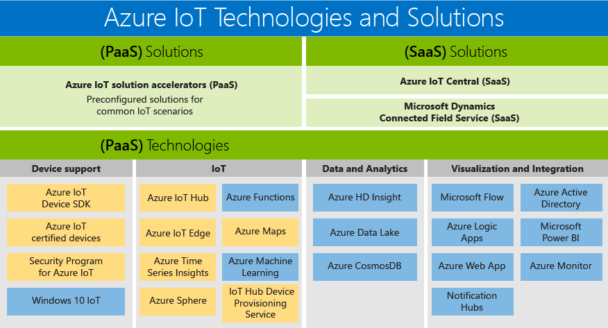

# Azure IoT technologies and solutions: PaaS and SaaS

Microsoft has built a portfolio that supports the needs of all customers, enabling everyone to access the benefits of digital transformation. The Azure IoT product portfolio is an overview of the available PaaS/SaaS technologies and solutions. It presents the two paths that are available for building your own solution:

- Platform as a Service (PaaS): build your application using any of the following services.
    - [Azure IoT solution accelerators](https://www.azureiotsolutions.com/), which are a collection of enterprise-grade preconfigured solutions that enable you to accelerate the development of custom IoT solutions, or 
    - [Azure Digital Twins](https://azure.microsoft.com/services/digital-twins/) service, which allows you to model the physical environment to create contextually-aware IoT solutions using a spatial intelligence graph and domain-specifc object models.

- Software as a Service (SaaS): get started fast with [Azure IoT Central](https://azure.microsoft.com/services/iot-central/), the new SaaS solution to develop IoT applications without being exposed to the complexity of IoT solution. If your organization lacks the resources to build your own IoT solution, Azure IoT Central is a codeless IoT solution that can create device models, dashboards, and rules in minutes.

## Solutions

Get started quickly with solution accelerators and SaaS offerings. Choose from preconfigured solutions that enable common IoT scenarios, such as remote monitoring, predictive maintenance, and connected factory, to create a fully customizable solution. Or use Azure IoT Central, a fully managed, end-to-end solution that enables powerful IoT scenarios without requiring cloud-solution expertise.

### Azure IoT solution accelerators (PaaS)

Azure IoT solution accelerators are customizable PaaS solutions that provide a high level of control over your IoT solution. If your business is implementing IoT for connected operations or has specific customization requirements for connected products, Azure IoT solution accelerators provide the control you need. 

Organizations with a large number of devices or device models, and manufacturers seeking connected factory solutions, are examples of companies that can benefit from IoT solution accelerators. Creating highly customizable solutions tailored to complex needs, IoT solution accelerators provide: 

- Prebuilt solutions
    - Remote monitoring
    - Connected factory
    - Predictive maintenance
    - Device simulation
- Ability to deploy in minutes
- Accelerated time to value
- Solutions that give ultimate control 
 
### Azure IoT Central (SaaS)

Azure IoT Central is a fully managed SaaS solution, which allows you to get started quickly with minimal IoT experience. If your business is pursuing speed over customization, SaaS models could be the perfect fit for your IoT implementation needs. 

Organizations with fewer device models, more predictable scenarios, and limited IoT/IT capabilities can now reap the benefits of IoT through a SaaS approach. Businesses that previously lacked the time, money, and expertise to develop connected products, can now get started quickly with Azure IoT Central. Microsoft is leading the industry in providing a mature SaaS solution that addresses common IoT implementation requirements. 

- Fully managed IoT SaaS
- No cloud solution development expertise required
- Configurable to your needs
- Ideal for straightforward IoT needs

### Compare Azure IoT solution accelerators and Azure IoT Central

To implement a typical [IoT solution architecture](/azure/iot-fundamentals/iot-introduction#iot-solution-architecture), Azure IoT offers several options, [Azure IoT solution accelerators](/azure/iot-suite) and [Azure IoT Central](https://www.microsoft.com/internet-of-things/iot-central-saas-solutions), each appropriate for different sets of customer requirements.

[Azure IoT Hub](https://azure.microsoft.com/services/iot-hub/) is the core Azure PaaS that both Azure IoT Central and Azure IoT solution accelerators use. IoT Hub enables reliable and securely bidirectional communications between millions of IoT devices and a cloud solution. IoT Hub helps you meet IoT implementation challenges such as:

* High-volume device connectivity and management.
* High-volume telemetry ingestion.
* Command and control of devices.
* Device security enforcement.

Choosing your Azure IoT product is a critical part of planning your IoT solution. IoT Hub is an individual Azure service that doesn't, by itself, provide an end-to-end IoT solution. IoT Hub can be used as a starting point for any IoT solution, and you don’t need to use Azure IoT solution accelerators or Azure IoT Central to use it. Both Azure IoT solution accelerators and Azure IoT Central use IoT Hub along with other Azure services. The following table summarizes the key differences between Azure IoT solution accelerators and Azure IoT Central to help you choose the correct one for your requirements:

|                        | Azure IoT solution accelerators | Azure IoT Central |
| ---------------------- | --------- | ----------- |
| Primary usage | To accelerate development of a custom IoT solution that needs maximum flexibility. | To accelerate time to market for straightforward IoT solutions that don’t require deep service customization. |
| Access to underlying PaaS services          | You have access to the underlying Azure services to manage them, or replace them as needed. | SaaS. Fully managed solution, the underlying services aren't exposed. |
| Flexibility            | High. The code for the microservices is open source and you can modify it in any way you see fit. Additionally, you can customize the deployment infrastructure.| Medium. You can use the built-in browser-based user experience to customize the solution model and aspects of the UI. The infrastructure is not customizable because the different components are not exposed.|
| Skill level                 | Medium-High. You need Java or .NET skills to customize the solution back end. You need JavaScript skills to customize the visualization. | Low. You need modeling skills to customize the solution. No coding skills are required. |
| Get started experience | Solution accelerators implement common IoT scenarios. Can be deployed in minutes. | Application templates and device templates provide pre-built models. Can be deployed in minutes. |
| Pricing                | You can fine-tune the services to control the cost. | Simple, predictable pricing structure. |

The decision of which product to use to build your IoT solution is ultimately determined by:

* Your business requirements
* The type of solution you want to build
* Your organization's skill set for building and maintaining the solution in the long term

## Technologies (PaaS)

With the most comprehensive IoT portfolio of platform services, Platform-as-a-Service (PaaS) technologies that span the Azure platform enable you to easily create, customize, and control all aspects of your IoT solution. Establish bi-directional communications with billions of IoT devices and manage your IoT devices at scale. Then integrate your IoT device data with other platform services, such as Azure Cosmos DB and Azure Time Series Insights, to enhance insights across your solution. 

### Device support

Get started on your IoT project with confidence by leveraging [Azure IoT Starter Kits](https://catalog.azureiotsuite.com/kits) or choosing from hundreds of Certified for IoT devices in the [device catalog](http://catalog.azureiotsuite.com/). All devices are platform-agnostic and tested to connect seamlessly to IoT Hub.
Connect all your devices to Azure IoT using the open-source [device SDKs](/azure/iot-hub/iot-hub-devguide-sdks). The SDKs support multiple operating systems, such as Linux, Windows, and real-time operating systems, as well as multiple programming languages, such as [C](https://github.com/Azure/azure-iot-sdk-c), [Node.js](https://github.com/Azure/azure-iot-sdk-node), [Java](https://github.com/Azure/azure-iot-sdk-java), [.NET](https://github.com/Azure/azure-iot-sdk-csharp), and [Python](https://github.com/Azure/azure-iot-sdk-python).

### IoT 
[Azure IoT Hub](https://azure.microsoft.com/services/iot-hub/) is a fully managed service that enables reliable and secure bidirectional communications between millions of IoT devices and a solution back end. The Azure IoT Hub Device Provisioning Service is a helper service for IoT Hub that enables zero-touch, just-in-time provisioning to the right IoT hub without requiring human intervention, enabling customers to provision millions of devices in a secure and scalable manner.

### Edge
[Azure IoT Edge](https://azure.microsoft.com/services/iot-edge/) is an IoT service. This service is meant for customers who want to analyze data on devices, a.k.a. "at the edge." By moving parts of your workload to the edge, you will experience reduced latency and have the option for off-line scenarios.

### Spatial Intelligence
[Azure Digital Twins](https://azure.microsoft.com/services/digital-twins/) is an IoT service that enables you to create a model of a physical environment. It provides a spatial intelligence graph to model the relationships between people, spaces, and devices. By corelating data across the digital and physical world you can create contextually aware solutions.  

### Data and analytics
Take advantage of an array of Azure data and analytics PaaS offerings in your IoT solution, from bringing cloud intelligence to the edge with Azure Machine Learning, to storing IoT device data in a cost-effective way with Azure Data Lake, to visualizing huge amount of data from IoT devices with [Azure Time Series Insights](https://azure.microsoft.com/services/time-series-insights/).

### Visualization and integration
Microsoft Azure offers a complete cloud solution, one that combines a constantly growing collection of integrated cloud services with an industry-leading commitment to the protection and privacy of your data. Find out more about [Microsoft Azure](https://azure.microsoft.com/).

## Next steps

Check out the [Get started section of the IoT Hub documentation](/azure/iot-hub/iot-hub-get-started) to experience IoT features quickly and easily. Or for a more in-depth hands-on experience, try one of the [IoT Edge Tutorials](/azure/iot-edge/tutorial-simulate-device-windows).
