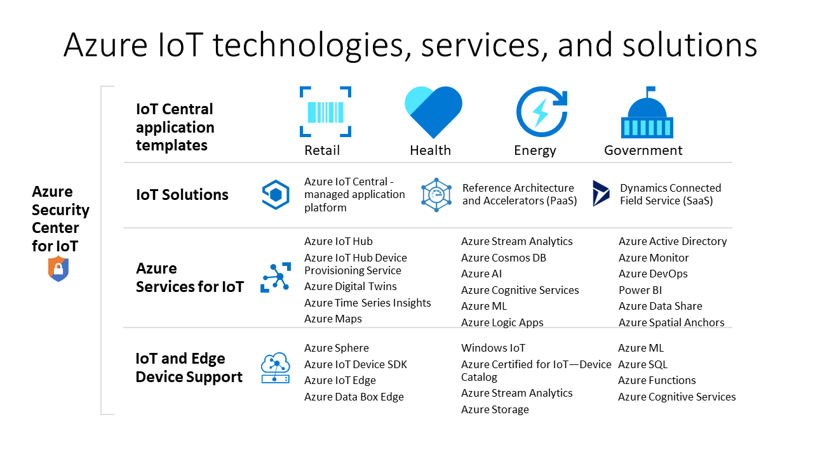

# Azure technologies and services for creating IoT solutions

Azure IoT technologies and services provide you with options to create a wide variety of IoT solutions that enable digital transformation for your organization. For example, you can:

- Use [Azure IoT Central](https://apps.azureiotcentral.com), a managed IoT application platform, to build and deploy a secure, enterprise-grade IoT solution. IoT Central features a collection of industry-specific application templates, such as retail and healthcare, to accelerate your solution development process.
- Extend the open-source code base for an Azure IoT [solution accelerator](https://www.azureiotsolutions.com) to implement a common IoT scenario such as remote monitoring or predictive maintenance.
- Use Azure IoT platform services such as [Azure IoT Hub](../iot-hub/about-iot-hub.md) and the [Azure IoT device SDKs](../iot-hub/iot-hub-devguide-sdks.md) to build a custom IoT solution from scratch.

## Azure IoT Central

The [IoT Central application platform](https://apps.azureiotcentral.com) reduces the burden and cost of developing, managing, and maintaining enterprise-grade IoT solutions. IoT Central's customizable web UI in lets you monitor device conditions, create rules, and manage millions of devices and their data throughout their life cycle. The API surface within IoT Central gives you programmatic access to configure and interact with your IoT solution.

Azure IoT Central is a fully managed application platform that you can use to create custom IoT solutions. IoT Central uses application templates to create solutions. There are templates for generic solutions and for specific industries such as energy, healthcare, government, and retail. IoT Central application templates let you deploy an IoT Central application in minutes that you can then customize with themes, dashboards, and views.

Choose devices from the [Azure Certified for IoT device catalog](https://catalog.azureiotsolutions.com) to quickly connect to your solution. Use the IoT Central web UI to monitor and manage your devices to keep them healthy and connected. Use connectors and APIs to integrate your IoT Central application with other business applications.

As a fully managed application platform, IoT Central has a simple, predictable pricing model.

## Azure IoT solution accelerators

The [Azure IoT solution accelerators](https://www.azureiotsolutions.com) are a collection of customizable enterprise-grade solutions. You can deploy these solutions as they are, or develop a custom IoT solution using the open-source Java or .NET source code.

Azure IoT solution accelerators provide a high level of control over your IoT solution. The solution accelerators include prebuilt solutions for common IoT scenarios that you can deploy to your Azure subscription in minutes. The scenarios include:

  - Remote monitoring
  - Connected factory
  - Predictive maintenance
  - Device simulation

The open-source code base for all the solution accelerators is available on GitHub. Download the code to customize a solution accelerator to meet your specific IoT requirements.

The solution accelerators use Azure services such as Azure IoT Hub and Azure Storage that you must manage in your Azure subscription.

## Custom solutions

To build an IoT solution from scratch, or extend a solution created using IoT Central or a solution accelerator, use one or more of the following Azure IoT technologies and services:

### Devices

Develop your IoT devices using one of the [Azure IoT Starter Kits](https://catalog.azureiotsolutions.com/kits) or choose a device to use from the [Azure Certified for IoT device catalog](https://catalog.azureiotsolutions.com). Implement your embedded code using the open-source [device SDKs](../iot-hub/iot-hub-devguide-sdks.md). The device SDKs support multiple operating systems, such as Linux, Windows, and real-time operating systems. There are SDKs for multiple programming languages, such as [C](https://github.com/Azure/azure-iot-sdk-c), [Node.js](https://github.com/Azure/azure-iot-sdk-node), [Java](https://github.com/Azure/azure-iot-sdk-java), [.NET](https://github.com/Azure/azure-iot-sdk-csharp), and [Python](https://github.com/Azure/azure-iot-sdk-python).

You can further simplify how you create the embedded code for your devices by using the [IoT Plug and Play Preview](../iot-pnp/overview-iot-plug-and-play.md) service. IoT Plug and Play enables solution developers to integrate devices with their solutions without writing any embedded code. At the core of IoT Plug and Play, is a _device capability model_ schema that describes device capabilities. Use the device capability model to generate your embedded device code and configure a cloud-based solution such as an IoT Central application.

[Azure IoT Edge](../iot-edge/about-iot-edge.md) lets you offload parts of your IoT workload from your Azure cloud services to your devices. IoT Edge can reduce latency in your solution, reduce the amount of data your devices exchange with the cloud, and enable off-line scenarios. You can manage IoT Edge devices from IoT Central and some solution accelerators.

[Azure Sphere](https://docs.microsoft.com/azure-sphere/product-overview/what-is-azure-sphere) is a secured, high-level application platform with built-in communication and security features for internet-connected devices. It includes a secured  microcontroller unit, a custom Linux-based operating system, and a cloud-based security service that provides continuous, renewable security.

### Cloud connectivity

The [Azure IoT Hub](../iot-hub/about-iot-hub.md) service enables reliable and secure bidirectional communications between millions of IoT devices and a cloud-based solution. [Azure IoT Hub Device Provisioning Service](../iot-dps/about-iot-dps.md) is a helper service for IoT Hub. The service provides zero-touch, just-in-time provisioning of devices to the right IoT hub without requiring human intervention. These capabilities enable customers to provision millions of devices in a secure and scalable manner.

IoT Hub is a core component of the solution accelerators and you can use it to meet IoT implementation challenges such as:

* High-volume device connectivity and management.
* High-volume telemetry ingestion.
* Command and control of devices.
* Device security enforcement.

### Bridging the gap between the physical and digital worlds

[Azure Digital Twins](../digital-twins/about-digital-twins.md) is an IoT service that enables you to model a physical environment. It uses a spatial intelligence graph to model the relationships between people, spaces, and devices. By corelating data across the digital and physical worlds you can create contextually aware solutions.

Iot Central uses digital twins to synchronize devices and data in the real world with the digital models that enable users to monitor and manage those connected devices.

### Data and analytics

IoT devices typically generate large amounts of time series data, such as temperature readings from sensors. [Azure Time Series Insights](../time-series-insights/time-series-insights-overview.md) can connect to an IoT hub, read the telemetry stream from your devices, store that data, and enable you to query and visualize it.

[Azure Maps](/azure/azure-maps) is a collection of geospatial services that use fresh mapping data to provide accurate geographic context to web and mobile applications. You can use a REST API, a web-based JavaScript control, or an Android SDK to build your applications.

## Next steps

For a hands-on experience, try one of the quickstarts:

- [Create an Azure IoT Central application](../iot-central/core/quick-deploy-iot-central.md)
- [Send telemetry from a device to an IoT hub](../iot-hub/quickstart-send-telemetry-cli.md)
- [Try a cloud-based remote monitoring solution](../iot-accelerators/quickstart-remote-monitoring-deploy.md)
